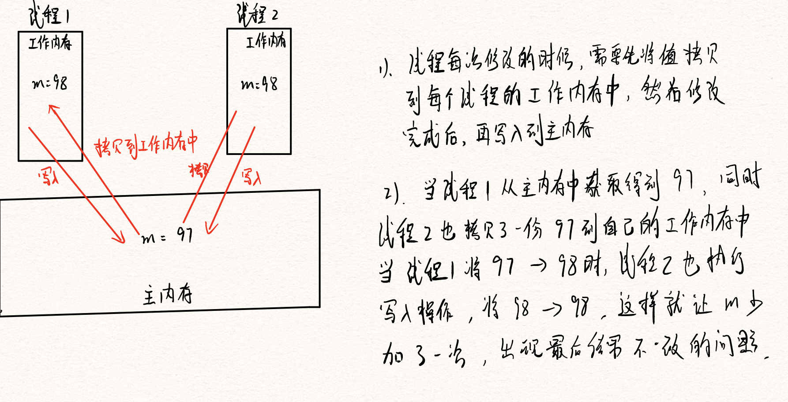

# AQS

## 前言

AQS：AbstractQueuedSynchronizer   抽象队列同步器

AQS是一个抽象类，是我们用到的锁的基础，例如我们经常用到的

- ReentrantLock
- Semaphore
- CountdownLatch
- ReentrantReadWriteLock
- .....

上述的提到的这些，其实内部都是基于AQS来实现的。

我们举下面的一个例子

```java
public class Main {
    public static int m = 0;

    public static void main(String[] args) throws InterruptedException {
        Thread[] threads = new Thread[100];
        for (int i = 0; i < threads.length; i++) {
            threads[i] = new Thread(() -> {
                for (int j = 0; j < 100; j++) {
                    m++;
                }
            });
        }
        for (Thread t: threads) {
            t.start();
        }
        // 等待所有线程结束
        for (Thread t: threads) {
            t.join();
        }
        System.out.println(m);
    }
}
```

运行结果，我们发现并不一样，这就是多线程在获取临界资源出现异常的情况

```bash
# 第一次
9985
# 第二次
10000
```

那么为什么会出现这样的问题呢？



## 解决方法1

针对上述的问题，就是因为线程来操作临界资源的时候，因为线程并发修改而造成数据不一致的问题，其实最简单的方法，就是通过引入Synchronized来给我们的对象上锁

```java
public class Main2 {
    public static int m = 0;

    public static void main(String[] args) throws InterruptedException {
        Thread[] threads = new Thread[100];
        for (int i = 0; i < threads.length; i++) {
            threads[i] = new Thread(() -> {
                synchronized (Main2.class) {
                    for (int j = 0; j < 100; j++) {
                        m++;
                    }
                }
            });
        }
        for (Thread t: threads) {
            t.start();
        }
        // 等待所有线程结束
        for (Thread t: threads) {
            t.join();
        }
        System.out.println(m);
    }
}
```

最后不管怎么执行，得到的结果都是 10000，为什么引入Synchronized就能让其保证数据一致呢？

通过Synchronized我们可以看到，它其实是对我们整个对象上锁，因为 m 是属于static修饰的静态变量，在class初始化的时候就已经创建，当第一个线程过来的时候，首先判断Main2.class 是否已经加锁了，如果没有加锁，那么就进入，同时给对象加锁，关于Synchronized加锁 我们通过转换成字节码可以看到，其实就是添加两个关键字

```
MonitorEnter
..... 被加锁的代码
MonitorExit
```

当第一个线程加锁后，其它线程在获取Main2.class对象的时候，就会进行阻塞，但是这里我们需要明白的是，因为Synchronized属于非公平锁，因此每个线程来的时候，都会尝试先获取锁，假设线程1还没有被执行，出现就绪状态，那么又可能会被其他线程剥夺CPU执行权，从而进入阻塞队列中。

但是如果线程1已经在执行的时候，它是不能被剥夺CPU执行权的，其它线程必须等待线程1执行完成后，释放锁才能够进入。

### 补充

关于Synchronized加锁，其实不是一来就是添加的重量级锁，而是有一个锁升级的过程

- 首先第一个线程将会尝试添加一个偏向锁，也就是对当前获取的线程1有偏向的功能，即不进行复杂加锁校验等，在线程的头部信息中，是有这么一个记录用于记录偏向的线程的
- 但是假设有多个线程来访问这个资源的时候，偏向锁就会升级成 CAS轻量级锁，也就是我们所说的自旋锁，会不断的自旋操作来获取CPU资源
- 但是假设某个线程长期进行自旋操作，而没有获取到锁，一般原来的版本是可以指定自旋次数的，后面的JDK进行优化，引入了适应性自旋。当某个线程长期获取不到资源的时候，就会升级成重量级锁，这个时候只要其它线程过来后，获取不到资源就会直接阻塞。

## 解决方法2

除了刚刚说的引入Synchronized以外，还可以使用的就是引入ReentrantLock来实现，这里用到了可重入锁，也就是已获得锁的线程可以直接进入，其它的线程则需要等待该线程释放锁

```java
public class Main3 {
    public static int m = 0;
    // ReentrantLock默认是非公平锁
    public static void main(String[] args) throws InterruptedException {
        Thread[] threads = new Thread[100];
        ReentrantLock lock = new ReentrantLock();
        for (int i = 0; i < threads.length; i++) {
            threads[i] = new Thread(() -> {
                lock.lock();
                try {
                    for (int j = 0; j < 100; j++) {
                        m++;
                    }
                } catch (Exception e) {
                    e.printStackTrace();
                } finally {
                    lock.unlock();
                }
            });
        }

        for (Thread t: threads) {
            t.start();
        }
        // 等待所有线程结束
        for (Thread t: threads) {
            t.join();
        }
        System.out.println(m);
    }
}
```

### 疑问

为什么已经有了Synchronized加锁了，在后面又引入了很多新的锁呢，如 ReentrantLock 等

- Synchronized加锁是需要JVM调用底层的OS来进行加锁的，这样就存在一些开销
  - 程序需要从 用户态 -> 内核态 进行切换，这一部分是比较消耗时间的
- 因为ReentrantLock属于API层面，不需要从进行资源的切换，也就是不用从 用户态 切换到 内核态

## 解决方法3

另外一种方法，就是自己实现一把锁，也就是实现Lock接口

```java
/**
 * 自定义锁
 *
 * @author: 陌溪
 * @create: 2020-07-17-17:06
 */
public class MyLock implements Lock {
    private volatile int i = 0;
    @Override
    public void lock() {
        synchronized (this) {
            // 判断是否有线程已经占用了锁
            while(i != 0) {
                try {
                    // 如果有线程占有锁，可以直接阻塞
                    this.wait();
                } catch (Exception e) {
                    e.printStackTrace();
                }
            }
            i = 1;
        }
    }

    @Override
    public void lockInterruptibly() throws InterruptedException {

    }

    @Override
    public boolean tryLock() {
        return false;
    }

    @Override
    public boolean tryLock(long time, TimeUnit unit) throws InterruptedException {
        return false;
    }

    @Override
    public void unlock() {
        synchronized (this) {
            i = 0;
            // 唤醒所有线程
            this.notifyAll();
        }
    }

    @Override
    public Condition newCondition() {
        return null;
    }
}
```

上述只是简单的实现了一下，还是用了Synchronized，但是例如ReentrantLock这样的代码，Main4.java的代码如下

```java
public class Main4 {
    public static int m = 0;
    // ReentrantLock默认是非公平锁
    public static void main(String[] args) throws InterruptedException {
        Thread[] threads = new Thread[100];
        Lock lock = new MyLock();
        for (int i = 0; i < threads.length; i++) {
            threads[i] = new Thread(() -> {
                lock.lock();
                try {
                    for (int j = 0; j < 100; j++) {
                        m++;
                    }
                } catch (Exception e) {
                    e.printStackTrace();
                } finally {
                    lock.unlock();
                }
            });
        }

        for (Thread t: threads) {
            t.start();
        }
        // 等待所有线程结束
        for (Thread t: threads) {
            t.join();
        }
        System.out.println(m);
    }
}
```

## AQS

上面我们提到了，例如 ReentrantLock、CountDownLatch、CycleBarrier 底层都是通过AQS来实现的，我们我们编写一个类，继承AQS，用于实现一把锁

**AQS的核心思想**：如果被请求的共享资源空闲，则将当前请求的资源的线程设置为有效的工作线程，并将共享资源设置为锁定状态，如果被请求的共享资源被占用，那么就需要一套线程阻塞等待以及唤醒时锁分配的机制，这个AQS是用CLH队列锁实现的，即将暂时获取不到的锁的线程加入到队列中。CLH队列是一个虚拟的双向队列，虚拟的双向队列即不存在队列的实例，仅存在节点之间的关联关系。

AQS是将每一条请求共享资源的线程封装成一个CLH锁队列的一个结点（Node），来实现锁的分配

用大白话来说，AQS就是基于CLH队列，用volatile修饰共享变量state，线程通过CAS去改变状态符，成功则获取锁成功，失败则进入等待队列，同时等待被唤醒。

注意：AQS是自旋锁，在等待唤醒的时候，经常会使用自旋的方式，不断的尝试获取锁，直到被其它线程获取成功

实现了AQS的锁有：自旋锁、互斥锁、读写锁、条件变量、信号量、栅栏都是AQS的衍生物，具体实现如下


如上图所示，AQS维护了一个volatile int state的变量 和 一个FIFO线程等待队列，多线程争用资源被阻塞的时候，就会进入这个队列中。state就是共享资源，其访问方式有如下三种：

- getState()
- setState()
- compareAndSetState()

AQS定义了两种资源共享方式

- Exclusive：独占，只有一个线程能执行，如ReentrantLock
- Share：共享，多个线程可以同时执行，如Semaphore、CountDownLatch、ReadWriteLock、CycleBarrier

不同的自定义同步器争用共享资源的方式也不同

## AQS底层实现

AQS使用了基于模板方法的设计模式，如果需要自定义同步器，一般的方式如下

- 继承AbstractQueuedSynchronizer，并重写指定的方法，在这里重写的方法就是对共享资源state获取和释放
- 将AQS组合在自定义同步组件的实现中，并调用其模板方法，而这些模板方法会调用使用者重写的方法。

我们通过下面的代码，来进行查看

```java
/**
 * AQS
 */
public class Sync extends AbstractQueuedSynchronizer {

    @Override
    protected boolean tryAcquire(int arg) {
        // 使用自旋锁 ，同时CAS必须保证原子性
        // 目前的CPU底层汇编都有这条指令了，即支持原语操作
        if (compareAndSetState(0, 1)) {
            // 设置排它的拥有者，也就是互斥锁
            setExclusiveOwnerThread(Thread.currentThread());
            return true;
        }
        return false;
    }

    @Override
    protected boolean tryRelease(int arg) {
        assert arg == 1;
        if(!isHeldExclusively()) {
            throw new IllegalMonitorStateException();
        }
        // 释放锁
        setExclusiveOwnerThread(null);
        setState(0);
        return super.tryRelease(arg);
    }

    @Override
    protected boolean isHeldExclusively() {
        // 判断当前线程 是不是和排它锁的线程一样
        return getExclusiveOwnerThread() == Thread.currentThread();
    }
}
```

自定义同步器在实现的时候，只需要实现共享资源state的获取和释放即可，至于具体线程等待队列的维护，AQS已经在顶层实现好了。自定义同步器实现的时候，主要实现下面几种方法：

- isHeldExclusively()：该线程是否正在独占资源。只有用到condition才需要实现它
- tryAcquire(int)：独占方式。尝试获取资源，成功则返回true，失败则返回false。
- tryRelease(int)：独占方式，尝试释放资源，成功则返回true，失败则返回false
- tryAcquireShared(int)：共享方式，尝试获取资源。负数表示失败，0表示成功，但没有剩余可用资源；正数表示成功，且有剩余资源。
- tryReleaseShared(int)：共享方式。尝试释放资源，如果允许释放后允许唤醒后续等待节点返回true，否则返回false。

### ReentrantLock

以ReentrantLock（可重入独占式锁）为例，state初始化为0，表示未锁定状态，A线程lock()时，会调用tryAcquire()独占锁，并将state + 1，之后其它线程在想通过tryAcquire的时候就会失败，知道A线程unlock() 到 state = 0 为止，其它线程才有机会获取到该锁。A释放锁之前，自己也是可以重复获取此锁（state累加），这就是可重入的概念。

> 注意：获取多少次锁就需要释放多少次锁，保证state是能够回到0

### CountDownLatch

以CountDownLatch为例，任务分N个子线程执行，state就初始化为N，N个线程并行执行，每个线程执行完之后 countDown() 一次，state 就会CAS减1，当N子线程全部执行完毕，state = 0,hui unpark() 主调动线程，主调用线程就会从await()函数返回，继续之后的动作。

## 总结

一般来说，自定义同步器要么独占方式，要么共享方式，他们也需要实现 tryAcquire 和 tryRelease、  tryAcquireShared 和 tryReleaseShared中的一种即可。但AQS也支持自定义同步器实现独占和共享两种方式，比如ReentrantLockReadWriteLock。

- acquire() 和 acquireShared() 两种方式下，线程在等待队列中都是忽略中断的
- acquireInterruptibly() 和 acquireSharedInterruptibly() 是支持响应中断的


