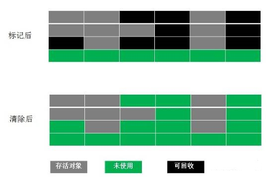
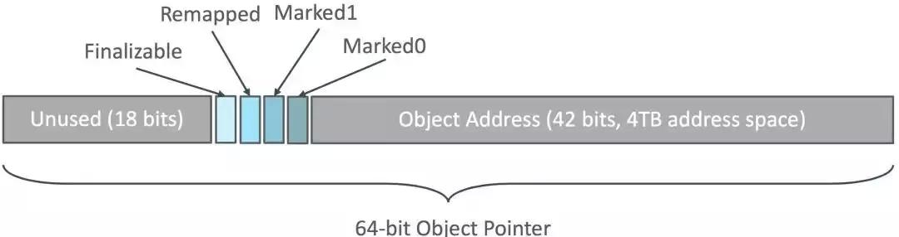

# JVM

## 常量池

### 1. 全局字符串池

string pool，在类加载完成，经过验证，准备阶段之后在堆中生成字符串对象实例，然后将该字符串对象实例的引用值存到string pool中（**记住：String Pool中存的是引用值而不是具体的实例对象，具体的实例对象是在堆中开辟的一块空间存放的**）。

在每个JVM中只有一份，存放的是字符串常量和引用值。


### 2. class文件常量池

编译的时候每个class都有的，编译阶段存放编译器生成的**字面量（Literal）和符号引用（Symbolic References）**。

1、字面量就是我们所说的常量概念，如文本字符串、被声明为final的常量值等。

2、符号引用是一组符号来描述所引用的目标：

- 类和接口的全限定名
- 字段的名称和描述符
- 方法的名称和描述符


### 3. 运行时常量池

在类加载完成之后，将每个class常量池中的符号引用值转存到运行时常量池中，也就是说，每个class都有一个运行时常量池，类在解析之后，将符号引用替换成直接引用，与全局常量池中的引用值保持一致。


1.布尔类型参数值

`-XX:+<option> '+'`表示启用该选项  
`-XX:-<option> '-'`表示关闭该选项  

2.数字类型参数值：

`-XX:<option>=<number>` 给选项设置一个数字类型值，可跟随单位，例如：'m'或'M'表示兆字节;'k'或'K'千字节;'g'或'G'千兆字节。32K与32768是相同大小的。

3.字符串类型参数值：

`-XX:<option>=<string>` 给选项设置一个字符串类型值，通常用于指定一个文件、路径或一系列命令列表。 例如：-XX:HeapDumpPath=./dump.core


- 堆设置

1. -Xms:初始堆大小，默认物理内存的1/64
2. -Xmx:最大堆大小，默认物理内存的1/4，设置与-Xms一样
3. -XX:NewSize=n:设置年轻代大小
4. -XX:NewRatio=n:设置年轻代和年老代的比值。如:为3，表示年轻代与年老代比值为1：3，年轻代占整个年轻代年老代和的1/4
5. -XX:SurvivorRatio=n:年轻代中Eden区与两个Survivor区的比值。注意Survivor区有两个。如：3，表示Eden：Survivor=3：2，一个Survivor区占整个年轻代的1/5
6. -XX:MaxPermSize=n:设置持久代大小

- 收集器设置

1. -XX:+UseSerialGC:设置串行收集器o -XX:+UseParallelGC:设置并行收集器
2. -XX:+UseParalledlOldGC:设置并行年老代收集器
3. -XX:+UseConcMarkSweepGC:设置并发收集器

- 垃圾回收统计信息

-XX:+PrintGC     输出GC日志

-XX:+PrintGCDetails     输出GC的详细日志

-XX:+PrintGCTimeStamps    输出GC的时间戳

-XX:+PrintGCDateStamps    输出GC的日期时间戳

-XX:+PrintGCCause     输出GC的详细日志

-Xloggc:/opt/xxx/logs/xxx-gc-%t.log  设置文件目录

-XX:+UseGCLogFileRotation       设置滚动日志

-XX:NumberOfGCLogFiles=5      设置5个文件日志

-XX:GCLogFileSize=100M            设置每个日志大小


## 内存泄露和内存溢出

### 内存泄露

Memory Leak，程序在申请内存后，无法释放已申请的内存空间，一次内存泄露危害可以忽略，但内存泄露堆积后果很严重，无论多少内存，迟早会被占光，广义并通俗的说，就是：不再会被使用的对象或者变量占用的**内存不能被回收**，就是内存泄露。

最终会导致out of memory

### 内存溢出

OOM，out of memory，在申请内存时，没有足够的内存空间供其使用；通常发生于OLD段或Perm段垃圾回收后，仍然无内存空间容纳新的Java对象的情况。通常都是由于内存泄露导致堆栈内存不断增大，从而引发内存溢出。


## Garbage Collection

什么是垃圾？

1. **引用计数算法**

给对象中添加一个引用计数器，每当有一个地方引用它时，计数器值就加1；当引用失效时，计数器值就减1；任何时刻计数器为0的对象就是不可能再被使用的。

> 优点：简单，高效，现在的objective-c用的就是这种算法。
> 缺点：很难处理**循环引用**，相互引用的两个对象则无法释放。


2. **可达性分析算法（根搜索算法）**Root Searching

从GC Roots作为起点，向下搜索引用的对象，生成一棵引用树，树的节点视为可达对象。

可作为GC Roots对象：

- 线程栈变量
- 方法区中静态变量引用的对象
- 方法区中的常量引用的对象
- 本地方法栈中JNI（Native方法）的引用对象

> 真正标记以为对象为可回收状态至少要标记两次。


### 垃圾回收算法

- Copying 复制算法
- Mark-Compact 标记-压缩
- Mark-Sweep 标记-清除

|       Copying 复制算法       |
| :--------------------------: |
|  |
>优点： 快速高效，不会产生内存碎片。
>缺点： 可用内存会减少一半，因为是按照均分的。


|       Mark-Compact 标记压缩       |
| :--------------------------: |
|  |
|  |
>优点： 适合存活对象多的，不产生内存碎片


| Mark-Sweep 标记清除              |
| :------------------------------- |
|  |
> 优点： 简单，易实现
> 缺点： 容易产生**内存碎片**，对于后面分配大空间时，找不到足够的空间，而主动会触发一次内存回收，增加内存回收的次数。


#### 年轻代（Young Generation）的回收算法（Minor GC）

a)	所有新生成的对象首先都是放在年轻代的。年轻代的目标就是尽可能快速的收集掉那些生命周期短的对象。
b)	新生代内存按照8:1:1的比例分为一个Eden区和两个survivor(s0,s1)区。一个Eden区，两个Survivor区(一般而言)。大部分对象在Eden区中生成。回收时先将Eden区存活对象复制到一个s0区，然后清空Eden区，当这个s0区也存放满了时，则将Eden区和s0区存活对象复制到另一个s1区，然后清空Eden和这个s0区，此时s0区是空的，然后将s0区和s1区交换，即保持s1区为空， 如此往复。
c)	当s1区不足以存放 Eden和s0的存活对象时，就将存活对象直接存放到老年代。若是老年代也满了就会触发一次Full GC，也就是新生代、老年代都进行回收。
d)	新生代发生的GC也叫做Minor GC，MinorGC发生频率比较高(不一定等Eden区满了才触发)。

#### 年老代（Old Generation）的回收算法（Full GC）

a)	在年轻代中经历了N次垃圾回收后仍然存活的对象，就会被放到年老代中。因此，可以认为年老代中存放的都是一些生命周期较长的对象。
b)	内存比新生代也大很多(大概比例是1:2)，当老年代内存满时触发Major GC即Full GC，Full GC发生频率比较低，老年代对象存活时间比较长，存活率标记高。

循环引用

https://segmentfault.com/a/1190000019910501


## 垃圾回收器种类

从分代算法演变到不分代算法

- 串行垃圾回收器（Serial Garbage Collector）：单线程
- 并行垃圾回收器（Parallel Garbage Collector）：多线程
- 并发标记扫描垃圾回收器（CMS Garbage Collector）
- G1垃圾回收器（G1 Garbage Collector）


### 具体划分：

新生代：垃圾回收算法（**复制算法**）

- Serial收集器
- ParNew收集器
- Parallel Scavenge收集器（并行）

老年代：

- Serial Old收集器：标记-整理算法
- Parallel Old收集器（并行）：标记-整理算法
- CMS（Concurrent Mark Sweep）收集器（并发）：标记-清除算法

整堆：

- G1（Garbage First）收集器
- ZGC收集器

|      |
| :--: |
|      |
|  |


| 垃圾回收器        | 新生代/老年代 | 回收算法  | 线程模式     |
| ----------------- | ------------- | --------- | ------------ |
| Serial            | 新生代        | 复制算法  | 单线程       |
| ParNew            | 新生代        | 复制算法  | 多线程       |
| Parallel Scavenge | 新生代        | 复制算法  | 多线程       |
| Serial Old        | 老年代        | 标记-整理 | 单线程       |
| Parallel Old      | 老年代        | 标记-整理 | 多线程       |
| CMS               | 老年代        | 标记-清除 | 并发，多线程 |
| G1                |               |           |              |


#### Serial

- 发生在新生代

- 采用复制算法

- 单线程收集

Stop The World，在进行垃圾收集时，必须暂停其他所有工作线程（即GC停顿），直到它收集结束

|                                                        |
| :----------------------------------------------------: |
|  |

设置参数：`-Xms5m -Xmx5m -XX:+PrintGCDetails  -XX:+PrintCommandLineFlags -XX:+UseSerialGC`

```java
-XX:InitialHeapSize=5242880 -XX:MaxHeapSize=5242880 -XX:+PrintCommandLineFlags -XX:+PrintGCDetails -XX:-UseLargePagesIndividualAllocation -XX:+UseSerialGC 
[GC (Allocation Failure) [DefNew: 1664K->192K(1856K), 0.0011112 secs] 1664K->718K(5952K), 0.0011399 secs] [Times: user=0.00 sys=0.00, real=0.00 secs]
    
[GC (Allocation Failure) [DefNew: 1650K->150K(1856K), 0.0004731 secs][Tenured: 1305K->1440K(4096K), 0.0019278 secs] 2926K->1440K(5952K), [Metaspace: 3270K->3270K(4480K)], 0.0024290 secs] [Times: user=0.01 sys=0.00, real=0.02 secs]

[Full GC (Allocation Failure) [Tenured: 1440K->1190K(4096K), 0.0016928 secs] 1440K->1190K(5952K), [Metaspace: 3270K->3270K(4480K)], 0.0017108 secs] [Times: user=0.00 sys=0.00, real=0.00 secs] 
```


#### ParNew

Serial收集器的多线程版本，除了使用多条线程进行垃圾收集之外，其余行为包括Serial收集器可用的所有控制参数、收集算法、Stop the World、对象分配规则、回收策略等都与Serial收集器完全一样。

|                                                        |
| :----------------------------------------------------: |
|  |

> 目前只有ParNew收集器可以和老年代的CMS收集器配合

设置参数：

“-XX:+UseConcMarkSweepGC”：指定使用CMS后，会默认使用ParNew作为新生代收集器；

“-XX:+UseParNewGC”：强制指定使用ParNew；

“-XX:ParallelGCThreads”：指定垃圾收集的线程数量，ParNew默认开启的收集线程与CPU的数量相同；


#### Parallel Scavenge

因为与吞吐量关系密切，也称为吞吐量收集器（Throughput Collector），即吞吐量=运行用户代码时间/(运行用户代码时间+GC线程时间）PS GC所能处理的堆内存较小，建议堆内存小于8GB考虑。

- 发生在新生代
- 采用复制算法
- 多线程收集

|                                                          |
| :------------------------------------------------------: |
|  |

设置参数：

- **-XX:+UseParallelGC**
  使用并行GC算法，新生代使用并行擦除算法，老年代使用串行标记擦除算法
- **-XX:+UserParallelOldGC**
  使用并行GC算法，新生代使用并行擦除算法，老年代使用并行标记擦除算法
- **-XX:NewRatio**
  默认值是2。新生代和老年代的比例环比，默认是老年代是新生代的2倍。对于PS GC比较多的情况是FGC非常耗时，可以将该值调整为1来减少老年代标记、清理时间。同时，可以设置在FGC前执行一次YGC来减少对老年代对像的引用数据。
- **-XX:MaxGCPauseMillis**
  默认值是最大32位整数值。收集器将尽可能的保证回收耗费的时间不超过设定的值，但是，并不是越小越好，GC停顿时间缩短是以牺牲吞吐量和新生代空间来换取的，如果设置的值太小，将会导致频繁GC。
- **-XX:GCTimeRatio**
  默认值是99%。参数的值是一个大于0且小于100的整数，也就是垃圾收集时间占总时间的比率，默认是99%，也就是允许最大1%（即1/(1+99)）的垃圾收集时间。
- **-XX:UseAdaptiveSizePolicy**
  默认是开启自适应算法功能的。JVM会根据当前系统运行情况收集到的监控信息，动态调整新生代的比例，以提供最合适的停顿时间或最大的吞吐量。开启这个参数之后，就不需要再设置新生代大小，Eden与S0/S1的比例等参数。
- **-XX:+ScavengeBeforeFullGC**
  默认是开启的，作用是在一次Full GC之前，先触发一次Young GC来清理年轻代，以降低Full GC的STW耗时（Young GC会清理Young GC中非存活的对象，减少Full GC中，标记存活对象的工作量）。

参数建议：

```
-Xmx6G
-Xms6G
-XX:+UserParallelOldGC
-XX:MaxGCPauseMillis = 250
-XX:GCTimeRatio = 99
-XX:-UseAdaptiveSizePolicy  // 如果考虑到更大的吞吐量，可以关闭自适应算法
-XX:+ScavengeBeforeFullGC 
```


#### Serial Old

- 发生在老年代
- 采用标记-整理算法
- 单线程收集


#### Parallel Old收集器

- 发生在老年代
- 采用标记-整理算法
- 多线程收集

设置参数：`-Xms5m -Xmx5m -XX:+PrintGCDetails  -XX:+UseParallelGC -XX:+UseParallelOldGC`

```java
[GC (Allocation Failure) [PSYoungGen: 256K->192K(1536K)] 1809K->1885K(5632K), 0.0005799 secs] [Times: user=0.00 sys=0.00, real=0.00 secs]

[Full GC (Allocation Failure) [PSYoungGen: 192K->0K(1536K)] [ParOldGen: 1693K->1172K(4096K)] 1885K->1172K(5632K), [Metaspace: 3269K->3269K(4480K)], 0.0040003 secs] [Times: user=0.00 sys=0.00, real=0.00 secs]

[GC (Allocation Failure) [PSYoungGen: 0K->0K(1536K)] 1172K->1172K(5632K), 0.0012317 secs] [Times: user=0.00 sys=0.00, real=0.00 secs]

# OOM
[Full GC (Allocation Failure) [PSYoungGen: 0K->0K(1536K)] [ParOldGen: 1172K->1101K(4096K)] 1172K->1101K(5632K), [Metaspace: 3269K->3267K(4480K)], 0.0078113 secs] [Times: user=0.09 sys=0.00, real=0.01 secs] 

```

参数说明：

[名称：GC前内存占用 -> GC后内存占用 （该区内存总大小）]  GC前堆内存占用 -> GC后堆内存占用 （堆内存总大小）

+ `[GC (Allocation Failure) [PSYoungGen: 256K->192K(1536K)] 1809K->1885K(5632K), 0.0005799 secs] [Times: user=0.00 sys=0.00, real=0.00 secs]`GC类型：Young GC

新生代总内存 / 堆内存 = 1/3；

+ `[Full GC (Allocation Failure) [PSYoungGen: 192K->0K(1536K)] [ParOldGen: 1693K->1172K(4096K)] 1885K->1172K(5632K), [Metaspace: 3269K->3269K(4480K)], 0.0040003 secs] [Times: user=0.00 sys=0.00, real=0.00 secs]`GC类型：Full GC

新生代总内存/老年代总内存 = 1/2；新生代总内存 + 老年代总内存 = 堆内存


#### CMS

并发标记清理（Concurrent Mark Sweep，CMS）收集器也称为并发低停顿收集器（Concurrent Low Pause Collector）或低延迟（low-latency）垃圾收集器；

- 发生在老年代
- 标记-清除，不进行压缩，产生内存碎片
- 并发收集、低停顿

|                                                     |
| :-------------------------------------------------: |
|  |

设置参数：

- **-XX:+UseConcMarkSweepGC**
  CMS全称 Concurrent Mark Sweep，是一款并发的、使用标记-清除算法的垃圾回收器，
  是老年代垃圾回收器。
- **-XX:CMSInitiatingOccupancyFraction=n**
  CMS的一个缺点是它需要更大的堆空间。因为CMS标记阶段应用程序的线程还是在执行的，那么就会有堆空间继续分配的情况，为了保证在CMS回收完堆之前还有空间分配给正在运行的应用程序，必须预留一部分空间。也就是说，CMS不会在老年代满的时候才开始收集。相反，它会尝试更早的开始收集，已避免如下情况：在回收完成之前，堆没有足够空间分配！默认当老年代使用92%的时候，CMS就开始行动了。CMSInitiatingOccupancyFraction设置这个阀值，一般建议使用70%，但需要结合业务实际使用情况决定。
- **-XX:+UseCMSInitiatingOccupancyOnly**
  只使用设定的回收阈值（CMSInitiatingOccupancyFraction）；如果不指定，JVM仅在第一次使用设定值，后续则自动调整。
- **-XX:+CMSScavengeBeforeRemark**
  在CMS GC前启动一次ygc，目的在于减少old gen对ygc gen的引用，降低remark时的开销。一般CMS的GC耗时 80%都在remark阶段。
- **-XX:NewRatio**
  如果仅仅设置参数：-Xmx -Xms，CMS默认的NewRatio并未生效，新生代的大小是不确定的，即新生代的大小是通过GC的线程数与每线程处理的堆内存大小（Linux系统下64MB）计算出来的。
  所以，通常使用CMS的时候，建议手动指定新生代大小参数(-XX:NewRatio或者-Xmn或者-XX:NewSize/-XX:MaxNewSize)。
- **-XX:CMSFullGCsBeforeCompaction=n 废弃**
  在上一次CMS并发GC执行过后，还要再执行多少次Full GC才会做压缩。默认是0，也就是说，在默认配置下每次CMS GC要转入Full GC的时候都会做压缩。
- **-XX:-UseCMSCompactAtFullCollection 废弃**
  默认是true，即在进行Full GC前会进行一次压缩，减少碎片问题。
  默认情况下，配合CMSFullGCsBeforeCompaction值0，容易触发Serial Old GC（也就是可用堆内存空间不足）导致长时间暂停。

触发条件：

- 如果没有设置 -XX:+UseCMSInitiatingOccupancyOnly，虚拟机会根据收集的数据决定是否触发；
- 老年代使用率达到阈值 CMSInitiatingOccupancyFraction，默认92%；
- 永久代的使用率达到阈值 CMSInitiatingPermOccupancyFraction，默认92%，触发的前提是开启了选项： CMSClassUnloadingEnabled；
- 新生代的晋升交换区失败。

### Full GC时触发压缩条件

- UseCMSCompactAtFullCollection 与 CMSFullGCsBeforeCompaction 搭配使用；前者默认就是true，后者默认时0（即每次Full GC都会触发压缩动作）。
- 用户调用了System.gc()，而且DisableExplicitGC没有开启。
- Young Gen报告接下来如果做增量收集会失败，简单来说也就是Young Gen预计Old Gen没有足够空间来容纳下次Young GC晋升的对象。

`-Xms5m -Xmx5m -XX:+PrintGCDetails  -XX:+UseParNewGC -XX:+UseConcMarkSweepGC`

```
[GC (Allocation Failure) [ParNew: 1088K->128K(1216K), 0.0016975 secs] 1088K->647K(6016K), 0.0017305 secs] [Times: user=0.00 sys=0.00, real=0.00 secs]

[GC (Allocation Failure) [ParNew: 581K->55K(1216K), 0.0004477 secs][CMS: 1480K->1178K(4800K), 0.0023755 secs] 2022K->1178K(6016K), [Metaspace: 3270K->3270K(4480K)], 0.0028529 secs] [Times: user=0.00 sys=0.00, real=0.00 secs]

[Full GC (Allocation Failure) [CMS: 1178K->1130K(4800K), 0.0020235 secs] 1178K->1130K(6016K), [Metaspace: 3270K->3270K(4480K)], 0.0020465 secs] [Times: user=0.00 sys=0.00, real=0.00 secs] 
```

运行过程：

1. 初始标记（CMS initial mark）

   标记一下GC Roots能关联的对象，需要Stop The World

2. 并发标记（CMS concurrent mark）

   进行GC Roots Tracing过程，标记存活对象，应用程序运行，不需要Stop The World；与用户线程一起工作

3. 重新标记（CMS remark）

   修正并发标记期间因程序运行导致标记变动的那一部分标记记录，需要Stop The World，采用多线程执行

4. 并发清除（CMS concurrent sweep）

   回收所有的垃圾对象，不需要Stop The World；与用户线程一起工作

> incremental update

缺点：

1）浮动垃圾（Floating Garbage）

浮动垃圾，指的是并发清理阶段产生的垃圾。因为**并发清理**阶段用户程序也在运行，产生的垃圾在标记过程之后，所以本次清理过程不会被清理，并且CMS还必须预留一部分空间提供给并发收集时的程序运作使用。

这使得并发清除时需要预留一定的内存空间，不能像其他收集器在老年代几乎填满再进行收集；
也要可以认为CMS所需要的空间比其他垃圾收集器大；

> “-XX:CMSInitiatingOccupancyFraction”：设置CMS预留内存空间；
> JDK1.5默认值为68%；
> JDK1.6变为大约92%；

2）"Concurrent Mode Failure"失败
要是CMS运行期间预留的内存无法满足程序需要，就会触发“Concurrent Mode Failure”，这时虚拟机将启动后备预案，临时启用Serial Old收集器，但停顿时间会明显增加，而导致另一次Full GC的产生；

这样的代价是很大的，所以CMSInitiatingOccupancyFraction不能设置得太大。
CMS提供了参数-XXCMSInitiatingOccupancyFraction来控制触发CMS的内存使用占比，设置太低会导致CMS触发过于频繁，设置太高则很容易出现大量的“Concurrent Mode Failure”。
3）产生大量内存碎片

参考建议：

```
-Xmx16G
-Xms16G 
-XX:+UseConcMarkSweepGC
-XX:+UseCMSInitiatingOccupancyOnly
-XX:CMSInitiatingOccupancyFraction=70  // 预留内存30%，保障在并行标记过程中的YGC导致的晋升内存是满足申请需求的。但需要结合业务综合考虑，并不是越多越好。
-XX:NewRatio=2  // 强制设置
-XX:+CMSScavengeBeforeRemark // 可选，内存大情况下可设置
-XX:CMSFullGCsBeforeCompaction=5  // 默认0，即每次FGC都会触发压缩，每次压缩可能带来不小的性能损耗
```


#### G1

逻辑分代，物理不分代

|                                                    |
| :------------------------------------------------: |
|  |

设置参数：

“-XX:+UseG1GC”：指定使用G1收集器；

“-XX:InitiatingHeapOccupancyPercent”：当整个Java堆的占用率达到参数值时，开始并发标记阶段；默认为45；

“-XX:MaxGCPauseMillis”：为G1设置暂停时间目标，默认值为200毫秒；

“-XX:G1HeapRegionSize”：设置每个Region大小，范围1MB到32MB；目标是在最小Java堆时可以拥有约2048个Region

`-Xms5m -Xmx5m -XX:+PrintGCDetails  -XX:+UseG1GC`

```java
[GC pause (G1 Evacuation Pause) (young), 0.0018089 secs]
   [Parallel Time: 0.6 ms, GC Workers: 10]
      [GC Worker Start (ms): Min: 112.7, Avg: 112.8, Max: 112.8, Diff: 0.1]
      [Ext Root Scanning (ms): Min: 0.0, Avg: 0.2, Max: 0.5, Diff: 0.4, Sum: 1.6]
      [Update RS (ms): Min: 0.0, Avg: 0.0, Max: 0.0, Diff: 0.0, Sum: 0.0]
         [Processed Buffers: Min: 0, Avg: 0.0, Max: 0, Diff: 0, Sum: 0]
      [Scan RS (ms): Min: 0.0, Avg: 0.0, Max: 0.0, Diff: 0.0, Sum: 0.0]
      [Code Root Scanning (ms): Min: 0.0, Avg: 0.0, Max: 0.0, Diff: 0.0, Sum: 0.0]
      [Object Copy (ms): Min: 0.0, Avg: 0.3, Max: 0.4, Diff: 0.4, Sum: 3.1]
      [Termination (ms): Min: 0.0, Avg: 0.0, Max: 0.0, Diff: 0.0, Sum: 0.0]
      [GC Worker Other (ms): Min: 0.0, Avg: 0.0, Max: 0.0, Diff: 0.0, Sum: 0.2]
      [GC Worker Total (ms): Min: 0.5, Avg: 0.5, Max: 0.6, Diff: 0.1, Sum: 4.9]
      [GC Worker End (ms): Min: 113.3, Avg: 113.3, Max: 113.3, Diff: 0.0]
   [Code Root Fixup: 0.0 ms]
   [Code Root Purge: 0.0 ms]
   [Clear CT: 0.2 ms]
   [Other: 1.0 ms]
      [Choose CSet: 0.0 ms]
      [Ref Proc: 0.9 ms]
      [Ref Enq: 0.0 ms]
      [Redirty Cards: 0.1 ms]
      [Humongous Reclaim: 0.0 ms]
      [Free CSet: 0.0 ms]
   [Eden: 3072.0K(3072.0K)->0.0B(2048.0K) Survivors: 0.0B->1024.0K Heap: 3072.0K(6144.0K)->1133.5K(6144.0K)]
 [Times: user=0.00 sys=0.00, real=0.00 secs] 
[GC pause (G1 Evacuation Pause) (young), 0.0016612 secs]
   [Parallel Time: 0.8 ms, GC Workers: 10]
      [GC Worker Start (ms): Min: 171.8, Avg: 171.8, Max: 171.9, Diff: 0.1]
      [Ext Root Scanning (ms): Min: 0.0, Avg: 0.1, Max: 0.3, Diff: 0.3, Sum: 0.5]
      [Update RS (ms): Min: 0.0, Avg: 0.2, Max: 0.7, Diff: 0.7, Sum: 1.5]
         [Processed Buffers: Min: 0, Avg: 1.3, Max: 4, Diff: 4, Sum: 13]
      [Scan RS (ms): Min: 0.0, Avg: 0.0, Max: 0.0, Diff: 0.0, Sum: 0.0]
      [Code Root Scanning (ms): Min: 0.0, Avg: 0.0, Max: 0.0, Diff: 0.0, Sum: 0.0]
      [Object Copy (ms): Min: 0.0, Avg: 0.1, Max: 0.2, Diff: 0.2, Sum: 1.2]
      [Termination (ms): Min: 0.0, Avg: 0.4, Max: 0.5, Diff: 0.5, Sum: 3.8]
      [GC Worker Other (ms): Min: 0.0, Avg: 0.0, Max: 0.0, Diff: 0.0, Sum: 0.0]
      [GC Worker Total (ms): Min: 0.7, Avg: 0.7, Max: 0.8, Diff: 0.1, Sum: 7.1]
      [GC Worker End (ms): Min: 172.5, Avg: 172.5, Max: 172.6, Diff: 0.0]
   [Code Root Fixup: 0.0 ms]
   [Code Root Purge: 0.0 ms]
   [Clear CT: 0.1 ms]
   [Other: 0.8 ms]
      [Choose CSet: 0.0 ms]
      [Ref Proc: 0.6 ms]
      [Ref Enq: 0.0 ms]
      [Redirty Cards: 0.1 ms]
      [Humongous Reclaim: 0.0 ms]
      [Free CSet: 0.0 ms]
   [Eden: 2048.0K(2048.0K)->0.0B(2048.0K) Survivors: 1024.0K->1024.0K Heap: 3946.1K(6144.0K)->1614.0K(6144.0K)]
 [Times: user=0.00 sys=0.00, real=0.00 secs] 
[GC pause (G1 Humongous Allocation) (young) (initial-mark), 0.0010950 secs]
   [Parallel Time: 0.5 ms, GC Workers: 10]
      [GC Worker Start (ms): Min: 188.3, Avg: 188.3, Max: 188.4, Diff: 0.1]
      [Ext Root Scanning (ms): Min: 0.2, Avg: 0.2, Max: 0.3, Diff: 0.1, Sum: 2.2]
      [Update RS (ms): Min: 0.0, Avg: 0.0, Max: 0.1, Diff: 0.1, Sum: 0.2]
         [Processed Buffers: Min: 0, Avg: 1.0, Max: 5, Diff: 5, Sum: 10]
      [Scan RS (ms): Min: 0.0, Avg: 0.0, Max: 0.0, Diff: 0.0, Sum: 0.0]
      [Code Root Scanning (ms): Min: 0.0, Avg: 0.0, Max: 0.1, Diff: 0.1, Sum: 0.1]
      [Object Copy (ms): Min: 0.1, Avg: 0.1, Max: 0.2, Diff: 0.1, Sum: 1.4]
      [Termination (ms): Min: 0.0, Avg: 0.0, Max: 0.0, Diff: 0.0, Sum: 0.0]
      [GC Worker Other (ms): Min: 0.0, Avg: 0.0, Max: 0.0, Diff: 0.0, Sum: 0.1]
      [GC Worker Total (ms): Min: 0.4, Avg: 0.4, Max: 0.4, Diff: 0.1, Sum: 4.0]
      [GC Worker End (ms): Min: 188.7, Avg: 188.7, Max: 188.7, Diff: 0.0]
   [Code Root Fixup: 0.0 ms]
   [Code Root Purge: 0.0 ms]
   [Clear CT: 0.1 ms]
   [Other: 0.5 ms]
      [Choose CSet: 0.0 ms]
      [Ref Proc: 0.2 ms]
      [Ref Enq: 0.0 ms]
      [Redirty Cards: 0.2 ms]
      [Humongous Reclaim: 0.0 ms]
      [Free CSet: 0.0 ms]
   [Eden: 1024.0K(2048.0K)->0.0B(2048.0K) Survivors: 1024.0K->1024.0K Heap: 2638.0K(6144.0K)->1528.0K(6144.0K)]
 [Times: user=0.00 sys=0.00, real=0.00 secs] 
[GC concurrent-root-region-scan-start]
[GC pause (G1 Humongous Allocation) (young)[GC concurrent-root-region-scan-end, 0.0005756 secs]
[GC concurrent-mark-start]
, 0.0010326 secs]
   [Root Region Scan Waiting: 0.5 ms]
   [Parallel Time: 0.3 ms, GC Workers: 10]
      [GC Worker Start (ms): Min: 190.1, Avg: 190.1, Max: 190.2, Diff: 0.1]
      [Ext Root Scanning (ms): Min: 0.0, Avg: 0.0, Max: 0.1, Diff: 0.1, Sum: 0.2]
      [SATB Filtering (ms): Min: 0.0, Avg: 0.0, Max: 0.0, Diff: 0.0, Sum: 0.0]
      [Update RS (ms): Min: 0.0, Avg: 0.0, Max: 0.0, Diff: 0.0, Sum: 0.1]
         [Processed Buffers: Min: 0, Avg: 0.9, Max: 2, Diff: 2, Sum: 9]
      [Scan RS (ms): Min: 0.0, Avg: 0.0, Max: 0.0, Diff: 0.0, Sum: 0.0]
      [Code Root Scanning (ms): Min: 0.0, Avg: 0.0, Max: 0.0, Diff: 0.0, Sum: 0.0]
      [Object Copy (ms): Min: 0.1, Avg: 0.2, Max: 0.2, Diff: 0.1, Sum: 1.5]
      [Termination (ms): Min: 0.0, Avg: 0.0, Max: 0.0, Diff: 0.0, Sum: 0.0]
      [GC Worker Other (ms): Min: 0.0, Avg: 0.0, Max: 0.0, Diff: 0.0, Sum: 0.1]
      [GC Worker Total (ms): Min: 0.2, Avg: 0.2, Max: 0.2, Diff: 0.1, Sum: 2.0]
      [GC Worker End (ms): Min: 190.3, Avg: 190.3, Max: 190.3, Diff: 0.0]
   [Code Root Fixup: 0.0 ms]
   [Code Root Purge: 0.0 ms]
   [Clear CT: 0.1 ms]
   [Other: 0.2 ms]
      [Choose CSet: 0.0 ms]
      [Ref Proc: 0.1 ms]
      [Ref Enq: 0.0 ms]
      [Redirty Cards: 0.1 ms]
      [Humongous Reclaim: 0.0 ms]
      [Free CSet: 0.0 ms]
   [Eden: 0.0B(2048.0K)->0.0B(2048.0K) Survivors: 1024.0K->1024.0K Heap: 1528.0K(6144.0K)->1454.8K(6144.0K)]
 [Times: user=0.00 sys=0.00, real=0.00 secs] 
[Full GC (Allocation Failure)  1454K->1193K(6144K), 0.0031069 secs]
   [Eden: 0.0B(2048.0K)->0.0B(2048.0K) Survivors: 1024.0K->0.0B Heap: 1454.8K(6144.0K)->1193.2K(6144.0K)], [Metaspace: 3270K->3270K(4480K)]
 [Times: user=0.16 sys=0.00, real=0.01 secs] 
[Full GC (Allocation Failure)  1193K->1145K(6144K), 0.0030986 secs]
   [Eden: 0.0B(2048.0K)->0.0B(2048.0K) Survivors: 0.0B->0.0B Heap: 1193.2K(6144.0K)->1145.1K(6144.0K)], [Metaspace: 3270K->3268K(4480K)]
 [Times: user=0.00 sys=0.00, real=0.00 secs] 
[GC concurrent-mark-abort]
```

运行过程：

1. 初始标记（Initial Marking）
2. 并发标记（Concurrent Marking）
3. 最终标记（Final Marking）
4. 筛选回收（Live Data Counting and Evacuation）

> STAB     Snapshot At The Beginning在起始的时候做一个快照
>

- **-XX:+UseG1GC**
  Garbage-First，G1不再像早期的垃圾收集器，需要分代配合不同的垃圾收集器。因为G1中的垃圾收集区域是“分区”（Region）的。G1的分代收集和其它垃圾收集器不同的就是除了有年轻代的YGC，全堆扫描的FullGC外，还有包含所有年轻代以及部分老年代Region的MixedGC。
- **-XX:MaxGCPauseMillis**
  目标最大GC暂停时间，默认为200ms，这只是期望的目标延迟（服务的响应时间目标，不应该是指100%时间的服务响应。服务不可能是100%可用的，通常，我们对于服务的响应延迟目标也不是100%可用时间内的。实际应用中，我们可能会以99.9%时间内，延迟不超过100ms为目标）。我们知道G1有相应的收集算法，会根据收集的信息及检测的垃圾量动态的调整年轻代与老年代的大小以尽力达到这个目标。
- **-XX:G1HeapRegionSize**
  Region块大小，若未指定则默认最多生成2048块，每块的大小需要为2的幂次方，最大值为32M。Region的大小主要是关系到Humongous Object的判定，当一个对象超过Region大小的一半时，则为巨型对象，那么其会至少独占一个Region，如果一个放不下，会占用连续的多个Region。
- **-XX:InitiatingHeapOccupancyPercent**
  默认值是45%。也就是老年代使用与新申请的占超过堆的45%时触发并发标记。如果Mixed GC周期结束后老年代使用率还是超过45%，那么会再次触发全局并发标记过程，这样就会导致频繁的老年代GC，影响应用吞吐量。如果老年代空间不大，Mixed GC回收的空间肯定是偏少的，可以适当调高该值；当然如果该值太高，则很容易导致年轻代晋升失败而触发Full GC。
- **-XX:G1RSetUpdatingPauseTimePercent**
  默认值是10%。预期对RS（remembered set）在非GC时间并行处理时间，时间参照的是MaxGCPauseMillis值。G1HeapRegionSize会影响RS集合大小，Region越大则处理Region间引用（RS）的时间就越短，但是对于区块的回收时间则会增加。
- **-XX:G1NewSizePercent**
  G1NewSizePercent的默认值是5%。即G1的全部分区中新生代最小占据的比例。
- **-XX:G1MaxNewSizePercent**
  G1MaxNewSizePercent的默认值是60%。G1会根据实际的GC情况(主要是暂停时间)来动态的调整新生代的大小（也就是新生代的调整范围默认是整个堆空间的10%~60%之间），也就是新生代Region的个数。最好是新生代的空间大一点，毕竟Young GC的频率更大，大的新生代空间能够降低Young GC的发生次数。
- **-XX:ConcGCThreads**
  默认是-XX:ParallelGCThreads/4，也就是在非STW期间的GC工作线程数，不是越多越好，过多的话可能与业务线程竞争。
  并行GC线程数可以通过-XX:ParallelGCThreads来指定（1/4），也就是在STW阶段工作的GC线程数，其值遵循以下原则：
  ① 如果用户显示指定了ConcGCThreads，则使用用户指定的值。
  ② 否则，需要根据实际的CPU所能够支持的线程数来计算ParallelGCThreads的值，计算方法见步骤③和步骤④。
  ③ 如果物理CPU所能够支持线程数小于8，则ParallelGCThreads的值为CPU所支持的线程数。这里的阀值为8，是因为JVM中调用nof_parallel_worker_threads接口所传入的switch_pt的值均为8。
  ④ 如果物理CPU所能够支持线程数大于8，则ParallelGCThreads的值为8加上一个调整值，调整值的计算方式为：物理CPU所支持的线程数减去8所得值的5/8，JVM会根据实际的情况来选择具体是乘以5/8。
- **-XX:G1MixedGCLiveThresholdPercent**
  默认值是85%。在全局并发标记阶段，如果一个老年代的Region的存活对象的空间占比低于此值，则会被纳入Cset（也就是会在Mixed GC中进行清理）。Cset是Mixed GC选择回收的区域，当发现Mixed GC时间较长时，可以尝试调低此阈值，尽量优先选择回收垃圾占比高的Region，但该值过大时也可能导致垃圾回收的不够彻底，最终触发Full GC。
- **-XX:-G1UseAdaptiveIHOP**
  关闭自适应算法，默认是开启的，配合InitiatingHeapOccupancyPercent使用。否则设置的InitiatingHeapOccupancyPercent仅在第一次计算时起效，后续G1会重新通过自适应算法计算新的堆占比值（触发并发标记）。
- **-XX:G1HeapWastePercent**
  默认值是5%。也就是在全局标记结束后能够统计出所有Cset内可被回收的垃圾占整堆的比值，如果超过该值，那么就会触发之后的多轮Mixed GC；如果不超过，那么会在之后的某次Young GC中重新执行全局并发标记。
  可尝试适当的调高此阈值，能够降低Mixed GC的频率。
- **-XX:G1OldCSetRegionThresholdPercent**
  默认值是10%。也就是每轮Mixed GC附加来自老年代Cset的Region数不会超过全部Region的10%，如果暂停时间短，那么可能会少于10%。Mixed GC阶段不仅会回收全部的新生代区，也会加入部分的老年代区，该值就是限制加入老年代区的数量最大值。
  该值不是越大越好，获取的Region数是通过对老年代区标记获得，过多的标记反而使Mixed GC时间变长。
- **-XX:G1MixedGCCountTarget**
  默认值是8。也就是在一次全局并发标记后，最多接着 8 次Mixed GC，也就是会把全局并发标记阶段生成的Cset里的Region拆分为默认最多 8 个部分，然后在每轮Mixed GC里收集一部分。
- **-XX:G1ReservePercent**
  默认值是10%。也就是老年代会预留10%的空间来给新生代的对象晋升，如果经常发生新生代晋升失败而导致Full GC，那么可以适当调高此阈值。
- **-XX:+ParallelRefProcEnabled**
  启动引用对象的并发处理机制，以多线程的方式进行处理。建议不要使用引用对象，所以该功能一般不需要设置。

参考建议：

```
-Xmx16G
-Xms16G 
-XX:+UseG1GC
-XX:MaxGCPauseMillis = 100
-XX:InitiatingHeapOccupancyPercent = 45 // 一般会调高，避免频繁标记的Mixed GC
-XX:G1NewSizePercent = 30  // 适当将新生代区的最小值调大，降低YGC的频率
-XX:G1MaxNewSizePercent = 60  // 如果新生代区回收慢，可以适当降低该值；如果Mixed GC标记或者停顿长则可以适当增加该值。
-XX:ConcGCThreads = n // 一般不需要设置，系统自行计算即可，GC后台线程会消耗业务可用CPU资源
-XX:G1MixedGCLiveThresholdPercent = 75  // 如果标记时间长，且堆内存空闲大（触发GC频率低）的情况下可适当调低此值，让可释放内存多的区优先是否。
-XX:-G1UseAdaptiveIHOP  // 一般与InitiatingHeapOccupancyPercent配合使用，关闭自适应阈值算法。
-XX:G1HeapWastePercent = 10 // 如果值过小，会导致较多的内存整理耗时
-XX:G1OldCSetRegionThresholdPercent = 15 // 可适当增加老年代分区进入Mixed GC范围，减少出现FGC的可能。
-XX:G1ReservePercent = 10 // 基本可以不用修改，G1的堆内存一般较大
```


#### ZGC

Java 11，支持 TB 级别的堆，ZGC 非常高效，能够做到 10ms 以下的回收停顿时间。

逻辑物理都不分代

> Colored Pointers  着色指针

|                         |
| :---------------------: |
|  |

对象指针必须是64位，同样的也就无法支持压缩指针了（CompressedOops，压缩指针也是32位）。（ZGC仅支持64位平台），指针可以处理更多的内存，因此可以使用一些位来存储状态。 ZGC将限制最大支持4Tb堆（42-bits），那么会剩下22位可用，它目前使用了4位： Finalizable， Remapped， Marked0和Marked1。

- 18位：预留给以后使用
- 1位：Finalizable标识，次位与并发引用处理有关，它表示这个对象只能通过finalizer才能访问；
- 1位：Remapped标识，设置此位的值后，对象未指向relocation set中（relocation set表示需要GC的Region集合）；
- 1位：Marked1标识；
- 1位：Marked0标识，和上面的Marked1都是标记对象用于辅助GC；
- 42位：对象的地址（所以它可以支持2^42=4T内存）：


### 配置参数

运行的垃圾回收器类型

| 配置                    | 描述                                         |
| :---------------------- | :------------------------------------------- |
| -XX:+UseSerialGC        | 串行垃圾回收器                               |
| -XX:+UseParallelGC      | 并行垃圾回收器                               |
| -XX:+UseConcMarkSweepGC | 并发标记扫描垃圾回收器                       |
| -XX:ParallelCMSThreads= | 并发标记扫描垃圾回收器,**=为使用的线程数量** |
| -XX:+UseG1GC            | G1垃圾回收器                                 |


| ~                                        | 新生代GC方式                 | 老年代和持久代GC方式                                         |
| :--------------------------------------- | :--------------------------- | :----------------------------------------------------------- |
| -XX:+UseSerialGC                         | Serial 串行GC                | Serial Old 串行GC                                            |
| -XX:+UseParallelGC                       | Parallel Scavenge 并行回收GC | Serial Old 并行GC                                            |
| -XX:+UseConcMarkSweepGC                  | ParNew 并行GC                | CMS并发GC, 当出现“Concurrent Mode Failure”时采用Serial Old 串行GC |
| -XX:+UseParNewGC                         | ParNew 并行GC                | Serial Old 串行GC                                            |
| -XX:+UseParallelOldGC                    | Parallel Scavenge 并行回收GC | Parallel Old 并行GC                                          |
| -XX:+UseConcMarkSweepGC -XX:+UseParNewGC | Serial 串行GC                | CMS 并发GC 当出现“Concurrent Mode Failure”时采用Serial Old 串行GC |


GC的优化配置

| 配置            | 描述             |
| :-------------- | :--------------- |
| -Xms            | 初始化堆内存大小 |
| -Xmx            | 堆内存最大值     |
| -Xmn            | 新生代大小       |
| -XX:PermSize    | 初始化永久代大小 |
| -XX:MaxPermSize | 永久代最大容量   |


参数：

| 参数                               | 描述                                                         |
| :--------------------------------- | :----------------------------------------------------------- |
| -XX:+UseSerialGC                   | Jvm运行在Client模式下的默认值，打开此开关后，使用Serial + Serial Old的收集器组合进行内存回收 |
| -XX:+UseParNewGC                   | 打开此开关后，使用ParNew + Serial Old的收集器进行垃圾回收    |
| -XX:+UseConcMarkSweepGC            | 使用ParNew + CMS + Serial Old的收集器组合进行内存回收，Serial Old作为CMS出现“Concurrent Mode Failure”失败后的后备收集器使用。 |
| -XX:+UseParallelGC                 | Jvm运行在Server模式下的默认值，打开此开关后，使用Parallel Scavenge + Serial Old的收集器组合进行回收 |
| -XX:+UseParallelOldGC              | 使用Parallel Scavenge + Parallel Old的收集器组合进行回收     |
| -XX:SurvivorRatio                  | 新生代中Eden区域与Survivor区域的容量比值，默认为8，代表Eden:Subrvivor = 8:1 |
| -XX:PretenureSizeThreshold         | 直接晋升到老年代对象的大小，设置这个参数后，大于这个参数的对象将直接在老年代分配 |
| -XX:MaxTenuringThreshold           | 晋升到老年代的对象年龄，每次Minor GC之后，年龄就加1，当超过这个参数的值时进入老年代 |
| -XX:UseAdaptiveSizePolicy          | 动态调整java堆中各个区域的大小以及进入老年代的年龄           |
| -XX:+HandlePromotionFailure        | 是否允许新生代收集担保，进行一次minor gc后, 另一块Survivor空间不足时，将直接会在老年代中保留 |
| -XX:ParallelGCThreads              | 设置并行GC进行内存回收的线程数                               |
| -XX:GCTimeRatio                    | GC时间占总时间的比列，默认值为99，即允许1%的GC时间，仅在使用Parallel Scavenge 收集器时有效 |
| -XX:MaxGCPauseMillis               | 设置GC的最大停顿时间，在Parallel Scavenge 收集器下有效       |
| -XX:CMSInitiatingOccupancyFraction | 设置CMS收集器在老年代空间被使用多少后出发垃圾收集，默认值为68%，仅在CMS收集器时有效，-XX:CMSInitiatingOccupancyFraction=70 |
| -XX:+UseCMSCompactAtFullCollection | 由于CMS收集器会产生碎片，此参数设置在垃圾收集器后是否需要一次内存碎片整理过程，仅在CMS收集器时有效 |
| -XX:+CMSFullGCBeforeCompaction     | 设置CMS收集器在进行若干次垃圾收集后再进行一次内存碎片整理过程，通常与UseCMSCompactAtFullCollection参数一起使用 |
| -XX:+UseFastAccessorMethods        | 原始类型优化                                                 |
| -XX:+DisableExplicitGC             | 是否关闭手动System.gc                                        |
| -XX:+CMSParallelRemarkEnabled      | 降低标记停顿                                                 |
| -XX:LargePageSizeInBytes           | 内存页的大小不可设置过大，会影响Perm的大小，-XX:LargePageSizeInBytes=128m |


1. CMS和G1的异同？

2. G1什么时候引起Full  GC?

3. 垃圾回收算法？

4. 吞吐量优先和响应时间优先的回收期有哪些？

5. 什么是内存泄漏？如何判断内存泄漏？

6. CMS的流程？

7. 为什么压缩指针超过32G失效？

8. 出现GC问题如何解决？

9. ThreadLocal有没有内存泄漏？

   弱引用

10. G1的两个Region不是连续的，而且之间还有一个可达的引用，如果回收一个，另一个怎么处理？

    写屏障

11. JVM的堆内存管理（对象分配过程）？

12. CMS的并发预处理和并发可中断预处理？

13. 到底多大的对象会被直接丢到老年代？

14. 


## JVM调优

- 吞吐量
- 响应时间


1. Java heap space
   当堆内存（Heap Space）没有足够空间存放新创建的对象时，就会抛出 java.lang.OutOfMemoryError: Java heap space 错误。（提示：根据实际生产经验，可以对程序日志中的 OutOfMemoryError 配置关键字告警，一经发现，立即处理）。

原因分析
Java heap space 错误产生的常见原因可以分为以下几类：

请求创建一个超大对象，通常是一个大数组。
超出预期的访问量/数据量，通常是上游系统请求流量飙升，常见于各类促销/秒杀活动，可以结合业务流量指标排查是否有尖状峰值。
过度使用终结器（Finalizer），该对象没有立即被 GC。
内存泄漏（Memory Leak），大量对象引用没有释放，JVM 无法对其自动回收，常见于使用了 File 等资源没有回收。
解决方案
针对大部分情况，通常只需要通过 -Xmx 参数调高 JVM 堆内存空间即可。如果仍然没有解决，可以参考以下情况做进一步处理：

如果是超大对象，可以检查其合理性，比如是否一次性查询了数据库全部结果，而没有做结果数限制。
如果是业务峰值压力，可以考虑添加机器资源，或者做限流降级。
如果是内存泄漏，需要找到持有的对象，修改代码设计，比如关闭没有释放的连接。

2. GC overhead limit exceeded
   当 Java 进程花费 98% 以上的时间执行 GC，但只恢复了不到 2% 的内存，且该动作连续重复了 5 次，就会抛出 java.lang.OutOfMemoryError:GC overhead limit exceeded 错误。简单地说，就是应用程序已经基本耗尽了所有可用内存， GC 也无法回收。

此类问题的原因与解决方案跟 Java heap space 非常类似，可以参考上文。

3. Permgen space
   该错误表示永久代（Permanent Generation）已用满，通常是因为加载的 class 数目太多或体积太大。

原因分析
永久代存储对象主要包括以下几类：

加载/缓存到内存中的 class 定义，包括类的名称，字段，方法和字节码；
常量池；
对象数组/类型数组所关联的 class；
JIT （即时编译）编译器优化后的 class 信息。
PermGen 的使用量与加载到内存的 class 的数量/大小正相关。

解决方案
根据 Permgen space 报错的时机，可以采用不同的解决方案，如下所示：

程序启动报错，修改 -XX:MaxPermSize 启动参数，调大永久代空间。
应用重新部署时报错，很可能是没有应用没有重启，导致加载了多份 class 信息，只需重启 JVM 即可解决。
运行时报错，应用程序可能会动态创建大量 class，而这些 class 的生命周期很短暂，但是 JVM 默认不会卸载 class，可以设置 -XX:+CMSClassUnloadingEnabled 和 -XX:+UseConcMarkSweepGC 这两个参数允许 JVM 卸载 class。
如果上述方法无法解决，可以通过 jmap 命令 dump 内存对象 jmap -dump:format=b,file=dump.hprof <process-id> ，然后利用 Eclipse MAT 功能逐一分析开销最大的 classloader 和重复 class。

4. Metaspace
   JDK 1.8 使用 Metaspace 替换了永久代（Permanent Generation），该错误表示 Metaspace 已被用满，通常是因为加载的 class 数目太多或体积太大。

此类问题的原因与解决方法跟 Permgen space 非常类似，可以参考上文。需要特别注意的是调整 Metaspace 空间大小的启动参数为 -XX:MaxMetaspaceSize。

5. Unable to create new native thread
   每个 Java 线程都需要占用一定的内存空间，当 JVM 向底层操作系统请求创建一个新的 native 线程时，如果没有足够的资源分配就会报此类错误。

原因分析
JVM 向 OS 请求创建 native 线程失败，就会抛出 Unable to create new native thread，常见的原因包括以下几类：

线程数超过操作系统最大线程数 ulimit 限制。
线程数超过 kernel.pid_max（只能重启）。
native 内存不足。
该问题发生的常见过程主要包括以下几步：

JVM 内部的应用程序请求创建一个新的 Java 线程；
JVM native 方法代理了该次请求，并向操作系统请求创建一个 native 线程；
操作系统尝试创建一个新的 native 线程，并为其分配内存；
如果操作系统的虚拟内存已耗尽，或是受到 32 位进程的地址空间限制，操作系统就会拒绝本次 native 内存分配；
JVM 将抛出 java.lang.OutOfMemoryError: Unable to create new native thread 错误。
解决方案
升级配置，为机器提供更多的内存；
降低 Java Heap Space 大小；
修复应用程序的线程泄漏问题；
限制线程池大小；
使用 -Xss 参数减少线程栈的大小；
调高 OS 层面的线程最大数：执行 ulimia -a 查看最大线程数限制，使用 ulimit -u xxx 调整最大线程数限制。
ulimit -a
.... 省略部分内容 .....
max user processes              (-u) 16384

6. Out of swap space？
   该错误表示所有可用的虚拟内存已被耗尽。虚拟内存（Virtual Memory）由物理内存（Physical Memory）和交换空间（Swap Space）两部分组成。当运行时程序请求的虚拟内存溢出时就会报 Out of swap space? 错误。

原因分析
该错误出现的常见原因包括以下几类：

地址空间不足；
物理内存已耗光；
应用程序的本地内存泄漏（native leak），例如不断申请本地内存，却不释放。
执行 jmap -histo:live <pid> 命令，强制执行 Full GC；如果几次执行后内存明显下降，则基本确认为 Direct ByteBuffer 问题。
解决方案
根据错误原因可以采取如下解决方案：

升级地址空间为 64 bit；
使用 Arthas 检查是否为 Inflater/Deflater 解压缩问题，如果是，则显式调用 end 方法。
Direct ByteBuffer 问题可以通过启动参数 -XX:MaxDirectMemorySize 调低阈值。
升级服务器配置/隔离部署，避免争用。

7. Kill process or sacrifice child
   有一种内核作业（Kernel Job）名为 Out of Memory Killer，它会在可用内存极低的情况下“杀死”（kill）某些进程。OOM Killer 会对所有进程进行打分，然后将评分较低的进程“杀死”，具体的评分规则可以参考 Surviving the Linux OOM Killer。

不同于其他的 OOM 错误，Kill process or sacrifice child 错误不是由 JVM 层面触发的，而是由操作系统层面触发的。

原因分析
默认情况下，Linux 内核允许进程申请的内存总量大于系统可用内存，通过这种“错峰复用”的方式可以更有效的利用系统资源。

然而，这种方式也会无可避免地带来一定的“超卖”风险。例如某些进程持续占用系统内存，然后导致其他进程没有可用内存。此时，系统将自动激活 OOM Killer，寻找评分低的进程，并将其“杀死”，释放内存资源。

解决方案
升级服务器配置/隔离部署，避免争用。
OOM Killer 调优。

8. Requested array size exceeds VM limit
   JVM 限制了数组的最大长度，该错误表示程序请求创建的数组超过最大长度限制。

JVM 在为数组分配内存前，会检查要分配的数据结构在系统中是否可寻址，通常为 Integer.MAX_VALUE - 2。

此类问题比较罕见，通常需要检查代码，确认业务是否需要创建如此大的数组，是否可以拆分为多个块，分批执行。

9. Direct buffer memory
   Java 允许应用程序通过 Direct ByteBuffer 直接访问堆外内存，许多高性能程序通过 Direct ByteBuffer 结合内存映射文件（Memory Mapped File）实现高速 IO。

原因分析
Direct ByteBuffer 的默认大小为 64 MB，一旦使用超出限制，就会抛出 Direct buffer memory 错误。

解决方案
Java 只能通过 ByteBuffer.allocateDirect 方法使用 Direct ByteBuffer，因此，可以通过 Arthas 等在线诊断工具拦截该方法进行排查。
检查是否直接或间接使用了 NIO，如 netty，jetty 等。
通过启动参数 -XX:MaxDirectMemorySize 调整 Direct ByteBuffer 的上限值。
检查 JVM 参数是否有 -XX:+DisableExplicitGC 选项，如果有就去掉，因为该参数会使 System.gc() 失效。
检查堆外内存使用代码，确认是否存在内存泄漏；或者通过反射调用 sun.misc.Cleaner 的 clean() 方法来主动释放被 Direct ByteBuffer 持有的内存空间。
内存容量确实不足，升级配置。

推荐工具&产品
Eclipse Memory Analyzer —— JVM 内存分析工具
ARMS —— 阿里云 APM 产品，支持 OOM 异常关键字告警
Arthas —— Java 在线诊断工具


## JVM指令集

```
指令码 助记符      说明
0x00 nop         无操作
0x01 aconst_null 将null推送至栈顶
0x02 iconst_m1    将int型-1推送至栈顶
0x03 iconst_0    将int型0推送至栈顶
0x04 iconst_1    将int型1推送至栈顶
0x05 iconst_2    将int型2推送至栈顶
0x06 iconst_3    将int型3推送至栈顶
0x07 iconst_4    将int型4推送至栈顶
0x08 iconst_5    将int型5推送至栈顶
0x09 lconst_0    将long型0推送至栈顶
0x0a lconst_1    将long型1推送至栈顶
0x0b fconst_0    将float型0推送至栈顶
0x0c fconst_1    将float型1推送至栈顶
0x0d fconst_2    将float型2推送至栈顶
0x0e dconst_0    将double型0推送至栈顶
0x0f dconst_1    将double型1推送至栈顶
0x10 bipush    将单字节的常量值(-128~127)推送至栈顶
0x11 sipush    将一个短整型常量值(-32768~32767)推送至栈顶
0x12 ldc    将int, float或String型常量值从常量池中推送至栈顶
0x13 ldc_w    将int, float或String型常量值从常量池中推送至栈顶（宽索引）
0x14 ldc2_w    将long或double型常量值从常量池中推送至栈顶（宽索引）
0x15 iload    将指定的int型本地变量推送至栈顶
0x16 lload    将指定的long型本地变量推送至栈顶
0x17 fload    将指定的float型本地变量推送至栈顶
0x18 dload    将指定的double型本地变量推送至栈顶
0x19 aload    将指定的引用类型本地变量推送至栈顶
0x1a iload_0    将第一个int型本地变量推送至栈顶
0x1b iload_1    将第二个int型本地变量推送至栈顶
0x1c iload_2    将第三个int型本地变量推送至栈顶
0x1d iload_3    将第四个int型本地变量推送至栈顶
0x1e lload_0    将第一个long型本地变量推送至栈顶
0x1f lload_1    将第二个long型本地变量推送至栈顶
0x20 lload_2    将第三个long型本地变量推送至栈顶
0x21 lload_3    将第四个long型本地变量推送至栈顶
0x22 fload_0    将第一个float型本地变量推送至栈顶
0x23 fload_1    将第二个float型本地变量推送至栈顶
0x24 fload_2    将第三个float型本地变量推送至栈顶
0x25 fload_3    将第四个float型本地变量推送至栈顶
0x26 dload_0    将第一个double型本地变量推送至栈顶
0x27 dload_1    将第二个double型本地变量推送至栈顶
0x28 dload_2    将第三个double型本地变量推送至栈顶
0x29 dload_3    将第四个double型本地变量推送至栈顶
0x2a aload_0    将第一个引用类型本地变量推送至栈顶
0x2b aload_1    将第二个引用类型本地变量推送至栈顶
0x2c aload_2    将第三个引用类型本地变量推送至栈顶
0x2d aload_3    将第四个引用类型本地变量推送至栈顶
0x2e iaload    将int型数组指定索引的值推送至栈顶
0x2f laload    将long型数组指定索引的值推送至栈顶
0x30 faload    将float型数组指定索引的值推送至栈顶
0x31 daload    将double型数组指定索引的值推送至栈顶
0x32 aaload    将引用型数组指定索引的值推送至栈顶
0x33 baload    将boolean或byte型数组指定索引的值推送至栈顶
0x34 caload    将char型数组指定索引的值推送至栈顶
0x35 saload    将short型数组指定索引的值推送至栈顶
0x36 istore    将栈顶int型数值存入指定本地变量
0x37 lstore    将栈顶long型数值存入指定本地变量
0x38 fstore    将栈顶float型数值存入指定本地变量
0x39 dstore    将栈顶double型数值存入指定本地变量
0x3a astore    将栈顶引用型数值存入指定本地变量
0x3b istore_0    将栈顶int型数值存入第一个本地变量
0x3c istore_1    将栈顶int型数值存入第二个本地变量
0x3d istore_2    将栈顶int型数值存入第三个本地变量
0x3e istore_3    将栈顶int型数值存入第四个本地变量
0x3f lstore_0    将栈顶long型数值存入第一个本地变量
0x40 lstore_1    将栈顶long型数值存入第二个本地变量
0x41 lstore_2    将栈顶long型数值存入第三个本地变量
0x42 lstore_3    将栈顶long型数值存入第四个本地变量
0x43 fstore_0    将栈顶float型数值存入第一个本地变量
0x44 fstore_1    将栈顶float型数值存入第二个本地变量
0x45 fstore_2    将栈顶float型数值存入第三个本地变量
0x46 fstore_3    将栈顶float型数值存入第四个本地变量
0x47 dstore_0    将栈顶double型数值存入第一个本地变量
0x48 dstore_1    将栈顶double型数值存入第二个本地变量
0x49 dstore_2    将栈顶double型数值存入第三个本地变量
0x4a dstore_3    将栈顶double型数值存入第四个本地变量
0x4b astore_0    将栈顶引用型数值存入第一个本地变量
0x4c astore_1    将栈顶引用型数值存入第二个本地变量
0x4d astore_2    将栈顶引用型数值存入第三个本地变量
0x4e astore_3    将栈顶引用型数值存入第四个本地变量
0x4f iastore    将栈顶int型数值存入指定数组的指定索引位置
0x50 lastore    将栈顶long型数值存入指定数组的指定索引位置
0x51 fastore    将栈顶float型数值存入指定数组的指定索引位置
0x52 dastore    将栈顶double型数值存入指定数组的指定索引位置
0x53 aastore    将栈顶引用型数值存入指定数组的指定索引位置
0x54 bastore    将栈顶boolean或byte型数值存入指定数组的指定索引位置
0x55 castore    将栈顶char型数值存入指定数组的指定索引位置
0x56 sastore    将栈顶short型数值存入指定数组的指定索引位置
0x57 pop     将栈顶数值弹出 (数值不能是long或double类型的)
0x58 pop2    将栈顶的一个（long或double类型的)或两个数值弹出（其它）
0x59 dup     复制栈顶数值并将复制值压入栈顶
0x5a dup_x1    复制栈顶数值并将两个复制值压入栈顶
0x5b dup_x2    复制栈顶数值并将三个（或两个）复制值压入栈顶
0x5c dup2    复制栈顶一个（long或double类型的)或两个（其它）数值并将复制值压入栈顶
0x5d dup2_x1    <待补充>
0x5e dup2_x2    <待补充>
0x5f swap    将栈最顶端的两个数值互换(数值不能是long或double类型的)
0x60 iadd    将栈顶两int型数值相加并将结果压入栈顶
0x61 ladd    将栈顶两long型数值相加并将结果压入栈顶
0x62 fadd    将栈顶两float型数值相加并将结果压入栈顶
0x63 dadd    将栈顶两double型数值相加并将结果压入栈顶
0x64 isub    将栈顶两int型数值相减并将结果压入栈顶
0x65 lsub    将栈顶两long型数值相减并将结果压入栈顶
0x66 fsub    将栈顶两float型数值相减并将结果压入栈顶
0x67 dsub    将栈顶两double型数值相减并将结果压入栈顶
0x68 imul    将栈顶两int型数值相乘并将结果压入栈顶
0x69 lmul    将栈顶两long型数值相乘并将结果压入栈顶
0x6a fmul    将栈顶两float型数值相乘并将结果压入栈顶
0x6b dmul    将栈顶两double型数值相乘并将结果压入栈顶
0x6c idiv    将栈顶两int型数值相除并将结果压入栈顶
0x6d ldiv    将栈顶两long型数值相除并将结果压入栈顶
0x6e fdiv    将栈顶两float型数值相除并将结果压入栈顶
0x6f ddiv    将栈顶两double型数值相除并将结果压入栈顶
0x70 irem    将栈顶两int型数值作取模运算并将结果压入栈顶
0x71 lrem    将栈顶两long型数值作取模运算并将结果压入栈顶
0x72 frem    将栈顶两float型数值作取模运算并将结果压入栈顶
0x73 drem    将栈顶两double型数值作取模运算并将结果压入栈顶
0x74 ineg    将栈顶int型数值取负并将结果压入栈顶
0x75 lneg    将栈顶long型数值取负并将结果压入栈顶
0x76 fneg    将栈顶float型数值取负并将结果压入栈顶
0x77 dneg    将栈顶double型数值取负并将结果压入栈顶
0x78 ishl    将int型数值左移位指定位数并将结果压入栈顶
0x79 lshl    将long型数值左移位指定位数并将结果压入栈顶
0x7a ishr    将int型数值右（符号）移位指定位数并将结果压入栈顶
0x7b lshr    将long型数值右（符号）移位指定位数并将结果压入栈顶
0x7c iushr    将int型数值右（无符号）移位指定位数并将结果压入栈顶
0x7d lushr    将long型数值右（无符号）移位指定位数并将结果压入栈顶
0x7e iand    将栈顶两int型数值作“按位与”并将结果压入栈顶
0x7f land    将栈顶两long型数值作“按位与”并将结果压入栈顶
0x80 ior     将栈顶两int型数值作“按位或”并将结果压入栈顶
0x81 lor     将栈顶两long型数值作“按位或”并将结果压入栈顶
0x82 ixor    将栈顶两int型数值作“按位异或”并将结果压入栈顶
0x83 lxor    将栈顶两long型数值作“按位异或”并将结果压入栈顶
0x84 iinc    将指定int型变量增加指定值（i++, i--, i+=2）
0x85 i2l     将栈顶int型数值强制转换成long型数值并将结果压入栈顶
0x86 i2f     将栈顶int型数值强制转换成float型数值并将结果压入栈顶
0x87 i2d     将栈顶int型数值强制转换成double型数值并将结果压入栈顶
0x88 l2i     将栈顶long型数值强制转换成int型数值并将结果压入栈顶
0x89 l2f     将栈顶long型数值强制转换成float型数值并将结果压入栈顶
0x8a l2d     将栈顶long型数值强制转换成double型数值并将结果压入栈顶
0x8b f2i     将栈顶float型数值强制转换成int型数值并将结果压入栈顶
0x8c f2l     将栈顶float型数值强制转换成long型数值并将结果压入栈顶
0x8d f2d     将栈顶float型数值强制转换成double型数值并将结果压入栈顶
0x8e d2i     将栈顶double型数值强制转换成int型数值并将结果压入栈顶
0x8f d2l     将栈顶double型数值强制转换成long型数值并将结果压入栈顶
0x90 d2f     将栈顶double型数值强制转换成float型数值并将结果压入栈顶
0x91 i2b     将栈顶int型数值强制转换成byte型数值并将结果压入栈顶
0x92 i2c     将栈顶int型数值强制转换成char型数值并将结果压入栈顶
0x93 i2s     将栈顶int型数值强制转换成short型数值并将结果压入栈顶
0x94 lcmp    比较栈顶两long型数值大小，并将结果（1，0，-1）压入栈顶
0x95 fcmpl    比较栈顶两float型数值大小，并将结果（1，0，-1）压入栈顶；当其中一个数值为NaN时，将-1压入栈顶
0x96 fcmpg    比较栈顶两float型数值大小，并将结果（1，0，-1）压入栈顶；当其中一个数值为NaN时，将1压入栈顶
0x97 dcmpl    比较栈顶两double型数值大小，并将结果（1，0，-1）压入栈顶；当其中一个数值为NaN时，将-1压入栈顶
0x98 dcmpg    比较栈顶两double型数值大小，并将结果（1，0，-1）压入栈顶；当其中一个数值为NaN时，将1压入栈顶
0x99 ifeq    当栈顶int型数值等于0时跳转
0x9a ifne    当栈顶int型数值不等于0时跳转
0x9b iflt    当栈顶int型数值小于0时跳转
0x9c ifge    当栈顶int型数值大于等于0时跳转
0x9d ifgt    当栈顶int型数值大于0时跳转
0x9e ifle    当栈顶int型数值小于等于0时跳转
0x9f if_icmpeq    比较栈顶两int型数值大小，当结果等于0时跳转
0xa0 if_icmpne    比较栈顶两int型数值大小，当结果不等于0时跳转
0xa1 if_icmplt    比较栈顶两int型数值大小，当结果小于0时跳转
0xa2 if_icmpge    比较栈顶两int型数值大小，当结果大于等于0时跳转
0xa3 if_icmpgt    比较栈顶两int型数值大小，当结果大于0时跳转
0xa4 if_icmple    比较栈顶两int型数值大小，当结果小于等于0时跳转
0xa5 if_acmpeq    比较栈顶两引用型数值，当结果相等时跳转
0xa6 if_acmpne    比较栈顶两引用型数值，当结果不相等时跳转
0xa7 goto    无条件跳转
0xa8 jsr     跳转至指定16位offset位置，并将jsr下一条指令地址压入栈顶
0xa9 ret     返回至本地变量指定的index的指令位置（一般与jsr, jsr_w联合使用）
0xaa tableswitch    用于switch条件跳转，case值连续（可变长度指令）
0xab lookupswitch    用于switch条件跳转，case值不连续（可变长度指令）
0xac ireturn    从当前方法返回int
0xad lreturn    从当前方法返回long
0xae freturn    从当前方法返回float
0xaf dreturn    从当前方法返回double
0xb0 areturn    从当前方法返回对象引用
0xb1 return    从当前方法返回void
0xb2 getstatic    获取指定类的静态域，并将其值压入栈顶
0xb3 putstatic    为指定的类的静态域赋值
0xb4 getfield    获取指定类的实例域，并将其值压入栈顶
0xb5 putfield    为指定的类的实例域赋值
0xb6 invokevirtual    调用实例方法
0xb7 invokespecial    调用超类构造方法，实例初始化方法，私有方法
0xb8 invokestatic    调用静态方法
0xb9 invokeinterface 调用接口方法
0xba --
0xbb new     创建一个对象，并将其引用值压入栈顶
0xbc newarray    创建一个指定原始类型（如int, float, char…）的数组，并将其引用值压入栈顶
0xbd anewarray    创建一个引用型（如类，接口，数组）的数组，并将其引用值压入栈顶
0xbe arraylength 获得数组的长度值并压入栈顶
0xbf athrow    将栈顶的异常抛出
0xc0 checkcast    检验类型转换，检验未通过将抛出ClassCastException
0xc1 instanceof 检验对象是否是指定的类的实例，如果是将1压入栈顶，否则将0压入栈顶
0xc2 monitorenter    获得对象的锁，用于同步方法或同步块
0xc3 monitorexit    释放对象的锁，用于同步方法或同步块
0xc4 wide    <待补充>
0xc5 multianewarray 创建指定类型和指定维度的多维数组（执行该指令时，操作栈中必须包含各维度的长度值），并将其引用值压入栈顶
0xc6 ifnull    为null时跳转
0xc7 ifnonnull    不为null时跳转
0xc8 goto_w    无条件跳转
0xc9 jsr_w    跳转至指定32位offset位置，并将jsr_w下一条指令地址压入栈顶
```