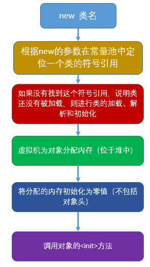

# JAVA高阶知识

## 三高

高性能、高扩展、高可用

- 高性能：响应（低延时）、吞吐（高吞吐量、高并发）

集群 - 吞吐

负载均衡 - 吞吐

缓存 - 响应

JVM调优 - 响应

分库分表 - 吞吐/响应

非阻塞协议 - 

MQ异步 - 吞吐

云原生、k8s - 动态扩缩容


## JUC

### 锁

- `synchronized` 关键字
- `java.util.concurrent.Lock` （`Lock`是一个接口，`ReentrantLock`是该接口一个很常用的实现）

底层原理：

- `synchronized` 关键字通过一对字节码指令 `monitorenter/monitorexit` 实现， 这对指令被 JVM 规范所描述。
- `java.util.concurrent.Lock` 通过 Java 代码搭配`sun.misc.Unsafe` 中的本地调用实现的

能用synchronized解决问题的优先使用。CAS自旋消耗资源。

|            | ReentrantLock                  | synchronized    |
| ---------- | ------------------------------ | --------------- |
| 锁实现机制 | 依赖AQS                        | 监视器模式      |
| 灵活性     | 支持响应中断、超时、尝试获取锁 | 不灵活          |
| 释放方式   | 显示调用unlock()               | 自动释放监视器  |
| 锁类型     | 公平锁&非公平锁                | 非公平锁        |
| 条件队列   | 关联多个条件队列               | 关联1个条件队列 |
| 可重入性   | 可重入                         | 可重入          |

### CAS

compare and swap，比较并交换，是一种乐观锁

该指令概念上存在3个参数，第一个参数【目标地址】，第二个参数【值1】，第三个参数【值2】， 指令会比较【目标地址存储的内容】和【值1】是否一致， 如果一致，则将【值 2】填写到【目标地址】

- ReentrantLock
- ReentrantReadWriteLock
- CyclicBarrier
- CountDownLatch
- Semaphore

### ABA

- AtomicStampedReference 

- AtomicReference

- AtomicMarkableReference


## AQS

AbstractQueuedSynchronizer，提供了一种实现阻塞锁和一系列依赖FIFO等待队列的同步器的框架

|                                                            |
| :--------------------------------------------------------: |
|                       |
|                   |
|        |
|  |
|                               |

原理 -> 数据结构 -> AQS同步状态 -> AQS等待队列 -> 解锁过程 -> 中断机制

### 原理

如果被请求的共享资源空闲，就将当前的请求资源设置为有效的工作线程。如果被占用，就需要一定的阻塞、唤醒机制来保证锁分配。

> CLH：Craig、Landin and Hagersten队列，是单向链表

AQS是变体的虚拟双向队列（FIFO），通过将每条请求共享资源的线程封装成一个节点来实现锁的分配。


### AQS数据结构

```java
static final class Node {
    /** Marker to indicate a node is waiting in shared mode */
    static final Node SHARED = new Node();
    /** Marker to indicate a node is waiting in exclusive mode */
    static final Node EXCLUSIVE = null;
    /** waitStatus value to indicate thread has cancelled */
    static final int CANCELLED =  1;
    /** waitStatus value to indicate successor's thread needs unparking */
    static final int SIGNAL    = -1;
    /** waitStatus value to indicate thread is waiting on condition */
    static final int CONDITION = -2;
    /** waitStatus value to indicate the next acquireShared should unconditionally propagate */
    static final int PROPAGATE = -3;

    volatile int waitStatus;
    
    volatile Node prev;       
    volatile Node next;      
    volatile Thread thread;
    
    Node nextWaiter;
}
```

- 属性值：

| 方法和属性值 | 含义                              |
| :----------- | :-------------------------------- |
| waitStatus   | 当前节点在队列中的等待状态        |
| thread       | 表示处于该节点的线程              |
| prev         | 前驱指针                          |
| predecessor  | 返回前驱节点，没有的话抛出npe     |
| nextWaiter   | 指向下一个处于CONDITION状态的节点 |
| next         | 后继指针                          |

- 线程两种锁的模式

| 模式      | 含义                           |
| :-------- | :----------------------------- |
| SHARED    | 表示线程以共享的模式等待锁     |
| EXCLUSIVE | 表示线程正在以独占的方式等待锁 |

- waitStatus

| 枚举      | 含义                                                |
| :-------- | :-------------------------------------------------- |
| 0         | 当一个Node被初始化的时候的默认值                    |
| CANCELLED | 为1，因为超时或中断，表示线程获取锁的请求已经取消了 |
| CONDITION | 为-2，表示节点在等待队列中，节点线程等待唤醒        |
| PROPAGATE | 为-3，当前线程处在SHARED情况下，该字段才会使用      |
| SIGNAL    | 为-1，表示线程已经准备好了，就等资源释放了          |

### 同步状态

同步状态的管理，`volatile int state`，用于标识是否持有锁。


实现过程中，要么独占是否，要么共享方式，tryAcquire-tryRelease、tryAcquireShared-tryReleaseShared，也可以同时实现，`ReentrantReadWriteLock`。

### 独占模式

#### 独占锁

独占模式下线程获取资源。如果获取到资源，线程直接返回，否则进入等待队列，直到获取到资源为止，且整个过程忽略中断的影响。这也正是lock()的语义，当然不仅仅只限于lock()。获取到资源后，线程就可以去执行其临界区代码了。

大致过程：acquire -> tryAcquire -> addWaiter -> acquireQueued

##### acquire

```java
public final void acquire(int arg) {
    if (!tryAcquire(arg) && acquireQueued(addWaiter(Node.EXCLUSIVE), arg))
        selfInterrupt();
}
```

具体流程：

   1. tryAcquire()   尝试直接去获取资源，如果成功则直接返回；
   2. addWaiter()  将该线程加入等待队列的尾部，并标记为独占模式；
   3. acquireQueued()  使线程在等待队列中获取资源，一直获取到资源后才返回。如果在整个等待过程中被中断过，则返回true，否则返回false。
   4. 如果线程在等待过程中被中断过，它是不响应的。只是获取资源后才再进行自我中断selfInterrupt()，将中断补上。

　

##### tryAcquire

　　尝试去获取独占资源。如果获取成功，则直接返回true，否则直接返回false。

```java
protected boolean tryAcquire(int arg) {
    throw new UnsupportedOperationException();
}
```

由子类实现，采用了模板方法设计模式。ReentrantLock.Sync类，Sync的子类实现：FairSync、NonfairSync。

- 公平锁

```java
// FairSync
protected final boolean tryAcquire(int acquires) {
    final Thread current = Thread.currentThread();
    // 原子操作
    int c = getState();
    if (c == 0) {
        if (!hasQueuedPredecessors() && compareAndSetState(0, acquires)) {
            setExclusiveOwnerThread(current);
            return true;
        }
    }
    // 当前线程是否等于持有锁的那个线程，--> 可重入锁的逻辑在此
    else if (current == getExclusiveOwnerThread()) {
        int nextc = c + acquires;
        if (nextc < 0)
            throw new Error("Maximum lock count exceeded");
        setState(nextc);
        return true;
    }
    return false;
}
```

- 非公平锁

```java
// NonfairSync
final boolean nonfairTryAcquire(int acquires) {
    final Thread current = Thread.currentThread();
    int c = getState();
    if (c == 0) {
        if (compareAndSetState(0, acquires)) {
            setExclusiveOwnerThread(current);
            return true;
        }
    }
    // 当前线程是否等于持有锁的那个线程，--> 可重入锁的逻辑在此
    else if (current == getExclusiveOwnerThread()) {
        int nextc = c + acquires;
        if (nextc < 0) // overflow
            throw new Error("Maximum lock count exceeded");
        setState(nextc);
        return true;
    }
    return false;
}
```

###### hasQueuedPredecessors

公平锁加锁时判断等待队列中是否存在有效节点hasQueuedPredecessors，如果返回false，说明当前线程可以争取共享资源；如果返回true，说明队列中存在有效节点，当前线程必须加入到等待队列中。

```java
public final boolean hasQueuedPredecessors() {
    // The correctness of this depends on head being initialized
    // before tail and on head.next being accurate if the current
    // thread is first in queue.
    Node t = tail; // Read fields in reverse initialization order
    Node h = head;
    Node s;
    return h != t && ((s = h.next) == null || s.thread != Thread.currentThread());
}
```

1. `h != t`返回false的情况
    1.1 当h和t都为null，返回false。此时说明队列为空，还从来没有Node入队。
    1.2 当h和t都指向同一个Node，也返回false。此时说明队列中只有一个dummy node，那说明没有线程在队列中。
    
2. `h != t`返回true，且`(s = h.next) == null`返回true

    2.1 既然`h != t`返回true，说明h和t不相等，先考虑特殊情况（上面讲到的出现“head不为null，tail为null”的情况，此时head是空node，next成员肯定为null），那么说明有一个线程正在执行enq，且它正好执行到`if (compareAndSetHead(new Node()))`到`tail = head;`的间隙。但这个线程肯定不是当前线程，所以不用判断后面短路的`s.thread != Thread.currentThread()`了，因为当前线程连enq都没开始执行，但另一个线程都开始执行enq了，那不就是说明当前线程排在别人后面了，别的线程马上就要入队了。
    2.2 既然`h != t`返回true，说明h和t不相等，再考虑二者都不为null。那此时队列中已经至少有一个等待中的线程了，那说明当前线程肯定排在别人后面了。

3. `h != t`返回true，且`(s = h.next) == null`返回false，且`s.thread != Thread.currentThread()`返回true

    现在知道head不为null，而且head.next也不为null了（(s = h.next) == null返回false）。我们也知道队列中第一个等待的线程存放在head.next里（注意，head为dummy node，不存放线程），那么如果head.next的线程不是当前线程，那即说明当前线程已经排在别人线程后面了。
    

- 公平锁：公平锁讲究先来先到，线程在获取锁时，如果这个锁的等待队列中已经有线程在等待，那么当前线程就会进入等待队列中;
- 非公平锁：不管是否有等待队列，如果可以获取锁，则立刻占有锁对象。也就是说队列的第一个排队线程在unpark()，之后还是需要竞争锁（存在线程竞争的情况下）

##### addWaiter

​		获取锁失败时，将当前线程加入到等待队列的尾部，并返回当前线程所在的节点。

```java
// addWaiter(Node.EXCLUSIVE)
private Node addWaiter(Node mode) {
    Node node = new Node(Thread.currentThread(), mode);
    // Try the fast path of enq; backup to full enq on failure
    Node pred = tail;
    if (pred != null) {
        node.prev = pred;
        // CAS 设置尾结点
        if (compareAndSetTail(pred, node)) {
            pred.next = node;
            return node;
        }
    }
    // pred=null（说明等待队列中没有元素），或者当前Pred指针和Tail指向的位置不同（说明被别的线程已经修改）
    enq(node);
    return node;
}

// 将node加入队尾
private Node enq(final Node node) {
    // CAS"自旋"，直到成功加入队尾
    for (;;) {
        Node t = tail;
        if (t == null) { // Must initialize
            // 队列为空，进行初始化一个头结点(并不是当前线程节点，而是调用了无参构造函数的节点)出来作为head结点，并将tail也指向它
            if (compareAndSetHead(new Node()))
                tail = head;
        } else {//正常流程，放入队尾
            node.prev = t;
            if (compareAndSetTail(t, node)) {
                t.next = node;
                return t;
            }
        }
    }
}
```

1. 通过当前线程和锁模式（Node.EXCLUSIVE或Node.SHARED）新建一个节点
2. pred指针指向尾结点tail
3. 将new node的prev指向pred

##### acquireQueued

​		线程获取锁失败，已经被放入等待队列尾部了。**进入等待状态休息，直到其他线程彻底释放资源后唤醒自己，自己再拿到资源，然后就可以去干自己想干的事了**。

```java
final boolean acquireQueued(final Node node, int arg) {
    // 标记是否成功拿到资源
    boolean failed = true;
    try {
        // 标记等待过程中线程是否中断过
        boolean interrupted = false;
        // 开始自旋，要么获取锁，要么中断
        for (;;) {
            // 当前节点的前驱节点
            final Node p = node.predecessor();
            // 如果是头结点，说明当前节点在队列的首部，就尝试获取锁（别忘了头结点是虚节点）
            if (p == head && tryAcquire(arg)) {
                // 获取锁成功，将当前节点设置成头节点
                setHead(node);
                p.next = null; // help GC
                failed = false;
                return interrupted;
            }
            // p为头结点且当前没有获取到锁（可能是非公平锁被抢占）；或者p不是头节点，这个时候判断当前node是否要被阻塞（被阻塞条件，waitStatus=-1），防止无限循环浪费资源
            // 自旋获取锁失败之后是否需要睡眠
            if (shouldParkAfterFailedAcquire(p, node) && parkAndCheckInterrupt())
                interrupted = true;
        }
    } finally {
        if (failed)
            cancelAcquire(node);
    }
}
```


###### shouldParkAfterFailedAcquire

​		靠前驱节点判断当前线程是否应该被阻塞

```java
private static boolean shouldParkAfterFailedAcquire(Node pred, Node node) {
    // 当前头节点的状态
    int ws = pred.waitStatus;
    // 说明头节点处于唤醒状态
    if (ws == Node.SIGNAL)
        /*
         * This node has already set status asking a release
         * to signal it, so it can safely park.
         */
        return true;
    if (ws > 0) {
        /*
         * Predecessor was cancelled. Skip over predecessors and
         * indicate retry.
         */
        do {
            // 循环向前查找取消节点，把取消节点从队列中剔除
            node.prev = pred = pred.prev;
        } while (pred.waitStatus > 0);
        pred.next = node;
    } else {
        /*
         * waitStatus must be 0 or PROPAGATE.  Indicate that we
         * need a signal, but don't park yet.  Caller will need to
         * retry to make sure it cannot acquire before parking.
         */
        compareAndSetWaitStatus(pred, ws, Node.SIGNAL);
    }
    return false;
}
```


###### parkAndCheckInterrupt

　　主要用于挂起当前线程，阻塞调用栈，返回当前线程的中断状态。

```java
private final boolean parkAndCheckInterrupt() {
    // 阻塞当前线程
    LockSupport.park(this);
    // 返回当前线程的中断状态
    return Thread.interrupted();
}
```

###### cancelAcquire

​		释放节点通知到被挂起的线程，将Node的状态标记为CANCELLED

```java
private void cancelAcquire(Node node) {
    // Ignore if node doesn't exist
    if (node == null)
        return;
	// 设置该节点不关联任何线程，也就是虚节点
    node.thread = null;

    // Skip cancelled predecessors
    Node pred = node.prev;
    // 通过前驱节点，跳过取消状态的node
    while (pred.waitStatus > 0)
        node.prev = pred = pred.prev;

    // predNext is the apparent node to unsplice. CASes below will
    // fail if not, in which case, we lost race vs another cancel
    // or signal, so no further action is necessary.
    // 获取前驱节点的后继节点
    Node predNext = pred.next;

    // Can use unconditional write instead of CAS here.
    // After this atomic step, other Nodes can skip past us.
    // Before, we are free of interference from other threads.
    node.waitStatus = Node.CANCELLED;

    // If we are the tail, remove ourselves.
    // 如果当前节点是tail节点，将从后往前的第一个非取消状态的节点设置为tail节点
  	// 更新失败的话，则进入else，如果更新成功，将tail的后继节点设置为null
    if (node == tail && compareAndSetTail(node, pred)) {
        compareAndSetNext(pred, predNext, null);
    } else {
        // If successor needs signal, try to set pred's next-link
        // so it will get one. Otherwise wake it up to propagate.
        int ws;
        // 如果当前节点不是head的后继节点，1:判断当前节点前驱节点的是否为SIGNAL，2:如果不是，则把前驱节点设置为SINGAL看是否成功
        // 如果1和2中有一个为true，再判断当前节点的线程是否为null
        // 如果上述条件都满足，把当前节点的前驱节点的后继指针指向当前节点的后继节点
        if (pred != head &&
            ((ws = pred.waitStatus) == Node.SIGNAL || (ws <= 0 && compareAndSetWaitStatus(pred, ws, Node.SIGNAL))) &&
            pred.thread != null) {
            Node next = node.next;
            if (next != null && next.waitStatus <= 0)
                compareAndSetNext(pred, predNext, next);
        } else {
            // 如果当前节点是head的后继节点，或者上述条件不满足，那就唤醒当前节点的后继节点
            unparkSuccessor(node);
        }

        node.next = node; // help GC
    }
}
```

(1) 当前节点是尾节点。

(2) 当前节点是head的后继节点。

(3) 当前节点不是head的后继节点，也不是尾节点。

|                        尾节点                        |
| :--------------------------------------------------: |
|            |
|                **head节点的后继节点**                |
|  |
|                     **普通节点**                     |
|                  |

> 执行cancelAcquire的时候，当前节点的前置节点可能已经从队列中出去了（已经执行过Try代码块中的shouldParkAfterFailedAcquire方法了），如果此时修改Prev指针，有可能会导致Prev指向另一个已经移除队列的Node，因此这块变化Prev指针不安全。 shouldParkAfterFailedAcquire方法中，会执行下面的代码，其实就是在处理Prev指针。shouldParkAfterFailedAcquire是获取锁失败的情况下才会执行，进入该方法后，说明共享资源已被获取，当前节点之前的节点都不会出现变化，因此这个时候变更Prev指针比较安全。

#### 独占锁释放


```java
public final boolean release(int arg) {
    if (tryRelease(arg)) {
        Node h = head;
        // head节点不为空 && head结点等待状态不为0，不是初始化节点情况，解除线程挂起状态
        if (h != null && h.waitStatus != 0)
            // 唤醒头结点的后继节点
            unparkSuccessor(h);
        return true;
    }
    return false;
}
```

1. `h == null`   head还没初始化。初始情况下，head == null，第一个节点入队，head会被初始化一个虚拟节点。所以说，这里如果还没来得及入队，就会出现head == null 的情况。

2. `h != null && waitStatus == 0`  表明next节点对应的线程仍在运行中，不需要唤醒。

3. `h != null && waitStatus < 0` 表明next节点可能被阻塞了，需要唤醒。

##### tryRelease

​		尝试去释放同步状态。如果释放成功，则直接返回true，否则直接返回false。

```java
protected boolean tryRelease(int arg) {
    throw new UnsupportedOperationException();
}
```

由子类实现，采用了模板方法设计模式。ReentrantLock.Sync类，Sync的子类：FairSync、NonfairSync


```
protected final boolean tryRelease(int releases) {
    int c = getState() - releases;
    if (Thread.currentThread() != getExclusiveOwnerThread())
        throw new IllegalMonitorStateException();
    boolean free = false;
    if (c == 0) {
        free = true;
        setExclusiveOwnerThread(null);
    }
    setState(c);
    return free;
}
```


##### unparkSuccessor

​		唤醒头结点的后继节点

```java
private void unparkSuccessor(Node node) {
    /*
     * If status is negative (i.e., possibly needing signal) try
     * to clear in anticipation of signalling.  It is OK if this
     * fails or if status is changed by waiting thread.
     * 获取head节点的等待状态
     */
    int ws = node.waitStatus;
    if (ws < 0)
        // 小于0，CAS设置成0
        compareAndSetWaitStatus(node, ws, 0);

    /*
     * Thread to unpark is held in successor, which is normally
     * just the next node.  But if cancelled or apparently null,
     * traverse backwards from tail to find the actual
     * non-cancelled successor.
     * 获取head节点的next节点
     */
    Node s = node.next;
    // 后继节点为空 或 其等待状态大于0（表示取消状态），就找到队列最开始的非cancelled的节点
    if (s == null || s.waitStatus > 0) {
        s = null;
        // 就从tail节点开始找，到队首，找到队列第一个waitStatus<0的节点。
        for (Node t = tail; t != null && t != node; t = t.prev)
            if (t.waitStatus <= 0)
                s = t;
    }
    // 如果当前节点的下个节点不为空，而且状态<=0，就把当前节点unpark
    if (s != null)
        // 唤醒后继节点
        LockSupport.unpark(s.thread);
}
```

> 我们从这里可以看到，节点入队并不是原子操作，也就是说，node.prev = pred; compareAndSetTail(pred, node) 这两个地方可以看作Tail入队的原子操作，但是此时pred.next = node;还没执行，如果这个时候执行了unparkSuccessor方法，就没办法从前往后找了，所以需要从后往前找。还有一点原因，在产生CANCELLED状态节点的时候，先断开的是Next指针，Prev指针并未断开，因此也是必须要从后往前遍历才能够遍历完全部的Node。
>
> 综上所述，如果是从前往后找，由于极端情况下入队的非原子操作和CANCELLED节点产生过程中断开Next指针的操作，可能会导致无法遍历所有的节点。所以，唤醒对应的线程后，对应的线程就会继续往下执行。继续执行acquireQueued方法以后，中断如何处理？


但为什么获取了锁以后还要中断线程呢？

1. 当中断线程被唤醒时，并不知道被唤醒的原因，可能是当前线程在等待中被中断，也可能是释放了锁以后被唤醒。因此我们通过Thread.interrupted()方法检查中断标记（该方法返回了当前线程的中断状态，并将当前线程的中断标识设置为False），并记录下来，如果发现该线程被中断过，就再中断一次。
2. 线程在等待资源的过程中被唤醒，唤醒后还是会不断地去尝试获取锁，直到抢到锁为止。也就是说，在整个流程中，并不响应中断，只是记录中断记录。最后抢到锁返回了，那么如果被中断过的话，就需要补充一次中断。

### 共享模式

在同一时刻可以有多个线程获取同步状态（独占模式在同一时刻只有1个线程获取同步状态）。

```java
public final void acquireShared(int arg) {
    if (tryAcquireShared(arg) < 0)
        doAcquireShared(arg);
}
```


#### tryAcquireShared

```java
protected int tryAcquireShared(int arg) {
    throw new UnsupportedOperationException();
}
```

ReentrantReadWriteLock.Sync类，Semaphore.FairSync、NonfairSync，CountDownLatch.Sync

#### doAcquireShared

```java
private void doAcquireShared(int arg) {
    final Node node = addWaiter(Node.SHARED);
    boolean failed = true;
    try {
        boolean interrupted = false;
        for (;;) {
            final Node p = node.predecessor();
            if (p == head) {
                int r = tryAcquireShared(arg);
                if (r >= 0) {
                    setHeadAndPropagate(node, r);
                    p.next = null; // help GC
                    if (interrupted)
                        selfInterrupt();
                    failed = false;
                    return;
                }
            }
            if (shouldParkAfterFailedAcquire(p, node) && parkAndCheckInterrupt())
                interrupted = true;
        }
    } finally {
        if (failed)
            cancelAcquire(node);
    }
}
```

#### setHeadAndPropagate

```java
private void setHeadAndPropagate(Node node, int propagate) {
    Node h = head; // Record old head for check below
    setHead(node);
    /*
     * Try to signal next queued node if:
     *   Propagation was indicated by caller,
     *     or was recorded (as h.waitStatus either before
     *     or after setHead) by a previous operation
     *     (note: this uses sign-check of waitStatus because
     *      PROPAGATE status may transition to SIGNAL.)
     * and
     *   The next node is waiting in shared mode,
     *     or we don't know, because it appears null
     *
     * The conservatism in both of these checks may cause
     * unnecessary wake-ups, but only when there are multiple
     * racing acquires/releases, so most need signals now or soon
     * anyway.
     */
    if (propagate > 0 || h == null || h.waitStatus < 0 ||
        (h = head) == null || h.waitStatus < 0) {
        Node s = node.next;
        if (s == null || s.isShared())
            doReleaseShared();
    }
}
```


#### doReleaseShared

是否共享同步状态

```java
private void doReleaseShared() {
    /*
     * Ensure that a release propagates, even if there are other
     * in-progress acquires/releases.  This proceeds in the usual
     * way of trying to unparkSuccessor of head if it needs
     * signal. But if it does not, status is set to PROPAGATE to
     * ensure that upon release, propagation continues.
     * Additionally, we must loop in case a new node is added
     * while we are doing this. Also, unlike other uses of
     * unparkSuccessor, we need to know if CAS to reset status
     * fails, if so rechecking.
     */
    for (;;) {
        Node h = head;
        if (h != null && h != tail) {
            int ws = h.waitStatus;
            if (ws == Node.SIGNAL) {
                if (!compareAndSetWaitStatus(h, Node.SIGNAL, 0))
                    continue;            // loop to recheck cases
                unparkSuccessor(h);
            }
            else if (ws == 0 && !compareAndSetWaitStatus(h, 0, Node.PROPAGATE))
                continue;                // loop on failed CAS
        }
        if (h == head)                   // loop if head changed
            break;
    }
}
```

https://tech.meituan.com/2019/12/05/aqs-theory-and-apply.html

https://blog.csdn.net/qq_21040559/article/details/112388069


## DCL

Double Check Lock双检锁

```java
public class SingletonLazy {

    /**
     * 因为这个变量要在静态方法中使用，所以需要加上static修饰
     * static对象,定义成null
     * volatile 可见性
     */
    private volatile static SingletonLazy instance = null;

    /**
     * 构造方法私有化
     */
    private SingletonLazy() {
    }

    /**
     * 提供获取实例的方法
     * 定义成static
     * 双重检查加锁
     */
    public static SingletonLazy getInstance() {
        //　判断存储实例的变量是否有值
        if (instance == null) {
            //　同步块，线程安全的创建实例
            synchronized (SingletonLazy.class) {
                //　再次检查实例是否存在，如果不存在才真的创建实例
                if (instance == null) {
                    //　如果没有，就创建一个类实例，并把值赋值给存储类实例的变量
                    instance = new SingletonLazy();
                }
            }
        }
        //　如果有值，那就直接使用
        return instance;
    }
}
```


## 对象的基本存储方式

- 对象的引用：存储在栈中
- 对象的实例数据：存储在堆中
- 对象的元数据：存储在方法区

> 在jdk8中为什么大于4秒钟的时候才会有偏向锁状态？
> 其实这是因为虚拟机在启动的时候对于偏向锁有延迟。
> 因为在项目启动的时候，有大量的同步块(synchronized),多个线程访问的时候，需要消除偏向锁。会很麻烦，反而会降低效率。
> -XX:+UseBiasedLocking -XX:BiasedLockingStartupDelay=0 修改上面的jvm参数，可以开启jvm偏向锁延迟配置，延迟为0
> -XX:-UseBiasedLocking关闭偏向锁


## 对象的内存布局

对象保存在堆中，由三部分组成：

- **对象头（object header）**：包括了关于堆对象的布局、类型、GC状态、同步状态和标识哈希码的基本信息。Java对象和vm内部对象都有一个共同的对象头格式。
- **实例数据（Instance Data）**：主要是存放类的数据信息，父类的信息，对象字段属性信息。

- **对齐填充（Padding）**：为了字节对齐，填充的数据，不是必须的。

|                对象实例                |
| :------------------------------------: |
|  |

jdk8版本是默认开启指针压缩的，可以通过配置vm参数开启关闭指针压缩，-XX:-UseCompressedOops。

开启指针压缩可以减少对象的内存使用

### 对象头（Object Header）

对象头至少由两个**Word**组成，第一个字就是 **mark word**，第二个就是 **klass pointer**，数组类型占用3个字宽

- #### **Mark Word（标记字段）**

> 对于32位处理器 1 Word = 4 Bytes， 64位处理器 1 Word = 8 Bytes

对象的Mark Word部分占8个字节，其内容是一系列的标记位，比如轻量级锁的标记位，偏向锁标记位等等。

用于存储对象自身的运行时数据，如哈希码（HashCode）、GC分代年龄、锁信息（锁状态标志、线程持有的锁、偏向线程ID、偏向时间戳）等。在32位JVM中的长度是32bit，在64位JVM中长度是64bit

> 工具：JOL

|               Mark Word               |
| :-----------------------------------: |
|  |
|  |

- **unused**：未使用空间
- **对象的hashcode（identity hash code）**：占31bits，运行期间调用System.identityHashCode()来计算，延迟计算，并把结果赋值到这里。当对象加锁后，计算的结果31位不够表示，在偏向锁，轻量锁，重量锁，hashcode会被转移到Monitor中。
- **GC分代年龄（age）**：占4bits，表示对象被GC的次数，在GC过程中，如果新生代对象在Survivor区复制一次，年龄+1．当对象年龄达到设定的阈值时，对象将会进入老年代．或者有一半的的对象年龄相等，则大于该年龄的对象直接进入老年代．默认情况GC年龄阈值为15．因为age只占4位 ，所以最大值为1 1 1 1 = 15．
- **锁标志位（lock）**：占2bits，区分锁状态，00-轻量锁，01-解锁或偏向锁，10-重量锁，11-GC标记
- **biased_lock**：占1bits，是否偏向锁，由于正常锁和偏向锁的锁标识都是 01，没办法区分，这里引入一位的偏向锁标识位。

> 无锁和偏向锁的锁标志都是01 ，区分的方式是通过1bit的是否为偏向锁(biased_lock)．偏向锁的这1bit等于1，无锁这一位则为0

- **偏向锁的线程ID（JavaThread）**：占54bits，偏向锁记录的线程标识，当某个线程持有对象的时候，对象这里就会被置为该线程的ID。 在后面的操作中，就无需再进行尝试获取锁的动作。

- **Epoch**：占2bits，偏向锁在CAS锁操作过程中，偏向性标识，表示对象更偏向哪个锁。

- **ptr_to_lock_record**：轻量级锁状态下，指向栈中锁记录的指针。当锁获取是无竞争的时，JVM使用原子操作而不是OS互斥。这种技术称为轻量级锁定。在轻量级锁定的情况下，JVM通过CAS操作在对象的标题字中设置指向锁记录的指针。

- **ptr_to_heavyweight_monitor**：重量级锁状态下，指向对象监视器Monitor的指针。如果两个不同的线程同时在同一个对象上竞争，则必须将轻量级锁定升级到Monitor以管理等待的线程。在重量级锁定的情况下，JVM在对象的ptr_to_heavyweight_monitor设置指向Monitor的指针。

> 分析synchronize锁优化和JVM垃圾回收年龄代的时候会有很大作用


> JVM中大家是否还记得对象在Suvivor中每熬过一次MinorGC，年龄就增加1，当它的年龄增加到一定程度后就会被晋升到老年代中，这个次数默认是15岁，有想过为什么是15吗？在Mark Word中可以发现标记对象分代年龄的分配的空间是4bit，而4bit能表示的最大数就是2^4-1 = 15。


- #### **类型指针（class Pointer）**

> 未开启指针压缩时，类型指针占用8byte (64bit)
>
> 开启指针压缩情况下，类型指针占用4byte (32bit)

Class对象指针（指针压缩默认开启）的大小默认是4个字节，其指向的位置是对象对应的Class对象（其对应的元数据对象）的内存地址，保存在元空间。

前提：

new Object()在32为系统中占用内存大小是8byte（对象头，在堆中）+ 4byte（对象的引用地址，在栈中）=12byte；

new Object()在64为系统中占用内存大小是16byte（对象头，在堆中）+ 8byte（对象的引用地址，在栈中）=24byte；

> -XX:+UseCompressedOops  JVM 会使用 32-bit的offset来代表java object的引用
>
> -XX:+UseCompressedClassPointers  (默认是开启)     表示使用压缩指针，使用32-bit的offset来代表64-bit进程中的class pointer

总结：

1. 通过指针压缩，利用对齐填充的特性，通过映射方式达到了内存地址扩展的效果
2. 指针压缩能够节省内存空间，同时提高了程序的寻址效率
3. 堆内存设置时最好不要超过32GB，这时指针压缩将会失效，造成空间的浪费
4. 此外，指针压缩不仅可以作用于对象头的类型指针，还可以作用于引用类型的字段指针，以及引用类型数组指针
   

- #### **array length(数组特有)**

如果对象是一个数组，那么对象头还要有额外的空间存储数组的长度，JVM可以通过对象头中的数组长度数据来判定数组的大小，这是访问数组类型的元数据是无法得知的.　长度为4个字节

#### 不同情况下的Object Header

- 32位JVM下

```
|----------------------------------------------------------------------------------------|--------------------
|                                    Object Header (64 bits)                             |        State       
|-------------------------------------------------------|--------------------------------|--------------------
|                  Mark Word (32 bits)                  |      Klass Word (32 bits)      |                    
|-------------------------------------------------------|--------------------------------|--------------------
| identity_hashcode:25 | age:4 | biased_lock:1 | lock:2 |      OOP to metadata object    |     正常(无状态)   
|-------------------------------------------------------|--------------------------------|--------------------
|  thread:23 | epoch:2 | age:4 | biased_lock:1 | lock:2 |      OOP to metadata object    |       偏向锁       
|-------------------------------------------------------|--------------------------------|--------------------
|               ptr_to_lock_record:30          | lock:2 |      OOP to metadata object    |       轻量锁       
|-------------------------------------------------------|--------------------------------|--------------------
|               ptr_to_heavyweight_monitor:30  | lock:2 |      OOP to metadata object    |       重量锁       
|-------------------------------------------------------|--------------------------------|--------------------
|                                              | lock:2 |      OOP to metadata object    |       GC标记       
|-------------------------------------------------------|--------------------------------|--------------------
```

- 64位JVM下

```
|----------------------------------------------------------------------------------------------------------|------------
|                                            Object Header (128 bits)                                      |    State
|------------------------------------------------------------------------------|---------------------------|------------
|                                  mark word (64 bits)                         |  klass word (64 bits)  |
|------------------------------------------------------------------------------|---------------------------|------------
| unused:25 | identity_hashcode:31 | unused:1 | age:4 | biased_lock:1 | lock:2 |  OOP to metadata object   | 正常(无状态)
|------------------------------------------------------------------------------|---------------------------|------------
| thread:54 |       epoch:2        | unused:1 | age:4 | biased_lock:1 | lock:2 |  OOP to metadata object   |   偏向锁
|------------------------------------------------------------------------------|---------------------------|------------
|                       ptr_to_lock_record:62                         | lock:2 |  OOP to metadata object   |   轻量锁
|------------------------------------------------------------------------------|---------------------------|------------
|                     ptr_to_heavyweight_monitor:62                   | lock:2 |  OOP to metadata object   |   重量锁
|------------------------------------------------------------------------------|---------------------------|------------
|                                                                     | lock:2 |  OOP to metadata object   |   GC标记
|------------------------------------------------------------------------------|---------------------------|------------
```

- 64位JVM压缩指针

```
|---------------------------------------------------------------------------------------------------------|------------|
|                                            Object Header (96 bits)                                      |  State     |
|--------------------------------------------------------------------------------|------------------------|------------|
|                                  Mark Word (64 bits)                           | Klass Word (32 bits)   |            |
|--------------------------------------------------------------------------------|------------------------|------------|
| unused:25 | identity_hashcode:31 | cms_free:1 | age:4 | biased_lock:1 | lock:2 | OOP to metadata object | 正常(无状态) |
|--------------------------------------------------------------------------------|------------------------|------------|
| thread:54 |       epoch:2        | cms_free:1 | age:4 | biased_lock:1 | lock:2 | OOP to metadata object | 偏向锁      |
|--------------------------------------------------------------------------------|------------------------|------------|
|                         ptr_to_lock_record                            | lock:2 | OOP to metadata object | 轻量锁      |
|--------------------------------------------------------------------------------|------------------------|------------|
|                     ptr_to_heavyweight_monitor                        | lock:2 | OOP to metadata object | 重量锁      |
|--------------------------------------------------------------------------------|------------------------|------------|
|                                                                       | lock:2 | OOP to metadata object | GC标记     |
|--------------------------------------------------------------------------------|------------------------|------------|
```


### 实例数据（Instance Data）

包括了对象的所有成员变量，分配策略为longs/doubles、ints、shorts/chars、bytes/booleans、oops（Ordinary Object Pointers普通对象指针）。

- 基本数据类型

byte和boolean是1个字节，short和char是2个字节，int和float是4个字节，long和double是8个字节

- 引用数据类型

reference开启UseCompressedOops占4字节，不开启UseCompressedOops占8字节

> -XX:+UseCompressedOops  为4字节(默认开启) ，不开启为8字节 Oops（Ordinary Object Pointers）(成员变量的引用 比如Object o)


### 对齐补充（Padding）

由于要求对象起始地址必须是8字节的整数倍，换句话说就是对象的大小必须是8字节的整数倍。对象头正好是8字节的倍数（1倍或者2倍），因此当对象实例数据部分没有对齐的话，就需要通过对齐填充来补全。

> **为什么要对齐数据**？字段内存对齐的其中一个原因，是让字段只出现在同一CPU的缓存行中。如果字段不是对齐的，那么就有可能出现跨缓存行的字段。也就是说，该字段的读取可能需要替换两个缓存行，而该字段的存储也会同时污染两个缓存行。这两种情况对程序的执行效率而言都是不利的。其实对其填充的最终目的是为了计算机高效寻址


## 对象的创建过程

|                                                             |
| :---------------------------------------------------------: |
|  |

#### 类加载

首先jvm要检查类A是否已经被加载到了内存，即类的符号引用是否已经在常量池中，并且检查这个符号引用代表的类是否已被加载、解析和初始化过的。如果还没有，需要先触发类的加载、解析、初始化，然后在堆上创建对象。


#### 分配内存

在类加载检查通过后，虚拟机将为新生对象分配内存。

##### 内存分配方式

1. **指针碰撞**

   如果Java堆中内存是**绝对规整**的，所有用过的内存都被放在一边，空闲的内存被放在另一边，中间放着一个指针作为分界点的指示器，那所分配内存就仅仅是把那个指针向空闲空间那边挪动一段与对象大小相等的距离，这种分配方式称为**“指针碰撞”（Bump The Pointer）**。

2. **空闲列表**

   如果Java堆中的内存并**不是规整**的，已被使用的内存和空闲的内存相互交错，那就没有办法简单的进行指针碰撞了，虚拟机就必须维护一个列表，记录上哪些内存块是可用的，在分配的时候从列表中找到一块足够大的空间划分给对象实例，并更新列表上的记录，这种分配方式称为**“空闲列表”（Free List）**。

> 选择哪种分配方式由Java堆是否规整决定，而Java堆是否规整又由所采用的垃圾收集器是否带有压缩整理功能决定。因此在使用Serial、ParNew等带Compact过程的收集器时，系统采用的分配算法是指针碰撞，而使用CMS这种基于Mark-Sweep算法的收集器时（说明一下，CMS收集器可以通过UseCMSCompactAtFullCollection或 CMSFullGCsBeforeCompaction来整理内存），就通常采用空闲列表


##### 内存分配时处理并发安全问题

对象创建在虚拟机中是非常频繁的行为，即使是仅仅修改一个指针所指向的位置，在并发情况下也并不是线程安全的，可能出现正在给对象A分配内存，指针还没来得及修改，对象B又同时使用了原来的指针来分配内存。

- CAS：失败重试，区域加锁，保证指针更新操作的原子性

- TLAB：（Thread Local Allocation Buffer）把内存分配的动作按照线程划分在不同的空间中进行，即每个线程在Java堆中预先分配一小块内存，称为**本地线程分配缓冲区**，哪个线程要分配内存，就在哪个线程的TLAB上分配，只有TLAB用完，分配新的TLAB时才需要同步锁定。虚拟机是否使用TLAB，可以通过-XX:+/-UseTLAB参数来设定。

  

#### 完成实例数据部分的初始化工作（初始化为0值）

内存分配完成之后，虚拟机需要将分配到的内存空间都初始化为零值（不包括对象头），如果使用TLAB的话，这一工作也可以提前至TLAB分配时进行。这步操作保证了对象的实例字段在Java代码中可以不赋初始值就直接使用，程序能访问到这些字段的数据类型所对应的零值。

| 类型                  | 默认值         |
| --------------------- | -------------- |
| byte                  | (byte)0        |
| short                 | (short)0       |
| int                   | 0              |
| long                  | 0L             |
| float                 | 0.0f           |
| double                | 0.0d           |
| boolean               | false          |
| char                  | '/uoooo'(null) |
| reference（引用类型） | null           |

#### 设置对象头

虚拟机要对对象进行必要的设置，例如这个对象是哪个类的实例、如何才能找到类的元数据信息、对象的哈希码、对象的GC分代年龄等信息。这些信息存放在对象的**对象头（Object Header）**之中。根据虚拟机当前的运行状态的不同，如是否启用偏向锁等，对象头会有不同的设置方式。


#### 执行\<init>方法

在上面工作都完成之后，在虚拟机的视角来看，一个新的对象已经产生了。但是在Java程序的视角看来，初始化才正式开始，开始调用\<init>方法完成初始复制和构造函数，所有的字段都为零值。因此一般来说（由字节码中是否跟随有invokespecial指令所决定），new指令之后会接着就是执 行\<init>方法（**子类的< init >方法中会首先对父类< init >方法的调用**），把对象按照程序员的意愿进行初始化，然后将内存地址赋给栈内存中的变量，这样一个真正可用的对象才算完全创建出来。

> <init> 实例初始化方法，对象构造器方法。1.父类变量初始化块/父类语句块 2.父类构造函数 3.子类变量初始化块/子类语句块 4.子类构造函数。
>
> <client> 类初始化方法，类构造器方法。1.父类静态变量初始化/父类静态语句块 2.子类静态变量初始化/子类静态语句块。

```cpp
// 确保常量池中存放的是已解释的类
    if (!constants->tag_at(index).is_unresolved_klass()) {
      // 断言确保是klassOop和instanceKlassOop
      oop entry = (klassOop) *constants->obj_at_addr(index);
      assert(entry->is_klass(), "Should be resolved klass");
      klassOop k_entry = (klassOop) entry;
      assert(k_entry->klass_part()->oop_is_instance(), "Should be instanceKlass");
      instanceKlass* ik = (instanceKlass*) k_entry->klass_part();
      // 确保对象所属类型已经经过初始化阶段
      if ( ik->is_initialized() && ik->can_be_fastpath_allocated() ) {
        // 取对象长度
        size_t obj_size = ik->size_helper();
        oop result = NULL;
        // 记录是否需要将对象所有字段置零值
        bool need_zero = !ZeroTLAB;
        // 是否在TLAB中分配对象
        if (UseTLAB) {
          result = (oop) THREAD->tlab().allocate(obj_size);
        }
        if (result == NULL) {
          need_zero = true;
          // 直接在eden中分配对象
    retry:
          HeapWord* compare_to = *Universe::heap()->top_addr();
          HeapWord* new_top = compare_to + obj_size;
          // cmpxchg是x86中的CAS指令，这里是一个C++方法，通过CAS方式分配空间，并发失败的话，转到retry中重试直至成功分配为止
          if (new_top <= *Universe::heap()->end_addr()) {
            if (Atomic::cmpxchg_ptr(new_top, Universe::heap()->top_addr(), compare_to) != compare_to) {
              goto retry;
            }
            result = (oop) compare_to;
          }
        }
        if (result != NULL) {
          // 如果需要，为对象初始化零值
          if (need_zero ) {
            HeapWord* to_zero = (HeapWord*) result + sizeof(oopDesc) / oopSize;
            obj_size -= sizeof(oopDesc) / oopSize;
            if (obj_size > 0 ) {
              memset(to_zero, 0, obj_size * HeapWordSize);
            }
          }
          // 根据是否启用偏向锁，设置对象头信息
          if (UseBiasedLocking) {
            result->set_mark(ik->prototype_header());
          } else {
            result->set_mark(markOopDesc::prototype());
          }
          result->set_klass_gap(0);
          result->set_klass(k_entry);
          // 将对象引用入栈，继续执行下一条指令
          SET_STACK_OBJECT(result, 0);
          UPDATE_PC_AND_TOS_AND_CONTINUE(3, 1);
        }
      }
    }
```


## 对象的访问定位

​        需要通过栈上的reference数据来操作堆上的具体对象。由于reference类型在Java虚拟机规范里面只规定了是一个指向对象的引用，并没有定义这个引用应该通过什么种方式去定位、访问到堆中的对象的具体位置，对象访问方式也是取决于虚拟机实现而定的。主流的访问方式有使用**句柄**和**直接指针**两种。 

- **句柄**

​        Java堆中将会划分出一块内存来作为**句柄池**，**reference**中存储的就是**对象的句柄地址**，而句柄中包含了对象实例数据与类型数据的具体各自的地址信息。

> 最大好处就是reference中存储的是稳定句柄地址，在对象被移动（垃圾回收时，内存地址发生变动）时只会改变句柄中的实例数据指针，而reference本身不需要被修改。 

|                         句柄访问对象                         |
| :----------------------------------------------------------: |
|  |


- **直接指针**

　　**reference**中直接存储的对象地址， 对象实例数据中存储类型的指针地址。

> 最大的好处就是速度更快，它节省了一次**对象实例指针定位**的时间开销，由于对象访问的在Java中非常频繁，因此这类开销积小成多也是一项非常可观的执行成本。就虚拟机HotSpot而言，它是使用**直接指针**方式进行对象访问

|                       直接指针访问对象                       |
| :----------------------------------------------------------: |
|  |


## 锁的四种状态

|                                                            |
| :--------------------------------------------------------: |
|  |
|                                                            |


- new (未锁定状态)
  在一个对象刚new出来的时候，没有线程竞争，就是一个普通对象，不需要加锁，此时biased_lock为1,锁的标志位为01 , 表示无锁可偏向 . ( 如果计算了对象的hashcode ,则会记录对象的hashcode，锁的标志位为01．biased_lock位置为0. 此时表示无锁不可偏向状态)

  
  
- 偏向锁：biased_lock
  如果已经计算了对象的hashcode ,则表示该锁不能偏向 .直接升级为轻量级锁.(对象的hashcode和偏向线程id只能存储一个)
  
  1. 当第一个线程A来获取资源的时候，这个时候只有线程A一个，没有其他线程来竞争，他会将biased_lock标志位置为1，锁标志为01, 表示已经偏向它的状态．线程ID也会记录A的id.
2. 当A线程再次获取该资源的时候，JVM发现mark word里面的线程id是A的id，锁的标志位是01，biased_lock是1，表示A已经获得该偏向锁．

  

- 轻量级锁（自旋，自旋锁，look-free，CAS轻量级锁）：
  当线程B尝试获取该锁时（此时有了锁的竞争），JVM发现此时锁处于偏向状态，mark word的线程id记录的是A，此时线程B会尝试通过CAS的方式（在用户空间）获取锁．两个线程都将对象的hashcode复制到自己新建的用于存储锁的记录空间LockRecord，通过CAS的操作，将对象的mark word的内容修改为自己新建的记录空间的地址来竞争mark word．成功则获取资源，失败则继续CAS操作．
  自旋的线程在自旋过程中，成功获取资源，整个状态仍然处于轻量级锁的状态．

  
  
- 重量级锁：

> 竞争加剧 在jdk6: 自旋锁自旋次数超过10，或者等待线程超过CPU核数的二分之一，升级为重量级锁
> jdk6以后：jdk自适应自旋，来判断什么时候升级

自旋的线程将被阻塞，需经过os，提供一个等待队列和一个竞争队列．等待操作系统的调度


| 锁名称   |                             描述                             | 优点                                                         | 缺点                                           | 适用场景                           |
| -------- | :----------------------------------------------------------: | ------------------------------------------------------------ | ---------------------------------------------- | ---------------------------------- |
| 偏向锁   | 线程在大多数情况下并不存在竞争条件，使用同步会消耗性能，而偏向锁是对锁的优化，可以消除同步，提升性能。当一个线程获得锁，会将对象头的锁标志位设为01，进入偏向模式.偏向锁可以在让一个线程一直持有锁，在其他线程需要竞争锁的时候，再释放锁 | 加锁和解锁不需要额外的消耗，和执行非同步方法比仅存在纳秒级的差距 | 如果线程间存在锁竞争，会带来额外的锁撤销的消耗 | 适用于只有一个线程访问同步块场景   |
| 轻量级锁 | 当线程A获得偏向锁后，线程B进入竞争状态，需要获得线程A持有的锁，那么线程A撤销偏向锁，进入无锁状态。线程A和线程B交替进入临界区，偏向锁无法满足，膨胀到轻量级锁，锁标志位设为00。 | 竞争的线程不会阻塞，提高了程序的响应速度                     | 如果始终得不到锁竞争的线程使用自旋会消耗CPU    | 追求响应时间。同步块执行速度非常快 |
| 重量级锁 | 当多线程交替进入临界区，轻量级锁hold得住。但如果多个线程同时进入临界区，hold不住了，膨胀到重量级锁 | 线程竞争不使用自旋，不会消耗CPU                              | 线程阻塞，响应时间缓慢                         | 追求吞吐量。同步块执行速度较长     |


## JSR内存屏障（Memory Barrier）

Java内存屏障主要有Load和Store两类。 
对Load Barrier来说，在读指令前插入读屏障，可以让高速缓存中的数据失效，重新从主内存加载数据 
对Store Barrier来说，在写指令之后插入写屏障，能让写入缓存的最新数据写回到主内存

| 屏障类型   | 指令示例                 | 说明                                                         |
| ---------- | ------------------------ | ------------------------------------------------------------ |
| LoadLoad   | Load1;Loadload;Load2     | 在Load2及后续读取操作要读取的数据被访问前，保证Load1要读取的数据被读取完毕 |
| StoreStore | Store1;StoreStore;Store2 | 在Store2及后续写入操作执行前，保证Store1的写入操作对其它处理器可见 |
| LoadStore  | Load1;LoadStore;Store2   | 在Store2及后续写入操作被刷出前，保证Load1要读取的数据被读取完毕 |
| StoreLoad  | Store1;StoreLoad;Load2   | 在Load2及后续所有读取操作执行前，保证Store1的写入对所有处理器可见 |


- LoadLoad 屏障

  序列：Load1 -> Loadload -> Load2 

- StoreStore 屏障

  序列：Store1 -> StoreStore -> Store2 

- LoadStore 屏障

  序列：Load1 -> LoadStore -> Store2 

- StoreLoad 屏障

  序列：Store1 -> StoreLoad ->  Load2
  
  **它的开销是四种屏障中最大的。在大多数处理器的实现中，这个屏障是个万能屏障，兼具其它三种内存屏障的功能**


## Happens - Before原则

导致多线程间可见性问题的两个“罪魁祸首”是*CPU缓存*和*重排序*，JMM定义了Happens-Before原则：**对于两个操作A和B，这两个操作可以在不同的线程中执行。如果A Happens-Before B，那么可以保证，当A操作执行完后，A操作的执行结果对B操作是可见的。**

1. 程序顺序规则
2. 锁定规则
3. volatile变量规则
4. 线程启动规则
5. 线程结束规则
6. 中断规则
7. 终结器规则
8. 传递性规则

|                                                              |
| :----------------------------------------------------------: |
|  |

如图所示，这里的unlock M和lock M就是划分程序的分割线。在这里，红色区域和绿色区域的代码内部是可以进行重排序的，但是unlock和lock操作是不能与它们进行重排序的。即第一个图中的红色部分必须要在unlock M指令之前全部执行完，第二个图中的绿色部分必须全部在lock M指令之后执行。并且在第一个图中的unlock M指令处，红色部分的执行结果要全部刷新到主存中，在第二个图中的lock M指令处，绿色部分用到的变量都要从主存中重新读取。
在程序中加入分割线将其划分成多个程序块，虽然在程序块内部代码仍然可能被重排序，但是保证了程序代码在宏观上是有序的。并且可以确保在分割线处，CPU一定会和主内存进行交互。Happens-Before原则就是定义了程序中什么样的代码可以作为分隔线。并且无论是哪条Happens-Before原则，它们所产生分割线的作用都是相同的。


## synchronized 

实则是一个悲观锁。重量级锁

- 普通方法：当前实例对象
- 静态方法：当前类的Class对象
- 同步方法块：括号里配置的对象

JVM基于进入和退出monitor对象实现的。代码块同步是使用monitorenter和monitorexit指令实现的，monitorenter指令是在编译后插入到同步代码块开始的位置，monitorexit是插在方法结束处和异常处。

synchronized关键字在JavaSE1.6之后进行了主要包括为了减少获得锁和释放锁带来的性能消耗而引入的偏向锁和轻量级锁以及其它各种优化之后执行效率有了显著提升。

- 偏向锁（Biased Lock ）
- 轻量级锁（Lightweight Lock）（轻量级锁）
- 重量级锁（Heavyweight Lock）（悲观排队锁）

### 锁升级过程

在几乎无竞争的条件下，使用**偏向锁（Biased Lock ）**，轻度竞争的条件下，会由**偏向锁（Biased Lock ）**升级为**轻量级锁（Lightweight Lock）**，重度竞争条件下，会由**轻量级锁（Lightweight Lock）**升级为**重量级锁（Heavyweight Lock）**

> -XX:-UseBiasedLocking     关闭偏向锁的机制


## volatile

轻量级的synchronized。作用：

- 禁止指令重排序
- 保证内存可见性

- 不能保证原子性

通过**内存屏障**来防止指令被重排序

> 在每个volatile写操作前插入StoreStore屏障，在写操作后插入StoreLoad屏障；
> 在每个volatile读操作前插入LoadLoad屏障，在读操作后插入LoadStore屏障；


用途：

​		结合CAS，保证原子性（AtomicXxx），常用于多线程环境下的单次操作。

用volatile修饰long和double可以保证其操作原子性。


## final


> 1. 新建对象过程中，构造体中对final域的初始化写入和这个对象赋值给其他引用变量，这两个操作不能重排序；
> 2. 初次读包含final域的对象引用和读取这个final域，这两个操作不能重排序；（意思就是先赋值引用，再调用final值）


1. 对象的创建过程？（半初始化过程）

```cpp
Code:
    0: new           #2                  // class java/lang/Object    申请一块内存
    3: dup                               // 复制
    4: invokespecial #1                  // Method java/lang/Object."<init>":()V 调用构造方法
    7: astore_1						    // 建立关联
    8: return
```

   

2. DCL和volatile（线程可见性和禁止指令重排序）

3. 对象和数组在内存中存储布局？

4. 对象头包括什么？

5. 对象如何定位、分配？

6. Object o = new Object()在存在中占有多少字节？

7. Class对象在堆还是在方法区？

8. 对象中的属性是如何在内存中分配的？

