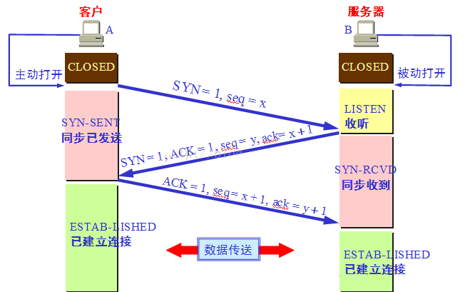
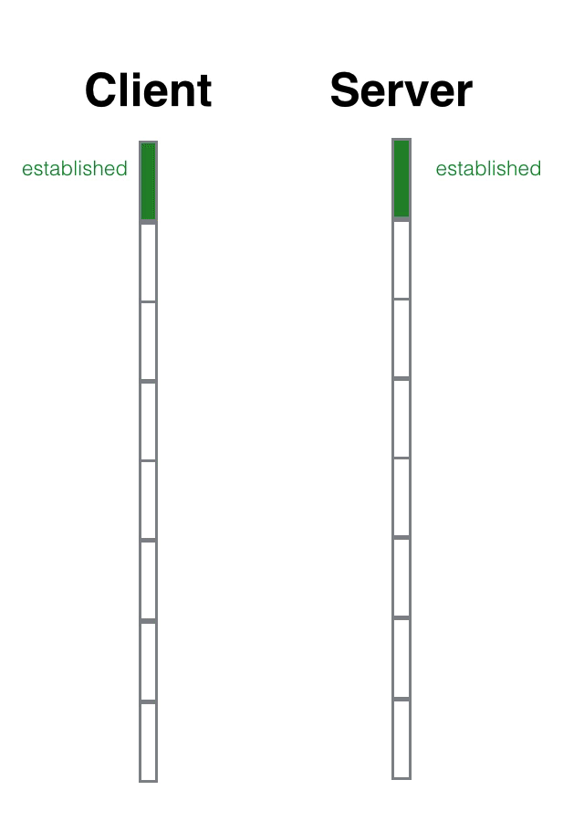
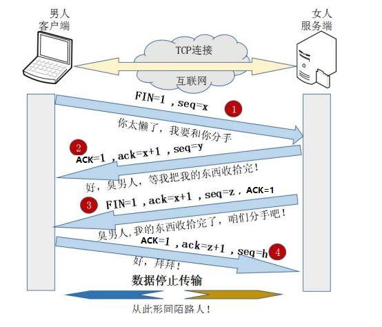

# 网络

HTML：HyperText Markup Language

超文本标记语言

HTTP：HyperText Transfer Protocol

超文本传输协议

URL：Uniform Resource Locator

统一资源定位符

## TCP报文格式

### TCP/IP分层结构模型

- 应用层

- 传输层：TCP

- 网络层：IP

- 链路层

  IPv4     2^32 -1

  IPV6     2^128 -1

  ### 子网掩码与IP地址

  

  现在已经知道了主机A的IP地址和子网掩码，把它们转化成二进制的形式。通过二进制对应子网掩码的1的部分对应IP地址的网络号，子网掩码为0的部分对应主机号。

  ### NAT协议

  NAT（Network Address Translation，网络地址转换）

- **静态NAT(Static NAT)：** 静态NAT设置起来最为简单和最容易实现的一种，内部网络中的每个主机都被永久映射成外部网络中的某个合法的地址。当一个内部主机必须被作为一个固定的外部地址访问时，通过静态NAT实现。

- **动态地址NAT(Pooled NAT)：** 动态NAT则是在外部网络中定 义了一系列的合法地址（地址池），采用动态分配的方法映射到内部网络。动态NAT转换的工作过程是这样的，当有一个内部主机需要访问外网时，从公用IP地址池中取出一个可用的地址分配给该主机使用。当通信完成后，所获取的公用IP地址也被释放回地址池中。外部公用IP在被分配给一个内部主机通信使用时，该地址不能不能再次被分配给其他内部主机使用。

- **网络地址端口转换NAPT（Port－Level NAT）：** NAPT是把内部地址映射到外部网络的一个IP地址的不同端口上。NAPT（Network Address Port Translation），即网络端口地址转换，可将多个内部地址映射为一个合法公网地址，但以不同的协议端口号与不同的内部地址相对应，也就是<内部地址+内部端口>与<外部地址+外部端口>之间的转换。

  

  ### 报文

- 序列号（Sequence Number）：Seq序号，源端口 -> 目的端口

- 确认号（Acknowledgement Number）：Ack序号，只有Ack=1时，确认号才有效，Ack = Seq + 1

- 标志位（Flags）：共6个

> + SYN     请求建立连接，并设置序列号的初始值，当SYN=1，ACK=0时表示：这是一个连接请求报文段。若同意连接，则在响应报文段中使得SYN=1，ACK=1。因此，SYN=1表示这是一个连接请求，或连接接收报文。SYN这个标志位只有在TCP建产连接时才会被置1，握手完成后SYN标志位被置0。
>
> + ACK     确认号是否有效，一般置为1，仅当ACK=1时，确认号字段才有效。ACK=0时，确认号无效
>
> + PSH     接收方应该尽快将这个报文交给应用层
>
> + FIN      断开连接，FIN=1表示：此报文段的发送方的数据已经发送完毕，并要求释放运输连接
>
> + RST     重置连接
>
> + URG    紧急指针（urgent pointer）是否有效，1，表示某一位需要被优先处理

**不要将确认序号Ack与标志位中的ACK搞混了。确认方Ack=发起方Seq+1，两端配对**

## 建立连接

estalished**  TCP:连接成功

「半打开」状态，就是向对方招手了，但是还没来得及看到对方的点头微笑

- syn_sent: syn package has been sent

- syn_rcvd: syn package has been received

  **syn_sent**是主动打开方的「半打开」状态，**syn_rcvd**是被动打开方的「半打开」状态。客户端是主动打开方，服务器是被动打开方。

|  |
| :-----------------------------------------------------: |
|                         |

1. 初始化状态：客户端处于closed状态，服务端处于listen状态
2. 第一次握手：客户端向服务端发送报文，建立连接，等待服务端确认，此时客户端处于等待状态SYN_Send，（首部的同步位SYN=1，seq=x）

>   - 标志位SYN=1，建立连接，不携带数据
>   - 序列号seq=x，一般x=1
>   - 客户端进入SYN_SENT状态（同步已发送）

3. 第二次握手：服务端接收到SYN报文（**SYN=1，seq=x**）后，由标志位SYN=1得知建立连接，必须确认客户端的SYN，（SYN=1，ACK=1，ack=x+1，seq=y）

> + 标志位SYN=1和ACK=1，确认序列号seq有效
> + 序列号seq=y
> + 确认号ack=x+1，接收到客户端的序列号seq（**seq=x**）并将其值加1作为自己的ack值
> + 服务端进入SYN-RCVD（同步收到）状态

4. 第三次握手：客户端接收到服务端的确认数据报文，检查ack=x+1，ACK=1，明确从客户端到服务器的数据传输是正常的，结束SYN_SENT阶段。并返回最后一段TCP报文（ACK=1，ack=y+1，seq=x+1）

> + 标志位ACK=1，确认收到服务端同意连接的信号
> + 序列号seq=x+1，收到服务端的确认号ack（**ack=x+1**），并将其作为自己的序列号
> + 确认号ack=y+1，收到服务端的序列号seq（**seq=y**）并将其值加1作为自己的ack值
> + 客户端进入ESTABLISHED状态，当服务端接收后也进入ESTABLISHED状态
>

- 通俗理解：

> （1）男孩喜欢女孩，于是写了一封信告诉女孩：我爱你，请和我交往吧！;写完信之后，男孩焦急地等待，因为不知道信能否顺利传达给女孩。
>
> （2）女孩收到男孩的情书后，心花怒放，原来我们是两情相悦呀！于是给男孩写了一封回信：我收到你的情书了，也明白了你的心意，其实，我也喜欢你！我愿意和你交往！写完信之后，女孩也焦急地等待，因为不知道回信能否能顺利传达给男孩。
>
> （3）男孩收到回信之后很开心，因为发出的情书女孩收到了，并且从回信中知道了女孩喜欢自己，并且愿意和自己交往。然后男孩又写了一封信告诉女孩：你的心意和信我都收到了，谢谢你，还有我爱你！
>
> 女孩收到男孩的回信之后，也很开心，因为发出的情书男孩收到了。由此男孩女孩双方都知道了彼此的心意，之后就快乐地交流起来了~~

### 流程串

客户端和服务端都处于CLOSED状态 —> 服务端创建TCB，处于LISTEN状态，等待客户端请求 —> 客户端创建TCB，发送连接请求（SYN=1，seq=x），进入SYN-SENT状态 —> 服务端收到连接请求，向客户端发送确认（SYN=ACK=1，确认号ack=x+1，初始序号seq=y），进入SYN-RCVD状态 —> 客户端收到服务端的确认后，给服务端发出确认（ACK=1，ack=y+1，seq=x+1），客户端进入ESTABLISHED状态 —> 服务端收到客户端的确认后，进入ESTABLISHED状态。

## 数据传输

## 断开连接

|      |
| :---------------------------------------------------------: |
|  |

1. 第一次挥手：客户端结束ESTABLISHED状态，客户端发送TCP报文，`（FIN=1，序列号seq=u）`，并停止再发送数据，主动关闭TCP连接，进入FIN-WAIT-1（终止等待1）状态，等待服务端的确认

> - 标志位FIN=1，请求断开连接
> - 序列号seq=u
> - 客户端进入FIN-WAIT-1阶段（半关闭阶段），并且停止在客户端到服务器端方向上发送数据，但是客户端仍然能接收从服务器端传输过来的数据。（客户端仍然能发送ACK确认报文）
>

2. 第二次挥手：服务端接收到断开连接报文，服务端结束ESTABLISHED状态，进入CLOSE-WAIT（半关闭状态），并返回一段报文（ACK=1，ack=u+1，seq=v）

> - 标记位ACK=1
> - 确认号ack=u+1
> - 序列号seq=v
> - 服务端进入CLOSE-WAIT（半关闭状态）
> - 客户端接收，进入FIN-WAIT-2阶段（终止等待），等待服务端发出来接释放报文
>

3. 第三次挥手：服务端进入LAST-ACK（最后确认）状态，等待服务端的确认，发送报文（FIN=1，ACK=1，序号seq=w，确认号ack=u+1）

> - 标志位FIN=1和ACK=1
> - 序列号seq=w
> - 确认号ack=u+1
> - 服务端进入LAST_ACK（最后确认）
>
>

4. 第四次挥手：客户端接收到服务端的连接释放报文，发送确认报文（ACK=1，seq=u+1，ack=w+1），进入TIME-WAIT（时间等待）

> - 标志位ACK=1
>
> - 确认号ack=w+1
>
> - 序列号seq=u+1
>
> - 客户端进入TIME-WAIT（时间等待）
>
> - 经过2MSL，客户端进入CLOSED状态

> **MSL最长报文段寿命Maximum Segment Lifetime，MSL=2**

- 通俗理解：
  
   "第一次挥手"：日久见人心，男孩发现女孩变成了自己讨厌的样子，忍无可忍，于是决定分手，随即写了一封信告诉女孩。
   
   
   
   “第二次挥手”：女孩收到信之后，知道了男孩要和自己分手，怒火中烧，心中暗骂：你算什么东西，当初你可不是这个样子的！于是立马给男孩写了一封回信：分手就分手，给我点时间，我要把你的东西整理好，全部还给你！男孩收到女孩的第一封信之后，明白了女孩知道自己要和她分手。随后等待女孩把自己的东西收拾好。
   
   
   
   “第三次挥手”：过了几天，女孩把男孩送的东西都整理好了，于是再次写信给男孩：你的东西我整理好了，快把它们拿走，从此你我恩断义绝！
   
   
   
   “第四次挥手”：男孩收到女孩第二封信之后，知道了女孩收拾好东西了，可以正式分手了，于是再次写信告诉女孩：我知道了，这就去拿回来！
   
   
   
   这里双方都有各自的坚持。女孩自发出第二封信开始，限定一天内收不到男孩回信，就会再发一封信催促男孩来取东西！男孩自发出第二封信开始，限定两天内没有再次收到女孩的信就认为，女孩收到了自己的第二封信；若两天内再次收到女孩的来信，就认为自己的第二封信女孩没收到，需要再写一封信，再等两天…..
   
   
   
   ### 流程串
   
   客户端和服务端处于ESTABLISHED状态 —> 客户端发出连接释放报文段并处于FIN-WAIT-1状态 —> 服务端发出确认报文段且进入CLOSE-WAIT状态 —> 客户端收到确认后，进入FIN-WAIT-2状态，等待服务端的连接释放报文段 —> 服务端没有要向A发出的数据，服务端发出连接释放报文段且进入LAST-ACK状态 —> 客户端发出确认报文段且进入TIME-WAIT状态 —>服务端收到确认报文段后进入CLOSED状态 —> 客户端经过等待计时器时间2MSL后，进入CLOSED状态。

因为TCP是双工通信，客户端和服务端两个方向上都有数据传输，之所以要四次挥手，因为一次挥手加确认，只代表一方不再发送数据，但另一方可能数据还没发送完，处理完后再一次挥手完成断开

相恋是两情相悦，分手是一厢情愿

【问题1】为什么连接的时候是三次握手，关闭的时候却是四次握手？

答：因为当Server端收到Client端的SYN连接请求报文后，可以直接发送SYN+ACK报文。其中ACK报文是用来应答的，SYN报文是用来同步的。但是关闭连接时，当Server端收到FIN报文时，很可能并不会立即关闭SOCKET，所以只能先回复一个ACK报文，告诉Client端，"你发的FIN报文我收到了"。只有等到我Server端所有的报文都发送完了，我才能发送FIN报文，因此不能一起发送。故需要四步握手。

【问题2】为什么TIME_WAIT状态需要经过2MSL(最大报文段生存时间)才能返回到CLOSE状态？

答：虽然按道理，四个报文都发送完毕，我们可以直接进入CLOSE状态了，但是我们必须假象网络是不可靠的，有可以最后一个ACK丢失。所以TIME_WAIT状态就是用来重发可能丢失的ACK报文。在Client发送出最后的ACK回复，但该ACK可能丢失。Server如果没有收到ACK，将不断重复发送FIN片段。所以Client不能立即关闭，它必须确认Server接收到了该ACK。Client会在发送出ACK之后进入到TIME_WAIT状态。Client会设置一个计时器，等待2MSL的时间。如果在该时间内再次收到FIN，那么Client会重发ACK并再次等待2MSL。所谓的2MSL是两倍的MSL(Maximum Segment Lifetime)。MSL指一个片段在网络中最大的存活时间，2MSL就是一个发送和一个回复所需的最大时间。如果直到2MSL，Client都没有再次收到FIN，那么Client推断ACK已经被成功接收，则结束TCP连接。

【问题3】为什么不能用两次握手进行连接？

答：3次握手完成两个重要的功能，既要双方做好发送数据的准备工作(双方都知道彼此已准备好)，也要允许双方就初始序列号进行协商，这个序列号在握手过程中被发送和确认。

       现在把三次握手改成仅需要两次握手，死锁是可能发生的。作为例子，考虑计算机S和C之间的通信，假定C给S发送一个连接请求分组，S收到了这个分组，并发 送了确认应答分组。按照两次握手的协定，S认为连接已经成功地建立了，可以开始发送数据分组。可是，C在S的应答分组在传输中被丢失的情况下，将不知道S 是否已准备好，不知道S建立什么样的序列号，C甚至怀疑S是否收到自己的连接请求分组。在这种情况下，C认为连接还未建立成功，将忽略S发来的任何数据分 组，只等待连接确认应答分组。而S在发出的分组超时后，重复发送同样的分组。这样就形成了死锁。

【问题4】如果已经建立了连接，但是客户端突然出现故障了怎么办？

TCP还设有一个保活计时器，显然，客户端如果出现故障，服务器不能一直等下去，白白浪费资源。服务器每收到一次客户端的请求后都会重新复位这个计时器，时间通常是设置为2小时，若两小时还没有收到客户端的任何数据，服务器就会发送一个探测报文段，以后每隔75秒钟发送一次。若一连发送10个探测报文仍然没反应，服务器就认为客户端出了故障，接着就关闭连接。

参考文章：

https://juejin.im/post/6844904031576571917

https://juejin.im/post/6844903625513238541

https://baijiahao.baidu.com/s?id=1654225744653405133&wfr=spider&for=pc

https://juejin.im/post/6850418112165052423

https://juejin.im/post/6844903826747555847