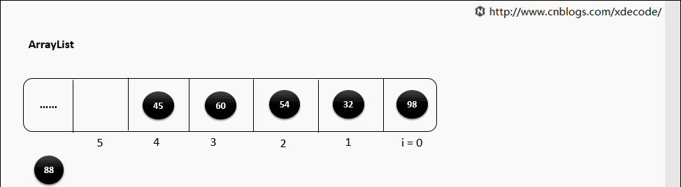

# ArrayList

## 简介

> 1. ArrayList 底层是一个动态扩容的数组结构 
> 2. 允许存放多个null 元素
> 3. 允许存放重复数据，存储顺序按照元素的添加顺序
> 4. ArrayList并不是一个线程安全的集合。如果集合的增删操作需要保证线程的安全性，可以考虑使用 CopyOnWriteArrayList 或者使用 collections.synchronizedList(List l)函数返回一个线程安全的ArrayList类
>

## 继承关系

```java
public class ArrayList<E> extends AbstractList<E> implements List<E>, RandomAccess, Cloneable, java.io.Serializable
```


- 实现 `RandomAccess` 标记接口  

1. 表明List提供了随机访问功能，也就是通过下标获取元素对象的功能。之所以是标记接口，是该类本来就具有某项能力，使用接口对其进行标签化，便于其他的类对其进行识别（instanceof）
2. ArrayList数组实现，本身就有通过下标随机访问任意元素的功能。那么需要细节上注意的就是随机下标访问和顺序下标访问（LinkedList）的不同了。也就是为什么LinkedList最好不要使用循环遍历，而是用迭代器遍历的原因。
3. 实现RandomAccess同时意味着一些算法可以通过类型判断进行一些针对性优化，例子有Collections的shuffle方法  

简单说就是：如果实现RandomAccess接口就下标遍历，反之迭代器遍历

- 实现了`Cloneable`，`Serializable`

  `Cloneable`意味着可以被克隆，`Serializable`意味着支持序列化，可以序列化传输

- 为什么ArrayList的属性值elementData是用transient修饰的？

elementData是一个缓存数组，通常会预留一些容量，容量不足时在进行扩容，那么里面有一些元素是空，这种就不需要序列化的。每次都序列化，会浪费时间和空间，重写了writeObject 保证序列化的时候虽然不序列化全部,，但是有的元素都序列化，所以说不是不序列化，而是不全部序列化。


```java
private void writeObject(java.io.ObjectOutputStream s) throws java.io.IOException{
    // Write out element count, and any hidden stuff
    int expectedModCount = modCount;
    s.defaultWriteObject();

    // Write out size as capacity for behavioural compatibility with clone()
    s.writeInt(size);

    // Write out all elements in the proper order.
    for (int i=0; i<size; i++) {
        s.writeObject(elementData[i]);
    }

    if (modCount != expectedModCount) {
        throw new ConcurrentModificationException();
    }
}


private void readObject(java.io.ObjectInputStream s) throws java.io.IOException, ClassNotFoundException {
    elementData = EMPTY_ELEMENTDATA;

    // Read in size, and any hidden stuff
    s.defaultReadObject();

    // Read in capacity
    s.readInt(); // ignored

    if (size > 0) {
        // be like clone(), allocate array based upon size not capacity
        int capacity = calculateCapacity(elementData, size);
        SharedSecrets.getJavaOISAccess().checkArray(s, Object[].class, capacity);
        ensureCapacityInternal(size);

        Object[] a = elementData;
        // Read in all elements in the proper order.
        for (int i=0; i<size; i++) {
            a[i] = s.readObject();
        }
    }
}
```

## 成员变量

```java
// 默认初始容量大小10
private static final int DEFAULT_CAPACITY = 10;

// 共享的空的数组实例，当使用 ArrayList(0) 或者 ArrayList(Collection<? extends E> c), 并且 c.size() = 0 的时候讲 elementData 数组讲指向这个实例对象。
private static final Object[] EMPTY_ELEMENTDATA = {};

// 另一个共享空数组实例，再第一次 add 元素的时候将使用它来判断数组大小是否设置为 DEFAULT_CAPACITY
private static final Object[] DEFAULTCAPACITY_EMPTY_ELEMENTDATA = {};

transient Object[] elementData;

private int size;

// 空数组，第一个元素添加时，容量为10, 原因: 第一次添加元素肯定走进 if 判断中 minCapacity 将被赋值为 10
public ArrayList() {
    this.elementData = DEFAULTCAPACITY_EMPTY_ELEMENTDATA;
}

public ArrayList(int initialCapacity) {
    if (initialCapacity > 0) {
        // 如果传入的参数大于0，创建initialCapacity大小的数组
        this.elementData = new Object[initialCapacity];
    } else if (initialCapacity == 0) {
        this.elementData = EMPTY_ELEMENTDATA;
    } else {
        throw new IllegalArgumentException("Illegal Capacity: "+ initialCapacity);
    }
}

public ArrayList(Collection<? extends E> c) {
    // 集合 -> 数组
    elementData = c.toArray();
    // elementData数组长度不等于0
    if ((size = elementData.length) != 0) {
        // c.toArray might (incorrectly) not return Object[] (see 6260652)
        // 如果elementData不是Object类型数据（c.toArray可能返回的不是Object类型的数组所以加上下面的语句用于判断）
        if (elementData.getClass() != Object[].class) 
            // 将原来不是Object类型的elementData数组的内容，赋值给新的Object类型的elementData数组
            elementData = Arrays.copyOf(elementData, size, Object[].class);
    } else {
        // replace with empty array.空数组
        this.elementData = EMPTY_ELEMENTDATA;
    }
}
```

## 方法

### add

```java
// 元素追加列表末尾
public boolean add(E e) {
    // 检查当前底层数组容量，如果容量不够则进行扩容
    ensureCapacityInternal(size + 1);
    // 数组赋值
    elementData[size++] = e;
    return true;
}

// 1. 检查当前底层数组容量，如果容量不够则进行扩容
private void ensureCapacityInternal(int minCapacity) {
    // 首次插入数据
    if (elementData == DEFAULTCAPACITY_EMPTY_ELEMENTDATA) {
        // 默认容量10 和 传入参数 的最大值
        minCapacity = Math.max(DEFAULT_CAPACITY, minCapacity);
    }
    ensureExplicitCapacity(minCapacity);
}

// 3. 将 size+1 或 10 传入 ensureExplicitCapacity 进行扩容判断
private void ensureExplicitCapacity(int minCapacity) {
    // 操作数加 1 用于保证并发访问
    modCount++;

    // 如果当前数组的长度比添加元素后的长度要小则进行扩容 
    if (minCapacity - elementData.length > 0)
        grow(minCapacity);
}

// 4. 扩容
private void grow(int minCapacity) {
    // 获取当前 elementData数组 的大小，也就是 List 中当前的容量，记为oldCapacity
    int oldCapacity = elementData.length;
    // oldCapacity右移一位，新容量为当前容量的 1.5 倍
    int newCapacity = oldCapacity + (oldCapacity >> 1);
    // 如果扩大1.5倍后仍旧比 minCapacity 小那么直接等于 minCapacity
    if (newCapacity - minCapacity < 0)
        newCapacity = minCapacity;
    // 检查是否超出最大容量，如果新数组大小比  MAX_ARRAY_SIZE 就需要进一步比较 minCapacity 和 MAX_ARRAY_SIZE 的大小
    if (newCapacity - MAX_ARRAY_SIZE > 0)
        newCapacity = hugeCapacity(minCapacity);
    // 使用 Arrays.copyOf 构建一个长度为 newCapacity 新数组 并将 elementData 指向新数组
    elementData = Arrays.copyOf(elementData, newCapacity);
}

// 5. 比较 minCapacity 与 Integer.MAX_VALUE-8(减少出错的几率) 的大小如果大则放弃-8的设定，设置为 Integer.MAX_VALUE 
private static int hugeCapacity(int minCapacity) {
    if (minCapacity < 0) // overflow
        throw new OutOfMemoryError();
    return (minCapacity > MAX_ARRAY_SIZE) ? Integer.MAX_VALUE : MAX_ARRAY_SIZE;
}

// 2 如果是无参构造方法构造的的集合，第一次添加元素的时候会满足这个条件 minCapacity 将会被赋值为 10
private static int calculateCapacity(Object[] elementData, int minCapacity) {
    if (elementData == DEFAULTCAPACITY_EMPTY_ELEMENTDATA) {
        return Math.max(DEFAULT_CAPACITY, minCapacity);
    }
    return minCapacity;
}
```


总结：

1. 数组初始化时，容量为0
2. 插入数据时，默认容量10
3. 扩容1.5倍
4. 其最大容量为Integer.MAX_VALUE


```java
// 指定位置插入指定数据
public void add(int index, E element) {
    // 检查index是否越界
	rangeCheckForAdd(index);

	ensureCapacityInternal(size + 1);  // Increments modCount!!
    // 数组copy
	System.arraycopy(elementData, index, elementData, index + 1, size - index);
    // 数组指定位置赋值
	elementData[index] = element;
    // 数组大小增1
	size++;
}

private void rangeCheck(int index) {
	if (index >= size)
		throw new IndexOutOfBoundsException(outOfBoundsMsg(index));
}
```



### addAll

```java
public boolean addAll(Collection<? extends E> c) {
	// 调用 c.toArray 将集合转化数组
	Object[] a = c.toArray();
    // 集合转为数组之后大小
	int numNew = a.length;
    // 数组本身大小 + 新数组大小，总容量大小
	ensureCapacityInternal(size + numNew);  // Increments modCount
	System.arraycopy(a, 0, elementData, size, numNew);
    // 此时数组的容量
	size += numNew;
	return numNew != 0;
}
```

按指定集合的Iterator返回的顺序将指定集合中的所有元素追加到此列表的末尾。

### get

```java
public E get(int index) {
    // 检查index是否越界
	rangeCheck(index);

	return elementData(index);
}

// 返回数组指定位置的value
E elementData(int index) {
	return (E) elementData[index];
}
```

### set

```java
public E set(int index, E element) {
    // 检查index是否越界
	rangeCheck(index);
	// 去除数组中指定位置index的旧值
	E oldValue = elementData(index);
    // 替换新值element
	elementData[index] = element;
    // 返回旧值
	return oldValue;
}
```

### clear

```java
// 清空所有元素
public void clear() {
	modCount++;

	// clear to let GC do its work
    // 数组所有元素nill
	for (int i = 0; i < size; i++)
		elementData[i] = null;
	// 数组大小置0
	size = 0;
}
```

### remove

```java
public E remove(int index) {
	rangeCheck(index);

	modCount++;
	E oldValue = elementData(index);
	// 计算需要向前移动元素的数量
	int numMoved = size - index - 1;
	if (numMoved > 0)
		System.arraycopy(elementData, index+1, elementData, index, numMoved);
    // 数组长度-1，最末尾置为null
	elementData[--size] = null; // clear to let GC do its work
	// 返回旧值
	return oldValue;
}
```

删除指定位置的元素，将任何后续元素移动到左侧（从其索引中减去一个元素）


```java
public boolean remove(Object o) {
    // 删除元素null
	if (o == null) {
		for (int index = 0; index < size; index++)
            // null值比较，'==',第一个出现的null值
			if (elementData[index] == null) {
                // 移除
				fastRemove(index);
				return true;
			}
	} else {
		for (int index = 0; index < size; index++)
            // 第一个出现的非null值,equals判断
			if (o.equals(elementData[index])) {
				fastRemove(index);
				return true;
			}
	}
	return false;
}

private void fastRemove(int index) {
	modCount++;
	int numMoved = size - index - 1;
	if (numMoved > 0)
		System.arraycopy(elementData, index+1, elementData, index, numMoved);
    // 数组长度-1，最末尾置为null
	elementData[--size] = null; // clear to let GC do its work
}
```

从列表中删除指定元素的第一个出现（如果存在）。 如果列表不包含该元素，则它不会更改。

### toArray

```java
/**
 * 以正确的顺序（从第一个到最后一个元素）返回一个包含此列表中所有元素的数组。 
 * 返回的数组“safe”，因为该列表不保留对它的引用。 （换句话说，这个方法必须分配一个新的数组）
 * 因此，调用者可以自由地修改返回的数组。 此方法充当基于阵列和基于集合的API之间的桥梁。
 */
public Object[] toArray() {
    // elementData：复制的数组；size：复制的长度
    return Arrays.copyOf(elementData, size);
}
/**
 * 以正确的顺序返回一个包含此列表中所有元素的数组（从第一个到最后一个元素）; 
 * 返回的数组的运行时类型是指定数组的运行时类型。 如果列表适合指定的数组，则返回其中。 
 * 否则，将为指定数组的运行时类型和此列表的大小分配一个新数组。 
 * 如果列表适用于指定的数组，其余空间（即数组的列表数量多于此元素），则紧跟在集合结束后的数组中的元素设置为null 。
 *（这仅在调用者知道列表不包含任何空元素的情况下才能确定列表的长度。） 
 */
public <T> T[] toArray(T[] a) {
    // 1.如果 a.length < size 即当前集合元素的个数与参数 a 数组元素的大小的时候将和toArray()一样返回一个新的数组
    if (a.length < size)
        return (T[]) Arrays.copyOf(elementData, size, a.getClass());
    // 2.将不会产生新的数组直接将集合中的元素调用 System.arraycopy 方法将元素复制到参数数组中，返回a
    System.arraycopy(elementData, 0, a, 0, size);
    // 3.a.length > size 也不会产生新的数组,但是值得注意的是 a[size]=null; 改变了原数组中index=size位置的元素，被重新设置为null
    if (a.length > size)
        a[size] = null;
    return a;
}
```

`System.arraycopy()` （浅拷贝）和`Arrays.copyOf()`联系和区别：

```java
# System.arraycopy()
src - the source array.                               源数组
srcPos - starting position in the source array.       从源数组的起始位置开始
dest - the destination array.                         目标数组
destPos - starting position in the destination data.  目标数组的开始起始位置
length - the number of array elements to be copied.   要copy的数组的长度

# Arrays
public static <T,U> T[] copyOf(U[] original, int newLength, Class<? extends T[]> newType) {
    // 根据class的类型是否是 Object[] 来决定是 new 还是反射去构造一个泛型数组
	T[] copy = ((Object)newType == (Object)Object[].class)
		? (T[]) new Object[newLength]
		: (T[]) Array.newInstance(newType.getComponentType(), newLength);
    // newLength 如果比 original.length 大的时候会将多余的空间赋值为 null
	System.arraycopy(original, 0, copy, 0, Math.min(original.length, newLength));
	return copy;
}
```


后者内部实际调用的是前者

- 前者需要目标数组，将原数组copy定义的新数组，选择起点和长度以及放入新数组中的位置

- 后者系统自动在内部新建一个数组进行copy，并返回。

```java
/**
 * 将list转为array，需要注意的是toArray() 不能得到基本数据类型，只能得到包装类型
 */
public void list2Array() {
	List<Integer> lists = Lists.newArrayList(1, 2, 3, 4);
	// 注意：强制转换异常 java.lang.ClassCastException: [Ljava.lang.Object; cannot be cast to [Ljava.lang.Integer;
	// List<Integer> lists = Lists.newArrayList(1, 2, 3, 4);
    Object[] objects = lists.toArray();
    System.out.println(Arrays.toString(objects));

    ///////////////////////////////// toArray(T[] a)指定类型 ////////////////////////////////////
    Integer[] lenLess = new Integer[2];
    Integer[] array0 = lists.toArray(lenLess);
    // 传入数组长度 < list的长度，新建数组：false [1, 2, 3, 4]
    System.out.println("是否新数组:" + (lenLess == array0) + "  " + Arrays.toString(array0));

    // len相同
    Integer[] lenEqual = new Integer[lists.size()];
    Integer[] array = lists.toArray(lenEqual);
    // 传入数组长度 = list的长度，数组copy：true [1, 2, 3, 4]
    System.out.println("是否新数组:" + (lenEqual == array) + " " + Arrays.toString(array));

    // 数组 > list
    Integer[] lenMore = new Integer[6];
    Integer[] array1 = lists.toArray(lenMore);
    // 传入数组长度 > list的长度，数组copy：true [1, 2, 3, 4, null, null]
    System.out.println("是否新数组:" + (lenMore == array1) + " " + Arrays.toString(array1));

    // length < list长度，新建数组
    Integer[] i0 = {1, 1};
    Integer[] toArray = lists.toArray(i0);
    // false [1, 2, 3, 4]
    System.out.println((i0 == toArray) + " " + Arrays.toString(toArray));

    // length > list长度，数组copy
    Integer[] i = {1, 1, 1, 1, 1, 1, 5, 6};
    Integer[] array2 = lists.toArray(i);
    // true [1, 2, 3, 4, null, 1, 5, 6]
    System.out.println((i == array2) + " " + Arrays.toString(array2));
}

/**
 * 将list转为array，若想得到基本数据类型，使用org.apache.commons.lang3.ArrayUtils
 */
public void list2ArrayPrimitive() {
	List<Integer> lists = Lists.newArrayList(1, 2, 3, 4);
	int[] ints = ArrayUtils.toPrimitive(lists.toArray(new Integer[0]));
	System.out.println(ints);
}
```

## 迭代器Iterator

- 元素：

```java
int cursor;       // index of next element to return 游标
int lastRet = -1; // index of last element returned; -1 if no such
int expectedModCount = modCount;	// 初始化的时候将其赋值为当前集合中的操作数
```

- 方法：

```java
// 
public boolean hasNext() {
    return cursor != size;
}

@SuppressWarnings("unchecked")
public E next() {
    // 验证期望操作数和当前的操作数是否相同 ConcurrentModificationException
    checkForComodification();
    // 初始cursor = 0
    int i = cursor;
    // 索引大于数组的长度 NoSuchElementException
    if (i >= size)
        throw new NoSuchElementException();
    // 指向当前ArrayList对象，而不是this，this指向了Iterator
    Object[] elementData = ArrayList.this.elementData;
    // 判断是否越界
    if (i >= elementData.length)
        throw new ConcurrentModificationException();
    // 索引+1
    cursor = i + 1;
    // 返回集合对应位置的元素，并将索引赋值给lastRet,其初始为-1，游标cursor比lastRet少1
    return (E) elementData[lastRet = i];
}

public void remove() {
    // 如果Iterator没有调用netx()方法，就直接使用remove()，由于lastRet=-1，抛出异常
    if (lastRet < 0)
        throw new IllegalStateException();
    // 验证期望操作数和当前的操作数
    checkForComodification();
    try {
        // 移除上次next的元素
        ArrayList.this.remove(lastRet);
        // 集合中少一个元素，游标cursor向前移动一个位置（next()中cursor = lastRet + 1）
        cursor = lastRet;
        // 删除元素之后，赋值-1，确保第一步的判断 lastRet < 0
        lastRet = -1;
        // 由于实际删除操作remove(lastRet)中，modCount++，所有需要修改期望操作数
        expectedModCount = modCount;
    } catch (IndexOutOfBoundsException ex) {
        throw new ConcurrentModificationException();
    }
}

final void checkForComodification() {
    if (modCount != expectedModCount)
        throw new ConcurrentModificationException();
}
```


参考文章:

[https://juejin.im/post/5ab548f75188257ddb0f8fa2#heading-32](https://note.youdao.com/)

https://www.cnblogs.com/xdecode/p/9321848.html

https://segmentfault.com/a/1190000009922279

