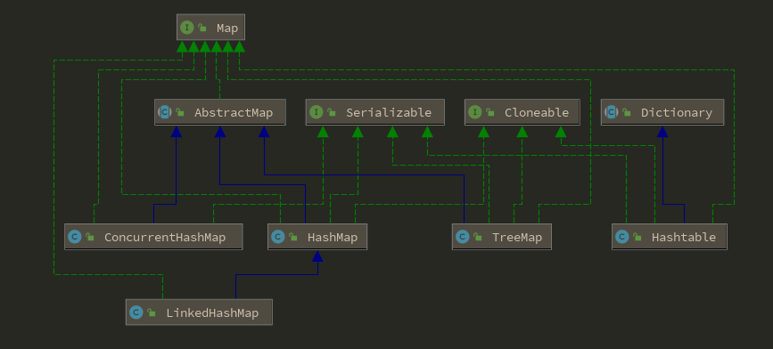
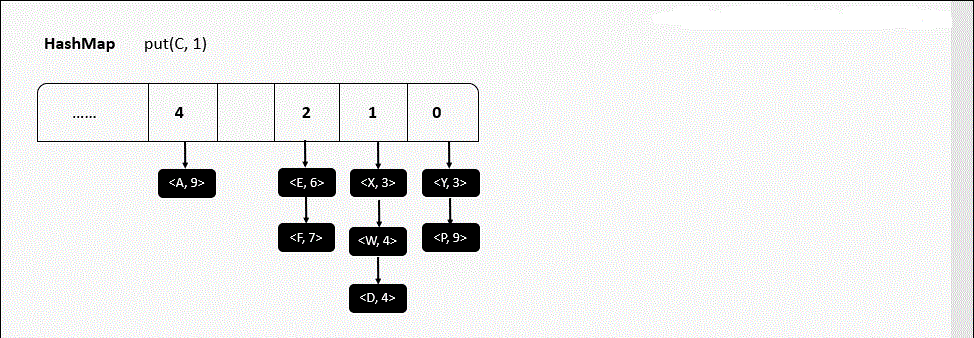
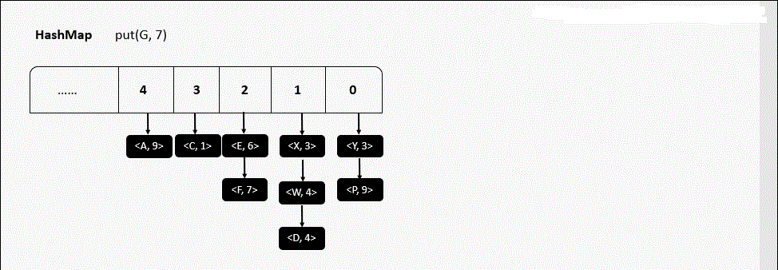
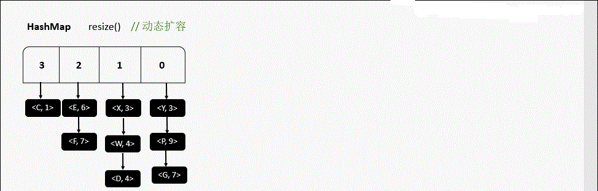
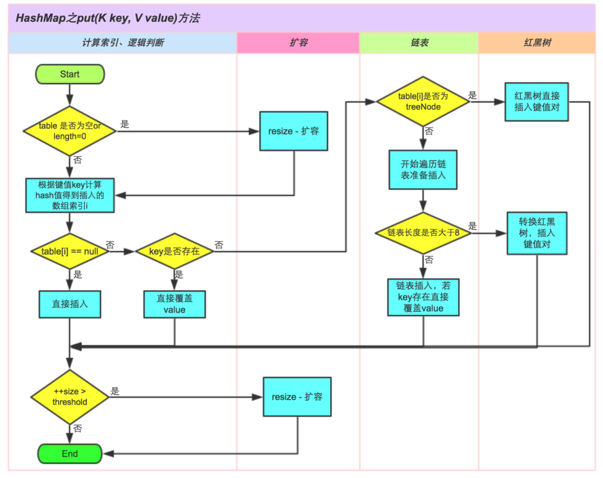

# HashMap




Node，存放key，val，hash，next

```java
static class Node<K,V> implements Map.Entry<K,V> {
    final int hash;
    final K key;
    V value;
    Node<K,V> next;

    Node(int hash, K key, V value, Node<K,V> next) {
        this.hash = hash;
        this.key = key;
        this.value = value;
        this.next = next;
    }

    public final K getKey()        { return key; }
    public final V getValue()      { return value; }
    public final String toString() { return key + "=" + value; }

    // 每个几点节点的hash值，由key的hash值 和 val的hash值   异或
    public final int hashCode() {
        return Objects.hashCode(key) ^ Objects.hashCode(value);
    }

    public final V setValue(V newValue) {
        V oldValue = value;
        value = newValue;
        return oldValue;
    }

    public final boolean equals(Object o) {
        if (o == this)
            return true;
        if (o instanceof Map.Entry) {
            Map.Entry<?,?> e = (Map.Entry<?,?>)o;
            if (Objects.equals(key, e.getKey()) &&
                Objects.equals(value, e.getValue()))
                return true;
        }
        return false;
    }
}
```

TreeNode

```java
static final class TreeNode<K,V> extends LinkedHashMap.Entry<K,V> {
	TreeNode<K,V> parent;  // red-black tree links
	TreeNode<K,V> left;
	TreeNode<K,V> right;
	TreeNode<K,V> prev;    // needed to unlink next upon deletion
	boolean red;
	TreeNode(int hash, K key, V val, Node<K,V> next) {
		super(hash, key, val, next);
	}
}
```


## 成员变量

```java
// 默认初始容量16
static final int DEFAULT_INITIAL_CAPACITY = 1 << 4; // aka 16
// 最大容量 2的30
static final int MAXIMUM_CAPACITY = 1 << 30;
// 默认加载因子
static final float DEFAULT_LOAD_FACTOR = 0.75f;
// 当桶(bucket)上的结点数大于这个值（8）时会转成红黑树
static final int TREEIFY_THRESHOLD = 8;
// 当桶(bucket)上的结点数小于这个值（6）时树转链表
static final int UNTREEIFY_THRESHOLD = 6;
// 桶中结构转化为红黑树对应的table的最小大小
static final int MIN_TREEIFY_CAPACITY = 64;
// 存放元素的数组，长度是2的幂次方
transient Node<K,V>[] table;
// 存放具体元素的集
transient Set<Map.Entry<K,V>> entrySet;
// 存放元素的个数，不是数组的长度
transient int size;
// 迭代器，failfast
transient int modCount;
// 临界值，当实际大小(容量*加载因子)超过临界值时，会进行扩容
int threshold;
// 加载因子，默认0.75
final float loadFactor;
```

- 加载因子loadFactor

  **loadFactor太大导致查找元素效率低，太小导致数组的利用率低，存放的数据会很分散。loadFactor的默认值为0.75f是官方给出的一个比较好的临界值**。

  给定的默认容量为 16，负载因子为 0.75。Map 在使用过程中不断的往里面存放数据，当数量达到了 16 * 0.75 = 12 就需要将当前 16 的容量进行扩容，而扩容这个过程涉及到 rehash、复制数据等操作，所以非常消耗性能。

- 临界值threshold

  threshold = capacity \* loadFactor，当Size>=threshold的时候，那么就要考虑对数组的扩增了，也就是说，这个的意思就是 衡量数组是否需要扩增的一个标准。


## 构造函数

```java
// 指定初始容量和加载因子
public HashMap(int initialCapacity, float loadFactor) {
    if (initialCapacity < 0)
        throw new IllegalArgumentException("Illegal initial capacity: " +
                                           initialCapacity);
    if (initialCapacity > MAXIMUM_CAPACITY)
        initialCapacity = MAXIMUM_CAPACITY;
    if (loadFactor <= 0 || Float.isNaN(loadFactor))
        throw new IllegalArgumentException("Illegal load factor: " +
                                           loadFactor);
    this.loadFactor = loadFactor;
    this.threshold = tableSizeFor(initialCapacity);
}

// 指定初始容量
public HashMap(int initialCapacity) {
    this(initialCapacity, DEFAULT_LOAD_FACTOR);
}

// 默认加载因子0.75
public HashMap() {
    this.loadFactor = DEFAULT_LOAD_FACTOR; // all other fields defaulted
}


public HashMap(Map<? extends K, ? extends V> m) {
    this.loadFactor = DEFAULT_LOAD_FACTOR;
    putMapEntries(m, false);
}
```


## 方法

### 新增

#### put

```java
public V put(K key, V value) {
    return putVal(hash(key), key, value, false, true);
}
```

- 不会覆盖旧值

```java
public V putIfAbsent(K key, V value) {
    return putVal(hash(key), key, value, true, true);
}
```

- putAll

```java
public void putAll(Map<? extends K, ? extends V> m) {
    putMapEntries(m, true);
}
```

- 计算hash值

```java
// hashcode的低位参与 与 操作 ；位（异或）^ 相同为0，否则为1 ； >>> 无符号右移，忽略符号位，空位都以0补齐
// hash碰撞几率增大
static final int hash(Object key) {
    int h;
    return (key == null) ? 0 : (h = key.hashCode()) ^ (h >>> 16);
}
```

| Y    | B = 0 | B = 1 |
| :--- | :---: | :---: |
| A = 0 |   0   | 1    |
| A = 1 |   1   | 0    |

1. 拿到 key 的 hashCode 值

2. 将 hashCode 的高位参与异或运算，重新计算 hash 值

3. 将计算出来的 hash 值与 (table.length - 1) 进行 & 运算

   

```java
final V putVal(int hash, K key, V value, boolean onlyIfAbsent, boolean evict) {
    Node<K,V>[] tab; Node<K,V> p; int n, i;	// tab 存放当前的哈希桶; p 临时链表节点
    // 1 如果当前哈希桶是空的，或者length=0，进行初始化，并设置哈希桶数组的长度
    if ((tab = table) == null || (n = tab.length) == 0)
        n = (tab = resize()).length;  // 扩容，新数组的长度赋值给n
    // 计算索引位置：当前节点的index = 数组长度-1 & hash值
    // 2 如果当前节点是空，说明没有发生hash碰撞，直接存放在index位置处
    if ((p = tab[i = (n - 1) & hash]) == null)
        tab[i] = newNode(hash, key, value, null);
    else {  // 发生hash碰撞，说明当前数组已经被占
        Node<K,V> e; K k;
        // 3 如果hash值相等，且key也相等，覆盖当前桶val
        if (p.hash == hash && ((k = p.key) == key || (key != null && key.equals(k))))
            e = p;  // 将当前节点赋值给e
        else if (p instanceof TreeNode)  // 4 红黑树
            e = ((TreeNode<K,V>)p).putTreeVal(this, tab, hash, key, value);
        else {  // 5 插入普通链表，使用binCount统计链表的节点数
            for (int binCount = 0; ; ++binCount) {
                // 遍历到尾部，追加新节点到尾部;注意这个地方跟Java7不一样，是插在链表尾部！！！
                if ((e = p.next) == null) {
                    // 追加新节点到尾部
                    p.next = newNode(hash, key, value, null);
                    // 6 校验节点数，如果追加节点之后，（TREEIFY_THRESHOLD=8）链表长度>=8
                    if (binCount >= TREEIFY_THRESHOLD - 1) // -1 for 1st
                        treeifyBin(tab, hash);
                    break;
                }
                // 7 链表中已存在且hash值和key值都相等，先获取引用，后面用来替换值
                if (e.hash == hash && ((k = e.key) == key || (key != null && key.equals(k))))
                    break;
                // 如果链表中遍历到尾部，此时e = null
                p = e;
            }
        }
        
        // 8 说明有需要覆盖的节点
        if (e != null) { // existing mapping for key
            // 覆盖节点值，返回旧值
            V oldValue = e.value;
            // 如果onlyIfAbsent是true，那么不会覆盖相同key的值value。
            // 如果evict是false,那么表示是在初始化时调用的
            if (!onlyIfAbsent || oldValue == null)
                e.value = value;
            afterNodeAccess(e);	  // 用于LinkedHashMap
            return oldValue;
        }
    }
    
    
    //如果执行到了这里，说明插入了一个新的节点，所以会修改modCount，以及返回null。
    ++modCount;
    // 9 更新size，并判断是否需要扩容
    if (++size > threshold)
        resize();
    afterNodeInsertion(evict);
    return null;
}
```

1. 判断当前桶是否为空，空就初始化，resize()判断是否进行初始化
2. 根据当前key的hashcode定位到具体的桶位置并判断是否为空，为空说明没有hash冲突，直接在该位置新建一个Node
3. 如果当前桶位置有值（Hash冲突），比较当前的key、key的hashcode，相同旧覆盖
4. 如果当前桶位置是红黑树，按照红黑树的方式写入数据
5. 如果是链表，封装new Node插入当前同位置的尾部
6. 接着判断当前链表的大小是否大于预设的阀值（8），大于就需要转换为红黑树
7. 在遍历过程中如果找到key相同时就退出遍历
8. 如果 e != null，说明存在相同的key，就需要覆盖
9. 最后判断是否需要扩容

- 扩容

```java
final Node<K,V>[] resize() {
    Node<K,V>[] oldTab = table;	// 当前表的哈希桶，旧数组
    int oldCap = (oldTab == null) ? 0 : oldTab.length;	// 当前哈希桶容量，旧数组的长度
    int oldThr = threshold;	// 旧数组的阀值
    int newCap, newThr = 0;	 // 定义新数组长度，新阀值
    // Node数组已经初始化，旧数组长度 > 0
    if (oldCap > 0) {        
        if (oldCap >= MAXIMUM_CAPACITY) {	// 极端情况，超过最大容量,不在扩容，直接返回
            threshold = Integer.MAX_VALUE;
            return oldTab;
        }
        // 扩容：原来的2倍，新数组长度是否大于最大容量，且大于默认容量
        else if ((newCap = oldCap << 1) < MAXIMUM_CAPACITY && oldCap >= DEFAULT_INITIAL_CAPACITY)
            // 新阀值位原来的2倍
            newThr = oldThr << 1; // double threshold
    }
    // 如果当前表是空的，但是有阈值。代表是初始化时指定了容量、阈值的情况
    // 对应构造函数HashMap(int initialCapacity, float loadFactor)
    else if (oldThr > 0) // initial capacity was placed in threshold
        newCap = oldThr;
    // 如果当前表是空的，而且也没有阈值。初始化时没有任何容量/阈值参数的情况
    // 进行数组的初始化，对应构造函数HashMap()
    else {               // zero initial threshold signifies using defaults
        newCap = DEFAULT_INITIAL_CAPACITY;	// 默认容量16
        newThr = (int)(DEFAULT_LOAD_FACTOR * DEFAULT_INITIAL_CAPACITY);		// 默认阀值:16 * 0.75 = 12
    }
    // 如果新阀值 = 0， 当前表是空的，但是有阀值的情况,即HashMap(int initialCapacity, float loadFactor)
    if (newThr == 0) {
        float ft = (float)newCap * loadFactor;	// 根据新容量和新加载因子计算阀值
        // 越界修复
        newThr = (newCap < MAXIMUM_CAPACITY && ft < (float)MAXIMUM_CAPACITY ? (int)ft : Integer.MAX_VALUE);
    }
    threshold = newThr;	  // 更新阀值
    
    Node<K,V>[] newTab = (Node<K,V>[])new Node[newCap];  // 根据新容量构建新数组
    table = newTab;	 // 更新哈希桶引用
    
    
    // 如果以前哈希桶中有元素
    if (oldTab != null) {
        for (int j = 0; j < oldCap; ++j) {  // 遍历旧数组
            Node<K,V> e;  // 取出当前的节点
            if ((e = oldTab[j]) != null) {
                oldTab[j] = null;  // 置空
                // 当前index位置链表只有一个元素（没有发生哈希碰撞）
                if (e.next == null)
                    newTab[e.hash & (newCap - 1)] = e;
                // 发生哈希碰撞，且节点数超过8个，转为红黑树
                else if (e instanceof TreeNode)
                    ((TreeNode<K,V>)e).split(this, newTab, j, oldCap);
                // 发生哈希碰撞，且节点数少于8个，根据链表上每个节点的哈希值，依次放入新哈希桶中
                else { // preserve order
                    // 因为扩容是容量翻倍，所以原链表上的每个节点，现在可能存放在原来的下标，即low位， 或者扩容后的下标，即high位。 high位=  low位+原哈希桶容量
                    Node<K,V> loHead = null, loTail = null;	 // 低位链表的头、尾
                    Node<K,V> hiHead = null, hiTail = null;  // 高位链表的头、尾
                    Node<K,V> next;  // 临时节点，存放e的next
                    do {
                        next = e.next;
                        // 哈希值 与 旧容量
                        // 可以得到哈希值去模后，是大于等于oldCap还是小于oldCap，
                        // 等于0代表小于oldCap，应该存放在低位，否则存放在高位
                        if ((e.hash & oldCap) == 0) {
                            // 低位链表
                            // 头、尾节点赋值
                            if (loTail == null)
                                loHead = e;
                            else
                                loTail.next = e;
                            loTail = e;
                        }
                        else {
                            // 高位链表
                            if (hiTail == null)
                                hiHead = e;
                            else
                                hiTail.next = e;
                            hiTail = e;
                        }
                    } while ((e = next) != null);
                    // 低位链表存放在原index处
                    if (loTail != null) {
                        loTail.next = null;
                        newTab[j] = loHead;
                    }
                    // 高位链表存放在新index处，并且新index = 原index+旧容量
                    if (hiTail != null) {
                        hiTail.next = null;
                        newTab[j + oldCap] = hiHead;
                    }
                }
            }
        }
    }
    return newTab;
}
```

**初始化或加倍哈希桶大小。如果当前哈希桶是null,分配符合当前阈值的初始容量目标。否则，扩容成以前的两倍。**

**在扩容时，要注意区分以前在哈希桶相同index的节点，现在是在以前的index里，还是index+oldCap里**

|     |
| :------------------------------------: |
|   |
|  |

- ①如果定位到的数组位置没有元素就直接插入。
- ②如果定位到的数组位置有元素就和要插入的key比较，如果key相同就直接覆盖，如果key不相同，就判断p是否是一个树节点，如果是就调用`e = ((TreeNode)p).putTreeVal(this, tab, hash, key, value)`将元素添加进入。如果不是就遍历链表插入(插入的是链表尾部)。



- 小结：

> 运算尽量都用**位运算**代替**，更高效**。
>
> 对于**扩容**导致需要新建数组存放更多元素时，除了要将老数组中的元素迁移过来，也记得将**老数组中的引用置null**，以便**GC**
>
> 取下标是用 **哈希值 与运算 （桶的长度-1）**  `i = (n - 1) & hash`。 由于桶的长度是2的n次方，这么做其实是等于 一个**模运算**。但是**效率更高**
>
> 扩容时，如果发生过哈希碰撞，节点数小于8个。则要根据链表上每个节点的哈希值，依次放入新哈希桶对应下标位置。
>
> 因为扩容是容量翻倍，所以原链表上的每个节点，现在可能存放在原来的下标，即low位， 或者扩容后的下标，即high位。 high位=  low位+原哈希桶容量
>
> 利用**哈希值 与运算 旧的容量** ，`if ((e.hash & oldCap) == 0)`,可以得到哈希值去模后，是大于等于oldCap还是小于oldCap，等于0代表小于oldCap，**应该存放在低位，否则存放在高位**。这里又是一个利用位运算 代替常规运算的高效点
>
> 如果追加节点后，链表数量>=8，则转化为红黑树
>
> 插入节点操作时，有一些空实现的函数，用作LinkedHashMap重写使用。


### 查询

#### get

以key为条件，找到返回value。没找到返回null

```java
public V get(Object key) {
    Node<K,V> e;
    // 传入扰动后的哈希值 和 key 找到目标节点Node
    return (e = getNode(hash(key), key)) == null ? null : e.value;
}

final Node<K,V> getNode(int hash, Object key) {
    // tab 存放原哈希桶 ； first 存放符合key的第一个元素
    Node<K,V>[] tab; Node<K,V> first, e; int n; K k;
    // 原哈希桶不为空 ，且根据hansh值计算index下的节点值不为空
    if ((tab = table) != null && (n = tab.length) > 0 && (first = tab[(n - 1) & hash]) != null) {
        // 如果链表头就是需要查找的节点，并且hash相等且key也相等
        if (first.hash == hash && // always check first node
            ((k = first.key) == key || (key != null && key.equals(k))))
            return first;
        // 发生hash碰撞
        if ((e = first.next) != null) {
            if (first instanceof TreeNode) // 红黑树
                return ((TreeNode<K,V>)first).getTreeNode(hash, key);
            do {   // 循环遍历查找
                if (e.hash == hash && ((k = e.key) == key || (key != null && key.equals(k))))
                    return e;
            } while ((e = e.next) != null);
        }
    }
    // 没有找到，返回null
    return null;
}
```

1. 首先将key hash之后获取桶位置

2. 如果桶为空则直接返回null

3. 判断桶的第一个位置的key是否为查询的key，是就直接返回val

4. 如果第一个不匹配，判断下一个是红黑树还是链表

5. 红黑树就按照树的查询方式

6. 链表按照链表的方式遍历匹配值返回

   O(logn)

#### getOrDefault

以key为条件，找到了返回value。否则返回defaultValue

```java
public V getOrDefault(Object key, V defaultValue) {
    Node<K,V> e;
    return (e = getNode(hash(key), key)) == null ? defaultValue : e.value;
}
```

#### containsKey

```java
public boolean containsKey(Object key) {
    return getNode(hash(key), key) != null;
}
```


#### containsValue

```java
public boolean containsValue(Object value) {
    Node<K,V>[] tab; V v;
    if ((tab = table) != null && size > 0) {
        for (int i = 0; i < tab.length; ++i) {
            for (Node<K,V> e = tab[i]; e != null; e = e.next) {
                if ((v = e.value) == value || (value != null && value.equals(v)))
                    return true;
            }
        }
    }
    return false;
}
```

### 删除

#### remove

如果key对应的value存在，则删除这个键值对。 并返回value。如果不存在 返回null。


```java
public V remove(Object key) {
    Node<K,V> e;
    return (e = removeNode(hash(key), key, null, false, true)) == null ?
        null : e.value;
}

public boolean remove(Object key, Object value) {
	return removeNode(hash(key), key, value, true, true) != null;
}

final Node<K,V> removeNode(int hash, Object key, Object value, boolean matchValue, boolean movable) {
    // tab 存放原哈希桶；p 存放待删除节点的前置节点
    Node<K,V>[] tab; Node<K,V> p; int n, index;
    // 原来哈希桶不为空，根据hansh值计算index下的节点值
    if ((tab = table) != null && (n = tab.length) > 0 && (p = tab[index = (n - 1) & hash]) != null) {
        // node 待删除的节点
        Node<K,V> node = null, e; K k; V v;
        // 如果链表头就是需要删除的节点
        if (p.hash == hash && ((k = p.key) == key || (key != null && key.equals(k))))
            node = p;  // 将待删除的节点赋值给node
        else if ((e = p.next) != null) {  // 否则循环遍历 找到待删除节点，赋值给node
            if (p instanceof TreeNode)  // 红黑树处理
                node = ((TreeNode<K,V>)p).getTreeNode(hash, key);
            else {
                do {
                    if (e.hash == hash && ((k = e.key) == key || (key != null && key.equals(k)))) {
                        node = e;
                        break;
                    }
                    p = e;
                } while ((e = e.next) != null);
            }
        }
        
        // 如果有待删除的节点 且 matchValue为false，或者值也相等
        if (node != null && (!matchValue || (v = node.value) == value || (value != null && value.equals(v)))) {
            if (node instanceof TreeNode)
                ((TreeNode<K,V>)node).removeTreeNode(this, tab, movable);
            else if (node == p) // 如果node ==  p，说明是链表头是待删除节点
                tab[index] = node.next;
            else // 否则待删除节点在表中间
                p.next = node.next;
            ++modCount;
            --size;
            afterNodeRemoval(node);
            return node;
        }
    }
    // 没有找到，返回null
    return null;
}
```


1.发生hash冲突时，Java7会在链表头部插入，Java8会在链表尾部插入

2.扩容后转移数据，Java7转移前后链表顺序会倒置，Java8还是保持原来的顺序


参考文档：

https://github.com/Snailclimb/JavaGuide/blob/master/docs/java/collection/HashMap.md

https://juejin.im/post/5a23f82ff265da432003109b

https://juejin.im/post/599652796fb9a0249975a318#heading-6

https://www.cnblogs.com/xdecode/p/9321848.html

https://juejin.im/post/5a23f82ff265da432003109b#heading-12

https://juejin.im/post/5dee6f54f265da33ba5a79c8

https://zhuanlan.zhihu.com/p/28501879