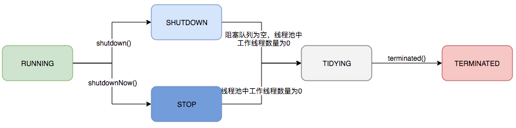

# 线程和线程池

## 线程


## 线程池

> 为什么要使用线程池？

1. 降低资源消耗。通过重复利用已创建的线程降低线程创建、销毁线程造成的消耗。
2. 提高响应速度。当任务到达时，任务可以不需要等到线程创建就能立即执行。
3. 提高线程的可管理性。线程是稀缺资源，如果无限制的创建，不仅会消耗系统资源，还会降低系统的稳定性，使用线程池可以进行统一的分配、调优和监控

总结就是：**线程复用；控制最大并发数；管理线程。**

|                                                              |
| :----------------------------------------------------------: |
|  |
|  |


### 线程池参数

```java
public ThreadPoolExecutor(int corePoolSize,
                          int maximumPoolSize,
                          long keepAliveTime,
                          TimeUnit unit,
                          BlockingQueue<Runnable> workQueue,
                          ThreadFactory threadFactory,
                          RejectedExecutionHandler handler)
```

| 参数            | 说明                                                         |
| --------------- | ------------------------------------------------------------ |
| corePoolSize    | 核心线程数量，线程池维护线程的最少数量                       |
| maximumPoolSize | 线程池维护线程的最大数量                                     |
| keepAliveTime   | 线程池除核心线程外的其他线程的最长空闲时间，超过该时间的空闲线程会被销毁 |
| unit            | keepAliveTime的单位，TimeUnit中的几个静态属性：NANOSECONDS、MICROSECONDS、MILLISECONDS、SECONDS |
| workQueue       | 线程池所使用的任务缓冲队列                                   |
| threadFactory   | 线程工厂，用于创建线程，一般用默认的即可                     |
| handler         | 线程池对拒绝任务的处理策略，默认**ThreadPoolExecutor.AbortPolicy** |

#### 核心线程数

线程池维护线程的最少数量

#### 最大线程数

线程池维护线程的最大数量

#### keepAliveTime空闲线程结束的超时时间

允许核心线程超时被释放或者当前线程数超过核心线程数


#### 阻塞队列

| 名称                  | 描述                                                         |
| --------------------- | :----------------------------------------------------------- |
| ArrayBlockingQueue    | 一个由数组结构组成的有界阻塞队列，按照先进先出（FIFO）的原则对元素进行排序。支持公平锁和非公平锁 |
| LinkedBlockingQueue   | 一个由链表结构组成的有界阻塞队列，按照先进先出（FIFO）的原则对元素进行排序。此队列的默认和最大长度为Integer.MAX_VALUE。 |
| PriorityBlockingQueue | 一个支持优先级排序的无界阻塞队列，默认采取自然顺序排列，也可以通过比较器comparator来指定元素的排序规则。元素按照升序排列。 |
| DelayQueue            | 一个使用优先级队列实现的无界阻塞队列                         |
| SynchronousQueue      | 一个不存储元素的阻塞队列，每一个put操作必须等待一个take操作，否则不能继续添加元素。支持公平锁和非公平锁。例如：Executors.newCachedThreadPool() |
| LinkedTransferQueue   | 一个由链表结构组成的无界阻塞队列，相对于其他阻塞队列LinkedTransferQueue多了tryTransfer和transfer方法。 |
| LinkedBlockingDeque   | 一个由链表结构组成的双向阻塞队列，可以从队列的两端插入和移出元素，多线程并发时，也就减少了一半的竞争。 |

- 缓存系统的设计：可以用DelayQueue保存缓存元素的有效期，使用一个线程循环查询DelayQueue，一旦能从DelayQueue中获取元素时，表示缓存有效期到了。
- 定时任务调度。使用DelayQueue保存当天将会执行的任务和执行时间，一旦从DelayQueue中获取到任务就开始执行，从比如TimerQueue就是使用DelayQueue实现的。

#### ThreadFactory线程工厂

自定义有意义的线程工厂

```java
public class DaemonThreadFactory implements ThreadFactory {

    private AtomicInteger threadNo = new AtomicInteger(1);
    private final String  nameStart;
    private final String  nameEnd  = "]";

    public DaemonThreadFactory(String poolName){
        // 指定线程池名称
        nameStart = "[" + poolName + "-";
    }

    public Thread newThread(Runnable r) {
        String threadName = nameStart + threadNo.getAndIncrement() + nameEnd;
        Thread newThread = new Thread(r, threadName);
        // 设置守护线程
        newThread.setDaemon(true);
        if (newThread.getPriority() != Thread.NORM_PRIORITY) {
            newThread.setPriority(Thread.NORM_PRIORITY);
        }
        return newThread;
    }
}
```


#### RejectedExecutionHandler 任务拒绝策略

任务拒绝模块是线程池的保护部分，线程池有一个最大的容量，当线程池的任务缓存队列已满，并且线程池中的线程数目达到maximumPoolSize时，就需要拒绝掉该任务，采取任务拒绝策略，保护线程池。

拒绝策略是一个接口，其设计如下：

```java
public interface RejectedExecutionHandler {
    void rejectedExecution(Runnable r, ThreadPoolExecutor executor);
}
```

- ThreadPoolExecutor.AbortPolicy    丢弃任务并抛出RejectedExecutionException异常；也是默认的处理方式。
- ThreadPoolExecutor.DiscardPolicy    丢弃任务，但是不抛出异常。
- ThreadPoolExecutor.DiscardOldestPolicy   丢弃队列最前面的任务，然后重新尝试执行任务（重复此过程）
- ThreadPoolExecutor.CallerRunsPolicy    由调用线程（提交任务的线程）处理该任务

PS：当然也可以通过实现RejectedExecutionHandler接口自定义处理方式


### 线程池任务执行

| （1）扩充执行任务的能力，补充可以为一个或一批异步任务生成Future的方法；（2）提供了管控线程池的方法，比如停止线程池的运行。 |
| :----------------------------------------------------------: |
|  |

线程池的运行主要分成两部分：任务管理、线程管理。

任务管理部分充当生产者的角色，当任务提交后，线程池会判断该任务后续的流转：

（1）直接申请线程执行该任务；

（2）缓冲到队列中等待线程执行；

（3）拒绝该任务。

线程管理部分是消费者，它们被统一维护在线程池内，根据任务请求进行线程的分配，当线程执行完任务后则会继续获取新的任务去执行，最终当线程获取不到任务的时候，线程就会被回收。

#### 生命周期

线程池运行的状态，并不是用户显式设置的，而是伴随着线程池的运行，由内部来维护。

运行状态(runState)和线程数量 (workerCount)

```
private static final int RUNNING    = -1 << COUNT_BITS;
private static final int SHUTDOWN   =  0 << COUNT_BITS;
private static final int STOP       =  1 << COUNT_BITS;
private static final int TIDYING    =  2 << COUNT_BITS;
private static final int TERMINATED =  3 << COUNT_BITS;
```


|                                                              |
| ------------------------------------------------------------ |
|  |

#### 任务执行机制

##### 任务调度

工作流程大致是：检查现在线程池的运行状态、运行线程数、运行策略，决定接下来执行的流程，是直接申请线程执行，或是缓冲到队列中执行，亦或是直接拒绝该任务。其执行过程如下：

1. 首先检测线程池运行状态，如果不是RUNNING，则直接拒绝，线程池要保证在RUNNING的状态下执行任务。
2. 如果workerCount < corePoolSize，则创建并启动一个线程来执行新提交的任务。
3. 如果workerCount >= corePoolSize，且线程池内的阻塞队列未满，则将任务添加到该阻塞队列中。
4. 如果workerCount >= corePoolSize && workerCount < maximumPoolSize，且线程池内的阻塞队列已满，则创建并启动一个线程来执行新提交的任务。
5. 如果workerCount >= maximumPoolSize，并且线程池内的阻塞队列已满, 则根据拒绝策略来处理该任务, 默认的处理方式是直接抛异常。


##### 任务缓冲

任务缓冲模块是线程池能够管理任务的核心部分。线程池的本质是对任务和线程的管理，而做到这一点最关键的思想就是将任务和线程两者解耦，不让两者直接关联，才可以做后续的分配工作。线程池中是以生产者消费者模式，通过一个阻塞队列来实现的。阻塞队列缓存任务，工作线程从阻塞队列中获取任务。


##### 任务申请

任务的执行有两种可能：一种是任务直接由新创建的线程执行。另一种是线程从任务队列中获取任务然后执行，执行完任务的空闲线程会再次去从队列中申请任务再去执行。

> 第一种情况仅出现在线程初始创建的时候，第二种是线程获取任务绝大多数的情况。

线程需要从任务缓存模块中不断地取任务执行，帮助线程从阻塞队列中获取任务，实现线程管理模块和任务管理模块之间的通信。这部分策略由getTask方法实现，其执行流程如下图所示：


getTask这部分进行了多次判断，为的是控制线程的数量，使其符合线程池的状态。如果线程池现在不应该持有那么多线程，则会返回null值。工作线程Worker会不断接收新任务去执行，而当工作线程Worker接收不到任务的时候，就会开始被回收。

##### **任务拒绝**

任务拒绝模块是线程池的保护部分，线程池有一个最大的容量，当线程池的任务缓存队列已满，并且线程池中的线程数目达到maximumPoolSize时，就需要拒绝掉该任务，采取任务拒绝策略，保护线程池。

### Worker线程管理


#### Worker线程

```java
private final class Worker extends AbstractQueuedSynchronizer implements Runnable{
    // Worker持有的线程
    final Thread thread;
    // 初始化的任务，可以为null
    Runnable firstTask;
}
```

Worker这个工作线程，实现了Runnable接口，并持有一个线程thread，一个初始化的任务firstTask。thread是在调用构造方法时通过ThreadFactory来创建的线程，可以用来执行任务；firstTask用它来保存传入的第一个任务，这个任务可以有也可以为null。如果这个值是非空的，那么线程就会在启动初期立即执行这个任务，也就对应核心线程创建时的情况；如果这个值是null，那么就需要创建一个线程去执行任务列表（workQueue）中的任务，也就是非核心线程的创建。


线程池需要管理线程的生命周期，需要在线程长时间不运行的时候进行回收。线程池使用一张Hash表去持有线程的引用，这样可以通过添加引用、移除引用这样的操作来控制线程的生命周期。这个时候重要的就是如何判断线程是否在运行。

Worker是通过继承AQS，使用AQS来实现独占锁这个功能。没有使用可重入锁ReentrantLock，而是使用AQS，为的就是实现不可重入的特性去反应线程现在的执行状态。

1. lock方法一旦获取了独占锁，表示当前线程正在执行任务中。
2. 如果正在执行任务，则不应该中断线程。
3. 如果该线程现在不是独占锁的状态，也就是空闲的状态，说明它没有在处理任务，这时可以对该线程进行中断。
4. 线程池在执行shutdown方法或tryTerminate方法时会调用interruptIdleWorkers方法来中断空闲的线程，interruptIdleWorkers方法会使用tryLock方法来判断线程池中的线程是否是空闲状态；如果线程是空闲状态则可以安全回收。

在线程回收过程中就使用到了这种特性，回收过程如下图所示：


#### Worker线程增加

增加线程是通过线程池中的addWorker方法，该方法的功能就是增加一个线程，该方法不考虑线程池是在哪个阶段增加的该线程，这个分配线程的策略是在上个步骤完成的，该步骤仅仅完成增加线程，并使它运行，最后返回是否成功这个结果。addWorker方法有两个参数：firstTask、core。firstTask参数用于指定新增的线程执行的第一个任务，该参数可以为空；core参数为true表示在新增线程时会判断当前活动线程数是否少于corePoolSize，false表示新增线程前需要判断当前活动线程数是否少于maximumPoolSize，其执行流程如下图所示：


#### Worker线程增加回收

线程池中线程的销毁依赖JVM自动的回收，线程池做的工作是根据当前线程池的状态维护一定数量的线程引用，防止这部分线程被JVM回收，当线程池决定哪些线程需要回收时，只需要将其引用消除即可。Worker被创建出来后，就会不断地进行轮询，然后获取任务去执行，核心线程可以无限等待获取任务，非核心线程要限时获取任务。当Worker无法获取到任务，也就是获取的任务为空时，循环会结束，Worker会主动消除自身在线程池内的引用。


事实上，在这个方法中，将线程引用移出线程池就已经结束了线程销毁的部分。但由于引起线程销毁的可能性有很多，线程池还要判断是什么引发了这次销毁，是否要改变线程池的现阶段状态，是否要根据新状态，重新分配线程。

#### Worker线程执行任务

在Worker类中的run方法调用了runWorker方法来执行任务，runWorker方法的执行过程如下：

1. while循环不断地通过getTask()方法获取任务。
2. getTask()方法从阻塞队列中取任务。
3. 如果线程池正在停止，那么要保证当前线程是中断状态，否则要保证当前线程不是中断状态。
4. 执行任务。
5. 如果getTask结果为null则跳出循环，执行processWorkerExit()方法，销毁线程。


### 任务提交

- void execute()
- Future<?> submit()


### 关闭线程池

- `shutdown()`会将线程池状态置为`SHUTDOWN`，不再接受新的任务，同时会等待线程池中已有的任务执行完成再结束。

- `shutdownNow()`会将线程池状态置为`SHUTDOWN`，对所有线程执行`interrupt()`操作，清空队列，并将队列中的任务返回回来。


### 线程池监控

如果系统中大量使用了线程池，有必要对其进行监控

1. `long getTaskCount()`获取已经执行或正在执行的任务数
2. `long getCompletedTaskCount()`获取已经执行的任务数
3. `int getLargestPoolSize()`获取线程池曾经创建过的最大线程数，根据这个参数，我们可以知道线程池是否满过
4. `int getPoolSize()`获取线程池线程数
5. `int getActiveCount()`获取活跃线程数（正在执行任务的线程数）

其次，`ThreadPoolExecutor`留给我们自行处理的方法有3个

1. `protected void beforeExecute(Thread t, Runnable r)`   任务执行前被调用
2. `protected void afterExecute(Runnable r, Throwable t)`   任务执行后被调用
3. `protected void terminated()`   线程池结束后被调用

### Spring提供的线程池

- ThreadPoolTaskExecutor  implements  InitializingBean

线程池初始化afterPropertiesSet()：

```java
	@Override
	public void afterPropertiesSet() {
		initialize();
	}
	
	/**
	 * Set up the ExecutorService.
	 */
	public void initialize() {
		if (logger.isInfoEnabled()) {
			logger.info("Initializing ExecutorService" + (this.beanName != null ? " '" + this.beanName + "'" : ""));
		}
		if (!this.threadNamePrefixSet && this.beanName != null) {
			setThreadNamePrefix(this.beanName + "-");
		}
		this.executor = initializeExecutor(this.threadFactory, this.rejectedExecutionHandler);
	}
	
		@Override
	protected ExecutorService initializeExecutor(
			ThreadFactory threadFactory, RejectedExecutionHandler rejectedExecutionHandler) {

		BlockingQueue<Runnable> queue = createQueue(this.queueCapacity);

        // JDK原生ThreadPoolExecutor
		ThreadPoolExecutor executor;
		if (this.taskDecorator != null) {
			executor = new ThreadPoolExecutor(
					this.corePoolSize, this.maxPoolSize, this.keepAliveSeconds, TimeUnit.SECONDS,
					queue, threadFactory, rejectedExecutionHandler) {
				@Override
				public void execute(Runnable command) {
					Runnable decorated = taskDecorator.decorate(command);
					if (decorated != command) {
						decoratedTaskMap.put(decorated, command);
					}
                    // 回调
					super.execute(decorated);
				}
			};
		}
		else {
			executor = new ThreadPoolExecutor(
					this.corePoolSize, this.maxPoolSize, this.keepAliveSeconds, TimeUnit.SECONDS,
					queue, threadFactory, rejectedExecutionHandler);

		}

		if (this.allowCoreThreadTimeOut) {
			executor.allowCoreThreadTimeOut(true);
		}

		this.threadPoolExecutor = executor;
		return executor;
	}

	// 创建阻塞队列
	protected BlockingQueue<Runnable> createQueue(int queueCapacity) {
		if (queueCapacity > 0) {
			return new LinkedBlockingQueue<>(queueCapacity);
		}
		else {
			return new SynchronousQueue<>();
		}
	}
```


- ThreadPoolTaskExecutor  implements  DisposableBean

注册线程池关闭方法destroy()：

```java
	@Override
	public void destroy() {
		shutdown();
	}

	public void shutdown() {
		if (logger.isInfoEnabled()) {
			logger.info("Shutting down ExecutorService" + (this.beanName != null ? " '" + this.beanName + "'" : ""));
		}
		if (this.executor != null) {
			if (this.waitForTasksToCompleteOnShutdown) {
                // 将线程池的状态设置为shutdown，然后中断所有没有执行任务的线程，并将剩余的任务执行完。
				this.executor.shutdown();
			}
			else {
                // 将线程池的状态设置为STOP，然后尝试停止所有线程（有可能导致部分任务没有执行完）然后返回未执行任务的列表
				for (Runnable remainingTask : this.executor.shutdownNow()) {
					cancelRemainingTask(remainingTask);
				}
			}
			awaitTerminationIfNecessary(this.executor);
		}
	}
	
	protected void cancelRemainingTask(Runnable task) {
		if (task instanceof Future) {
			((Future<?>) task).cancel(true);
		}
	}
```

https://zhuanlan.zhihu.com/p/123328822