# MySQL索引

什么是数据库索引？

​		定义在table基础之上，有助于无需检查所有记录而快速定位所需记录的一种**辅助存储结构**，由一系列存储在磁盘上的索引项组成，每一种索引项由索引字段和行指针构成。

> 在关系数据库中，索引是一种单独的、物理的数对数据库表中一列或多列的值进行排序的一种存储结构，它是某个表中一列或若干列值的集合和相应的指向表中物理标识这些值的数据页的逻辑指针清单。

PS:最多可以创建 16 个索引列

|                              |
| :--------------------------: |
| 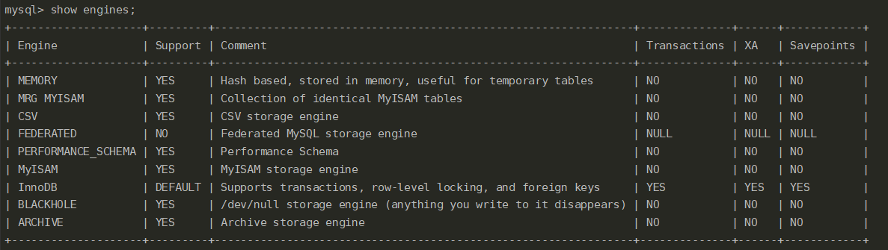 |


## MySQL整体架构

|                                                              |
| :----------------------------------------------------------: |
| 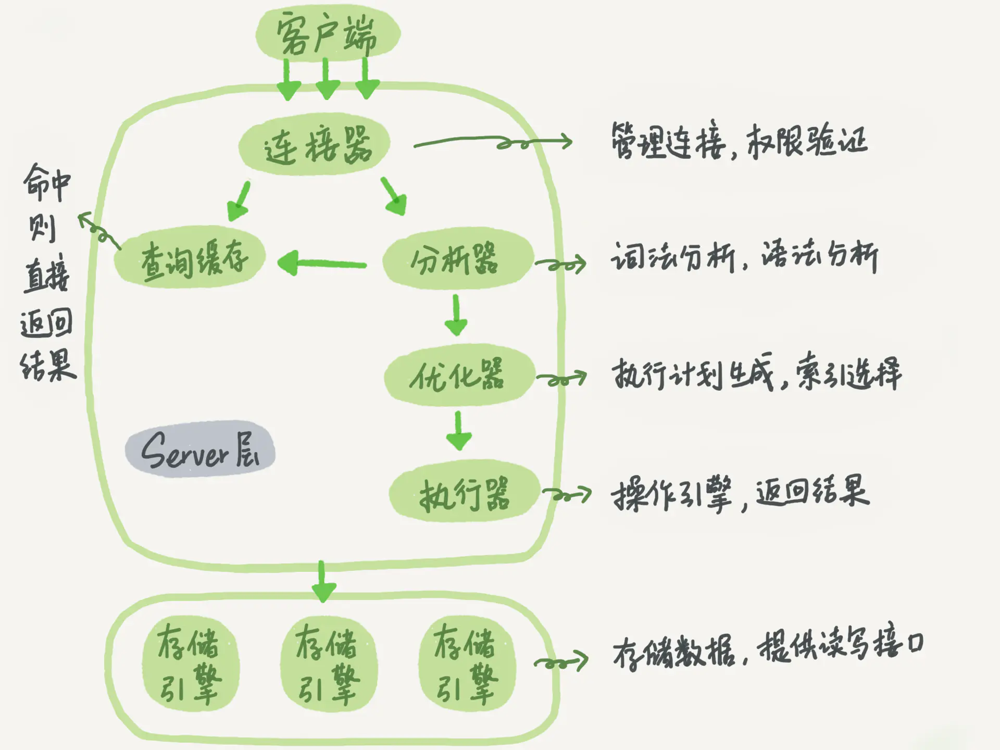 |
|                  |
| 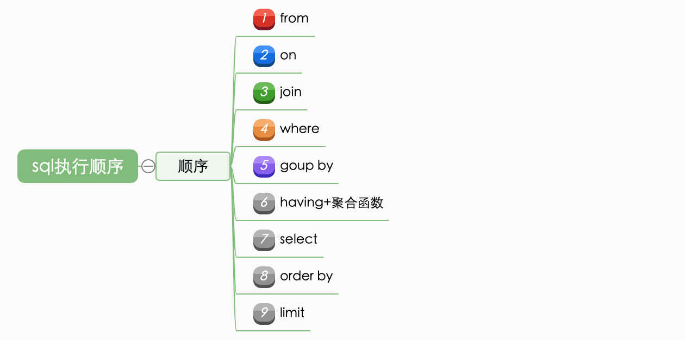 |
| 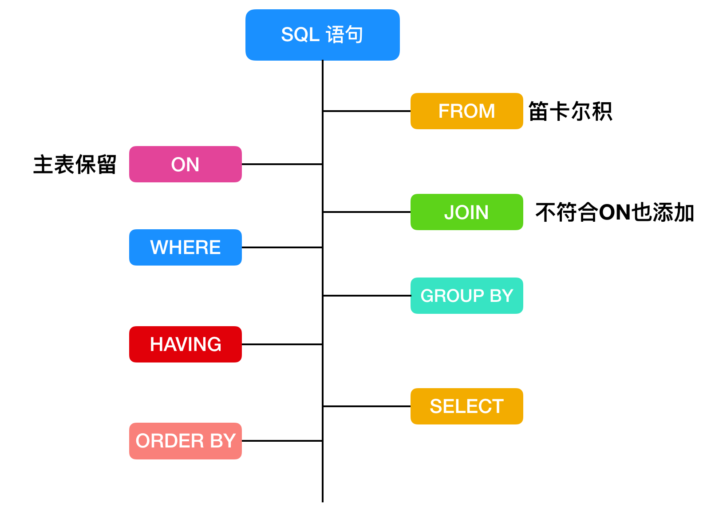 |


## 索引的优点

最典型的例子就是查新华字典，通过查找目录快速定位到查找的字

|                                                      |
| :--------------------------------------------------: |
| 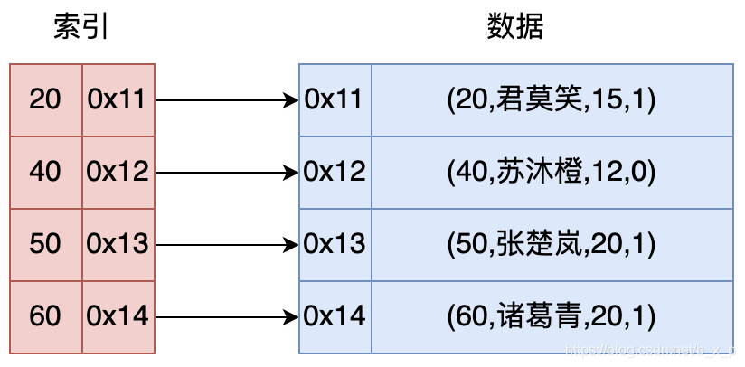 |


- 大大减少了服务器需要扫描的数量
- 帮助服务器避免排序和临时表
- 将IO变成顺序IO
  - 尽可能的降低磁盘的寻址时间，也就是局部性原理，就是很大一部分数据在未来的一段时间被连续访问
  - 在复制1G压缩包 和 1G小文件，前者的速度会大于后者
  - 减少IO的量，例如写SQL语句的时候，不要写 select *
  - 减少IO的次数，一次IO能搞定的事，不使用3次IO

## 索引数据结构

索引保存数据的方式：

- 数据区保存id对应行数据的所有内容
- 数据区保存真正数据的磁盘地址

### hash索引

memory存储引擎使用的索引是hash表，innodb支持自适应hash

缺点：

1. hash碰撞
2. 比较消耗内存
3. 无法进行范围查找，适合等值查询

### B+树

#### 二叉排序树（BST）

有序，顶端的节点我们称为根节点，**没有子节点的节点**我们称之为叶节点。O(log2(n))。特点：

1. **左子树的键值总是小于根的键值，**

2. **右子树的键值总是大于根的键值，**

3. 任意节点的左右子树也分别是二叉查找树；

4. 没有键值相等的点

> 因此可以通过中序遍历得到键值的排序输出
>

   

|                                                              |
| :----------------------------------------------------------: |
|     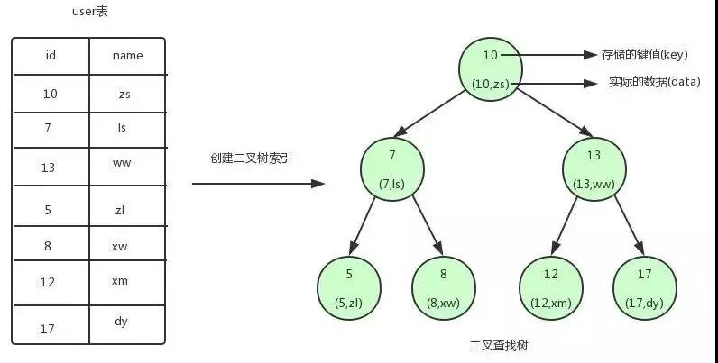      |
| 图中的圆为二叉查找树的节点，节点中存储了键（key）和数据（data）。键对应 user 表中的 id，数据对应 user 表中的行数据。 |

如果我们需要查找 id=12 的用户信息，利用我们创建的二叉查找树索引，查找流程如下：

- 将根节点作为当前节点，把 12 与当前节点的键值 10 比较，12 大于 10，接下来我们把当前节点>的右子节点作为当前节点。
- 继续把 12 和当前节点的键值 13 比较，发现 12 小于 13，把当前节点的左子节点作为当前节点。
- 把 12 和当前节点的键值 12 对比，12 等于 12，满足条件，我们从当前节点中取出 data，即 id=12，name=xm。

局限性：

一个二叉查找树是由n个节点随机构成，所以，对于某些情况，二叉查找树会退化成一个有n个节点的线性链。


#### 平衡二叉树（AVL树）

带有平衡条件的二叉查找树。节点的子节点高度差不能超过1。保证平衡的方式为左旋、右旋操作。O(log2(n))

特点：

1. **首先复合二叉查找树的定义，**
2. **其次必须满足任何节点的两个子树的高度最大差为1.**
> (平衡二叉树相比于二叉查找树来说，查找效率更稳定，总体的查找速度也更快。)

不管我们是执行插入还是删除操作，只要不满足上面的条件，就要通过旋转来保持平衡，而旋转是非常耗时的，由此我们可以知道AVL树适合用于插入删除次数比较少，但查找多的情况。 

|                                                              |
| :----------------------------------------------------------: |
| 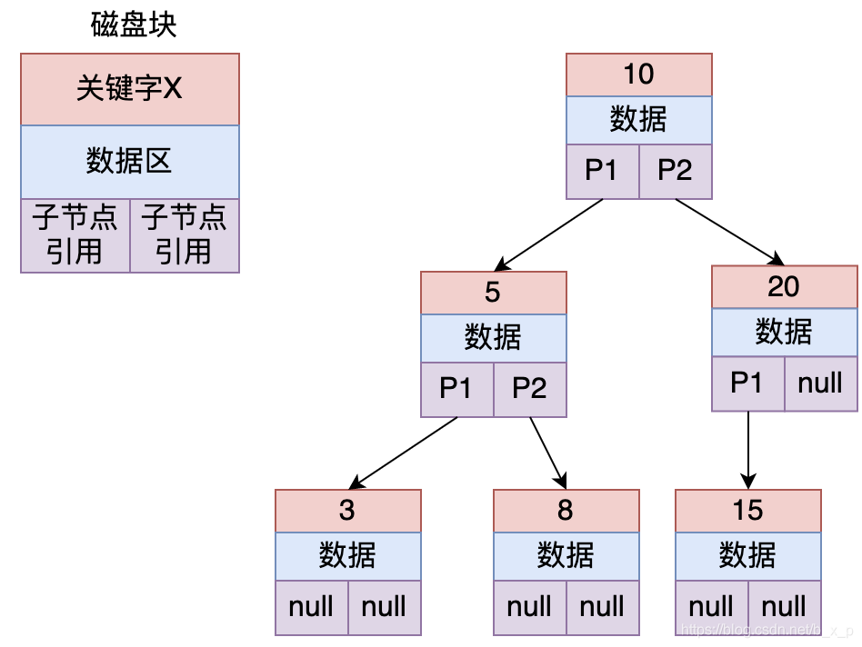 |
|      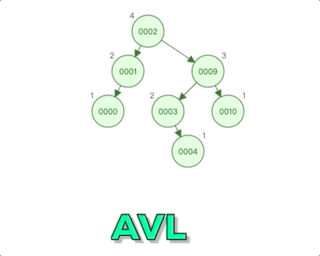       |
|   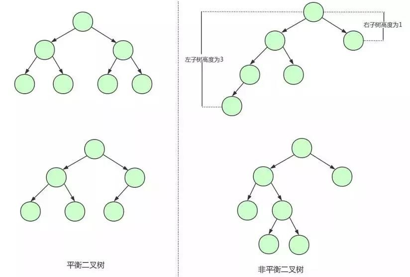    |
|                                                              |

局限性：

1. 搜索效率不足。一般来说，在树结构中，数据所处的深度，决定了搜索时的IO次数（MySql中将每个节点大小设置为一页大小，一次IO读取一页 / 一个节点）。如上图中搜索id = 8的数据，需要进行3次IO。当数据量到达几百万的时候，树的高度就会很恐怖。
2. 查询不不稳定。如果查询的数据落在根节点，只需要一次IO，如果是叶子节点或者是支节点，会需要多次IO才可以。
3. 存储的数据内容太少。没有很好利用操作系统和磁盘数据交换特性，也没有利用好磁盘IO的预读能力。因为操作系统和磁盘之间一次数据交换是以页为单位的，一页大小为 4K，即每次IO操作系统会将4K数据加载进内存。但是，在二叉树每个节点的结构只保存一个关键字，一个数据区，两个子节点的引用，并不能够填满4K的内容。幸幸苦苦做了一次的IO操作，却只加载了一个关键字。在树的高度很高，恰好又搜索的关键字位于叶子节点或者支节点的时候，取一个关键字要做很多次的IO。
   

#### 红黑树（Red-Black-Tree）

一种二叉查找树，但在每个节点增加一个存储位表示节点的颜色，可以是red或black。通过对任何一条从根到叶子的路径上各个节点着色的方式的限制，红黑树确保没有一条路径会比其它路径长出两倍。它是一种弱平衡二叉树(由于是弱平衡，可以推出，相同的节点情况下，AVL树的高度低于红黑树)，相对于要求严格的AVL树来说，它的旋转次数变少，所以对于搜索、插入、删除操作多的情况下，我们就用红黑树。

|                                                              |
| :----------------------------------------------------------: |
|                                  |
| 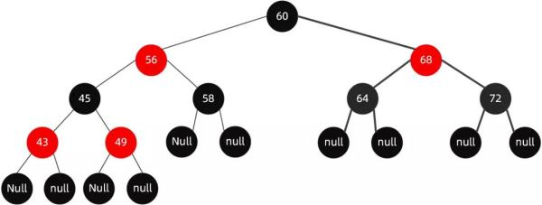 |

特点：

1. 每个节点非红即黑
2. 根节点是黑的
3. 每个叶节点(叶节点即树尾端NULL指针或NULL节点)都是黑的
4. 每个红色结点的两个子结点一定都是黑色。
5. 对于任意节点而言，其到叶子点树NULL指针的每条路径都包含相同数目的黑节点
6. 每条路径都包含相同的黑节点

https://www.cnblogs.com/chuonye/p/11236136.html


#### m阶B-树（Balance Tree）

阶：表示一个结点最多有多少个子结点

最小逻辑单元：页（datapage）,4k或8k，在读取的时候一般是页的整数倍（InnoDB 页的大小默认是 16K）

树中每个结点至多m棵子树、非叶子结点的根结点至少有两棵子树、除根结点外的非叶子结点至少有m/2棵子树、所有的叶子结点出现在同一层，并且不带信息，通常称为失败结点、树中每个结点的关键字有序，且关键字的左子树中的关键字均小于它，右子树均大于它。（单个节点可以存储多个键值和数据的平衡树）

|                                                   |
| :-----------------------------------------------: |
| 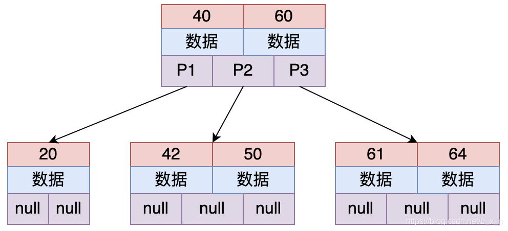 |
|                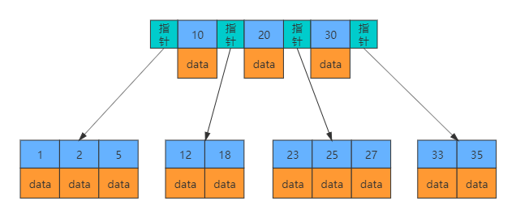                |

2-3树（每个节点存储2个关键字，有3路）：关键字 = 路数 - 1

假设要从上图中查找id = X的数据，B-TREE搜索过程如下：

1. 取出根磁盘块，加载40和60两个关键字。
2. 如果X等于40，则命中；如果X小于40走P1；如果40 < X < 60走P2；如果X = 60，则命中；如果X > 60走P3。
3. 根据以上规则命中后，接下来加载对应的数据， 数据区中存储的是具体的数据或者是指向数据的指针。
   

特点：

1. 根结点至少有两个子节点
2. 每个中间节点都包含k-1个元素和k个孩子，其中 m/2 <= k <= m
3. 每一个叶子节点都包含k-1个元素，其中 m/2 <= k <= m
4. 所有的叶子结点都位于同一层。
5. 每个节点中的元素从小到大排列，节点当中k-1个元素正好是k个孩子包含的元素的值域分划。
6. 所有非终端结点中包含下列信息数据 ( n, A0 , K1 , A1 , K2 , A2 , … , Kn , An )，其中： Ki (i=1,…,n)为关键字，且Ki < Ki+1 , Ai (i=0,…,n)为指向子树根结点的指针, n为关键字的个数
7. 非叶子结点的指针：P[1], P[2], …, P[M]；其中P[1]指向关键字小于K[1]的子树，P[M]指向关键字大于K[M-1]的子树，其它P[i]指向关键字属于(K[i-1], K[i])的子树；

MySQL将页的大小设置为16k，即将一个节点（磁盘块）的大小设置为16K，一次IO将一个节点内容（16K）加载进内存。假设关键字类型bigint，8 个字节，数据区也是8个字节，那么一个磁盘块大概存储16*1000/16=1000个关键字


#### m阶B+树

与B-树差异在于有n棵子树的结点中含有n个关键字、所有的叶子节点包含了全部关键字的信息，以及指向这些关键字记录的指针、所有的非终端结点可以看成是索引部分，结点中仅含有其子树中最大的关键字。

由根节点（root node）、中间节点（non leaf node）、叶子节点（leaf node）组成。

随着插入 B+ 树索引的记录变多，1个页（16K）无法存放这么多数据，所以会发生 B+ 树的分裂，B+ 树的高度变为 2，当 B+ 树的高度大于等于 2 时，根节点和中间节点存放的是索引键对，由（索引键、指针）组成。

- 根节点存放键值对：16384/(8 +6) = 1170
- 中间节点存放键值对：16384/(8 +6) = 1170
- 叶子节点存放记录数：16384/每条记录大小 = ？
- 总数：1170 * 1170 * ？= 

|                            InnoDB                            |
| :----------------------------------------------------------: |
|                                  |
|  |
|               |
|                          **myisam**                          |
|      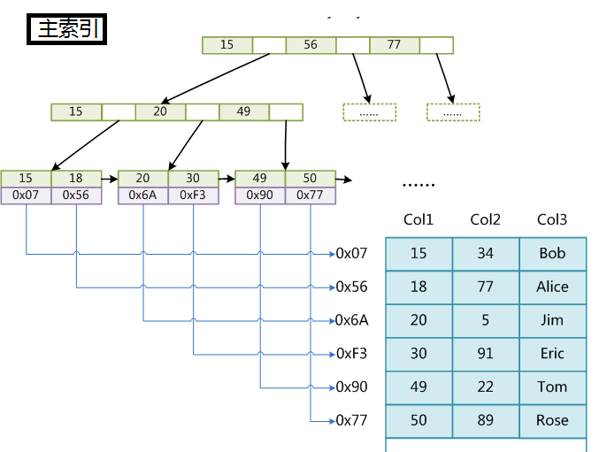       |
|                                                              |
|                   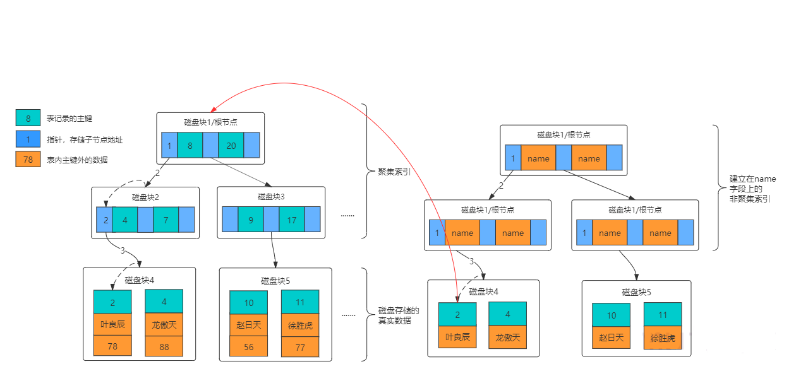                   |

B树的变种，检索规则采用**左闭合区间**，路数和关键个数1比1。

如果上图中是用ID做的索引，如果是搜索X = 1的数据，搜索规则如下：

1. 取出根磁盘块，加载1，28，66三个关键字。
2. X <= 1 走P1，取出磁盘块，加载1，10，20三个关键字。
3. X <= 1 走P1，取出磁盘块，加载1，8，9三个关键字。
4. 已经到达叶子节点，命中1，接下来加载对应的数据，图中数据区中存储的是具体的数据。
   

特点：

1. 有k个子树的中间节点包含有k个元素（B树中是k-1个元素），每个元素不保存数据，只用来索引，所有数据都保存在叶子节点。

2. 所有的叶子结点中包含了全部元素的信息，及指向含这些元素记录的指针，且叶子结点本身依关键字的大小自小而大顺序链接。

3. 所有的中间节点元素都同时存在于子节点，在子节点元素中是最大（或最小）元素。

> PS：因此 InnoDB 建议为大部分表使用默认自增的主键作为主索引。

- B+ 树索引的高度通常为 3~4 层，高度为 4 的 B+ 树能存放 50 亿左右的数据；
- 由于 B+ 树的高度不高，查询效率极高，50 亿的数据也只需要插叙 4 次 I/O；

#### B树和B+树的区别

1. B+Tree 关键字的搜索采用的是左闭合区间，之所以采用左闭合区间是因为他要最好的去支持自增id，这也是mysql的设计初衷。即，如果id = 1命中，会继续往下查找，直到找到叶子节点中的1。
2. B+Tree 根节点和支节点没有数据区，关键字对应的数据只保存在叶子节点中。即只有叶子节点中的关键字数据区才会保存真正的数据内容或者是内容的地址。而在B树种，如果根节点命中，则会直接返回数据。
3. 在B+Tree中，叶子节点不会去保存子节点的引用。
4. B+Tree叶子节点是顺序排列的，并且相邻的节点具有顺序引用的关系，如上图中叶子节点之间有指针相连接，缓存命中性好

參考：https://blog.csdn.net/kking_edc/article/details/108450652，https://segmentfault.com/a/1190000020416577


## 索引的用处

- 快速查找匹配where子句的行
- 从consideration中消除行，如果可以在多个索引之间进行选择，mysql通常会使用栈找到最少行的索引
- 如果表具有多列索引，则优化器可以使用索引的**最左匹配**前缀来查找
- 当有表连接的时候，从其它表检测行数据
- 查找特定索引列min或max值
- 如果排序或分组时，在可用索引的最左前缀上完成的，则对表进行排序和分组
- 在某些情况下，可以优化查询以检索值而无需查询数据行


## 索引的分类

> 默认情况下，索引的key为主键，没有主键，那么就是唯一键，如果没有唯一键，那么就是6byte的row_id
>
> 数据仅存储一份，表中有多个索引时，其它索引叶子节点data存储的是主键key

### 主键索引

主键索引，primary key

``` sql
CREATE TABLE `t_blog_sort` (
  `id` bigint(18) NOT NULL COMMENT '唯一uid',
  `sort_name` varchar(255) DEFAULT NULL COMMENT '分类内容',
  `content` varchar(255) DEFAULT NULL COMMENT '分类简介',
  `create_time` timestamp NOT NULL DEFAULT '0000-00-00 00:00:00' COMMENT '创建时间',
  `update_time` timestamp NOT NULL DEFAULT '0000-00-00 00:00:00' COMMENT '更新时间',
  `status` tinyint(1) unsigned NOT NULL DEFAULT '1' COMMENT '状态',
  `sort` int(11) DEFAULT '0' COMMENT '排序字段，越大越靠前',
  `click_count` int(11) DEFAULT '0' COMMENT '点击数',
  PRIMARY KEY (`id`)
) ENGINE=InnoDB DEFAULT CHARSET=utf8mb4 COMMENT='博客分类表';
```

PRIMARY KEY (`id`)，主键索引，叶子节点存的是整行数据。主键索引也被称为**聚簇索引（clustered index）**

#### 自增主键不是连续的

#### 自增id用完怎么办？

报主键冲突错误，主键设置`bigint unsigned`


#### 系统自增row_id

当建表时没有指定主键，InnoDB自动创建一个不可见的长度为6个字节的row_id

### 唯一索引

唯一索引 类似于主键索引，索引列的值必须唯一

唯一索引和主键索引的区别就是，唯一索引允许出现空值，而主键索引不能为空

```sql
create unique index index_name on table(column)
```

或者创建表时指定

```sql
unique index_name column
```

### 普通索引

普通索引，辅助索引或**二级索引（）**

```sql
create index  index_name on table(column)
```

或者创建表时指定

``` sql
create table(..., index index_name column)
```

叶子节点内容是主键的值

### 全文索引

lunce、solr和ElasticSearch就是做全文检索的，里面涉及到了倒排索引的概念，mysql很少使用全文索引。

要用来查找文本中的关键字，不是直接与索引中的值相比较，像是一个搜索引擎，配合 match against 使用，现在只有char，varchar，text上可以创建索引，在数据量比较大时，先将数据放在一个没有全文索引的表里，然后在利用create index创建全文索引，比先生成全文索引在插入数据快很多。

### 组合索引

目前，在业务不是特别复杂的时候，可能使用一个列作为索引，或者直接采用主键索引即可，但是如果业务变得复杂的时候，就需要用到组合索引，通过对多个列建立索引。

- 经常用的列优先（最左匹配原则）
- 离散度高的列优先（离散度高原则）
- 宽度小的列优先（最少空间原则）

组合索引的用处，假设我现在表有个多个字段：id、name、age、gender，然后我经常使用以下的查询条件

```sql
select * from user where name = 'xx' and age = xx
```

这个时候，我们就可以通过组合 name 和 age 来建立一个组合索引，加快查询效率，建立成组合索引后，我的索引将包含两个key值

在多个字段上创建索引，遵循**最左匹配**原则

```sql
alter table t add index index_name(a,b,c);
```

> 主键索引和非主键索引的查询有什么区别？
>
> 主键查询方式时，只需要搜索主键这棵B+树；普通索引查询方式时，先搜索普通索引这颗B+树，获取主键值，再到主键这课B+树搜索一次。这个过程被称为“回表”。
>
> 普通索引会多一次回表操作

## 索引的使用与否

### 索引的使用

MySQL每次只使用一个索引，与其说数据库查询只能用一个索引，倒不如说，和全表扫描比起来，去分析两个索引 B+树更耗费时间，所以where A=a and B=b 这种查询使用（A，B）的组合索引最佳，B+树根据（A，B）来排序。

- 主键，unique字段
- 和其他表做连接的字段需要加索引
- 在where 里使用 >, >=, = , <, <=, is null 和 between等字段。
- 使用不以通配符开始的like，where A like ‘China%’
- 聚合函数里面的 MIN()， MAX()的字段
- order by  和 group by字段

### 何时不使用索引

- 表记录太少
- 数据重复且分布平均的字段（只有很少数据的列）；
- 经常插入、删除、修改的表要减少索引
- text，image 等类型不应该建立索引，这些列的数据量大（加入text的前10个字符唯一，也可以对text前10个字符建立索引）
- MySQL能估计出全表扫描比使用索引更快的时候，不使用索引

### 索引何时失效

- 组合索引为使用最左前缀，例如组合索引（A，B），where B = b 不会使用索引
- like未使用最左前缀，where A  like "%China"
- 搜索一个索引而在另一个索引上做 order by， where A = a order by B，只会使用A上的索引，因为查询只使用一个索引。
- or会使索引失效。如果查询字段相同，也可以使用索引。例如  where A = a1 or A = a2（生效），where A=a or B = b （失效）
- 在索引列上的操作，计算、函数upper()、（自动或手动）类型转换，会导致索引失效而转向全表扫描，or、!= （<>）,not in, is null，is not null 等


## 面试技术名词

### 回表

当建立几个索引时，就会生成几棵B+Tree，但是带有原始数据行的B+Tree只有一棵，其它棵树上的叶子节点带的是主键值。

例如，我们通过主键建立了主键索引，然后在叶子节点上存放的是我们的数据

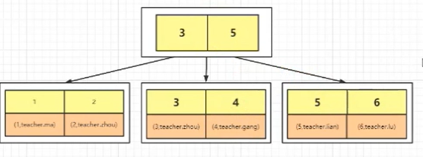

当我们创建了两个索引时，一个是主键，一个是name，它还会在生成一棵B+Tree，这棵树的叶子节点存放的是主键，当我们通过name进行查找的时候，会先得到一个主键，然后在通过主键再去上面的这个主键B+Tree中进行查找，这个操作为 **回表**


当我们的SQL语句使用的是下面这种的时候，它会查找第一颗树，直接返回我们的数据

```mysql
select * from tb where id = 1
```

当我们使用下面这种查询的时候，它会先查找第二棵树得到我们的主键，然后拿着主键再去查询第一棵树

```mysql
select * from tb  where name = 'gang'
```

> 回表就是通过非聚簇索引进行检索，然后再去主键索引进行检索，这个操作就是回表
>

但是我们在使用检索的时候，尽量避免回表，因为这会造成两次B+Tree的查询，假设一次B+Tree查询需要三次IO操作，那么查询两次B+Tree就需要6次IO操作。

**尽量避免回表**

### 覆盖索引

下面两个SQL语句，看看它们的查询过程是一样的么？

```SQL
select * from tb where id = 1
select id from tb where name = 'zhou'
```

答案是不一样的，首先我们看第二个语句，就是要输出的列中，就是我们的主键，当我们通过name建立的B+Tree进行查询的时候


我们可以直接找到我们的数据，并得到主键，不需要再通过主键去主键B+Tree中进行查询。

> 普通索引的B+树包含查询的所有字段时，不需要进行回表操作的过程，我们称为**索引覆盖**
>

常用的性能优化手段之一，**推荐使用索引覆盖**

### 最左匹配

这里提到的 **最左匹配** 和 **索引下推** 都是针对于组合索引的。

例如，我们有这样一个索引

```
name  age：组合索引
```

必须要先匹配name，才能匹配到age。这个我们就被称为最左匹配

例如下面的几条SQL语句，那些语句不会使用组合索引

```sql
where name = ? and age = ?
where name = ?
where age = ?
where age = ? and name = ?
```

根据最左匹配原则，我们的 `where age = ?`不会使用组合索引的。

- 那为什么4的顺序不一样，也会使用组合索引呢？

其实内部的优化器会进行调整，例如下面的一个连表操作

```sql
select * from tb1 join tb2 on tb1.id = tb2.id
```

其实在加载表的时候，并不一定是先加载tb1，在加载tb2，而是可能根据表的大小决定的，小表优先加载进内存中。

### 索引下推

```sql
select * from tb1 where name = ? and age = ?
```

index condition pushdown，在Mysql5.6的版本上推出，用于优化查询。可以有效减少回表的次数，

在mysq 5.6之前，会先根据name去存储引擎中拿到所有的数据，然后在server层对age进行数据过滤

在mysql5.6之后，根据name和 age两个列的值去获取数据，直到把数据返回。

通过对比能够发现，第一个的效率低，第二个的效率高，因为整体的IO量少了，原来是把数据查询出来，在server层进行筛选，而现在在存储引擎层面进行筛选，然后返回结果。我们把这个过程就称为  **索引下推**

> `Using index condition`

### 优化器

#### CBO

Cost-Based Optimizer，基于成本的优化，这种方式会根据模型计算出各个可能的执行计划的代价，然后选择代价最少的那个。它会利用数据库里面的统计信息来做判断，因此是动态的。

#### RBO

Rule-Based Optimize，基于规则的优化，基于一些预置的规则对查询进行优化。


### 谓词下推


### MRR

mult_range read

内存排序  -->  范围查找

### FIC

fast index create 

MySQL5.5之前，插入和删除数据：

1. 先创建一个临时表，将数据导入临时表；
2. 把原始表删除
3. 修改临时表的名字

MySQL5.5之后，创建和删除辅助索引不再需要拷贝整个表的数据。

给当前表添加一个share锁，不会创建临时文件的资源消耗，还是在源文件中，但是此时如果有人发起dml操作，很明显会导致数据不一致，所以添加share锁，读取时没有问题的，但是DML会有问题


## 索引创建原则

### 列的离散型

离散型的计算公式：`count(distinct column_name):count(*)`，就是用去重后的列值个数比个数。值在 (0,1] 范围内。离散型越高，选择型越好。通过索引最终确定的范围越小，最终扫面的行数也就越少。


### 最左匹配原则

对于索引中的关键字进行对比的时候，一定是从左往右以此对比，且不可跳过。当进行匹配的时候，转换成ascll码


### 最少空间原则

当关键字占用的空间越小，则每个节点保存的关键字个数就越多，每次加载进内存的关键字个数就越多，检索效率就越高。创建索引的关键字要尽可能占用空间小。


## 索引匹配方式

### 全值匹配

全值匹配指的是和索引中所有的列进行匹配

```sql
explain select * from staffs where name = 'July' and age = 23 and pos = 'dev'
```

而我们建立了一个 包含  name、age、pos的组合索引，使用上面的SQL语句，就会进行全值匹配

### 最佳左前缀法则

- 如果索引了多列，要遵守此规则，指的是从索引最左前列开始并且不跳过索引中的列
- 带头大哥不能死，中间兄弟不能断

1. 只匹配前面的2列

```sql
mysql> explain select * from staffs where name = 'July' and age = 23;
+----+-------------+--------+------------+------+-----------------------+-----------------------+---------+-------------+------+----------+-------+
| id | select_type | table  | partitions | type | possible_keys         | key                   | key_len | ref         | rows | filtered | Extra |
+----+-------------+--------+------------+------+-----------------------+-----------------------+---------+-------------+------+----------+-------+
|  1 | SIMPLE      | staffs | NULL       | ref  | idx_staffs_nameAgePos | idx_staffs_nameAgePos | 78      | const,const |    1 |   100.00 | NULL  |
+----+-------------+--------+------------+------+-----------------------+-----------------------+---------+-------------+------+----------+-------+
1 row in set, 1 warning (0.00 sec)
```

这个时候，只使匹配了前面两个列，而没有使用第三个列

2. 匹配前后2列，丢弃中间列

```sql
mysql> explain select * from staffs where name = 'July' and pos = 'dev';
+----+-------------+--------+------------+------+-----------------------+-----------------------+---------+-------+------+----------+-----------------------+
| id | select_type | table  | partitions | type | possible_keys         | key                   | key_len | ref   | rows | filtered | Extra                 |
+----+-------------+--------+------------+------+-----------------------+-----------------------+---------+-------+------+----------+-----------------------+
|  1 | SIMPLE      | staffs | NULL       | ref  | idx_staffs_nameAgePos | idx_staffs_nameAgePos | 74      | const |    1 |    33.33 | Using index condition |
+----+-------------+--------+------------+------+-----------------------+-----------------------+---------+-------+------+----------+-----------------------+
1 row in set, 1 warning (0.00 sec)
```

3. 匹配后面几列

```sql
mysql> explain select * from staffs where age=23 and pos='dev';
+----+-------------+--------+------------+------+---------------+------+---------+------+------+----------+-------------+
| id | select_type | table  | partitions | type | possible_keys | key  | key_len | ref  | rows | filtered | Extra       |
+----+-------------+--------+------------+------+---------------+------+---------+------+------+----------+-------------+
|  1 | SIMPLE      | staffs | NULL       | ALL  | NULL          | NULL | NULL    | NULL |    3 |    33.33 | Using where |
+----+-------------+--------+------------+------+---------------+------+---------+------+------+----------+-------------+
1 row in set, 1 warning (0.01 sec)
```

4. 索引优化

```sql
mysql> explain select * from staffs where age=23 and pos='dev' and name = 'mary';
+----+-------------+--------+------------+------+-----------------------+-----------------------+---------+-------------------+------+----------+-------+
| id | select_type | table  | partitions | type | possible_keys         | key                   | key_len | ref               | rows | filtered | Extra |
+----+-------------+--------+------------+------+-----------------------+-----------------------+---------+-------------------+------+----------+-------+
|  1 | SIMPLE      | staffs | NULL       | ref  | idx_staffs_nameAgePos | idx_staffs_nameAgePos | 140     | const,const,const |    1 |   100.00 | NULL  |
+----+-------------+--------+------------+------+-----------------------+-----------------------+---------+-------------------+------+----------+-------+
1 row in set, 1 warning (0.00 sec)
```


现在我们使用下面的SQL语句进行验证，但我们输出值只包含ID的时候

```sql
explain select id from staffs where id = 1
```

我们查看其任务计划，在某尾有 Extra字段，如果是Using index 表示是使用了覆盖索引

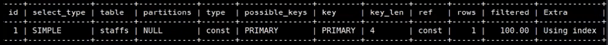

然后我们在查看下面这条SQL语句

```sql
explain select * from staffs where id = 1
```

通过查看任务计划，发现extra字段是NULL，说明没有使用覆盖索引

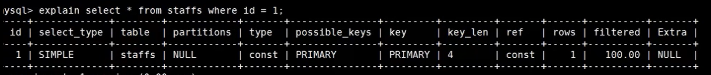

### 匹配列前缀

可以匹配某一列值的开头部分

```sql
mysql> explain select * from staffs where name like '%July%';
+----+-------------+--------+------------+------+---------------+------+---------+------+------+----------+-------------+
| id | select_type | table  | partitions | type | possible_keys | key  | key_len | ref  | rows | filtered | Extra       |
+----+-------------+--------+------------+------+---------------+------+---------+------+------+----------+-------------+
|  1 | SIMPLE      | staffs | NULL       | ALL  | NULL          | NULL | NULL    | NULL |    3 |    33.33 | Using where |
+----+-------------+--------+------------+------+---------------+------+---------+------+------+----------+-------------+
1 row in set, 1 warning (0.00 sec)
mysql> explain select * from staffs where name like '%July';

+----+-------------+--------+------------+------+---------------+------+---------+------+------+----------+-------------+
| id | select_type | table  | partitions | type | possible_keys | key  | key_len | ref  | rows | filtered | Extra       |
+----+-------------+--------+------------+------+---------------+------+---------+------+------+----------+-------------+
|  1 | SIMPLE      | staffs | NULL       | ALL  | NULL          | NULL | NULL    | NULL |    3 |    33.33 | Using where |
+----+-------------+--------+------------+------+---------------+------+---------+------+------+----------+-------------+
1 row in set, 1 warning (0.00 sec)

mysql> explain select * from staffs where name like 'July%';
+----+-------------+--------+------------+-------+-----------------------+-----------------------+---------+------+------+----------+-----------------------+
| id | select_type | table  | partitions | type  | possible_keys         | key                   | key_len | ref  | rows | filtered | Extra                 |
+----+-------------+--------+------------+-------+-----------------------+-----------------------+---------+------+------+----------+-----------------------+
|  1 | SIMPLE      | staffs | NULL       | range | idx_staffs_nameAgePos | idx_staffs_nameAgePos | 74      | NULL |    1 |   100.00 | Using index condition |
+----+-------------+--------+------------+-------+-----------------------+-----------------------+---------+------+------+----------+-----------------------+
1 row in set, 1 warning (0.00 sec)
```

### 匹配范围值

可以查找某个范围的数据

```sql
mysql> explain select * from staffs where name > 'Mary';
+----+-------------+--------+------------+-------+-----------------------+-----------------------+---------+------+------+----------+-----------------------+
| id | select_type | table  | partitions | type  | possible_keys         | key                   | key_len | ref  | rows | filtered | Extra                 |
+----+-------------+--------+------------+-------+-----------------------+-----------------------+---------+------+------+----------+-----------------------+
|  1 | SIMPLE      | staffs | NULL       | range | idx_staffs_nameAgePos | idx_staffs_nameAgePos | 74      | NULL |    1 |   100.00 | Using index condition |
+----+-------------+--------+------------+-------+-----------------------+-----------------------+---------+------+------+----------+-----------------------+
1 row in set, 1 warning (0.00 sec)
```

### 精确匹配某一列并范围匹配另外一列

可以查询某一列的全部和第二列的部分

```sql
mysql> explain select * from staffs where name = "July" and age > 25;
+----+-------------+--------+------------+-------+-----------------------+-----------------------+---------+------+------+----------+-----------------------+
| id | select_type | table  | partitions | type  | possible_keys         | key                   | key_len | ref  | rows | filtered | Extra                 |
+----+-------------+--------+------------+-------+-----------------------+-----------------------+---------+------+------+----------+-----------------------+
|  1 | SIMPLE      | staffs | NULL       | range | idx_staffs_nameAgePos | idx_staffs_nameAgePos | 78      | NULL |    1 |   100.00 | Using index condition |
+----+-------------+--------+------------+-------+-----------------------+-----------------------+---------+------+------+----------+-----------------------+
1 row in set, 1 warning (0.00 sec)
```

- 正常查询

```sql
mysql> explain select * from staffs where name = "July" and age = 25 and pos = 'dev';
+----+-------------+--------+------------+------+-----------------------+-----------------------+---------+-------------------+------+----------+-------+
| id | select_type | table  | partitions | type | possible_keys         | key                   | key_len | ref               | rows | filtered | Extra |
+----+-------------+--------+------------+------+-----------------------+-----------------------+---------+-------------------+------+----------+-------+
|  1 | SIMPLE      | staffs | NULL       | ref  | idx_staffs_nameAgePos | idx_staffs_nameAgePos | 140     | const,const,const |    1 |   100.00 | NULL  |
+----+-------------+--------+------------+------+-----------------------+-----------------------+---------+-------------------+------+----------+-------+
1 row in set, 1 warning (0.00 sec)
```

- 使用范围查找，后面索引失效

```sql
mysql> explain select * from staffs where name = "July" and age > 25 and pos = 'dev';
+----+-------------+--------+------------+-------+-----------------------+-----------------------+---------+------+------+----------+-----------------------+
| id | select_type | table  | partitions | type  | possible_keys         | key                   | key_len | ref  | rows | filtered | Extra                 |
+----+-------------+--------+------------+-------+-----------------------+-----------------------+---------+------+------+----------+-----------------------+
|  1 | SIMPLE      | staffs | NULL       | range | idx_staffs_nameAgePos | idx_staffs_nameAgePos | 78      | NULL |    1 |    33.33 | Using index condition |
+----+-------------+--------+------------+-------+-----------------------+-----------------------+---------+------+------+----------+-----------------------+
1 row in set, 1 warning (0.00 sec)
```


### 只访问索引的查询

查询的时候值需要访问索引，不需要访问数据行，本质上就是索引覆盖，减少select *

```sql
mysql> explain select name,age,pos from staffs where name="July" and age=25 and pos = "dev";
+----+-------------+--------+------------+------+-----------------------+-----------------------+---------+-------------------+------+----------+-------------+
| id | select_type | table  | partitions | type | possible_keys         | key                   | key_len | ref               | rows | filtered | Extra       |
+----+-------------+--------+------------+------+-----------------------+-----------------------+---------+-------------------+------+----------+-------------+
|  1 | SIMPLE      | staffs | NULL       | ref  | idx_staffs_nameAgePos | idx_staffs_nameAgePos | 140     | const,const,const |    1 |   100.00 | Using index |
+----+-------------+--------+------------+------+-----------------------+-----------------------+---------+-------------------+------+----------+-------------+
1 row in set, 1 warning (0.00 sec)
```


## 哈希索引

### 概念

基于哈希的实现，只有精确匹配索引所有的列的查询才有效，在mysql中，只有memory的存储引擎显式支持哈希索引，哈希索引自身只需存储对应的hash值，索引索引的结构十分紧凑，这让哈希索引查找的速度非常快。

### 哈希索引的限制

- 哈希索引值包含哈希值和行指针，而不存储字段值。索引不能使用索引中的值来避免读取行

- 哈希索引数据并不是按照索引值顺序存储的，所以无法进行排序

- 哈希索引不支持部分列匹配查找，哈希索引是使用索引列的全部内容来计算哈希值

- 哈希索引支持等值比较查询，也不支持任何范围查询

- 访问哈希索引的数据非常快，除非有很多哈希冲突，当出现哈希冲突的时候，存储引擎必须遍历链表中的所有行指针，逐行进行比较，知道找到所有符合条件的行

- 哈希冲突比较多的话，维护的代价也会很高

  

## 聚簇索引和非聚簇索引

innodb中一定有聚簇索引，但是其它索引都是非聚簇索引；MyISAM中只有非聚簇索引

|                      MyISAM索引结构                       |
| :-------------------------------------------------------: |
| 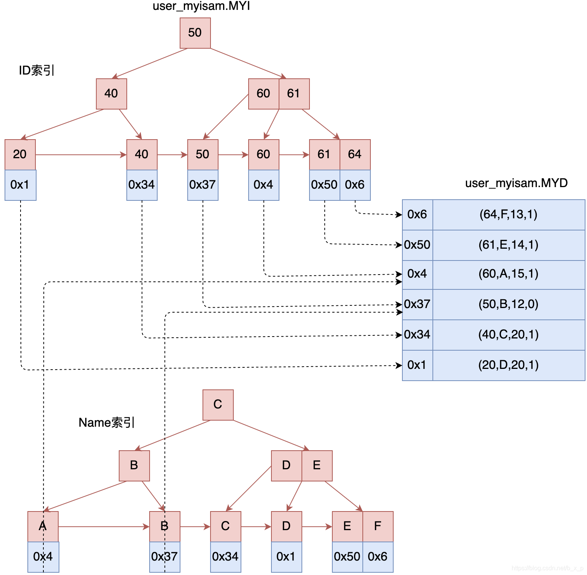 |
|    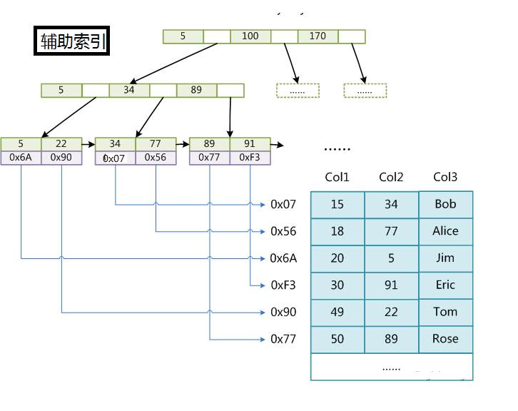     |
|       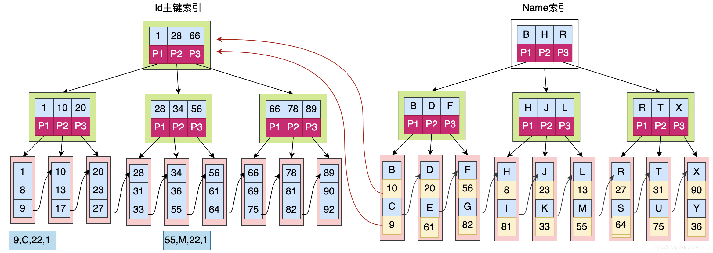        |


### 聚簇索引（clustered index）

InnoDB中，表数据文件本身就是按B+Tree组织的一个索引结构，聚簇索引就是按每张表的主键构造一棵B+树，同时叶子节点中存放的就是整张表的行记录数据，也将聚簇索引的叶子节点称为数据页，这个特性就决定了索引组织表中的数据也是索引的一部分。

==一句话来说：将索引和数据放在一起的，就称为聚簇索引==

我们日常的工作中，根据实际情况自行添加的索引，都是辅助索引或者称为普通索引，辅助索引就是为了查找主键索引的二级索引，先找到主键索引然后再通过主键索引找数据，但是可能会存在**回表**的问题。

#### 聚簇索引的优点

- 数据访问更快，因为聚簇索引将索引和数据保存在一个B+树中，因此从聚簇索引中获取数据比非聚簇索引更快
- 聚簇索引对主键的排序和范围查找速度非常快

#### 聚簇索引的缺点

- 插入速度严重依赖于排序，按照主键的顺序插入是最快的方式，否者会出现页分裂，严重影响性能。因此，对于InnoDB表，我们一般都会定义一个自增的ID列作为主键
- 更新主键的代价很高，因为将会导致被更新的行移动，因此，对于InnoDB表，我们一般定义主键不可更新
- 二级索引访问需要两次索引查找，第一次找到主键值，第二次根据主键值查找行数据，一般我们需要尽量避免出现索引的二次查找，这个时候，用到的就是**索引覆盖**

### 非聚簇索引（secondary index）

非聚簇索引也被称为辅助索引或普通索引，辅助索引在我们访问数据的时候总是需要两次查找。辅助索引叶子节点存储的不再是行的物理位置，而是主键值。通过辅助索引首先找到主键值，然后在通过主键值找到数据行的数据页，在通过数据页中的Page Directory找到数据行。

InnoDB辅助索引的叶子节点并不包含行记录的全部数据，叶子节点除了包含键值外，还包含了行数据的聚簇索引建。辅助索引的存在不影响数据在聚簇索引中的组织，所以一张表可以有多个辅助索引。在InnoDB中有时也称为辅助索引为二级索引

|                                                              |
| :----------------------------------------------------------: |
| 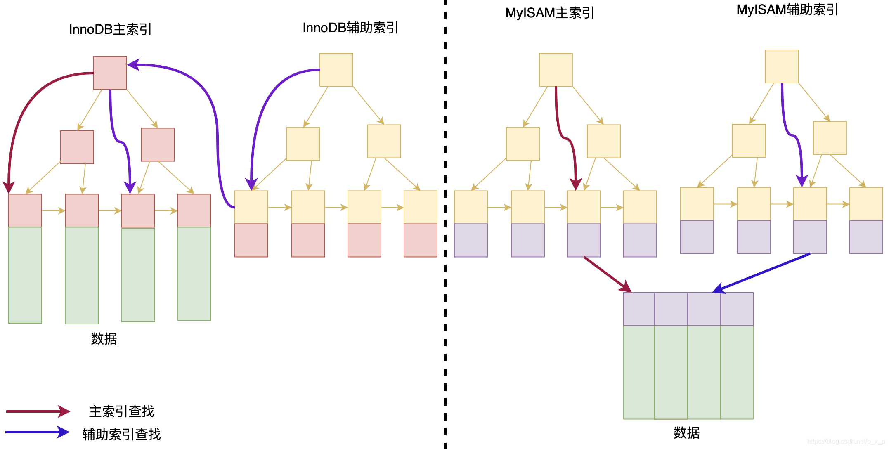 |


## 组合索引

|       组合索引结构       |
| :----------------------: |
| 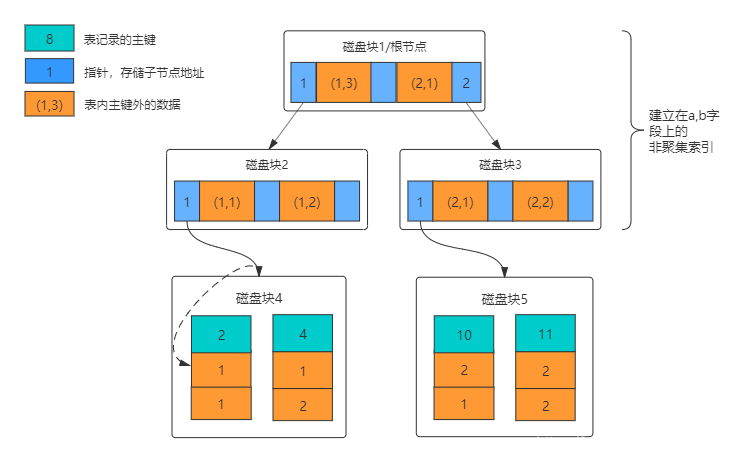 |

当包含多个列为索引，需要注意的是正确的顺序依赖于该索引的查询，同时需要考虑如何更好的满足排序和分组的需要


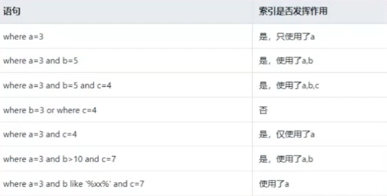

第4个不走索引，是因为不满足最左匹配原则

第5个，因为跨过了b，所以只走a的索引

## 优化细节

- 当使用索引列进行查询的时候，尽量不要使用表达式，把计算放到业务层而不是数据库层

  ```sql
  select actor_id from actor where actor_id = 4
  select actor_id from actor where actor_id+1 = 5
  ```

  第一条语句走索引

  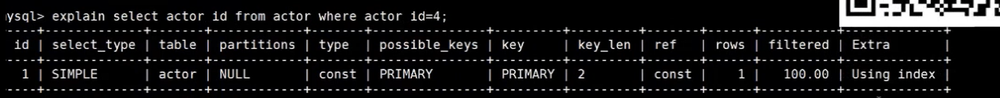

  而第二条语句没有走主键索引

  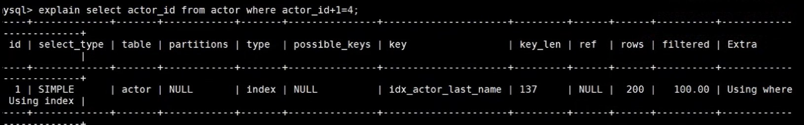

- 尽量使用主键查询，而不是其它索引，因为主键查询不会触发回表操作

- 使用前缀索引

有时候需要索引很长的字符串，这会让索引变得大且满，通常情况下可以使用某个列开始的部分字符串，这样大大的节约了索引空间，从而提高索引效率，但这会降低索引的选择性，索引的选择性是指不重复的索引值和数据表记录总数的比值，范围从1/#T 到 1 之间，索引的选择性越高，则查询效率越高，因为选择性更高的索引可以让mysql在查找的时候过滤掉更多的行。

一般情况下，某个列前缀的选择性也是足够高的，足以满足查询的性能，但是对应BLOG，TEXT，VARCHAR类型的列，必须要使用前缀索引，因为mysql不允许索引这些列的完整长度，使用该方法的诀窍在于选择足够长的前缀以保证较高的选择性，通过又不能太长 。

- 使用索引扫描来进行排序
- union、all、in、or都能使用索引，但是推荐使用in

```sql
explain select * from actor where actor_id = 1 union all select * from actor where actor_id = 2

explain select * from actor where actor_id in (1,2);

explain select * from actor where actor_id = 1 or actor_id = 2;

-- 关于or到底走不走索引，必须根据实际情况进行考虑
```

- 范围列可以使用到索引

例如 范围条件是：<、<=、>、>=、between

范围列可以用到索引，但是范围列后面的列无法用到索引，索引最多用于一个范围列，所以一般如果我们使用组合索引的时候，最好不要使用范围查找


如倒数第一个所示，因为中间b使用了范围查找，所以后面的c是无法使用索引的，只能是a和b才能使用索引

- 强制类型转换会让索引失效，进行全表查询

例如下面这样一个例子所示，我们对 phone字段进行了强制类型转换

```sql
explain select * from user where phone = 13800001234  -- 不会触发索引（触发了字符串到整型转换）
explain select * from user where phone = '13800001234'  -- 触发索引
```

- 更新十分频繁，数据区分度不高的字段上不宜建立索引

更新会变更B+树，更新 频繁的字段建立索引会大大降低数据库性能

类似于性别这列的区分度不高的字段，建立索引是没有意义的，不能有效的过滤数据

一般区分度在百分80以上的时候，就可以建立索引，区分度可以使用 count(distinct(列名)) / count(*) 来进行计算

- 创建索引的列，不允许为null，可能会得到不符合预期的结果
- 当需要进行表连接的时候，最好不要超过三张表，因为需要join的字段，数据类型必须一致（阿里规约）
  - 允许数据的冗余，从而加快查询的效率
  - 目前是范式和反范式的混合使用
- 能使用limit的时候，尽量使用limit
- 单表索引建议控制在5个以内
- 单索引字段不允许超过5个（组合索引）
- 创建索引的时候应该尽量避免以下错误的概念

索引不是越多越好，不要在不了解系统的情况下进行优化

## MySQL 中 MyISAM 中的查询为什么比 InnoDB 快？

1. **表锁设计**：MyISAM使用的是表级别的锁（table-level locking），而InnoDB使用的是行级别的锁（row-level locking）和MVCC（多版本并发控制）
2. **数据存储和索引结构**：MyISAM将数据和索引存储在两个独立的文件中，而InnoDB则将数据和索引存储在同一个表空间。这意味着MyISAM可以更快地读取索引，因为它不需要在数据和索引之间进行切换。
3. 查询的时候，如果走了索引，而索引又不是主键索引，此时，由于innodb是聚簇索引，会有一个回表的过程，即：先去非聚簇索引树（非主键索引树）中查询数据，找到数据对应的key之后，再通过key回表到聚簇索引树，最后找到需要的数据。而MyISAM是非聚集索引，而且叶子节点存储的是磁盘地址，所以，查询的时候查到的最后结果不是聚簇索引树的key，而是会直接去查询磁盘。

### 深度分页问题

- 子查询，利用聚簇索引减少回表

```mysql
select * from t where t.id >= (select id from t order by id limit #{offset}, 1) limit #{pageSize};
```

- left join查询，子查询的结果当成一张临时表，关联查询

```mysql
select * from t, (select id from t order by id limit #{offset},  #{pageSize}) t0 where to.id = t.id;
```

- 游标分页查询，将上一页的参数作为下一页的查询条件

```mysql
select * from t where t.id >= #{lastId} order by id limit #{pageSize};
```


## 参考

https://www.cnblogs.com/jiawen010/p/11805241.html

https://www.bilibili.com/video/BV1d5411p7MY?from=search&seid=6712050221639355647