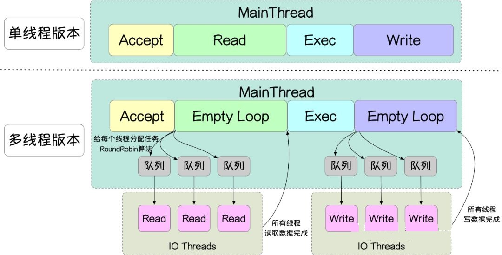

# Redis

## 数据类型

**字符串（Strings**

**列表（Lists）**：双向链表（LinkedList）、压缩表（ZipList）

**集合（Sets）**：整型集合、哈希表

**哈希（Hashes）**：哈希表、压缩表

**有序集合（Sorted sets）**：压缩表、跳跃表

**Bitmaps 和 HyperLogLogs**

**Streams**

**GEO**


## Pipeline（管道）

​		一次请求/响应服务器能实现处理新的请求即使旧的请求还未被响应。这样就可以将*多个命令*发送到服务器，而不用等待回复，最后在一个步骤中读取该答复。

​		大量 pipeline 应用场景可通过 Redis [脚本]（Redis 版本 >= 2.6）得到更高效的处理，后者在服务器端执行大量工作。脚本的一大优势是可通过最小的延迟读写数据，让读、计算、写等操作变得非常快（pipeline 在这种情况下不能使用，因为客户端在写命令前需要读命令返回的结果）。

应用程序有时可能在 pipeline 中发送 [EVAL] 或 [EVALSHA] 命令。

​		**重要说明**: 使用管道发送命令时，服务器将被迫回复一个队列答复，占用很多内存。所以，如果你需要发送大量的命令，最好是把他们按照合理数量分批次的处理，例如10K的命令，读回复，然后再发送另一个10k的命令，等等。这样速度几乎是相同的，但是在回复这10k命令队列需要非常大量的内存用来组织返回数据内容。


#### 使用Pipeline或者Lua脚本减少请求次数

(1) 批量操作的命令，如mget，mset等

(2) pipeline方式 

(3) Lua脚本


redis确实不是单线程的,更确切地说法是redis的核心业务线程只有一个,但是可以配置多个I/O线程，除此之外还有执行RDB序列化操作的时候也会开启线程


## 持久化配置

快照（RDB快照）和追加式文件（AOF文件），可以同时开启两种持久化方式，在这种情况下, 当redis重启的时候会优先载入AOF文件来恢复原始的数据，因为在通常情况下AOF文件保存的数据集要比RDB文件保存的数据集要完整。[RDB file]  [AOF tail]


### AOF（Append-Only File）

|                                  |
| :------------------------------: |
|  |

​		记录每次对服务器写的操作,当服务器重启的时候会重新执行这些命令来恢复原始的数据，AOF命令以redis协议追加保存每次写的操作到文件末尾，Redis还能对AOF文件进行后台重写，使得AOF文件的体积不至于过大.

> appendonly       yes

**设置Redis调用fsync的频率**
推荐使用每秒fsync一次的方式（默认的方式），因为它速度快，安全性也不错。相关同步策略配置如下：

```
appendfsync   always       # 每次有数据修改时都会写入AOF文件
appendfsync   everysec     # 每秒同步一次，默认策略
appendfsync   no           # 从不同步，高效但不会持久化
```

其它配置项：

```
appendfilename  appendonly.aof   # 指定更新日志文件名，默认为appendonly.aof
no-appendfsync-on-rewrite no   # 设置为yes表示rewrite期间对新写操作不fsync,暂时存在内存中,等rewrite完成后再写入。Linux默认fsync策略是30秒。可能丢失30秒数据
auto-aof-rewrite-percentage  100  # 增长到一定大小的时候Redis能够调用bgrewriteaof对日志文件进行重写。当前AOF文件大小是上次日志重写得
到AOF文件大小的二倍（设置为100）时，自动启动新的日志重写过程
auto-aof-rewrite-min-size  64mb  # 设置允许重写的最小aof文件大小，避免了达到约定百分比但尺寸仍然很小的情况还要重写
```

​		缺点：数据量很大的时候，比RDB的启动效率低。


### RDB文件（Redis  DataBase）

|                                  |
| :------------------------------: |
|  |


```
save 900 1			# 900秒（15分钟）内有1个更改
save 300 10			# 300秒（5分钟）内有10个更改
save 60 10000		# 60秒内有10000个更改
```

> 同步数据

​		在指定的时间间隔对数据进行快照存储。

​		非常适用于数据的备份、灾难恢复。

​		RDB在保存RDB文件时主进程唯一需要做的就是**fork出一个子进程**，接下来的写操作全部由子进程来做进行持久化，主进程不需要再做其他IO操作，所以RDB持久化方式可以最大化redis的性能。

缺点：

​		

1. RDB过程中Redis会停止对外服务吗？

2. 如果不会停止服务，如何处理新的请求？

   

### 混合持久化（4.x）

​		AOF重写时子进程将当前时间点的数据快照保存为RDB文件格式，而后将父进程积累命令保存为AOF格式。[RDB file] [AOF tail]

> aof-use-rdb-preamble   yes


​	加载Redis时，可以识别AOF文件是否以“redis”字符串开头，是，加载带前缀的RDB文件，之后继续加载AOF尾巴


原因：

内存存储，没有磁盘IO开销

单线程处理请求，避免线程切换和锁资源开销

非阻塞IO，多路复用IO

好的数据结构


## 过期删除策略

> 返回键的剩余生存时间：TTL <key> ：以秒的单位返回键 key 的剩余生存时间；PTTL <key> ：以毫秒的单位返回键 key 的剩余生存时间。

过期时间的判断：键 + 过期时间 -->  **过期字典**

- **惰性删除**（被动删除）

  放任过期键不管，在客户端访问这个key的时候，对key的过期时间进行检查，如果过期了就立即删除，不会给你返回任何东西。这样会导致很多过期key到了时间并没有被删除掉，除非你的系统去查一下那个 key，才会被Redis给删除掉

- **定期删除**（主动删除）

  Redis 会将每个设置了过期时间的 key 放入到一个独立的字典中，以后会定期遍历这个字典来删除到期的 key。

  Redis默认是每隔 100ms（**设置hz 10**）就**随机抽取**一些设置了过期时间的key，检查其是否过期，如果过期就删除。为什么要随机呢？你想一想假如 redis 存了几十万个 key ，每隔100ms就遍历所有的设置过期时间的 key 的话，就会给 CPU 带来很大的负载。而是采用了一种简单的贪心策略。

  ```
  # Not all tasks are performed with the same frequency, but Redis checks for
  # tasks to perform according to the specified "hz" value.
  #
  # By default "hz" is set to 10. Raising the value will use more CPU when
  # Redis is idle, but at the same time will make Redis more responsive when
  # there are many keys expiring at the same time, and timeouts may be
  # handled with more precision.
  #
  # The range is between 1 and 500, however a value over 100 is usually not
  # a good idea. Most users should use the default of 10 and raise this up to
  # 100 only in environments where very low latency is required.
  # 定期删除函数的运行频率
  hz 10
  
  # 设置最大内存，通常会设定其为物理内存的四分之三
  # maxmemory <bytes>
  ```

  

> 总结：定期删除是集中处理，惰性删除是零散处理。Redis采用惰性删除和定期删除这两种方式组合进行的

- 在RDB持久化模式中：可以使用*save*和*bgsave*命令进行数据持久化操作
- 在AOF持久化模式中：使用*rewriteaof*和*bgrewriteaof*命令进行持久化操作

非字符串的bigKey，不要使用del删除，删除的时候建议采用渐进式的方式来完成：hscan、ltrim、sscan、zscan。

> 如果你使用Redis 4.0+，一条异步删除unlink就解决
>


有了以上过期策略的说明后，就很容易理解为什么需要淘汰策略了，因为不管是定期采样删除还是惰性删除都不是一种完全精准的删除，就还是会存在key没有被删除掉的场景，所以就需要内存淘汰策略进行补充。


## 内存淘汰策略

当超过能够使用的最大内存（大于**maxmemory**）时，便会触发主动淘汰内存方式，，设置**maxmemory-policy**

LRU（Least Recently Used）：最近最少使用，其核心思想是“**如果数据最近被访问过，那么将来被访问的几率也更高**”。

LFU（Least Frequently Used）：最不经常使用，使用频率最少，其核心思想是“**如果数据过去被访问多次，那么将来被访问的频率也更高**”。

策略种类：

- **noeviction**：不淘汰任何数据，当内存不足时，拒绝所有写入操作，Redis 默认内存淘汰策略；

- **allkeys-lru**：淘汰整个键值中最久未使用的键值；

- **allkeys-random**：随机淘汰任意键值;

- **allkeys-lfu**：淘汰整个键值中最少使用使用频率最低的的键值。（4.0之后）

- **volatile-lru**：淘汰所有设置了过期时间的键值中最久未使用的键值；（默认）

- **volatile-random**：随机淘汰设置了过期时间的任意键值；

- **volatile-ttl**：从已设置过期时间的数据集中挑选将要过期的数据淘汰

- **volatile-lfu**：淘汰所有设置了过期时间的键值中，使用频率最低的键值；（4.0之后）


> 其中 allkeys-xxx 表示从所有的键值中淘汰数据，而 volatile-xxx 表示从设置了过期键的键值中淘汰数据。
> 过期键值：贪心策略

建议：内存淘汰策略设置为volatile-lru

```
############################## MEMORY MANAGEMENT ################################

# Set a memory usage limit to the specified amount of bytes.
# When the memory limit is reached Redis will try to remove keys
# according to the eviction policy selected (see maxmemory-policy).
#
# If Redis can't remove keys according to the policy, or if the policy is
# set to 'noeviction', Redis will start to reply with errors to commands
# that would use more memory, like SET, LPUSH, and so on, and will continue
# to reply to read-only commands like GET.
#
# This option is usually useful when using Redis as an LRU or LFU cache, or to
# set a hard memory limit for an instance (using the 'noeviction' policy).
#
# WARNING: If you have replicas attached to an instance with maxmemory on,
# the size of the output buffers needed to feed the replicas are subtracted
# from the used memory count, so that network problems / resyncs will
# not trigger a loop where keys are evicted, and in turn the output
# buffer of replicas is full with DELs of keys evicted triggering the deletion
# of more keys, and so forth until the database is completely emptied.
#
# In short... if you have replicas attached it is suggested that you set a lower
# limit for maxmemory so that there is some free RAM on the system for replica
# output buffers (but this is not needed if the policy is 'noeviction').
#
# maxmemory <bytes>

# MAXMEMORY POLICY: how Redis will select what to remove when maxmemory
# is reached. You can select one from the following behaviors:
#
# volatile-lru -> Evict using approximated LRU, only keys with an expire set.
# allkeys-lru -> Evict any key using approximated LRU.
# volatile-lfu -> Evict using approximated LFU, only keys with an expire set.
# allkeys-lfu -> Evict any key using approximated LFU.
# volatile-random -> Remove a random key having an expire set.
# allkeys-random -> Remove a random key, any key.
# volatile-ttl -> Remove the key with the nearest expire time (minor TTL)
# noeviction -> Don't evict anything, just return an error on write operations.
#
# LRU means Least Recently Used
# LFU means Least Frequently Used
#
# Both LRU, LFU and volatile-ttl are implemented using approximated
# randomized algorithms.
#
# Note: with any of the above policies, Redis will return an error on write
#       operations, when there are no suitable keys for eviction.
#
#       At the date of writing these commands are: set setnx setex append
#       incr decr rpush lpush rpushx lpushx linsert lset rpoplpush sadd
#       sinter sinterstore sunion sunionstore sdiff sdiffstore zadd zincrby
#       zunionstore zinterstore hset hsetnx hmset hincrby incrby decrby
#       getset mset msetnx exec sort
# Redis默认内存淘汰策略
# The default is:
# maxmemory-policy noeviction

# LRU, LFU and minimal TTL algorithms are not precise algorithms but approximated
# algorithms (in order to save memory), so you can tune it for speed or
# accuracy. For default Redis will check five keys and pick the one that was
# used less recently, you can change the sample size using the following
# configuration directive.
#
# The default of 5 produces good enough results. 10 Approximates very closely
# true LRU but costs more CPU. 3 is faster but not very accurate.
#
# maxmemory-samples 5

# Starting from Redis 5, by default a replica will ignore its maxmemory setting
# (unless it is promoted to master after a failover or manually). It means
# that the eviction of keys will be just handled by the master, sending the
# DEL commands to the replica as keys evict in the master side.
#
# This behavior ensures that masters and replicas stay consistent, and is usually
# what you want, however if your replica is writable, or you want the replica
# to have a different memory setting, and you are sure all the writes performed
# to the replica are idempotent, then you may change this default (but be sure
# to understand what you are doing).
#
# Note that since the replica by default does not evict, it may end using more
# memory than the one set via maxmemory (there are certain buffers that may
# be larger on the replica, or data structures may sometimes take more memory
# and so forth). So make sure you monitor your replicas and make sure they
# have enough memory to never hit a real out-of-memory condition before the
# master hits the configured maxmemory setting.
#
# replica-ignore-maxmemory yes

# Redis reclaims expired keys in two ways: upon access when those keys are
# found to be expired, and also in background, in what is called the
# "active expire key". The key space is slowly and interactively scanned
# looking for expired keys to reclaim, so that it is possible to free memory
# of keys that are expired and will never be accessed again in a short time.
#
# The default effort of the expire cycle will try to avoid having more than
# ten percent of expired keys still in memory, and will try to avoid consuming
# more than 25% of total memory and to add latency to the system. However
# it is possible to increase the expire "effort" that is normally set to
# "1", to a greater value, up to the value "10". At its maximum value the
# system will use more CPU, longer cycles (and technically may introduce
# more latency), and will tollerate less already expired keys still present
# in the system. It's a tradeoff betweeen memory, CPU and latecy.
#
# active-expire-effort 1
```


## 事务

事务实现基于COMMANDS队列，不支持rollback。只保证一致性和隔离性，不满足原子性和持久性。

watch机制（乐观锁）监控key发生变化

- MULTI：标记事务的开始；
- EXEC：执行事务的commands队列；
- DISCARD：结束事务，并清除commands队列；


## 删除bigKey

### 4.0+版本

```
一条异步删除unlink
```


### 编程式

#### list

```java
public void delKeyList(String key) {
    Long len = jedis.llen(key);
    int counter = 0;
    int left = 100;
    while (counter < len) {
        // 左侧截取left个 就是说，让列表只保留指定区间内的元素，不在指定区间之内的元素都将被删除。
        jedis.ltrim(key, left, len);
        counter += left;
    }
    //最终删除key
    jedis.del(key);
}
```


#### set

```java
public void delKeySet(String key) {
    String cursor = START_CURSOR;
    do {
        ScanResult<String> scanResult = jedis.sscan(key, cursor, new ScanParams().count(100));
        // 获取扫描结果
        List<String> result = scanResult.getResult();
        if (result != null && !result.isEmpty()) {
            // set remove 移除集合中一个或多个成员
            jedis.srem(key, result.toArray(new String[result.size()]));
        }
        // 获取游标
        cursor = scanResult.getCursor();
    } while (!START_CURSOR.equals(cursor));

    //最终删除key
    jedis.del(key);
}
```


#### zset

```java
public void delKeyZSet(String key) {
    String cursor = START_CURSOR;
    ScanParams scanParams = new ScanParams().count(100);
    do {
        ScanResult<Tuple> scanResult = jedis.zscan(key, cursor, scanParams);
        // 获取扫描结果
        List<Tuple> result = scanResult.getResult();
        if (result != null && !result.isEmpty()) {
            // zst remove 移除集合中一个或多个成员
            jedis.zrem(key, result.stream().map(Tuple::getElement).toArray(String[]::new));
        }
        // 获取游标
        cursor = scanResult.getCursor();
    } while (!START_CURSOR.equals(cursor));
    jedis.del(key);
}
```


#### hash

```java
public void delKeyHash(String key) {
    String cursor = START_CURSOR;
    ScanParams scanParams = new ScanParams().count(100);
    do {
        ScanResult<Map.Entry<String, String>> scanResult = jedis.hscan(key, cursor, scanParams);
        List<Map.Entry<String, String>> result = scanResult.getResult();
        if (result != null && !result.isEmpty()) {
            jedis.hdel(key, result.stream().map(Map.Entry::getKey).toArray(String[]::new));
        }
        cursor = scanResult.getCursor();
    } while (!START_CURSOR.equals(cursor));
    jedis.del(key);
}
```


## 批命令

原生和Pipeline


Pipeline 多个命令一起执行，无法保证原子性

multi 事务执行

参考文章：https://mp.weixin.qq.com/s?spm=a2c4e.10696291.0.0.54b019a4fgyMeh&__biz=Mzg2NTEyNzE0OA==&mid=2247483677&idx=1&sn=5c320b46f0e06ce9369a29909d62b401&chksm=ce5f9e9ef928178834021b6f9b939550ac400abae5c31e1933bafca2f16b23d028cc51813aec&scene=21#wechat_redirect

https://yq.aliyun.com/articles/531067

关于Redis单线程问题：Redis在处理客户端的请求时，包括获取 (socket 读)、解析、执行、内容返回 (socket 写) 等都由一个顺序串行的主线程处理，这就是所谓的“单线程”。但如果严格来讲从Redis4.0之后并不是单线程，除了主线程外，它也有后台线程在处理一些较为缓慢的操作，例如清理脏数据、无用连接的释放、大key的删除等等。


## 线程模型

1. Redis 基于 Reactor 模式开发了网络事件处理器： 这个处理器被称为文件事件处理器（file event handler）
2. 文件事件处理器使用 I/O 多路复用（multiplexing）程序来同时监听多个套接字， 并根据套接字目前执行的任务来为套接字关联不同的事件处理器。
3. 当被监听的套接字准备好执行连接应答（accept）、读取（read）、写入（write）、关闭（close）等操作时， 与操作相对应的文件事件就会产生， 这时文件事件处理器就会调用套接字之前关联好的事件处理器来处理这些事件。
4. 文件事件处理器以单线程方式运行， 但通过使用 I/O 多路复用程序来监听多个套接字， 文件事件处理器既实现了高性能的网络通信模型， 又可以很好地与 redis 服务器中其他同样以单线程方式运行的模块进行对接， 这保持了 Redis 内部单线程设计的简单性。

|                                                              |
| :----------------------------------------------------------: |
|  |


## Redis5.x

​		**单线程Worker实现**

​		Redis基于Reactor设计模式开发了网络事件处理器，这个处理器被称为**文件事件处理器**。它的组成结构为4部分：多个套接字、IO多路复用程序、文件事件分派器、事件处理器。因为**文件事件分派器队列的消费是单线程的，所以Redis才叫单线程模型**。

|                                                              |
| ------------------------------------------------------------ |
|  |


## Redis6.x

默认没有开启多线程，在conf文件进行配置

```
io-threads-do-reads  yes
io-threads   4
```

> 官方建议：4 核的机器建议设置为 2 或 3 个线程，8 核的建议设置为 6 个线程，线程数一定要小于机器核数，尽量不超过8个。

多线程实现机制：

|                               |
| :---------------------------: |
|  |

主要流程：

- 主线程负责接收建立连接请求，获取 Socket 放入全局等待读处理队列。
- 主线程处理完读事件之后，通过 RR（Round Robin）将这些连接分配给这些 IO 线程。
- 主线程阻塞等待 IO 线程读取 Socket 完毕。
- 主线程通过单线程的方式执行请求命令，请求数据读取并解析完成，但并不执行。
- 主线程阻塞等待 IO 线程将数据回写 Socket 完毕。
- 解除绑定，清空等待队列。


> 开启多线程后，是否会存在线程并发安全问题？
>
> 不会，Redis 的多线程部分只是用来处理网络数据的读写和协议解析，执行命令仍然是单线程顺序执行。


- IO 线程要么同时在读 Socket，要么同时在写，不会同时读或写。
- IO 线程只负责读写 Socket 解析命令，不负责命令处理。


## 应用场景

活跃用户、用户统计

秒杀、抢购、排行榜、评论列表

推荐系统、抽奖、商品详情


排序实现：

跳表

## 缓存问题隐患

### 多线程

- 线程模型：

Reactor模式，非阻塞IO多路复用机制


### 缓存穿透

​		正常情况下，查询的数据都存在，如果请求一个不存在的数据，也就是缓存和数据库都查不到这个数据，每次都会去数据库查询，这种**查询不存在数据的现象**我们称为缓存穿透（透心凉）

​		**缓存中无，DB中也无**

解决办法：

- 缓存空值

- BloomFilter布隆过滤器


### 缓存击穿

​		在高并发的情况下，大量的请求同时查询同一个key时，此时这个key正好失效了，就会导致同一时间，这些请求都会去查询数据库，这样的现象我们称为缓存击穿

​		**缓存中无，但是DB中有**

​		会造成某一时刻数据库请求量过大

解决办法：

- 热点数据不过期
- 互斥锁，在第一个查询数据的请求上使用一个锁，其他的线程走到这一步拿不到锁就等着，等第一个线程查询到了数据，然后做缓存。后面的线程进来发现已经有缓存了，就直接走缓存。


### 缓存雪崩

​		缓存雪崩的情况是说，当某一时刻发生大规模的缓存失效的情况，比如你的缓存服务宕机了，会有大量的请求进来直接打到DB上面。结果就是DB挂了

解决方案：

- 缓存时间设置随机
- 缓存预热
- 互斥锁
- ehcache本地缓存 + 限流&降级组件


### 热点数据集中失效

对于一些热点的数据来说，当缓存失效以后会存在大量的请求过来，然后打到数据库去，从而可能导致数据库崩溃的情况。

设置不同的失效时间（在一个基础的时间上加上或者减去一个范围内的随机值）

互斥锁


### 热点key倾斜


### 热点key重建


### 缓存数据库双写不一致

- 延迟双删

- 内存队列
- 读写锁（分布式）


### 查询响应慢

#### 客户端

1. 连接池过小引起的阻塞

   如果连接池配置了较小连接数，不能满足业务高QPS的需求的话，可能导致经常无法获取到空闲连接，此时如果blockWhenExhausted=true的话，就会在获取连接时阻塞等待，表现在业务接口中，就是接口耗时增加。也可能会无法获取到连接，在客户端抛出无法获取连接的异常。

2. 连接池伸缩引起的性能损耗

   创建连接是个较耗时的操作，如果连接池配置maxTotal > maxIdle，可能会在请求量大时经常创建新的连接。频繁的创建、销毁连接，会带来性能损耗。

#### 服务端

1. 慢查询

   在慢查询日志中，可以查看到处理时间超过slowlog-log-slower-than（可配置）微秒的命令

2. 大量的key同时过期引起的阻塞

   打散过期时间

3. AOF rewrite引起的阻塞

   AOF重写需要fork子进程


### 连接池设置建议

| 参数名                        | 资源池中最大连接数                                           | 默认值           | 使用建议                                                     |
| ----------------------------- | ------------------------------------------------------------ | ---------------- | ------------------------------------------------------------ |
| maxTotal(maxActive）          | 资源池中最大连接数                                           | 8                | 建议根据需要设置( qps/主节点数/ (1000/每条命令的预计耗时ms)*(3/2))与maxIdle、minIdle相同，且不超过业务线程数量 |
| maxIdle                       | 资源池允许最大空闲的连接数                                   | 8                | 同上                                                         |
| minIdle                       | 资源池允许最小空闲的连接数                                   | 8                | 同上                                                         |
| blockWhenExhausted            | 资源池资源耗尽时，是否等待                                   | true             |                                                              |
| maxWaitMillis(maxWait)        | 当资源池连接用尽后，调用者的最大等待时间(单位为毫秒)         | -1：表示永不超时 | 根据需要确认最大等待时间                                     |
| jmxEnable                     | 是否开启JMX                                                  | true             | true                                                         |
| testOnBorrow                  | 向资源池借用连接时是否做连接有效性检测(ping)，无效连接会被移除 | false            | false                                                        |
| testOnReturn                  | 向资源池归还连接时是否做连接有效性检测(ping)，无效连接会被移除 | false            | false                                                        |
| testWhileIdle                 | 是否开启空闲资源监测                                         | false            | true                                                         |
| timeBetweenEvictionRunsMillis | 空闲资源的检测周期(单位为毫秒)                               | -1:不检测        | 建议设置，可以使用JedisPoolConfig中的配置                    |
| minEvictableIdleTimeMillis    | 资源池中资源最小空闲时间(单位为毫秒)，达到此值后空闲资源将被移除 | 30分钟           | 大部分情况下默认值即可，也可以参考JedisPoolConfig的配置      |
| numTestsPerEvictionRun        | 做空闲资源检测时，每次的采样数                               | 3                | 可根据自身应用连接数进行微调,如果设置为-1，就是对所有连接做空闲监测 |

1. 缩短键值对的存储长度；**序列化我们可以使用 protostuff 或 kryo，压缩我们可以使用 snappy。**

2. 使用 lazy free（延迟删除）特性；

   4.0版本

   ```
   lazyfree-lazy-eviction no
   lazyfree-lazy-expire no
   lazyfree-lazy-server-del no
   slave-lazy-flush no
   ```

   

3. 设置键值的过期时间；

4. 禁用长耗时的查询命令；

5. 使用 slowlog 优化耗时命令；

   ```
   slowlog-log-slower-than ：用于设置慢查询的评定时间，也就是说超过此配置项的命令，将会被当成慢操作记录在慢查询日志中，它执行单位是微秒 (1 秒等于 1000000 微秒)；
   slowlog-max-len ：用来配置慢查询日志的最大记录数。
   ```

6. 使用 Pipeline 批量操作数据；

7. 避免大量数据同时失效；**过期时间的基础上添加一个指定范围的随机数**

8. 客户端使用优化；**Pipeline和连接池**

9. 限制 Redis 内存大小；

10. 使用物理机而非虚拟机安装 Redis 服务；

11. 检查数据持久化策略；
    - RDB 快照         内存快照
    - AOF 文件追加  文件形式
    - 混合 在写入的时候，先把当前的数据以 RDB 的形式写入文件的开头，再将后续的操作命令以 AOF 的格式存入文件，这样既能保证 Redis 重启时的速度，又能减低数据丢失的风险。

```
aof-use-rdb-preamble  4.0版本提供
```

12. 禁用 THP 特性；

13. 使用分布式架构来增加读写速度。