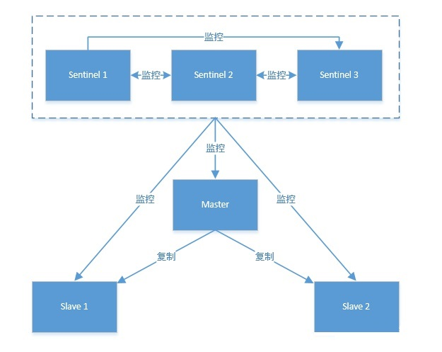

# Redis安装

```
tar -zxvf redis-5.0.9.tar.gz
cd redis-5.0.9
make

cd src
./redis-server ../redis.conf
```


## Redis哨兵（Sentinel）模式




哨兵作用：

1. 通过发送命令，让Redis服务器返回监控其运行状态，包括主服务器和从服务器。
2. 当哨兵监测到master宕机，会自动将slave切换成master，然后通过**发布订阅模式**通知其他的从服务器，修改配置文件，让它们切换主机
3. 各个哨兵之间还会进行监控，这样就形成了多哨兵模式。

用文字描述一下**故障切换（failover）**的过程。假设主服务器宕机，哨兵1先检测到这个结果，系统并不会马上进行failover过程，仅仅是哨兵1主观的认为主服务器不可用，这个现象成为**主观下线**。当后面的哨兵也检测到主服务器不可用，并且数量达到一定值时，那么哨兵之间就会进行一次投票，投票的结果由一个哨兵发起，进行failover操作。切换成功后，就会通过发布订阅模式，让各个哨兵把自己监控的从服务器实现切换主机，这个过程称为**客观下线**。


```bash
# 使得Redis服务器可以跨网络访问
bind 0.0.0.0
# 设置密码
requirepass "123456"
# 指定主服务器，注意：有关slaveof的配置只是配置从服务器，主服务器不需要配置
slaveof 192.168.11.128 6379
# 主服务器密码，注意：有关slaveof的配置只是配置从服务器，主服务器不需要配置
masterauth 123456
```

sentinel.conf

```css
# 禁止保护模式
protected-mode no
# 配置监听的主服务器，这里sentinel monitor代表监控，mymaster代表服务器的名称，可以自定义，192.168.11.128代表监控的主服务器，6379代表端口，2代表只有两个或两个以上的哨兵认为主服务器不可用的时候，才会进行failover操作。
sentinel monitor mymaster 192.168.11.128 6379 2
# sentinel author-pass定义服务的密码，mymaster是服务名称，123456是Redis服务器密码
# sentinel auth-pass <master-name> <password>
sentinel auth-pass mymaster 123456
```


配置项 参数类型 作用   port 整数 启动哨兵进程端口  dir 文件夹目录 哨兵进程服务临时文件夹，默认为/tmp，要保证有可写入的权限  sentinel down-after-milliseconds <服务名称><毫秒数（整数）> 指定哨兵在监控Redis服务时，当Redis服务在一个默认毫秒数内都无法回答时，单个哨兵认为的主观下线时间，默认为30000（30秒）  sentinel parallel-syncs <服务名称><服务器数（整数）> 指定可以有多少个Redis服务同步新的主机，一般而言，这个数字越小同步时间越长，而越大，则对网络资源要求越高  sentinel failover-timeout <服务名称><毫秒数（整数）> 指定故障切换允许的毫秒数，超过这个时间，就认为故障切换失败，默认为3分钟  sentinel notification-script <服务名称><脚本路径> 指定sentinel检测到该监控的redis实例指向的实例异常时，调用的报警脚本。该配置项可选，比较常用


sentinel down-after-milliseconds配置项只是一个哨兵在超过规定时间依旧没有得到响应后，会自己认为主机不可用。对于其他哨兵而言，并不是这样认为。哨兵会记录这个消息，当拥有认为主观下线的哨兵达到sentinel monitor所配置的数量时，就会发起一次投票，进行failover，此时哨兵会重写Redis的哨兵配置文件，以适应新场景的需要。


https://www.cnblogs.com/kevingrace/p/9004460.html

## Redis集群（Cluster）模式

数据分片：没有使用一致性hash，而是**哈希槽**。

集群有16384（2^14）个哈希槽，每个节点负责一部分hash槽，例如：

- 节点 A 包含 0 到 5500号哈希槽.

- 节点 B 包含5501 到 11000 号哈希槽.

- 节点 C 包含11001 到 16384号哈希槽.

  

Redis不能保证数据的强一致性，可能丢失写操作。

1. 异步复制过程，写操作步骤：

- 客户端向主节点B写入一条命令.
- 主节点B向客户端回复命令状态.
- 主节点将写操作复制给它的从节点 B1, B2 和 B3.

2. 网络分区


### 集群搭建

redis5.0版本之后，直接使用`redis-cli`创建集群，不使用`redis-trib.rb`命令

`redis-5.0.9/utils/create-cluster/create-cluster`脚本搭建工具

```shell
echo “Usage: $0 [start|create|stop|watch|tail|clean]”
echo “start – Launch Redis Cluster instances.”                     创建redis集群实例
echo “create – Create a cluster using redis-cli --cluster create.” 搭建redis集群
echo “stop – Stop Redis Cluster instances.” 停止redis集群实例
echo “watch – Show CLUSTER NODES output (first 30 lines) of first node.”
echo “tail – Run tail -f of instance at base port + ID.”
echo “clean – Remove all instances data, logs, configs.”   删除生成的日志，配置，数据文件
echo “clean-logs – Remove just instances logs.”            只删除日志
```


添加hostsname

192.168.107.128      redis-128
192.168.107.129      redis-129
192.168.107.130      redis-130


redis.conf

```
bind 192.168.107.128
port 6379
## cluster集群模式
cluster-enabled yes
## 集群配置名
cluster-config-file nodes_6379.conf
cluster-node-timeout 15000
# 启动AOF增量持久化策略
appendonly yes
daemonize yes
# 关闭，此时外部网络可以直接访问；开启，需配置bind ip或者设置访问密码
protected-mode no
pidfile "/var/run/redis_6379.pid"
logfile "/data/redis-5/cluster/redis_6379.log"
dir "/data/redis-5/cluster/redis_6379"
# 如果master redis配置了密码，还要添加如下内容：
masterauth 123456
requirepass 123456
# 发生改变，则记录日志
appendfsync always
```


```
85498:M 20 Oct 2020 21:28:32.958 * Increased maximum number of open files to 10032 (it was originally set to 1024).
85498:M 20 Oct 2020 21:28:32.970 # Could not create server TCP listening socket redis-128:16379: bind: Address already in use
```

原因：设置的端口号16379，只能到10032


启动：分别按照配置文件启动各服务器上的Redis服务

```
/opt/redis-5.0.9/src/redis-server /data/redis-5/conf/redis-6379.conf
```


Can't chdir to '/data/redis-5/cluster/redis_6380': No such file or directory

手动创建目录吧


Could not create server TCP listening socket 192.168.107.128:16379: bind: Address already in use


查看redis服务

```
ps -ef | grep redis 
```


创建集群：

```
/opt/redis-5.0.9/src/redis-cli --cluster create  192.168.107.128:6379 192.168.107.128:6380 192.168.107.129:6379 192.168.107.129:6380 192.168.107.130:6379 192.168.107.130:6380 --cluster-replicas 1
```

> –replicas 1： 表示为集群中的每个主节点创建一个从节点


错误：

[ERR] Node 192.168.107.128:6379 NOAUTH Authentication required.

```
/opt/redis-5.0.9/src/redis-cli --cluster create  192.168.107.128:6379 192.168.107.129:6379  192.168.107.130:6379 192.168.107.128:6380 192.168.107.129:6380 192.168.107.130:6380 --cluster-replicas 1 -a 123456
```


错误：

[ERR] Node 192.168.107.128:6380 is not empty. Either the node already knows other nodes (check with CLUSTER NODES) or contains some key in database 0.

这是由于上次redis集群没有配置成功，生成了每个节点的配置文件和db的备份文件，所以才会产生这个错误。删除192.168.107.128:6380对应的nodes*.conf文件

```
>>> Nodes configuration updated
>>> Assign a different config epoch to each node
>>> Sending CLUSTER MEET messages to join the cluster
Waiting for the cluster to join
..............................................................................................................................................................................................................................................
```

redis集群不仅需要开通redis客户端连接的端口，而且需要开通集群总线端口

集群总线端口为redis客户端连接的端口 + 10000


制作cluster启动脚本:

```
vi cluster_start.sh
./redis-server cluster/redis-6379.conf
./redis-server cluster/redis-6380.conf

# 脚本生效
chmod +x cluster_shutdown.sh
```

制作cluster关闭脚本:

```
vi cluster_shutdown.sh
pgrep redis-server | xargs -exec kill -9

# 脚本生效
chmod +x cluster_shutdown.sh
```


```
>>> Nodes configuration updated
>>> Assign a different config epoch to each node
>>> Sending CLUSTER MEET messages to join the cluster
Waiting for the cluster to join
...
>>> Performing Cluster Check (using node 192.168.107.128:6379)
M: b34a66f9557bc79551720c24de059e71704367e2 192.168.107.128:6379
   slots:[0-5460] (5461 slots) master
   1 additional replica(s)
S: de9b5886e4ece58900e111145de40a40067cef01 192.168.107.129:6380
   slots: (0 slots) slave
   replicates b34a66f9557bc79551720c24de059e71704367e2
S: 5b4fc6b488e131373fb1dfef623c10b767d7c006 192.168.107.130:6380
   slots: (0 slots) slave
   replicates 90e6c9a6be2d917f8e308e5f87630f5d66c12ff7
S: cfa8d4bce963c0c994fcacbe4e5a7e9621c5d687 192.168.107.128:6380
   slots: (0 slots) slave
   replicates 71dfb6218a9de7d34b9cf5f6e498ad3d93798e9d
M: 71dfb6218a9de7d34b9cf5f6e498ad3d93798e9d 192.168.107.130:6379
   slots:[10923-16383] (5461 slots) master
   1 additional replica(s)
M: 90e6c9a6be2d917f8e308e5f87630f5d66c12ff7 192.168.107.129:6379
   slots:[5461-10922] (5462 slots) master
   1 additional replica(s)
[OK] All nodes agree about slots configuration.
>>> Check for open slots...
>>> Check slots coverage...
[OK] All 16384 slots covered.
```

集群完成！！！


## **Codis**

https://www.jianshu.com/p/1ecbd1a88924


https://www.redis.com.cn/topics/sentinel

http://www.redis.cn/documentation.html（中文文档）

https://www.cnblogs.com/yfacesclub/p/11847361.html

https://my.oschina.net/u/4342750/blog/4653747