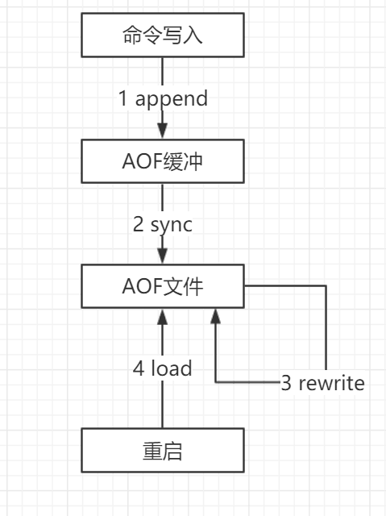
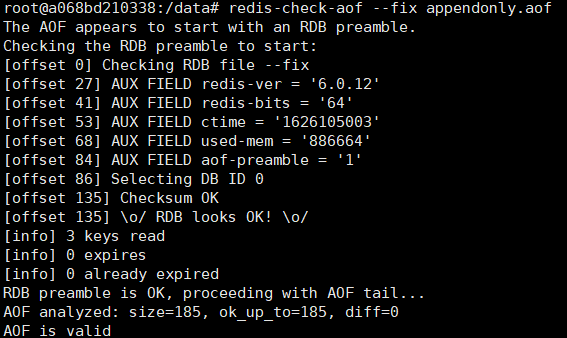
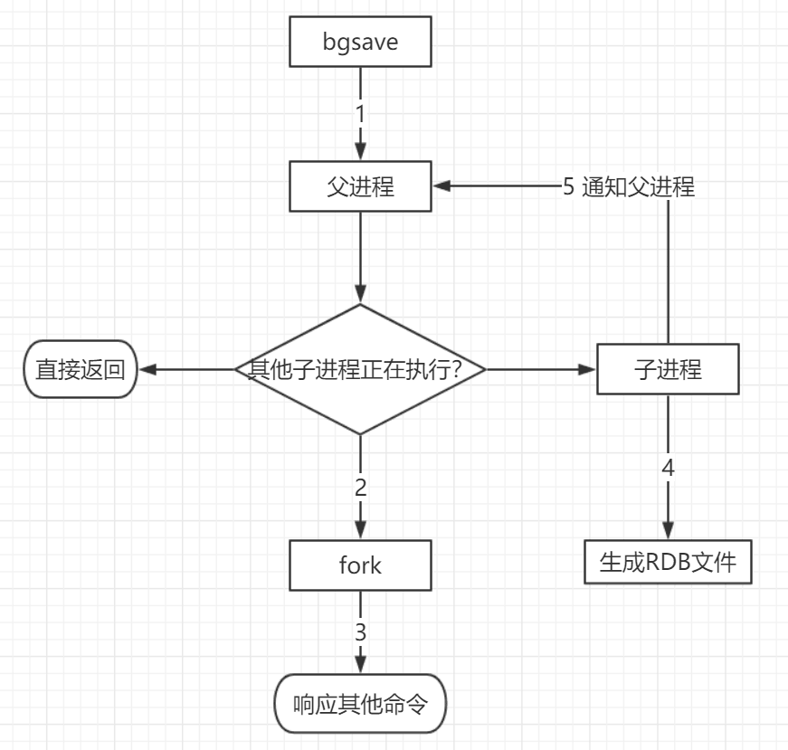

# Redis

## 数据类型

- **字符串（String）**：最大不能超过512MB

  i. int 长整型
  ii. embstr 短字符(<=39字节)
  iii. raw 长字符(>39)

- **列表（List）**

  压缩表（ZipList）：当列表的元素个数小于list-max-ziplist-entries配置（默认512个），同时列表中每个元素的值都小于list-max-ziplist-value配置时（默认64字节），Redis会选用ziplist来作为列表的内部实现来减少内存的使用。

  双向链表（LinkedList）：当列表类型无法满足ziplist的条件时，Redis会使用LinkedList作为列表的内部实现。

- **哈希（Hash）**

  压缩表：当field个数不超过hash-max-ziplist-entries（默认为512个）时，并且没有大value（64个字节以上算大）

  哈希表：ziplist的两个条件只要有一个不符合就会转换为hashtable

- **集合（Set）**

  整型集合：当集合中的元素都是整数且元素个数小于set-max-intset-entries配置（默认512个）时，Redis会选用intset来作为集合的内部实现，从而减少内存的使用。

  哈希表：当集合类型无法满足intset的条件时，Redis会使用hashtable作为集合的内部实现。

  i. 给用户添加标签（共同好友，共同兴趣）

  ii.抽奖：生成随机数,集合不能存放相同的元素,因此随机pop出一个元素,可以作为中奖的号码
  
- **有序集合（Sorted Set）**

  压缩表：当有序集合的元素个数小于zset-max-ziplist-entries配置（默认128个），同时每个元素的值都小于zset-max-ziplist-value配置（默认64字节）时，Redis会用ziplist来作为有序集合的内部实现，ziplist可以有效减少内存的使用。

  跳跃表：当ziplist条件不满足时，有序集合会使用skiplist作为内部实现，因为此时ziplist的读写效率会下降。

  i. 用户点赞数排行
  ii. 排行榜
  iii. 展示用户信息及用户分数

- **Bitmaps **：位图

  > 位存储

  统计用户信息，活跃数，打卡，只要2个状态的都可以使用Bitmaps.

  - SETBIT key offset value：指定偏移量原来储存的位
  - GETBIT key offset ：字符串值指定偏移量上的位(bit)
  - BITCOUNT  key [start] [end]：被设置为 `1` 的位的数量
  - BITPOS  key bit [start] [end]：整数回复
  - BITOP operation destkey key [key …]：保存到 `destkey` 的字符串的长度，和输入 `key` 中最长的字符串长度相等。
  - BITFIELD

- **HyperLogLog**：基数统计

  > 基数：不重复的元素

  存在一定范围内的误差

  - PFADD  key  element  [element ...\]：添加指定元素到 HyperLogLog 中。

  - PFCOUNT  key  [key ...\]：返回给定 HyperLogLog 的基数估算值。

  - PFMERGE destkey  sourcekey  [sourcekey ...\]：将多个 HyperLogLog 合并为一个 HyperLogLog

- **Streams**

- **Geo经纬度**

  推理地理位置、两地之间的距离，底层使用的**Zset**

  - GEOADD：添加地理位置的坐标。
  - GEOPOS：获取地理位置的坐标。
  - GEODIST：计算两个位置之间的距离。
  - GEORADIUS：根据用户给定的经纬度坐标来获取指定范围内的地理位置集合。
  - GEORADIUSBYMEMBER：根据储存在位置集合里面的某个地点获取指定范围内的地理位置集合，中心点是由给定的位置元素决定的， 而不是使用经度和纬度来决定中心点。
  - GEOHASH：返回一个或多个位置对象的 geohash 值。

  i. （我附近的人）


## 持久化配置

快照（RDB快照）和追加式文件（AOF文件），可以同时开启两种持久化方式，在这种情况下, 当redis重启的时候会优先载入AOF文件来恢复原始的数据，因为在通常情况下AOF文件保存的数据集要比RDB文件保存的数据集要完整。[RDB file]  [AOF tail]


### AOF（Append-Only File）

|                                                             |
| :---------------------------------------------------------: |
|  |
|   |

​		以日志的形式记录每个对服务器写操作，只许追加文件不可修改文件，当服务器重启的时候会重新执行这些命令来恢复原始的数据，AOF命令以redis协议追加保存每次写的操作到文件末尾，Redis还能对AOF文件进行后台重写，使得AOF文件的体积不至于过大。**appendonly.aof**文本文件

> appendonly       yes      # 默认不开启

执行流程：

1）所有的写入命令会追加到aof_buf中。

2）AOF缓冲区根据对应的策略向硬盘做同步操作。

3）随着AOF文件越来越大，需要定期对AOF文件进行重写，达到压缩的目的。

4）当Redis服务器重启时，可以加载AOF文件进行数据恢复。

**设置Redis调用fsync的频率**
推荐使用每秒fsync一次的方式（默认的方式），因为它速度快，安全性也不错。相关同步策略配置如下：

```shell
appendfsync   always       # 每次有数据修改时都会写入AOF文件
appendfsync   everysec     # 每秒同步一次，默认策略
appendfsync   no           # 从不同步，高效但不会持久化
```

其它配置项：

```shell
# 指定更新日志文件名，默认为appendonly.aof
appendfilename  appendonly.aof
# 设置为yes表示rewrite期间对新写操作不fsync，暂时存在内存中，等rewrite完成后再写入。Linux默认fsync策略是30秒。可能丢失30秒数据
no-appendfsync-on-rewrite yes
# 增长到一定大小的时候Redis能够调用bgrewriteaof对日志文件进行重写。当前AOF文件大小是上次日志重写得到AOF文件大小的二倍（设置为100）时，自动启动新的日志重写过程
auto-aof-rewrite-percentage  100
# 设置允许重写的最小aof文件大小，避免了达到约定百分比但尺寸仍然很小的情况还要重写
auto-aof-rewrite-min-size  64mb
```

> 缺点：数据量很大的时候，比RDB的启动效率低。

如果**appendonly.aof**出现损坏，`redis-check-aof --fix appendonly.aof`



### RDB文件（Redis  DataBase）

|                                                           |
| :-------------------------------------------------------: |
|                           |
|  |


```shell
save 900 1			# 900秒（15分钟）内有1个更改
save 300 10			# 300秒（5分钟）内有10个更改
save 60 10000		# 60秒内有10000个更改

stop-writes-on-bgsave-error yes

# 快照，可以设置是否进行压缩存储，LZF算法进行压缩
rdbcompression yes

# 数据校验
rdbchecksum yes

# 快照的文件名
dbfilename dump.rdb

rdb-del-sync-files no

# 快照文件的存放路径
dir ./
```

> 同步数据，在指定的时间间隔对数据进行快照存储。非常适用于数据的备份、灾难恢复。

**dump.rdb**二进制文件

执行流程：

1）执行bgsave命令，Redis父进程判断当前是否存在正在执行的子进程，如RDB/AOF子进程，如果存在bgsave命令直接返回。

2）父进程执行fork操作创建子进程，fork操作过程中父进程会阻塞，通过info stats命令查看latest_fork_usec选项，可以获取最近一个fork操作的耗时，单位为微秒。

3）父进程fork完成后，bgsave命令返回“Background saving started”信息并不再阻塞父进程，可以继续响应其他命令。

4）子进程创建RDB文件，根据父进程内存生成临时快照文件，完成后对原有文件进行原子替换。执行lastsave命令可以获取最后一次生成RDB的时间，对应info统计的rdb_last_save_time选项。

5）进程发送信号给父进程表示完成，父进程更新统计信息。

​		RDB在保存RDB文件时主进程唯一需要做的就是单独**fork出一个子进程**，接下来的写操作全部由子进程来做进行持久化，会先将数据写入到一个临时文件中，待持久化过程都结束了，在用这个临时文件替换上次的持久化好的文件。主进程不需要再做其它IO操作，所以RDB持久化方式可以最大化redis的性能。

缺点：不能实时保存数据，最后一次持久化的数据可能会在宕机的时候出现丢失

​		

> 恢复rdb文件？将rdb文件放在redis启动目录即可，会自动检查dump.rdb恢复其中的数据

1. RDB过程中Redis会停止对外服务吗？

2. 如果不会停止服务，如何处理新的请求？

   
   
   启动时会先检查AOF文件是否存在，如果不存在就尝试加载RDB。
   
   那么为什么会优先加载AOF呢？因为AOF保存的数据更完整。
   
   

### 混合持久化（4.x）

​		AOF重写时子进程将当前时间点的数据快照保存为RDB文件格式，而后将父进程积累命令保存为AOF格式。**[RDB file] [AOF tail]**

> aof-use-rdb-preamble   yes

加载Redis时，可以识别AOF文件是否以“redis”字符串开头，是，加载带前缀的RDB文件，之后继续加载AOF尾巴。


- 在RDB持久化模式中：可以使用*save*和*bgsave*命令进行数据持久化操作
- 在AOF持久化模式中：使用*rewriteaof*和*bgrewriteaof*命令进行持久化操作


原因：

内存存储，没有磁盘IO开销

单线程处理请求，避免线程切换和锁资源开销

非阻塞IO，多路复用IO

好的数据结构


1. 用来做缓存的Redis实例尽量不要开启持久化功能
2. 建议关闭RDB持久化功能，使用AOF持久化
3. 利用脚本定期在slave节点做RDB，实现数据备份
4. 实则合理的rewrite阀组，避免频繁的bgrewrite
5. 配置 `no-appendfsync-on-rewrite=yes`，禁止在rewrite期间做aof，避免因AOF引起的阻塞
