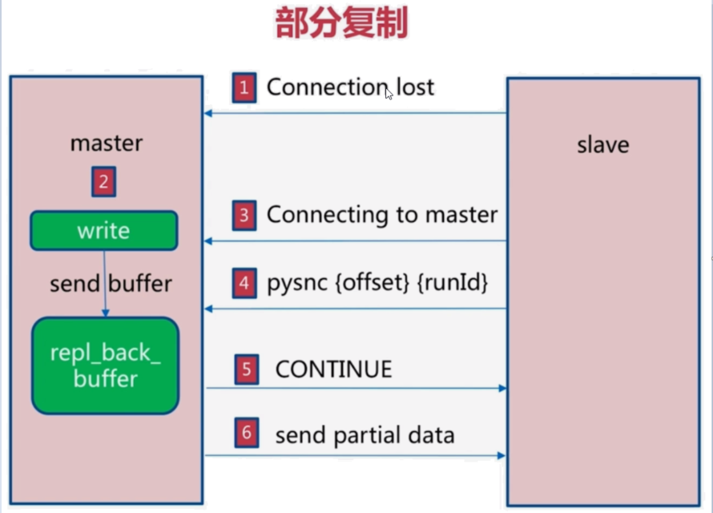
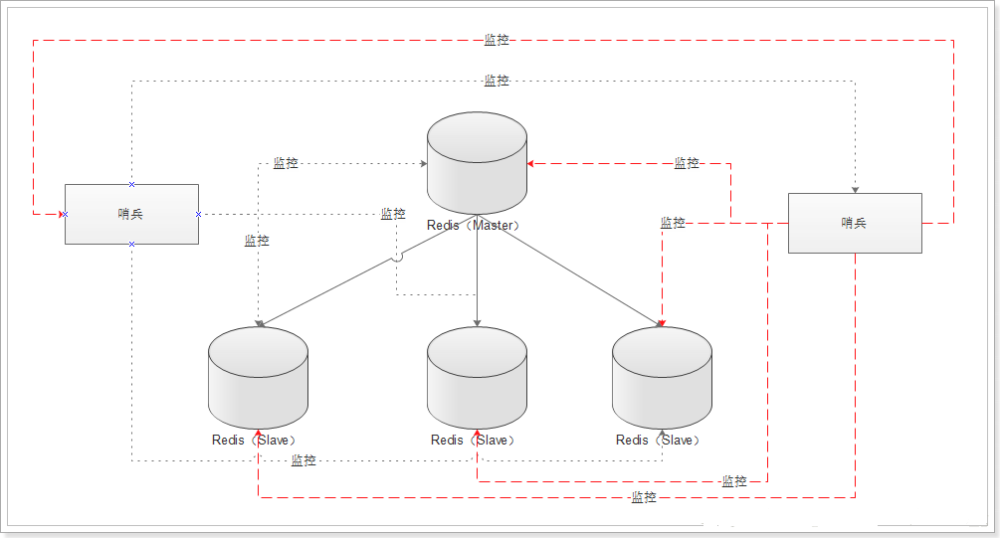

# Redis

## 高可用

### 主从复制原理

#### 全量同步

发生在Slave初始化阶段，将Master上所有的数据都复制一份，执行步骤：

|                                                             |
| :---------------------------------------------------------: |
|  |

1. 从服务器连接主服务器，不管它是第一次连接还是再次连接都没有关系，从服务器发送SYNC命令，刚开始是 Psync 命令，Psync ? -1表示要求 master 主机同步数据
2. 主机会向从机发送 runid （redis-cli info server）和 offset，因为slave并没有对应的offset，所以是全量复制
3. 从服务器slave会保存主机master的基本信息 save masterInfo
4. 主服务器接收到命令，开启一个后台进程执行BGSAVE命令（异步执行）生成RDB文件，并使用缓冲区记录此后的所有写命令
5. BGSAVE执行完成后，向所有的从服务器发送快照文件，并在发送期间继续记录所有的写命令
6. 从服务器接收到快照文件后丢弃原有的旧数据，载入新快照
7. 主服务器发送完成之后开始向从服务器发送缓冲区内的写命令
8. 从服务器完成快照载入之后，开始接收新的命令请求，并执行来自主服务器缓冲区的写命令

完成上面几个步骤后就完成了从服务器数据初始化的所有操作，从服务器此时可以接收来自用户的读请求。

#### 增量同步

|                                                             |
| :---------------------------------------------------------: |
|  |

Slave初始化后开始正常工作时主服务器发生的写操作同步到从服务器的过程。 

增量复制的过程主要是主服务器每执行一个写命令就会向从服务器发送相同的写命令，从服务器接收并执行收到的写命令。

  1. 如果网络抖动（连接断开 connection lost）
  2. 主机master 还是会写 repl_back_buffer（复制缓冲区）
  3. 从机slave 会继续尝试连接主机
  4. 从机slave 会把自己当前 runid 和偏移量传输给主机 master，并且执行 pysnc 命令同步
  5. 如果 master 发现你的偏移量是在缓冲区的范围内，就会返回 continue 命令
 6. 同步了offset 的部分数据，所以部分复制的基础就是偏移量 offset。

#### 服务器运行ID（run_id）

每个Redis节点（无论主从），在启动时都会自动生成一个随机ID（每次启动都不一样），由40个随机的十六进制字符串组成，run_id用来唯一识别一个Redis节点。通过`info server`命令，可以查看节点的run_id


​		主从节点首次复制时，主节点将自己的run_id发送给从节点，从节点将这个run_id保存起来，当断线重连时，从节点会将这个run_id发送给主节点，主节点根据runid判断能否进行部分复制；

​		如果从节点保存的run_id与主节点的run_id相同，说明主从节点之前同步过，主节点会继续尝试使用部分复制（到底能不能部分复制还要看offset和复制积压缓冲区的情况）

​		如果从节点保存的run_id与主节点的run_id不同，说明从节点在断线前同步的Redis节点并不是当前的主节点，只能进行**全量复制**

#### 复制偏移量

参与复制的主从节点都会维护自身复制偏移量。主节点（master）在处理完写入命令后，会把命令的字节长度做累加记录，统计信息会在`info replication`中的`master_repl_offset`指标中

从节点（slave）每秒钟上报自身的复制偏移量给主节点，因为主节点也会保存从节点的复制偏移量，统计指标如下：


从节点在接收到主节点发送的命令后，也会累加记录自身的偏移量。统计信息在`info replication`中的`slave_repl_offset`

#### 主从同步策略

master-slave刚连接的时候，进行全量同步；全量同步结束之后，进行增量同步。Redis策略：首先先尝试进行增量同步，如不成功，要求从服务器进行全量同步

从节点将offset发送给主节点后，主节点根据offset和缓冲区大小决定能否执行增量同步

> 如果offset偏移量之后的数据，仍然都在复制积压缓冲区里，则执行增量同步；
>
> 如果offset偏移量之后的数据已不在复制积压缓冲区中（数据已被挤压），则执行全量增量同步

Redis主从复制不阻塞主服务器端，采用异步复制。也就是说当若干个从服务器在进行初始同步时，主服务器仍然可以处理请求。

#### 心跳机制

> 主节点在建立成功后会维护这长连接彼此发送心跳检测

- 主从节点彼此都有心跳检测机制，各自模拟成对方的客户端进行通信，通过`client list`命令查看复制相关客户端信息，主节点的连接状态为`flags=M`，从节点连接状态`flags=S`，`flags=N`表示No
- 主节点默认**每隔10秒对从节点发送ping命令**，判断从节点的存活性和连接状态。可通过参数`repl-ping-slave-period`控制发送频率。
- 从节点在主线程中每隔1秒发送repl conf ack {offset} 命令，给主节点上报自身当前的复制偏移量。
  

1. 什么时候会发生全量同步？

1) Redis Slave首启动或者重启后，连接到master时;

2) Redis Slave进程没重启，但是掉线了，重连后不满足增量同步条件


2. 什么时候会发生增量同步？

1) redis版本>=2.8

2) Redis Slave进程没有重启，但是掉线了，重连了master(因为slave进程重启的话，run id就没有了)

3) Redis Slave保存的run id与master当前run id一致 (注：run id并不是pid，slave把它保存在内存中，重启就消失)

d) Redis Slave掉线期间，master保存在内存的offset可用，也就是master变化不大，被更改的指令都保存在内存


3. 进程重启后会发生全量同步还是增量同步？

1) master重启时，run_id会发生变化

2) slave重启时，run_id会丢失

很显然，会发生全量同步，因为增量同步的条件之一run id已经不能满足

### 哨兵原理

​		哨兵(Sentinel) 是一个分布式系统，可以在一个架构中运行多个哨兵(sentinel) 进程，这些进程使用流言协议(gossipprotocols)来接收关于Master是否下线的信息，并使用投票协议(agreement protocols)来决定是否执行自动故障迁移，以及选择哪个Slave作为新的Master.
　　每个哨兵(sentinel) 会向其它哨兵(sentinel)、master、slave定时发送消息，以确认对方是否”活”着，如果发现对方在指定时间(可配置)内未回应，则暂时认为对方已挂(所谓的”主观认为宕机” Subjective Down，简称sdown).
　　若“哨兵群”中的多数sentinel，都报告某一master没响应，系统才认为该master"彻底死亡"(即:客观上的真正down机，Objective Down，简称odown)，通过一定的vote算法，从剩下的slave节点中，选一台提升为master，然后自动修改相关配置.
　　虽然哨兵(sentinel) 释出为一个单独的可执行文件 redis-sentinel ，但实际上它只是一个运行在特殊模式下的 Redis 服务器，你可以在启动一个普通 Redis 服务器时通过给定 --sentinel 选项来启动哨(sentinel).



> 哨兵(sentinel) 的一些设计思路和zookeeper非常类似


```
# bind 127.0.0.1 192.168.1.1
# protected-mode no
## 配置端口
# port <sentinel-port>
port 26379
## 以守护进程模式启动
daemonize no

pidfile /var/run/redis-sentinel.pid

## 日志文件名 logs will be sent to /dev/null
logfile "sentinel_26379.log"

# sentinel announce-ip <ip>
# sentinel announce-port <port>
# sentinel announce-ip 1.2.3.4

## 存放备份文件以及日志等文件的目录
# dir <working-directory>
dir "/opt/redis/data"

## Sentine监听的maste地址，第一个参数是给master起的名字，第二个参数为master IP，第三个为master端口，第四个为当该master挂了的时候，若想将该master判为失效，在Sentine集群中必须至少2个Sentine同意才行，只要该数量不达标，则就不会发生故障迁移。也就是说只要有2个sentinel认为master下线，就认为该master客观下线，启动failover并选举产生新的master。通常最后一个参数不能多于启动的sentinel实例数。
# sentinel monitor <master-name> <ip> <redis-port> <quorum>
sentinel monitor mymaster 127.0.0.1 6379 2

## 设置连接master和slave时的密码，master和slave的密码应该设置相同
# sentinel auth-pass <master-name> <password>
sentinel auth-pass mymaster MySUPER--secret-0123passw0rd

# sentinel auth-user <master-name> <username>

## 哨兵主观认为主节点下线，表示master被当前sentinel实例认定为失效的间隔时间。
# sentinel down-after-milliseconds <master-name> <milliseconds>
# Default is 30 seconds.
sentinel down-after-milliseconds mymaster 30000

# requirepass <password>
#

## 当在执行故障转移时，设置几个slave同时进行切换master，设置为1，保证每次只有一个slave处于不能处理请求命令的状态，
## 这个数字越小， 完成故障转移所需的时间就越长。
# sentinel parallel-syncs <master-name> <numreplicas>
sentinel parallel-syncs mymaster 1

## 执行故障转移时的过期时间
# sentinel failover-timeout <master-name> <milliseconds>
# Default is 3 minutes.
sentinel failover-timeout mymaster 180000


#
# sentinel notification-script <master-name> <script-path>
# sentinel notification-script mymaster /var/redis/notify.sh


# CLIENTS RECONFIGURATION SCRIPT
#
# sentinel client-reconfig-script <master-name> <script-path>
# sentinel client-reconfig-script mymaster /var/redis/reconfig.sh


sentinel deny-scripts-reconfig yes

# REDIS COMMANDS RENAMING
# SENTINEL rename-command mymaster CONFIG GUESSME
# SENTINEL rename-command mymaster CONFIG CONFIG
```

- sentinel monitor mymaster 127.0.0.1 6379 2

  `sentinel monitor <master-name> <ip> <redis-port> <quorum>`，

  quorum：**客观下线的一个依据**，至少有 quorum 个Sentinel主观的认为这个Master有故障，才会对这个Master进行下线以及故障转移。因为有的时候，某个sentinel节点可能因为自身网络原因，导致无法连接Master，而此时Master并没有出现故障，所以这就需要多个sentinel都一致认为该master有问题，才可以进行下一步操作，这就保证了公平性和高可用。

- sentinel down-after-milliseconds mymaster 30000

  `sentinel down-after-milliseconds <master-name> <milliseconds>`，**主观下线的一个依据**，哨兵主观认为主节点下线，表示master被当前sentinel实例认定为失效的间隔时间。
  如果多久没联系上redis-servevr，认为这个redis-server进入到失效（SDOWN）状态。如果服务器在给定的毫秒数之内， 没有返回 Sentinel 发送的 PING 命令的回复，或者返回一个错误，那么 Sentinel 将这个服务器标记为主观下线（subjectively down，简称 SDOWN ）。
  不过只有一个 Sentinel 将服务器标记为主观下线并不一定会引起服务器的自动故障迁移： 只有在足够数量的 Sentinel 都将一个服务器标记为主观下线之后， 服务器才会被标记为客观下线（objectively down， 简称ODOWN ），这时自动故障迁移才会执行。将服务器标记为客观下线所需的Sentinel数量由对主服务器的配置决定。

- sentinel parallel-syncs mymaster 1

  `sentinel parallel-syncs <master-name> <numreplicas>`，当在执行故障转移时，设置几个slave同时进行切换master，设置为1，保证每次只有一个slave处于不能处理请求命令的状态，
  这个数字越小， 完成故障转移所需的时间就越长。

- sentinel failover-timeout mymaster 180000

  `sentinel failover-timeout <master-name> <milliseconds>`，执行故障转移时的过期时间

#### 实现原理

1. **监控（Monitoring）**： Sentinel 会不断地检查你的主服务器和从服务器是否运作正常。
2. **提醒（Notification）**： 当被监控的某个 Redis 服务器出现问题时， Sentinel 可以通过 API 向管理员或者其他应用程序发送通知。
3. **自动故障迁移（Automatic failover）**： 当一个主服务器不能正常工作时， Sentinel 会开始一次自动故障迁移操作， 它会将失效主服务器的其中一个从服务器升级为新的主服务器， 并让失效主服务器的其他从服务器改为复制新的主服务器； 当客户端试图连接失效的主服务器时， 集群也会向客户端返回新主服务器的地址， 使得集群可以使用新主服务器代替失效服务器。

#### 哨兵作用

1. Master状态检测 
2. 如果Master异常，则会进行Master-Slave切换，将其中一个Slave作为Master，将之前的Master作为Slave。
3.  Master-Slave切换后，master_redis.conf、slave_redis.conf和sentinel.conf的内容都会发生改变，即master_redis.conf中会多一行slaveof的配置，sentinel.conf的监控目标会随之调换。

##### Sentinel工作方式

1. 每个Sentinel以**每秒钟一次的频率**向它所知的Master，Slave以及其它Sentinel实例发送一个PING命令。
2. 如果一个实例（instance）距离最后一次有效回复PING命令的时间超过 `down-after-milliseconds` 选项所指定的值，则这个实例会被Sentinel标记为**主观下线**。 
3. 如果一个Master被标记为主观下线，则正在监视这个Master的所有Sentinel要以每秒一次的频率确认Master的确进入了主观下线状态。 
4. 当有足够数量的Sentinel（大于等于配置文件指定的值）在指定的时间范围内确认Master的确进入了主观下线状态，则Master会被标记为**客观下线**。
5. 通常每个Sentinel会以**每10秒一次的频率**向它已知的所有Master，Slave发送**INFO**命令。
6. 当Master被Sentinel标记为客观下线时，Sentinel向下线的Master的所有Slave发送INFO命令的频率会**从10秒一次改为每秒一次**。 
7. 若没有足够数量的Sentinel同意Master已经下线，Master的客观下线状态就会被移除。 若Master重新向Sentinel的PING命令返回有效回复，Master的主观下线状态就会被移除。

##### 3个定时监控任务

1. 每10秒每个Sentinel会对Master和Slave执行info命令，这个任务达到两个目的：
   1）发现Slave节点
   2）确认主从关系
2. 每2秒每个Sentinel通过Master节点的channel交换信息（pub/sub）。Master节点上有一个发布订阅的频道(`__sentinel__:hello`)。Sentinel节点通过__sentinel__:hello频道进行信息交换，达成共识。
3. 每1秒每个Sentinel对其它Sentinel和Redis节点执行PING操作（相互监控），即心跳检测，是失败判定的依据。

##### Sentinel之间和Slaves之间的自动发现机制

虽然Sentinel集群中各个Sentinel都互相连接彼此来检查对方的可用性以及互相发送消息。但是不用在任何一个Sentinel配置任何其它的Sentinel的节点。

> 因为Sentinel利用了Master的发布/订阅机制去自动发现其它也监控了统一master的sentinel节点。通过向名为`__sentinel__:hello`的管道中发送消息来实现。

同样，也不需要在Sentinel中配置某个Master的所有Slave的地址，Sentinel会通过询问Master来得到这些Slave的地址的。

每个Sentinel通过向每个Master和Slave的发布/订阅频道`__sentinel__:hello`每秒发送一次消息，来宣布它的存在。

每个sentinel也订阅了每个Master和Slave的频道`__sentinel__:hello`的内容，来发现未知的Sentinel，当检测到了新的Sentinel，则将其加入到自身维护的Master监控列表中。

每个Sentinel发送的消息中也包含了其当前维护的最新的Master配置。如果某个Sentinel发现自己的配置版本低于接收到的配置版本，则会用新的配置更新自己的Master配置。

在为一个Master添加一个新的Sentinel前，Sentinel总是检查是否已经有Sentinel与新的Sentinel的进程号或者是地址是一样的。如果是那样，这个Sentinel将会被删除，而把新的Sentinel添加上去。

#### 主观下线和客观下线

##### **SDOWN**（主观下线）

Subjectively Down，指的是**单个Sentinel实例**对服务器做出的下线判断，即单个sentinel认为某个服务下线（有可能是接收不到订阅，之间的网络不通等等原因）。

如果服务器在`down-after-milliseconds`给定的毫秒数之内， 没有返回Sentinel发送的 PING 命令的回复， 或者返回一个错误， 那么 Sentinel 将这个服务器标记为主观下线（SDOWN ）

Sentinel 会以每秒一次的频率向所有与其建立了命令连接的实例（Master，Slave，其它Sentinel）发送PING命令，通过判断PING回复是有效回复，还是无效回复来判断实例时候在线（对该sentinel来说是“主观在线”）

sentinel配置文件中的down-after-milliseconds设置了判断主观下线的时间长度，如果实例在down-after-milliseconds毫秒内，返回的都是无效回复，那么sentinel回认为该实例已（主观）下线，修改其flags状态为SRI_S_DOWN。

> 如果多个sentinel监视一个服务，有可能存在多个sentinel的down-after-milliseconds配置不同，这个在实际生产中要注意。

##### **ODOWN**（客观下线）

Objectively Down，指的是**多个 Sentinel 实例**在对同一个服务器做出 SDOWN 判断， 并且通过 SENTINEL is-master-down-by-addr 命令互相交流之后， 得出的服务器下线判断，然后开启failover。

只有在足够数量的 Sentinel 都将一个服务器标记为主观下线之后， 服务器才会被标记为客观下线（ODOWN）

只有当master被认定为客观下线时，才会发生故障迁移。

当Sentinel监视的某个服务主观下线后，Sentinel会询问其它监视该服务的Sentinel，看它们是否也认为该服务主观下线，接收到足够数量（这个值可以配置）的Sentinel判断为主观下线，既任务该服务客观下线，并对其做故障转移操作。

Sentinel通过发送 SENTINEL is-master-down-by-addr ip port current_epoch runid，（ip：主观下线的服务id，port：主观下线的服务端口，current_epoch：sentinel的纪元，runid：*表示检测服务下线状态，如果是sentinel 运行id，表示用来选举领头sentinel）来询问其它sentinel是否同意服务下线。

一个Sentinel接收另一个Sentinel发来的is-master-down-by-addr后，提取参数，根据ip和端口，检测该服务时候在该Sentinel主观下线，并且回复is-master-down-by-addr，回复包含三个参数：down_state（1表示已下线，0表示未下线），leader_runid（领头sentinal id），leader_epoch（领头sentinel纪元）

sentinel接收到回复后，根据配置设置的下线最小数量，达到这个值，既认为该服务客观下线。

客观下线条件只适用于主服务器： 对于任何其他类型的 Redis 实例， Sentinel 在将它们判断为下线前不需要进行协商， 所以从服务器或者其他 Sentinel 永远不会达到客观下线条件。只要一个 Sentinel 发现某个主服务器进入了客观下线状态， 这个 Sentinel 就可能会被其他 Sentinel 推选出， 并对失效的主服务器执行自动故障迁移操作。

##### 转换过程

#### Master选举

##### Sentinel 使用以下规则来选择新的主服务器：

在失效主服务器属下的从服务器当中， 那些被标记为主观下线、已断线、或者最后一次回复 PING 命令的时间大于五秒钟的从服务器都会被淘汰。
在失效主服务器属下的从服务器当中， 那些与失效主服务器连接断开的时长超过 down-after 选项指定的时长十倍的从服务器都会被淘汰。
在经历了以上两轮淘汰之后剩下来的从服务器中， 我们选出复制偏移量（replication offset）最大的那个从服务器作为新的主服务器； 如果复制偏移量不可用， 或者从服务器的复制偏移量相同， 那么带有最小运行 ID 的那个从服务器成为新的主服务器。

##### Sentinel 自动故障迁移的一致性特质

Sentinel 自动故障迁移使用 Raft 算法来选举领头（leader） Sentinel ， 从而确保在一个给定的纪元（epoch）里， 只有一个领头产生。

这表示在同一个纪元中， 不会有两个 Sentinel 同时被选中为领头， 并且各个 Sentinel 在同一个纪元中只会对一个领头进行投票。

更高的配置纪元总是优于较低的纪元， 因此每个 Sentinel 都会主动使用更新的纪元来代替自己的配置。

简单来说， 可以将 Sentinel 配置看作是一个带有版本号的状态。 一个状态会以最后写入者胜出（last-write-wins）的方式（也即是，最新的配置总是胜出）传播至所有其他 Sentinel 。

举个例子， 当出现网络分割（network partitions）时， 一个 Sentinel 可能会包含了较旧的配置， 而当这个 Sentinel 接到其他 Sentinel 发来的版本更新的配置时， Sentinel 就会对自己的配置进行更新。

如果要在网络分割出现的情况下仍然保持一致性， 那么应该使用 min-slaves-to-write 选项， 让主服务器在连接的从实例少于给定数量时停止执行写操作， 与此同时， 应该在每个运行 Redis 主服务器或从服务器的机器上运行 Redis Sentinel 进程。

#### 故障转移

当Master宕机，选一个合适的Slave来晋升为Master的操作，Redis-Sentinel会自动完成这个，不需要我们手动来实现。

##### 大致流程

1. 发现主服务器已经进入客观下线状态。
2. 对我们的当前集群进行自增， 并尝试在这个集群中当选。
3. 如果当选失败， 那么在设定的故障迁移超时时间的两倍之后， 重新尝试当选。 如果当选成功， 那么执行以下步骤：
   1. 选出一个从服务器，并将它升级为主服务器。
   2. 向被选中的从服务器发送 SLAVEOF NO ONE 命令，让它转变为主服务器。
   3. 通过发布与订阅功能， 将更新后的配置传播给所有其他 Sentinel ， 其他 Sentinel 对它们自己的配置进行更新。
   4. 向已下线主服务器的从服务器发送 SLAVEOF 命令， 让它们去复制新的主服务器。
   5. 当所有从服务器都已经开始复制新的主服务器时， 领头 Sentinel 终止这次故障迁移操作。

> 每当一个 Redis 实例被重新配置（reconfigured） —— 无论是被设置成主服务器、从服务器、又或者被设置成其他主服务器的从服务器 —— Sentinel 都会向被重新配置的实例发送一个 CONFIG REWRITE 命令， 从而确保这些配置会持久化在硬盘里。


优点和缺点：

基于主从复制，主从可以切换，故障可以转移，但不容易在线扩容

### 集群原理
