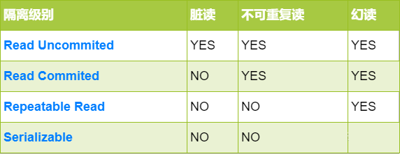

# Spring事务

## 什么是事务？

逻辑上的一组操作，要不都执行，要不都不执行


## 事务特性（ACID）


- **A**：Atomic 原子性 一个事务中所有操作，要不全部完成，要不全部不完成，事务在执行过程中发生错误，会被回滚到事务开始前的状态，就像这个事务没有被执行过一样。如何保证原子性？**回滚日志（undo  log）**

- **C**：Consistency 一致性 在一个事务执行之前和执行之后数据库都必须处于一致性状态，如果事务成功完成，那么系统中所有变化将正确应用。系统处于有效状态。如果在事务中出现错误，系统中所有变化都自动回滚，系统将返回到原始状态。

- **I**：Isolation 隔离性 指的是在并发环境中，当不同的事务同时操纵相同的数据时，每个事务都有各自的完整数据空间。由并发事务所做的修改必须与任何其他并发事务所做的修改隔离。事务查看数据更新时，数据所处的状态要么是另一事务修改它之前的状态，要么是另一事务修改它之后的状态，事务不会查看到中间状态的数据。（打个比方，你买东西，是不会影响到其他人的。）

- **D**：Durability 持久性 指的是只要事务成功结束，它对数据库所作的更新就必须永久保存下来。即使系统发生崩溃，重新启动数据库系统后，数据库还能恢复到事务成功结束时的状态


## mysql事务

- InnoDB引擎：支持事务

- MyISAM引擎：不支持事务

  

## Spring事务

> Spring事务处理，处理流程由抽象事务管理器AbstractPlatformTransactionManager提供，底层实现由PlatformTransactionManager的实现类实现，如 DataSourceTransactionManager 、JtaTransactionManager和 HibernateTransactionManager等。

#### 编程式事务管理

通过**TransactionTemplate** 或者 **PlatformTransactionManager**管理。

+ TransactionTemplate

```java
@Autowired
TransactionTemplate transactionTemplate;

public void transactionTemplate() {
	transactionTemplate.execute(new TransactionCallback<Object>() {
		@Override
		public Object doInTransaction(TransactionStatus status) {
			try {
				// todo 业务代码
				status.setRollbackOnly();	// 回滚
			}
			return null;
		}
	});
}
```


+ PlatformTransactionManager

```java
@Autowired
PlatformTransactionManager transactionManager;

public void transactionManager() {
	TransactionStatus transactionStatus = transactionManager.getTransaction(new DefaultTransactionDefinition());
	try {
		// todo 业务代码	
		transactionManager.commit(transactionStatus);	// 提交事务
	} catch (Exception e) {
		transactionManager.rollback(transactionStatus);	// 回滚
	}
}
```


#### 声明式事务

使用**@Transactional**注解


#### 事务管理接口

+ **`PlatformTransactionManager`**
+ **`TransactionDefinition`**
+ **`TransactionStatus`**


#####  1. **`PlatformTransactionManager`**事务管理器

```java
public interface PlatformTransactionManager {
    TransactionStatus getTransaction(@Nullable TransactionDefinition var1) throws TransactionException;  // 获得事务
    void commit(TransactionStatus var1) throws TransactionException;	// 提交事务
    void rollback(TransactionStatus var1) throws TransactionException;	 // 回滚事务
}
```

##### 2. **`TransactionDefinition`**事务属性

事务属性包括5个方面：


```java
public interface TransactionDefinition {   
	int getPropagationBehavior();	// 事务传播行为 PROPAGATION_REQUIRED
	int getIsolationLevel();	// 事务隔离级别 ISOLATION_DEFAULT
	int getTimeout();	// 事务超时时间 -1
	boolean isReadOnly();	// 是否只读事务 false
	String getName();
}
```

##### 3. **`TransactionStatus`**事务状态

```java
public interface TransactionStatus{
    boolean isNewTransaction();	 // 是否是新的事物
    boolean hasSavepoint();  // 是否有恢复点
    void setRollbackOnly();   // 设置为只回滚
    boolean isRollbackOnly();  // 是否为只回滚
    boolean isCompleted;  // 是否已完成
}
```


#### Spring事务传播行为

##### PROPAGATION_REQUIRED 

如果当前没有事务，就新建一个事务；如果已经存在一个事务中，加入到这个事务中。共用同一事务

+ 在外围方法未开启事务的情况下`Propagation.REQUIRED`修饰的内部方法会新开启自己的事务，且开启的事务相互独立，互不干扰。

+ 在外围方法开启事务的情况下`Propagation.REQUIRED`修饰的内部方法会加入到外围方法的事务中，所有`Propagation.REQUIRED`修饰的内部方法和外围方法均属于同一事务，只要一个方法回滚，整个事务均回滚。

  ```java
  Class A {
      @Autowired B b
          
      @Transactional(propagation=propagation.PROPAGATION_REQUIRED)
      public void aMethod {
          b.bMethod();
      }
  }
  
  @Service
  Class B {
      @Transactional(propagation=propagation.PROPAGATION_REQUIRED)
      public void bMethod {
         
      }
  }
  ```

  > 两者使用的就是同一个事务，只要其中一个方法回滚，整个事务均回滚。

##### PROPAGATION_REQUIRES_NEW
创建新的事务，如果当前存在事务，则把当前事务挂起。

+ 在外围方法未开启事务的情况下`Propagation.REQUIRES_NEW`修饰的内部方法会新开启自己的事务，且开启的事务相互独立，互不干扰。

+ 在外围方法开启事务的情况下`Propagation.REQUIRES_NEW`修饰的内部方法依然会单独开启独立事务，且与外部方法事务独立，内部方法之间、内部方法和外部方法事务均相互独立，互不干扰。

  ```java
  Class A {
      @Autowired B b
          
      @Transactional(propagation=propagation.PROPAGATION_REQUIRED)
      public void aMethod {
          b.bMethod();
      }
  }
  
  @Service
  Class B {
      @Transactional(propagation=propagation.REQUIRES_NEW)
      public void bMethod {
         
      }
  }
  ```

  > `bMethod()`使用`PROPAGATION_REQUIRES_NEW`事务传播行为修饰，`aMethod`还是用`PROPAGATION_REQUIRED`修饰的话。如果`aMethod()`发生异常回滚，`bMethod()`不会跟着回滚，因为 `bMethod()`开启了独立的事务。但是，如果 `bMethod()`抛出了未被捕获的异常并且这个异常满足事务回滚规则的话,`aMethod()`同样也会回滚，因为这个异常被 `aMethod()`的事务管理机制检测到了。

  

##### PROPAGATION_SUPPORTS
支持当前事务，如果当前没有事务，就以非事务方式执行

##### PROPAGATION_NESTED 

如果当前存在事务，则创建一个事务作为当前事务的嵌套事务执行。如果当前没有事务，则执行与`PROPAGATION_REQUIRED`类似的操作

+ 在外围方法未开启事务的情况下`Propagation.NESTED`和`Propagation.REQUIRED`作用相同，修饰的内部方法都会新开启自己的事务，且开启的事务相互独立，互不干扰

+ 在外围方法开启事务的情况下`Propagation.NESTED`修饰的内部方法属于外部事务的子事务，外围主事务回滚，子事务一定回滚；而内部子事务可以单独回滚而不影响外围主事务和其他子事务

  ```java
  Class A {
  	@Autowired B b
  
      @Transactional(propagation=propagation.PROPAGATION_REQUIRED)
      public void aMethod {
          //do something
          b.bMethod1();
          b.bMethod2();
      }
  }
  @Service
  Class B {
      @Transactional(propagation=propagation.PROPAGATION_NESTED)
      public void bMethod1 {
        
      }
      
      @Transactional(propagation=propagation.PROPAGATION_NESTED)
      public void bMethod2 {
        
      }
  }
  ```

  > 如果 `aMethod()` 回滚的话，`bMethod()`和`bMethod2()`都要回滚，而`bMethod()`回滚的话，并不会造成 `aMethod()` 和`bMethod()`回滚。


#### 区别和联系

+ `NESTED`和`REQUIRED`修饰的内部方法都属于外围方法事务，如果外围方法抛出异常，这两种方法的事务都会被回滚。但是`REQUIRED`是加入外围方法事务，所以和外围事务同属于一个事务，一旦`REQUIRED`事务抛出异常被回滚，外围方法事务也将被回滚。
而`NESTED`是外围方法的子事务，有单独的保存点，所以`NESTED`方法抛出异常被回滚，不会影响到外围方法的事务
+ `NESTED`和`REQUIRES_NEW`都可以做到内部方法事务回滚而不影响外围方法事务。但是因为`NESTED`是嵌套事务，所以外围方法回滚之后，作为外围方法事务的子事务也会被回滚。而`REQUIRES_NEW`是通过开启新的事务实现的，内部事务和外围事务是两个事务，外围事务回滚不会影响内部事务。


#### Spring事务隔离级别

- **`TransactionDefinition.ISOLATION_DEFAULT`** :使用数据库默认的隔离级别，MySQL 默认采用的 `REPEATABLE_READ` 隔离级别 Oracle 默认采用的 `READ_COMMITTED` 隔离级别.

- **`TransactionDefinition.ISOLATION_READ_UNCOMMITTED`** :最低的隔离级别，使用这个隔离级别很少，因为它允许读取尚未提交的数据变更，**可能会导致脏读、幻读或不可重复读**

- **`TransactionDefinition.ISOLATION_READ_COMMITTED`** : 允许读取并发事务已经提交的数据，**可以阻止脏读，但是幻读或不可重复读仍有可能发生**

- **`TransactionDefinition.ISOLATION_REPEATABLE_READ`** : 对同一字段的多次读取结果都是一致的，除非数据是被本身事务自己所修改，**可以阻止脏读和不可重复读，但幻读仍有可能发生。**

- **`TransactionDefinition.ISOLATION_SERIALIZABLE`** : 最高的隔离级别，完全服从 ACID 的隔离级别。所有的事务依次逐个执行，这样事务之间就完全不可能产生干扰，也就是说，**该级别可以防止脏读、不可重复读以及幻读**。但是这将严重影响程序的性能。




#### Spring事务只读属性

> MySQL 默认对每一个新建立的连接都启用了`autocommit`模式。在该模式下，每一个发送到 MySQL 服务器的`sql`语句都会在一个单独的事务中进行处理，执行结束后会自动提交事务，并开启一个新的事务。

如果给方法加上了`Transactional`注解的话，这个方法执行的所有`sql`会被放在一个事务中。如果声明了只读事务的话，数据库就会去优化它的执行，并不会带来其他的什么收益。

如果不加`Transactional`，每条`sql`会开启一个单独的事务，中间被其它事务改了数据，都会实时读取到最新值。

1.  如果一次执行单条查询语句，则没有必要启用事务支持，数据库默认支持 SQL 执行期间的读一致性；
2.  如果一次执行多条查询语句，例如统计查询，报表查询，在这种场景下，多条查询 SQL 必须保证整体的读一致性，否则，在前条 SQL 查询之后，后条 SQL 查询之前，数据被其他用户改变，则该次整体的统计查询将会出现读数据不一致的状态，此时，应该启用事务支持


#### 开启事务管理器

使用@EnableTransactionManagement开启事务管理器，Springboot中自动开启，由TransactionAutoConfiguration开启。

```java
@Configuration(proxyBeanMethods = false)
@ConditionalOnClass(PlatformTransactionManager.class)
@AutoConfigureAfter({ JtaAutoConfiguration.class, HibernateJpaAutoConfiguration.class,
		DataSourceTransactionManagerAutoConfiguration.class, Neo4jDataAutoConfiguration.class })
@EnableConfigurationProperties(TransactionProperties.class)
public class TransactionAutoConfiguration {
	// 省略

	@Configuration(proxyBeanMethods = false)
	@ConditionalOnBean(TransactionManager.class)
	@ConditionalOnMissingBean(AbstractTransactionManagementConfiguration.class)
	public static class EnableTransactionManagementConfiguration {

        // proxyTargetClass = false，使用jdk代理
		@Configuration(proxyBeanMethods = false)
		@EnableTransactionManagement(proxyTargetClass = false)
		@ConditionalOnProperty(prefix = "spring.aop", name = "proxy-target-class", havingValue = "false",
				matchIfMissing = false)
		public static class JdkDynamicAutoProxyConfiguration {
		}

        // proxyTargetClass = true，使用cglib代理
		@Configuration(proxyBeanMethods = false)
		@EnableTransactionManagement(proxyTargetClass = true)
		@ConditionalOnProperty(prefix = "spring.aop", name = "proxy-target-class", havingValue = "true",
				matchIfMissing = true)
		public static class CglibAutoProxyConfiguration {
		}
	}
}
```

首先会加载DataSourceTransactionManagerAutoConfiguration配置信息，配置数据源DataSource，之后加载TransactionAutoConfiguration配置信息

```java
@Target(ElementType.TYPE)
@Retention(RetentionPolicy.RUNTIME)
@Documented
@Import(TransactionManagementConfigurationSelector.class)
public @interface EnableTransactionManagement {
	// 默认使用jdk代理
	boolean proxyTargetClass() default false;
    AdviceMode mode() default AdviceMode.PROXY;
	// 省略
}
```

`EnableTransactionManagement`注解开启事务管理，默认jdk动态代理和PROXY。在注解之前，会引入TransactionManagementConfigurationSelector事务管理选择器

```java
public class TransactionManagementConfigurationSelector extends AdviceModeImportSelector<EnableTransactionManagement> {
    
    // 父类AdviceModeImportSelector#selectImports()
    @Override
	public final String[] selectImports(AnnotationMetadata importingClassMetadata) {
		Class<?> annType = GenericTypeResolver.resolveTypeArgument(getClass(), AdviceModeImportSelector.class);
		// ...
        // EnableTransactionManagement注解属性值
		AnnotationAttributes attributes = AnnotationConfigUtils.attributesFor(importingClassMetadata, annType);
		// ...
        
		AdviceMode adviceMode = attributes.getEnum(getAdviceModeAttributeName());
        // 默认PROXY，调用子类实现
		String[] imports = selectImports(adviceMode);
		// ...
		return imports;
	}

	@Override
	protected String[] selectImports(AdviceMode adviceMode) {
		switch (adviceMode) {
			case PROXY:
                // 前者处理代理，后者处理配置
				return new String[] {AutoProxyRegistrar.class.getName(),
						ProxyTransactionManagementConfiguration.class.getName()};
			case ASPECTJ:
				return new String[] {determineTransactionAspectClass()};
			default:
				return null;
		}
	}
	// ASPECT
	private String determineTransactionAspectClass() {
		return (ClassUtils.isPresent("javax.transaction.Transactional", getClass().getClassLoader()) ?
				TransactionManagementConfigUtils.JTA_TRANSACTION_ASPECT_CONFIGURATION_CLASS_NAME :
				TransactionManagementConfigUtils.TRANSACTION_ASPECT_CONFIGURATION_CLASS_NAME);
	}

}
```

根据AdviceMode选择创建不同的bean，默认PROXY，返回的是`AutoProxyRegistrar`和`ProxyTransactionManagementConfiguration`。

#####  AutoProxyRegistrar


```java
public class AutoProxyRegistrar implements ImportBeanDefinitionRegistrar {

	@Override
	public void registerBeanDefinitions(AnnotationMetadata importingClassMetadata, BeanDefinitionRegistry registry) {
		boolean candidateFound = false;
		Set<String> annTypes = importingClassMetadata.getAnnotationTypes();
		for (String annType : annTypes) {
            // 注解属性
			AnnotationAttributes candidate = AnnotationConfigUtils.attributesFor(importingClassMetadata, annType);
			if (candidate == null) {
				continue;
			}
            // @EnableTransactionManagement -> mode
			Object mode = candidate.get("mode");
            // @EnableTransactionManagement -> proxyTargetClass
			Object proxyTargetClass = candidate.get("proxyTargetClass");
            // 判断注解属性值得类型是否满足
			if (mode != null && proxyTargetClass != null && AdviceMode.class == mode.getClass() &&
					Boolean.class == proxyTargetClass.getClass()) {
				candidateFound = true;
                // PROXY
				if (mode == AdviceMode.PROXY) {
					AopConfigUtils.registerAutoProxyCreatorIfNecessary(registry);
					if ((Boolean) proxyTargetClass) {
						AopConfigUtils.forceAutoProxyCreatorToUseClassProxying(registry);
						return;
					}
				}
			}
		}
		// ...
	}

}
```

实现了ImportBeanDefinitionRegistrar，这个类是注册InfrastructureAdvisorAutoProxyCreator。

##### ProxyTransactionManagementConfiguration

```java
@Configuration(proxyBeanMethods = false)
@Role(BeanDefinition.ROLE_INFRASTRUCTURE)
public class ProxyTransactionManagementConfiguration extends AbstractTransactionManagementConfiguration {

    // 将TransactionAttributeSource注解事务属性源 和 TransactionInterceptor事务拦截器 注入Advisor
	@Bean(name = TransactionManagementConfigUtils.TRANSACTION_ADVISOR_BEAN_NAME)
	@Role(BeanDefinition.ROLE_INFRASTRUCTURE)
	public BeanFactoryTransactionAttributeSourceAdvisor transactionAdvisor(
			TransactionAttributeSource transactionAttributeSource, TransactionInterceptor transactionInterceptor) {
		BeanFactoryTransactionAttributeSourceAdvisor advisor = new BeanFactoryTransactionAttributeSourceAdvisor();
		advisor.setTransactionAttributeSource(transactionAttributeSource);
		advisor.setAdvice(transactionInterceptor);
		// ...
		return advisor;
	}

	@Bean
	@Role(BeanDefinition.ROLE_INFRASTRUCTURE)
	public TransactionAttributeSource transactionAttributeSource() {
		return new AnnotationTransactionAttributeSource();
	}

	@Bean
	@Role(BeanDefinition.ROLE_INFRASTRUCTURE)
	public TransactionInterceptor transactionInterceptor(TransactionAttributeSource transactionAttributeSource) {
		TransactionInterceptor interceptor = new TransactionInterceptor();
		interceptor.setTransactionAttributeSource(transactionAttributeSource);
		if (this.txManager != null) {
			interceptor.setTransactionManager(this.txManager);
		}
		return interceptor;
	}
}
```

作为一个注册文件，注册3个bean，BeanFactoryTransactionAttributeSourceAdvisor、TransactionAttributeSource、TransactionInterceptor，主要的逻辑就是创建一个Advisor对象(BeanFactoryTransactionAttributeSourceAdvisor)，并且注入通知(AnnotationTransactionAttributeSource)和切点(TransactionInterceptor)。

`TransactionManagementConfigurationSelector`事务管理选择器，创建aop代理，会通过`AnnotationAwareAspectJAutoProxyCreator`来处理，`AutoProxyRegistrar`优先级低。

`ProxyTransactionManagementConfiguration`处理事务配置，transactionAdvisor（）将会返回一个BeanFactoryTransactionAttributeSourceAdvisor，作为Bean存在BeanFactory。

##### 增强到Bean

```java
public abstract class AbstractAutoProxyCreator extends ProxyProcessorSupport
		implements SmartInstantiationAwareBeanPostProcessor, BeanFactoryAware {
		// 省略
    
        //
		protected Object wrapIfNecessary(Object bean, String beanName, Object cacheKey) {
		if (StringUtils.hasLength(beanName) && this.targetSourcedBeans.contains(beanName)) {
			return bean;
		}
		if (Boolean.FALSE.equals(this.advisedBeans.get(cacheKey))) {
			return bean;
		}
		if (isInfrastructureClass(bean.getClass()) || shouldSkip(bean.getClass(), beanName)) {
			this.advisedBeans.put(cacheKey, Boolean.FALSE);
			return bean;
		}

		// 获取可以增强到当前bean的Advisor
		Object[] specificInterceptors = getAdvicesAndAdvisorsForBean(bean.getClass(), beanName, null);
		if (specificInterceptors != DO_NOT_PROXY) {
			this.advisedBeans.put(cacheKey, Boolean.TRUE);
            // 创建代理
			Object proxy = createProxy(bean.getClass(), beanName, specificInterceptors, new SingletonTargetSource(bean));
			this.proxyTypes.put(cacheKey, proxy.getClass());
			return proxy;
		}

		this.advisedBeans.put(cacheKey, Boolean.FALSE);
		return bean;
	}
}
```


```java
public abstract class AbstractAdvisorAutoProxyCreator extends AbstractAutoProxyCreator 	
	// ...
    
    @Override
	protected Object[] getAdvicesAndAdvisorsForBean(
			Class<?> beanClass, String beanName, @Nullable TargetSource targetSource) {

		List<Advisor> advisors = findEligibleAdvisors(beanClass, beanName);
		if (advisors.isEmpty()) {
			return DO_NOT_PROXY;
		}
		return advisors.toArray();
	}
	
	protected List<Advisor> findEligibleAdvisors(Class<?> beanClass, String beanName) {
		// 找到beanFactory所有的Advisor
    	List<Advisor> candidateAdvisors = findCandidateAdvisors();
    	// 获取可以增强到当前bean的Advisor
		List<Advisor> eligibleAdvisors = findAdvisorsThatCanApply(candidateAdvisors, beanClass, beanName);
		extendAdvisors(eligibleAdvisors);
		if (!eligibleAdvisors.isEmpty()) {
			eligibleAdvisors = sortAdvisors(eligibleAdvisors);
		}
		return eligibleAdvisors;
	}

	// 获取可以增强到当前bean的Advisor
	protected List<Advisor> findAdvisorsThatCanApply(
			List<Advisor> candidateAdvisors, Class<?> beanClass, String beanName) {

		ProxyCreationContext.setCurrentProxiedBeanName(beanName);
		try {
            // 找到增强的Advisor
			return AopUtils.findAdvisorsThatCanApply(candidateAdvisors, beanClass);
		}
		finally {
			ProxyCreationContext.setCurrentProxiedBeanName(null);
		}
	}
 	// ...
｝
```


```java
public abstract class AopUtils {
    // ...
    
    // 找到增强的Advisor
	public static List<Advisor> findAdvisorsThatCanApply(List<Advisor> candidateAdvisors, Class<?> clazz) {
		if (candidateAdvisors.isEmpty()) {
			return candidateAdvisors;
		}
		List<Advisor> eligibleAdvisors = new ArrayList<>();
		for (Advisor candidate : candidateAdvisors) {
			if (candidate instanceof IntroductionAdvisor && canApply(candidate, clazz)) {
				eligibleAdvisors.add(candidate);
			}
		}
		boolean hasIntroductions = !eligibleAdvisors.isEmpty();
		for (Advisor candidate : candidateAdvisors) {
			if (candidate instanceof IntroductionAdvisor) {
				// already processed
				continue;
			}
            // 
			if (canApply(candidate, clazz, hasIntroductions)) {
				eligibleAdvisors.add(candidate);
			}
		}
		return eligibleAdvisors;
	}
	
	public static boolean canApply(Advisor advisor, Class<?> targetClass, boolean hasIntroductions) {
		if (advisor instanceof IntroductionAdvisor) {
			return ((IntroductionAdvisor) advisor).getClassFilter().matches(targetClass);
		}
        // 进入切面
		else if (advisor instanceof PointcutAdvisor) {
			PointcutAdvisor pca = (PointcutAdvisor) advisor;
            // 判断PointcutAdvisor是否能增强到targetClass
			return canApply(pca.getPointcut(), targetClass, hasIntroductions);
		}
		else {
			// It doesn't have a pointcut so we assume it applies.
			return true;
		}
	}
    
    // 判断PointcutAdvisor是否能增强到targetClass
    public static boolean canApply(Pointcut pc, Class<?> targetClass, boolean hasIntroductions) {
		if (!pc.getClassFilter().matches(targetClass)) {
			return false;
		}

		MethodMatcher methodMatcher = pc.getMethodMatcher();
		if (methodMatcher == MethodMatcher.TRUE) {
			// No need to iterate the methods if we're matching any method anyway...
			return true;
		}

		IntroductionAwareMethodMatcher introductionAwareMethodMatcher = null;
		if (methodMatcher instanceof IntroductionAwareMethodMatcher) {
			introductionAwareMethodMatcher = (IntroductionAwareMethodMatcher) methodMatcher;
		}

		Set<Class<?>> classes = new LinkedHashSet<>();
		if (!Proxy.isProxyClass(targetClass)) {
			classes.add(ClassUtils.getUserClass(targetClass));
		}
		classes.addAll(ClassUtils.getAllInterfacesForClassAsSet(targetClass));

		for (Class<?> clazz : classes) {
			Method[] methods = ReflectionUtils.getAllDeclaredMethods(clazz);
            // 判断能否应用到方法上
			for (Method method : methods) {
				if (introductionAwareMethodMatcher != null ?
						introductionAwareMethodMatcher.matches(method, targetClass, hasIntroductions) :
						methodMatcher.matches(method, targetClass)) {
					return true;
				}
			}
		}

		return false;
	}
    // ...
}
```

`AopUtils`工具类，提供了判断是jdk、cglib、aop代理。


#### 事务注解

首先，普及几个spring事务知识点

1. @Transactional可以被应用于接口定义和接口方法、类定义和类的 public 方法上。
2. @Transactional仅仅是一种元数据。必须在配置文件中使用配置元素，才真正开启了事务行为。
3. Spring的默认的事务回滚规则是遇到运行异常（RuntimeException及其子类）和程序错误（Error）才会进行事务回滚，但是，在遇到检查型（Checked）异常时不会回滚。

```java
@Target({ElementType.TYPE, ElementType.METHOD})
@Retention(RetentionPolicy.RUNTIME)
@Inherited
@Documented
public @interface Transactional {
	// ...
	Propagation propagation() default Propagation.REQUIRED;
	Isolation isolation() default Isolation.DEFAULT;
	int timeout() default TransactionDefinition.TIMEOUT_DEFAULT;
	boolean readOnly() default false;
	Class<? extends Throwable>[] rollbackFor() default {};
	String[] rollbackForClassName() default {};	
	Class<? extends Throwable>[] noRollbackFor() default {};
	String[] noRollbackForClassName() default {};
}
```

注解@Transactional，当业务代码中抛出异常时，Spring会创建RuleBasedTransactionAttribute，作为对@Transactional的描述

```java
public class RuleBasedTransactionAttribute extends DefaultTransactionAttribute implements Serializable {
	// ...
	
	// 对rollbackFor和noRollbackFor处理器
	@Nullable
	private List<RollbackRuleAttribute> rollbackRules;
}
// 异常回滚处理器
public class RollbackRuleAttribute implements Serializable{
	// 默认RuntimeException
	public static final RollbackRuleAttribute ROLLBACK_ON_RUNTIME_EXCEPTIONS =
			new RollbackRuleAttribute(RuntimeException.class);

	private final String exceptionName;
	public RollbackRuleAttribute(Class<?> clazz) {
		// ...
		this.exceptionName = clazz.getName();
	}

	public RollbackRuleAttribute(String exceptionName) {
		this.exceptionName = exceptionName;
	}
	
	public int getDepth(Throwable ex) {
        // 从0开始计数
		return getDepth(ex.getClass(), 0);
	}

	private int getDepth(Class<?> exceptionClass, int depth) {
		if (exceptionClass.getName().contains(this.exceptionName)) {
			// Found it!
			return depth;
		}
		// If we've gone as far as we can go and haven't found it...
		if (exceptionClass == Throwable.class) {
			return -1;
		}
		return getDepth(exceptionClass.getSuperclass(), depth + 1);
	}

	// ...
}
```

##### TransactionInterceptor

执行事务的动态代理类

```java
public class TransactionInterceptor extends TransactionAspectSupport implements MethodInterceptor, Serializable {
	@Override
	public Object invoke(MethodInvocation invocation) throws Throwable {
		Class<?> targetClass = (invocation.getThis() != null ? AopUtils.getTargetClass(invocation.getThis()) : null);
		// 调用父类TransactionAspectSupport#invokeWithinTransaction()
		return invokeWithinTransaction(invocation.getMethod(), targetClass, invocation::proceed);
	}
}
```

进入父类`TransactionAspectSupport`执行事务

##### TransactionAspectSupport

执行事务切面

```java
public abstract class TransactionAspectSupport implements BeanFactoryAware, InitializingBean {
    // ...
    
	protected Object invokeWithinTransaction(Method method, @Nullable Class<?> targetClass, final InvocationCallback invocation) throws Throwable {
		// 实现类AnnotationTransactionAttributeSource
		TransactionAttributeSource tas = getTransactionAttributeSource();
		// 获取@Transaction注解上事务属性
        final TransactionAttribute txAttr = (tas != null ? tas.getTransactionAttribute(method, targetClass) : null);
        // TransactionManager事务管理器，实现类DataSourceTransactionManager
		final TransactionManager tm = determineTransactionManager(txAttr);

		// ReactiveTransaction ...
		
		PlatformTransactionManager ptm = asPlatformTransactionManager(tm);
		final String joinpointIdentification = methodIdentification(method, targetClass, txAttr);

		if (txAttr == null || !(ptm instanceof CallbackPreferringPlatformTransactionManager)) {
			// 事务信息
			TransactionInfo txInfo = createTransactionIfNecessary(ptm, txAttr, joinpointIdentification);

			Object retVal;
			try {
				// 核心代码，执行service的方法
				retVal = invocation.proceedWithInvocation();
			}
			catch (Throwable ex) {
				// 处理exception回滚
				completeTransactionAfterThrowing(txInfo, ex);
				throw ex;
			}
			finally {
                // 清除事务信息
				cleanupTransactionInfo(txInfo);
			}
			// 提交事务
			commitTransactionAfterReturning(txInfo);
			return retVal;
		}

		else {
			final ThrowableHolder throwableHolder = new ThrowableHolder();

			// It's a CallbackPreferringPlatformTransactionManager: pass a TransactionCallback in.
			try {
				Object result = ((CallbackPreferringPlatformTransactionManager) tm).execute(txAttr, status -> {
					TransactionInfo txInfo = prepareTransactionInfo(tm, txAttr, joinpointIdentification, status);
					try {
						return invocation.proceedWithInvocation();
					}
					catch (Throwable ex) {
						if (txAttr.rollbackOn(ex)) {
							// A RuntimeException: will lead to a rollback.
							if (ex instanceof RuntimeException) {
								throw (RuntimeException) ex;
							}
							else {
								throw new ThrowableHolderException(ex);
							}
						}
						else {
							// A normal return value: will lead to a commit.
							throwableHolder.throwable = ex;
							return null;
						}
					}
					finally {
						cleanupTransactionInfo(txInfo);
					}
				});

				// Check result state: It might indicate a Throwable to rethrow.
				if (throwableHolder.throwable != null) {
					throw throwableHolder.throwable;
				}
				return result;
			}
			catch (ThrowableHolderException ex) {
				throw ex.getCause();
			}
			catch (TransactionSystemException ex2) {
				if (throwableHolder.throwable != null) {
					ex2.initApplicationException(throwableHolder.throwable);
				}
				throw ex2;
			}
			catch (Throwable ex2) {
				if (throwableHolder.throwable != null) {
				}
				throw ex2;
			}
		}
	}
        
    protected void completeTransactionAfterThrowing(@Nullable TransactionInfo txInfo, Throwable ex) {
		if (txInfo != null && txInfo.getTransactionStatus() != null) {
			// ...
			if (txInfo.transactionAttribute != null && txInfo.transactionAttribute.rollbackOn(ex)) {
				try {
					txInfo.getTransactionManager().rollback(txInfo.getTransactionStatus());
				}
				catch (TransactionSystemException ex2) {
					// ...
					ex2.initApplicationException(ex);
					throw ex2;
				}
				catch (RuntimeException | Error ex2) {
					// ...
					throw ex2;
				}
			}
			else {
				// We don't roll back on this exception.
				// Will still roll back if TransactionStatus.isRollbackOnly() is true.
				try {
					txInfo.getTransactionManager().commit(txInfo.getTransactionStatus());
				}
				catch (TransactionSystemException ex2) {
					// ...
					ex2.initApplicationException(ex);
					throw ex2;
				}
				catch (RuntimeException | Error ex2) {
					// ...
					throw ex2;
				}
			}
		}
	}
}
    
public abstract class DelegatingTransactionAttribute extends DelegatingTransactionDefinition
		implements TransactionAttribute, Serializable {

	private final TransactionAttribute targetAttribute;
    // ...
	@Override
	public boolean rollbackOn(Throwable ex) {
		return this.targetAttribute.rollbackOn(ex);
	}
}
    
public class RuleBasedTransactionAttribute extends DefaultTransactionAttribute implements Serializable {
    @Override
	public boolean rollbackOn(Throwable ex) {
		// ...
		RollbackRuleAttribute winner = null;
		int deepest = Integer.MAX_VALUE;

		if (this.rollbackRules != null) {
			for (RollbackRuleAttribute rule : this.rollbackRules) {
				int depth = rule.getDepth(ex);
				if (depth >= 0 && depth < deepest) {
					deepest = depth;
					winner = rule;
				}
			}
		}

		// ...

		// 无配置时
		if (winner == null) {
			return super.rollbackOn(ex);
		}

		return !(winner instanceof NoRollbackRuleAttribute);
	}
}
```

其中**TransactionAspectSupport**#`getTransactionAttribute()`获取的是TransactionAttribute，其实现类是**AnnotationTransactionAttributeSource**，那么getTransactionAttributeSource方法主要逻辑是交给了computeTransactionAttribute方法。

###### 事务属性

```java
public abstract class AbstractFallbackTransactionAttributeSource implements TransactionAttributeSource {
	protected TransactionAttribute computeTransactionAttribute(Method method, @Nullable Class<?> targetClass) {
		// 1. 判断是否public方法
		if (allowPublicMethodsOnly() && !Modifier.isPublic(method.getModifiers())) {
			return null;
		}

		// 2. method表示接口的方法，对于接口，从实现类查找类的方法specificMethod
		Method specificMethod = AopUtils.getMostSpecificMethod(method, targetClass);

		// 1）方法中是否有事务
		TransactionAttribute txAttr = findTransactionAttribute(specificMethod);
		if (txAttr != null) {
			return txAttr;
		}

		// 2）方法类是否有事务
		txAttr = findTransactionAttribute(specificMethod.getDeclaringClass());
		if (txAttr != null && ClassUtils.isUserLevelMethod(method)) {
			return txAttr;
		}
		// 接口实现类，从接口中查找
		if (specificMethod != method) {
			// 接口方法查找
			txAttr = findTransactionAttribute(method);
			if (txAttr != null) {
				return txAttr;
			}
			// 接口类查找
			txAttr = findTransactionAttribute(method.getDeclaringClass());
			if (txAttr != null && ClassUtils.isUserLevelMethod(method)) {
				return txAttr;
			}
		}

		return null;
	}
}
```

通过computeTransactionAttribute方法处理逻辑：

> 1. 判断是不是只运行公共方法，在AnnotationTransactionAttributeSource构造方法中传入true。若方法不是公共方法，则返回null。
> 2. 获取具体的方法，method方法可能是接口方法或者泛型方法。
> 3. 查看方法上是否存在事务
> 4. 查看方法所在类上是否存在事务
> 5. 查看接口的方法是否存在事务，查看接口上是否存在事务。
>

可以看出，对于非public方法，则返回null。如果在接口、实现类或方法上都指定了@Transactional 注解，则优先级顺序为**方法 > 实现类 > 接口**；


###### 创建事务

```java
# TransactionAspectSupport#createTransactionIfNecessary()
protected TransactionInfo createTransactionIfNecessary(@Nullable PlatformTransactionManager tm,
			@Nullable TransactionAttribute txAttr, final String joinpointIdentification) {

	// If no name specified, apply method identification as transaction name.
	if (txAttr != null && txAttr.getName() == null) {
		txAttr = new DelegatingTransactionAttribute(txAttr) {
			@Override
			public String getName() {
				return joinpointIdentification;
			}
		};
	}

	TransactionStatus status = null;
	if (txAttr != null) {
		if (tm != null) {
			status = tm.getTransaction(txAttr);	// 获取事务状态
		}
		else {
			
		}
	}
	return prepareTransactionInfo(tm, txAttr, joinpointIdentification, status);	// 构建事务信息
}
```

createTransactionIfNecessary()处理逻辑：

> 1. 获取事务状态
> 2. 构建事务信息

   获取事务状态：**AbstractPlatformTransactionManager**#getTransaction()

```java
// AbstractPlatformTransactionManager implements PlatformTransactionManager
public final TransactionStatus getTransaction(TransactionDefinition definition) throws TransactionException {
	// Use defaults if no transaction definition given.
	TransactionDefinition def = (definition != null ? definition : TransactionDefinition.withDefaults());
	// 1. 获取事务
	Object transaction = doGetTransaction();
	// ...
    // 2. 判断当前线程是否存在事务，判断依据：当前线程记录连接不为空且连接中的（connectionHolder）中的transactionActive属性不为空
	if (isExistingTransaction(transaction)) {
		// Existing transaction found -> check propagation behavior to find out how to behave.
        // 存在事务
		return handleExistingTransaction(def, transaction, debugEnabled);
	}

    ////////////////////// 当前线程不存在事务 //////////////////////////
    
	// Check definition settings for new transaction.
    // 检查超时
	if (def.getTimeout() < TransactionDefinition.TIMEOUT_DEFAULT) {
		throw ...
	}

    // 判断传播行为，PROPAGATION_MANDATORY直接抛出异常
	// No existing transaction found -> check propagation behavior to find out how to proceed.
	if (def.getPropagationBehavior() == TransactionDefinition.PROPAGATION_MANDATORY) {
		throw ...
	}
    // PROPAGATION_REQUIRED、PROPAGATION_REQUIRES_NEW、PROPAGATION_NESTED
	else if (def.getPropagationBehavior() == TransactionDefinition.PROPAGATION_REQUIRED ||
			def.getPropagationBehavior() == TransactionDefinition.PROPAGATION_REQUIRES_NEW ||
			def.getPropagationBehavior() == TransactionDefinition.PROPAGATION_NESTED) {
        // 空挂起
		SuspendedResourcesHolder suspendedResources = suspend(null);
		
		try {
            // 构建新事务
			return startTransaction(def, transaction, debugEnabled, suspendedResources);
		}
		catch (RuntimeException | Error ex) {
			resume(null, suspendedResources);
			throw ...;
		}
	}
	else {
		// Create "empty" transaction: no actual transaction, but potentially synchronization.
		if (def.getIsolationLevel() != TransactionDefinition.ISOLATION_DEFAULT && logger.isWarnEnabled()) {
			// ...
		}
        // 声明事务PROPAGATION_SUPPORTS
		boolean newSynchronization = (getTransactionSynchronization() == SYNCHRONIZATION_ALWAYS);
		return prepareTransactionStatus(def, null, true, newSynchronization, debugEnabled, null);
	}
}

private TransactionStatus startTransaction(TransactionDefinition definition, Object transaction, boolean debugEnabled, @Nullable SuspendedResourcesHolder suspendedResources) {
	// 默认true
    boolean newSynchronization = (getTransactionSynchronization() != SYNCHRONIZATION_NEVER);
    // 构建事务状态
    DefaultTransactionStatus status = newTransactionStatus(
        definition, transaction, true, newSynchronization, debugEnabled, suspendedResources);
    // 如果是新事务，绑定到当前线程
    doBegin(transaction, definition);
    // 针对当前线程，新事务同步设置
    prepareSynchronization(status, definition);
    return status;
}
```


###### 创建新事务流程

1. 获取事务

   DataSourceTransactionManager#doGetTransaction()

```java
# DataSourceTransactionManager
@Override
protected Object doGetTransaction() {
	DataSourceTransactionObject txObject = new DataSourceTransactionObject();
    // 是否开启允许保存点，取决于是否设置了允许嵌入式事务
	txObject.setSavepointAllowed(isNestedTransactionAllowed());
    // 从ThreadLocal中获取ConnectionHolder
	ConnectionHolder conHolder =
			(ConnectionHolder) TransactionSynchronizationManager.getResource(obtainDataSource());
	txObject.setConnectionHolder(conHolder, false);
	return txObject;
}
```

2. 判断当前线程是否存在事务，如果存在，嵌套事务处理

3. 事务超时设置验证

4. 事务传播行为验证

5. 构建事务状态DefaultTransactionStatus

6. 完善transaction，包括设置connectionHolder、隔离级别、timeout，如果是新事务，绑定到当前线程

```java
# DataSourceTransactionManager
@Override
protected void doBegin(Object transaction, TransactionDefinition definition) {
	DataSourceTransactionObject txObject = (DataSourceTransactionObject) transaction;
	Connection con = null;

	try {
		if (!txObject.hasConnectionHolder() ||
				txObject.getConnectionHolder().isSynchronizedWithTransaction()) {
            // 不存在数据库连接，从连接池中获取
			Connection newCon = obtainDataSource().getConnection();
			txObject.setConnectionHolder(new ConnectionHolder(newCon), true);
		}

		txObject.getConnectionHolder().setSynchronizedWithTransaction(true);
		con = txObject.getConnectionHolder().getConnection();
		// 设置隔离级别
		Integer previousIsolationLevel = DataSourceUtils.prepareConnectionForTransaction(con, definition);
		txObject.setPreviousIsolationLevel(previousIsolationLevel);
		txObject.setReadOnly(definition.isReadOnly());

		// Switch to manual commit if necessary. This is very expensive in some JDBC drivers,
		// so we don't want to do it unnecessarily (for example if we've explicitly
		// configured the connection pool to set it already).
        // 更新自动提交设置，Spring控制
		if (con.getAutoCommit()) {
			txObject.setMustRestoreAutoCommit(true);
			con.setAutoCommit(false);
		}

		prepareTransactionalConnection(con, definition);
        // 判断是否存在事务
		txObject.getConnectionHolder().setTransactionActive(true);
		// 设置超时时间
		int timeout = determineTimeout(definition);
		if (timeout != TransactionDefinition.TIMEOUT_DEFAULT) {
			txObject.getConnectionHolder().setTimeoutInSeconds(timeout);
		}

		// Bind the connection holder to the thread.
        // ConnectionHolder绑定到当前线程
		if (txObject.isNewConnectionHolder()) {
			TransactionSynchronizationManager.bindResource(obtainDataSource(), txObject.getConnectionHolder());
		}
	}

	catch (Throwable ex) {
		if (txObject.isNewConnectionHolder()) {
            // 释放连接
			DataSourceUtils.releaseConnection(con, obtainDataSource());
            // 重置ConnectionHolde
			txObject.setConnectionHolder(null, false);
		}
		throw ...
	}
}
```

- 尝试获取连接
  如果当前线程中的ConnectionHolder已经存在，则没有必要再获取，或者，对于事务同步表示设置为true的需要重新获取连接。

- 设置隔离级别和只读标识
  交给底层数据库的connection去处理

- 更改默认的提交设置，由Spring控制

- 设置标志位，标识当前连接已经被事务激活

- 设置超时时间

- 将connectionHolder绑定到当前线程

7. 将事务信息记录在当前线程中

```java
protected void prepareSynchronization(DefaultTransactionStatus status, TransactionDefinition definition) {
	if (status.isNewSynchronization()) {
		TransactionSynchronizationManager.setActualTransactionActive(status.hasTransaction());
		TransactionSynchronizationManager.setCurrentTransactionIsolationLevel(
				definition.getIsolationLevel() != TransactionDefinition.ISOLATION_DEFAULT ?
						definition.getIsolationLevel() : null);
		TransactionSynchronizationManager.setCurrentTransactionReadOnly(definition.isReadOnly());
		TransactionSynchronizationManager.setCurrentTransactionName(definition.getName());
		TransactionSynchronizationManager.initSynchronization();
	}
}
```

###### 嵌套事务处理

已存在事务，嵌套事务中处理事务

```java
private TransactionStatus handleExistingTransaction(TransactionDefinition definition, Object transaction, boolean debugEnabled) throws TransactionException {
	// PROPAGATION_NEVER，抛出异常
	if (definition.getPropagationBehavior() == TransactionDefinition.PROPAGATION_NEVER) {
		throw ...
	}
	// PROPAGATION_NOT_SUPPORTED，挂起当前事务，返回空的事务
	if (definition.getPropagationBehavior() == TransactionDefinition.PROPAGATION_NOT_SUPPORTED) {
		
		Object suspendedResources = suspend(transaction);
		boolean newSynchronization = (getTransactionSynchronization() == SYNCHRONIZATION_ALWAYS);
		return prepareTransactionStatus(
				definition, null, false, newSynchronization, debugEnabled, suspendedResources);
	}
	// PROPAGATION_REQUIRES_NEW，挂起当前事务，重新创建新的事务
	if (definition.getPropagationBehavior() == TransactionDefinition.PROPAGATION_REQUIRES_NEW) {
		SuspendedResourcesHolder suspendedResources = suspend(transaction);
		try {
			return startTransaction(definition, transaction, debugEnabled, suspendedResources);
		}
		catch (RuntimeException | Error beginEx) {
			resumeAfterBeginException(transaction, suspendedResources, beginEx);
			throw beginEx;
		}
	}
	// PROPAGATION_NESTED，嵌套事务
	if (definition.getPropagationBehavior() == TransactionDefinition.PROPAGATION_NESTED) {
		if (!isNestedTransactionAllowed()) {
			throw ...
		}
		
		if (useSavepointForNestedTransaction()) {
			// Create savepoint within existing Spring-managed transaction,
			// through the SavepointManager API implemented by TransactionStatus.
			// Usually uses JDBC 3.0 savepoints. Never activates Spring synchronization.
			DefaultTransactionStatus status = prepareTransactionStatus(definition, transaction, false, false, debugEnabled, null);
			status.createAndHoldSavepoint();
			return status;
		}
		else {
			// Nested transaction through nested begin and commit/rollback calls.
			// Usually only for JTA: Spring synchronization might get activated here
			// in case of a pre-existing JTA transaction.
			return startTransaction(definition, transaction, debugEnabled, null);
		}
	}

	// Assumably PROPAGATION_SUPPORTS or PROPAGATION_REQUIRED.
	
	if (isValidateExistingTransaction()) {
		if (definition.getIsolationLevel() != TransactionDefinition.ISOLATION_DEFAULT) {
			Integer currentIsolationLevel = TransactionSynchronizationManager.getCurrentTransactionIsolationLevel();
			if (currentIsolationLevel == null || currentIsolationLevel != definition.getIsolationLevel()) {
				Constants isoConstants = DefaultTransactionDefinition.constants;
				throw ...
			}
		}
		if (!definition.isReadOnly()) {
			if (TransactionSynchronizationManager.isCurrentTransactionReadOnly()) {
				throw ...
			}
		}
	}
    // PROPAGATION_SUPPORTS or PROPAGATION_REQUIRED，直接使用已有事务
	boolean newSynchronization = (getTransactionSynchronization() != SYNCHRONIZATION_NEVER);
	return prepareTransactionStatus(definition, transaction, false, newSynchronization, debugEnabled, null);
}
```

嵌套事务处理流程：

> 1. 若传播行为是PROPAGATION_NEVER，则直接抛异常
> 2. 若传播行为是PROPAGATION_NOT_SUPPORTED，挂起当前事务，返回空的事务
> 3. 若传播行为是PROPAGATION_REQUIRES_NEW，挂起当前事务，重新创建一个新的事务
> 4. 若传播行为是PROPAGATION_NESTED， 嵌套事务会先判断事务管理器是否支持嵌套，不支持直接抛出异常，然后判断是否能够使用安全点，如果不能使用处理逻辑和PROPAGATION_REQUIRES_NEW一样，不过不会挂起当前事务。
> 5. 若传播行为是PROPAGATION_SUPPORTS 或 PROPAGATION_REQUIRED，直接使用已有事务， 把事务标记成非新创建事务。


###### 挂起事务

```java
protected final SuspendedResourcesHolder suspend(@Nullable Object transaction) throws TransactionException {
	if (TransactionSynchronizationManager.isSynchronizationActive()) {
		List<TransactionSynchronization> suspendedSynchronizations = doSuspendSynchronization();
		try {
			Object suspendedResources = null;
			if (transaction != null) {
				suspendedResources = doSuspend(transaction);
			}
			String name = TransactionSynchronizationManager.getCurrentTransactionName();
			TransactionSynchronizationManager.setCurrentTransactionName(null);
			boolean readOnly = TransactionSynchronizationManager.isCurrentTransactionReadOnly();
			TransactionSynchronizationManager.setCurrentTransactionReadOnly(false);
			Integer isolationLevel = TransactionSynchronizationManager.getCurrentTransactionIsolationLevel();
			TransactionSynchronizationManager.setCurrentTransactionIsolationLevel(null);
			boolean wasActive = TransactionSynchronizationManager.isActualTransactionActive();
			TransactionSynchronizationManager.setActualTransactionActive(false);
			return new SuspendedResourcesHolder(
					suspendedResources, suspendedSynchronizations, name, readOnly, isolationLevel, wasActive);
		}
		catch (RuntimeException | Error ex) {
			// doSuspend failed - original transaction is still active...
			doResumeSynchronization(suspendedSynchronizations);
			throw ex;
		}
	}
	else if (transaction != null) {
		// Transaction active but no synchronization active.
		Object suspendedResources = doSuspend(transaction);
		return new SuspendedResourcesHolder(suspendedResources);
	}
	else {
		// Neither transaction nor synchronization active.
		return null;
	}
}
```

把当前线程中的值读取出来然后存到SuspendedResourcesHolder对象中，把当前线程中的信息还原，并把SuspendedResourcesHolder封装到TransactionStatus中。


###### 保存事务信息

将所有的事务信息统一记录在TransactionInfo类型的实例中，这个实例包含了目标方法开始前的所有状态信息，一旦事务执行失败，Spring可以通过TransactionInfo类型的实例中的信息来进行回滚等后续工作。


#### 回滚事务

当执行业务逻辑抛出异常后，调用TransactionAspectSupport#completeTransactionAfterThrowing方法回滚事务，**这里得注意的是，如果程序不把异常抛出，而且捕获异常，Spring是不会回滚的**。

```java
protected void completeTransactionAfterThrowing(@Nullable TransactionInfo txInfo, Throwable ex) {
	// 判断是否存在事务
    if (txInfo != null && txInfo.getTransactionStatus() != null) {
        // 根据异常类型判断是否回滚，可以通过Transactional注解中rollbackFor、rollbackForClassName、noRollbackForClassName配置
		if (txInfo.transactionAttribute != null && txInfo.transactionAttribute.rollbackOn(ex)) {
			try {
                // 处理回滚
				txInfo.getTransactionManager().rollback(txInfo.getTransactionStatus());
			}
			catch (TransactionSystemException ex2) {
				ex2.initApplicationException(ex);
				throw ex2;
			}
			catch (RuntimeException | Error ex2) {
				throw ex2;
			}
		}
		else {
			// We don't roll back on this exception.
			// Will still roll back if TransactionStatus.isRollbackOnly() is true.
            // 如果不满足符合的异常类型，也同样会提交
			try {
				txInfo.getTransactionManager().commit(txInfo.getTransactionStatus());
			}
			catch (TransactionSystemException ex2) {
				ex2.initApplicationException(ex);
				throw ex2;
			}
			catch (RuntimeException | Error ex2) {
				throw ex2;
			}
		}
	}
}
```

> 1. 判断是否存在事务，只有存在事务才执行回滚
> 2. 根据异常类型判断是否回滚。如果异常类型不符合，仍然会提交事务
> 3. 回滚处理

##### 回滚条件

`txInfo.transactionAttribute.rollbackOn(ex)`，属性值是RuleBasedTransactionAttribute。

>  (1) 根据@Transactional注解中rollbackFor、rollbackForClassName、noRollbackForClassName配置的值，找到最符合ex的异常类型，如果符合的异常类型不是NoRollbackRuleAttribute，则可以执行回滚。
>
>  (2) 如果@Transactional没有配置，则默认使用RuntimeException和Error异常。


#### 事务提交

> 1. 判断事务是否已经完成，如果完成抛出异常
> 2. 判断事务是否已经被标记成回滚，则执行回滚操作，不过这步我没找到在哪设置值？？？
> 3. 嵌入事务标记回滚，如果嵌入事务抛出了异常执行了回滚，但是在调用方把嵌入事务的异常个捕获没有抛出，就会执行这一步。


#### 注解事务失效

##### 失效场景

1. 有@Transaction的方法被没有@Transaction方法调用；
2. 非public方法事务注解；
3. @Transaction注解中propagation配置；
4. 业务代码异常被捕获而未抛出
5. 事务方法中存在多个数据源

##### 解决方案：

1. AopContext.currentProxy()
2. 编程事务，手动回滚事务
3. ApplicationContextAware获取Bean
4. 注入自身


记一次异常：

```java
org.springframework.transaction.UnexpectedRollbackException: Transaction rolled back because it has been marked as rollback-only 
```


Spring事务源码参考：https://www.jianshu.com/p/263dc9c0699d