# Mysql

## 引擎

查看存储引擎

```mysql
show engines;
```

查看默认存储引擎

```mysql
show variables like '%storage_engine%';
```


## Group by

建表：

```mysql
CREATE TABLE `courses` (
    `id` INT(11) UNSIGNED NOT NULL AUTO_INCREMENT COMMENT '自增id',
    `student` VARCHAR(255) DEFAULT NULL COMMENT '学生',
    `class` VARCHAR(255) DEFAULT NULL COMMENT '课程',
    `score` INT(255) DEFAULT NULL COMMENT '分数',
    PRIMARY KEY (`id`),
    UNIQUE KEY `course` (`student`, `class`)
) ENGINE=InnoDB DEFAULT CHARSET=utf8;
```

插入数据：

```mysql
INSERT INTO `courses`(`student`, `class`, `score`) VALUES('A', 'Math', 90);
INSERT INTO `courses`(`student`, `class`, `score`) VALUES('A', 'Chinese', 80);
INSERT INTO `courses`(`student`, `class`, `score`) VALUES('A', 'English', 70);
INSERT INTO `courses`(`student`, `class`, `score`) VALUES('A', 'History', 80);
INSERT INTO `courses`(`student`, `class`, `score`) VALUES('B', 'Math', 73);
INSERT INTO `courses`(`student`, `class`, `score`) VALUES('B', 'Chinese', 60);
INSERT INTO `courses`(`student`, `class`, `score`) VALUES('B', 'English', 70);
INSERT INTO `courses`(`student`, `class`, `score`) VALUES('B', 'History', 90);
INSERT INTO `courses`(`student`, `class`, `score`) VALUES('C', 'Math', 70);
INSERT INTO `courses`(`student`, `class`, `score`) VALUES('C', 'Chinese', 50);
INSERT INTO `courses`(`student`, `class`, `score`) VALUES('C', 'English', 20);
INSERT INTO `courses`(`student`, `class`, `score`) VALUES('C', 'History', 10);
INSERT INTO `courses`(`student`, `class`, `score`) VALUES('D', 'Math', 53);
INSERT INTO `courses`(`student`, `class`, `score`) VALUES('D', 'Chinese', 32);
INSERT INTO `courses`(`student`, `class`, `score`) VALUES('D', 'English', 99);
INSERT INTO `courses`(`student`, `class`, `score`) VALUES('D', 'History', 100);
```


```mysql
select @@version;
select @@GLOBAL.sql_mode;
-- ONLY_FULL_GROUP_BY,STRICT_TRANS_TABLES,NO_ZERO_IN_DATE,NO_ZERO_DATE,ERROR_FOR_DIVISION_BY_ZERO,NO_ENGINE_SUBSTITUTION
```

当执行语句时：

```mysql
SELECT * FROM `courses` GROUP BY `class`;
```

报错：

```mysql
[42000][1055] Expression #1 of SELECT list is not in GROUP BY clause and contains nonaggregated column 'aliyun.courses.id' which is not functionally dependent on columns in GROUP BY clause; this is incompatible with sql_mode=only_full_group_by
```

问题起因：

ONLY_FUll_GROUP_BY的意思是：对于GROUP BY聚合操作，如果在SELECT中的列，没有在GROUP BY中出现，那么这个SQL是不合法的，因为列不在GROUP BY语句中，也就是说查出来的列必须是GROUP BY之后的字段，或者这个字段出现在聚合函数里面。

解决方法一：使用ANY_VAKLUE()；

```mysql
SELECT any_value(id),any_value(student) FROM `courses` GROUP BY `class`;
```

解决方法二：把ONLY_FULL_GROUP_BY删除

```mysql
SET GLOBAL sql_mode=(SELECT REPLACE(@@sql_mode,'ONLY_FULL_GROUP_BY',''));
```


```mysql
SELECT any_value(id) id, any_value(student) student, any_value(class) class, any_value(score) score FROM `courses` GROUP BY `class`;
```

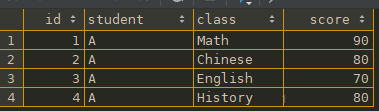

```mysql
SELECT any_value(id) id, any_value(student) student, any_value(class) class, any_value(score) score FROM `courses` GROUP BY `score`;
```

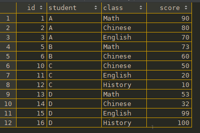


```mysql
SELECT
    any_value (id) id,
    group_concat(student SEPARATOR ' ||') student,
    group_concat(class ORDER BY class DESC SEPARATOR ' || ') class,
    any_value (score) score
FROM
    `courses`
GROUP BY
    `score`;
```

|               group_concat(DISTINCT, ORDER BY)               |
| :----------------------------------------------------------: |
| 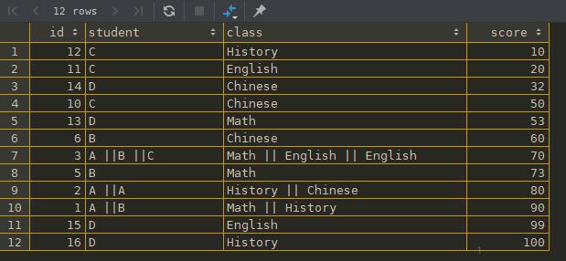 |


```mysql
SELECT any_value(id) id, student, class, any_value(score) score FROM `courses` GROUP BY class, student;
```

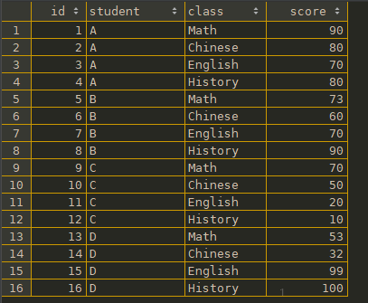


```mysql
SELECT any_value(id) id, student, class, any_value(score) score FROM `courses` GROUP BY student, class;
```

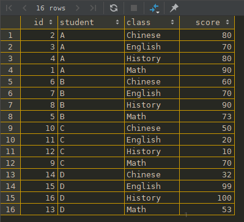

```mysql
-- 我们需要学生的成绩表，且每个学生每科的成绩按照由大到小的顺序排列
-- 错误结果
SELECT any_value(id) id, student, class, any_value(score) score FROM `courses` GROUP BY `student`,`class` ORDER BY `score` DESC;

-- 正确结果
SELECT any_value(id) id, student, class, any_value(score) score FROM `courses` GROUP BY `student`,`class` ORDER BY `student`,`score` DESC;
```

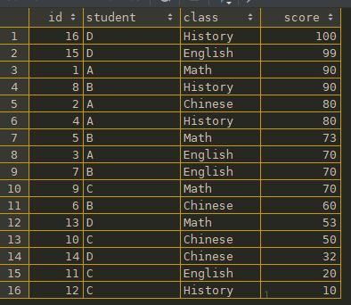


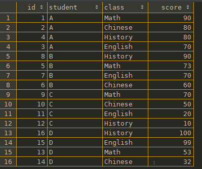

 


```mysql
-- 所有功课（除历史课）平均分达到60分的同学和他们的均分：

SELECT `student`, AVG(`score`) AS `avg_score`
FROM `courses`
GROUP BY `student`
HAVING AVG(`score`) >= 60
ORDER BY `avg_score` DESC;
```

SQL执行顺序：

`from` ... `where` ... `group by` ... `order by` ... `select`，`order by` 作用在整个记录，而不是每个分组上。

数据库编码需要使用utf8mb4 ，排序规则需要使用 utf8mb4_general_ci

- MySQL查询重复出现次数最多的记录

```mysql
SELECT keyword, count( * ) AS count  FROM table  GROUP BY keyword  HAVING count > 1 ORDER BY count DESC  LIMIT 20
```


## distinct

distinct去重，首先distinct必须放在查询字段的开头，如果放在中间或末尾，mysql会报错。

- 在对字段进行去重的时候，要保证distinct在所有字段的最前面
- 如果distinct关键字后面有多个字段时，则会对多个字段进行组合去重，只有多个字段组合起来的值是相等的才会被去重

例如：

```mysql
SELECT 
	DISTINCT wechat_pay_serial,
	order_id,
	serial,
	amount,
	fee,
	merchant_number,
	merchant_name,
	created_at,
	updated_at
FROM
	t_pay_order_bill
WHERE
	wechat_pay_serial IN (
		4349800623202007232922902116,
		4342100103202007243730646102,
		4323500622202007231116990334,
		4343600104202007242205187862,
		4323900101202007240796883042
	)
```

查询结果：还是出现2条重复的wechat_pay_serial。


所以一般distinct用来查询不重复记录的条数。

```mysql
count(distinct col_name)
```

如果查询不重复的记录，可以使用group by

## case

条件查询

```mysql
// 简单
CASE case_value
    WHEN when_value THEN statement_list
    [WHEN when_value THEN statement_list] ...
    [ELSE statement_list]
END CASE

// 搜索    
CASE
    WHEN search_condition THEN statement_list
    [WHEN search_condition THEN statement_list] ...
    [ELSE statement_list]
END CASE
```

```mysql
select id, `name`, 
(case `gender`
    when 1 then '男'
    when 2 then '女'
    else '未知'
end) as gender,

country_code,

(case 
    when country_code = 100 then '中国'
    when country_code = 110 then '英国'
    when country_code = 120 then '法国'
	else '美国' 
end) as country
from test_user;
```


## 多表update

```mysql
UPDATE table1 t1
JOIN table2 t2 ON t2.order_id = t1.order_id
SET t1.finish_order = 0,
t2.profit_status = 0
WHERE
t1.order_id = 5475175;
```


## 空值和null

+ 空值不占空间
+ For MyISAM tables, each NULL column takes one bit extra, rounded up to the nearest byte.
+ NOT NULL的字段不能插入NULL，只能插入"空值"
+ B树索引不会存储NULL值
+ 字段尽量NOT NULL
+ count()统计某列记录数，会忽略掉NULL，但"空值"会统计
+ 判断`NULL` 用`IS NULL` 或者 `IS NOT NULL`, `SQL`语句函数中可以使用`ifnull()`函数来进行处理，判断空字符用`=''`或者 `<>''`来进行处理
+ 对于`timestamp`数据类型，如果往这个数据类型插入的列插入`NULL`值，则出现的值是当前系统时间。插入空值，则会出现 `0000-00-00 00:00:00`

```mysql
DROP TABLE IF EXISTS `test_01`;
CREATE TABLE `test_01` (
  `id` int(10) unsigned NOT NULL AUTO_INCREMENT,
  `create_time` timestamp DEFAULT CURRENT_TIMESTAMP ON UPDATE CURRENT_TIMESTAMP,
  `update_time` timestamp NOT NULL DEFAULT CURRENT_TIMESTAMP ON UPDATE CURRENT_TIMESTAMP,
  PRIMARY KEY (`id`)
) ENGINE=InnoDB AUTO_INCREMENT=17 DEFAULT CHARSET=utf8mb4;

-- 执行插入
INSERT INTO test_01 (create_time, update_time) VALUES (NULL, '');
```

```mysql
-- 更新字段create_time NOT NULL
alter table test_01 modify create_time timestamp not null default CURRENT_TIMESTAMP;
```

|                     更新字段前 查询结果                      |                     更新字段后 查询结果                      |
| :----------------------------------------------------------: | :----------------------------------------------------------: |
| 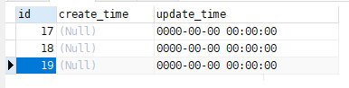 | 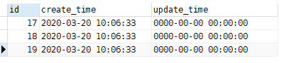 |

+ NULL 和 '空值'的length

  |                                                  |
  | :----------------------------------------------: |
  | 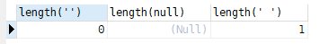 |

  
## 索引

```mysql
-- 查看表中index
show index from table_name;
```

表索引user_id、create_at、order_status


#### 一个条件查询

where条件中使用不等于操作符 <、>、 !=、 <>，不等于操作符会限制索引，即使字段上有索引。

1. 使用等号

```mysql
-- 使用 '=' 走索引
explain select * from orders where created_at = '2020-06-30 11:37:26';
```


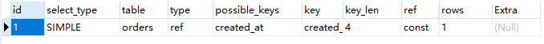

 2.使用不等号

```mysql
-- 使用不等号，不走索引，全表扫描
explain select * from orders where created_at != '2020-06-30 11:37:26';
explain select * from orders where created_at < '2020-06-30 11:37:26';
```


### OR查询

#### 筛选条件包含2条件


##### 两条等号非己条件，走索引

```mysql
explain select * from orders where id = 5476337 OR status = '2';
explain select * from orders where id = 5476337 OR created_at = '2020-06-30 11:37:26';
```

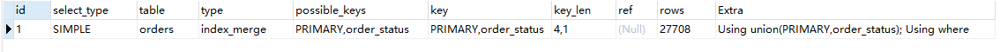

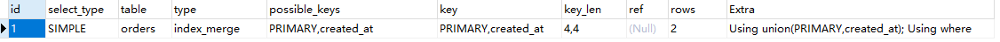


##### 两条不等号非己条件，不走索引

```mysql
explain select * from orders where id = 5476337 OR status != '2';
explain select * from orders where id = 5476337 OR created_at < '2020-06-30 11:37:26';
```

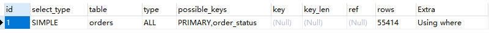

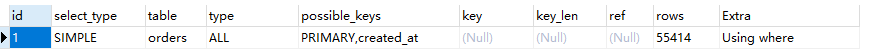


##### 两条等号自身条件，不走索引，全表扫描

```mysql
explain select * from orders where (status = 2 or status = 3);
explain select * from orders where status in (2,3)
```

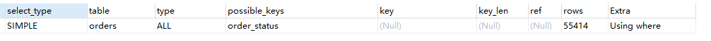


##### UNION ALL，走索引，使用零时表

```mysql
explain 
	select * from orders where status =2
union all 
	select * from orders where status =3;
```

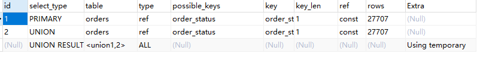

#### 筛选条件包含三个等号条件，不走索引，全表扫描

```mysql
explain select * from orders where id = 5476337 OR status = '2' OR created_at = '2020-06-30 11:37:26';
```


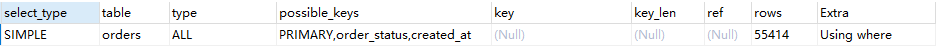


### 联合索引

+ 假设某个表有一个联合索引（c1,c2,c3,c4）以下选项哪些字段使用了该索引：
  
  
  
  ```sql
  A where c1=x and c2=x and c4>x and c3=x        四个字段均使用了该索引
  B where c1=x and c2=x and c4=x order by c3     c1，c2字段使用了该索引
  C where c1=x and c4= x group by c3,c2          c1字段使用该索引
  D where c1=? and c5=? order by c2,c3           c1字段使用该索引
  E where c1=? and c2=? and c5=? order by c2,c3  c1，c2字段使用了该索引
  ```


普通索引：idx_  唯一索引：uniq_  主键：pk_

索引的最左原则（左前缀原则），如（c1,c2,c3,c4....cN）的联合索引，where 条件按照索引建立的字段顺序来使用（不代表and条件必须按照顺序来写），如果中间某列没有条件，或使用like会导致后面的列不能使用索引。例如索引是key index (a,b,c). 可以支持**a** | **a,b**| **a,b,c** 3种组合进行查找，但不支持 b,c进行查找 .当最左侧字段是常量引用时，索引就十分有效。

如果where条件中是**OR**关系，加索引不起作用

如果我们分别创建**单个索引的话，mysql查询每次只能使用**一个索引

只要列中包含有NULL值都将不会被包含在索引中，复合索引中只要有**一列**含有**NULL值**，那么这一列对于此复合索引就是**无效**的。所以我们在数据库设计时不要让字段的默认值为NULL。

mysql查询只使用一个索引，因此如果where子句中已经使用了索引的话，那么order by中的列是不会使用索引的。因此数据库默认排序可以符合要求的情况下不要使用排序操作；尽量不要包含**多个列的排序**，如果需要最好给这些列创建**复合索引**。

一般情况下不鼓励使用like操作，如果非使用不可，如何使用也是一个问题。like “%aaa%” 不会使用索引而**like “aaa%”**可以使用索引。

NOT IN可以使用**NOT EXISTS代替**

order by 和group by 类似，字段顺序与索引一致时，会使用索引排序；字段顺序与索引不一致时，不使用索引。

索引也能用于分组和排序，分组要先排序，在计算平均值等等。所以在分组和排序中，如果字段顺序可以按照索引的字段顺序，即可利用索引的有序特性


### IN（xxx,xxx）筛选字段过多，例如1w多条

1. 不要在代码中直接传参数值，在SQL中关联子查询查出
2. 如果筛选字段符合某种规则，可以使用`like` 模糊查询
3. 如果筛选字段是连续数字，可以使用`between ... and ...`


### UNION 和 UNION ALL

union联表查询去重，union all不会去重


## JOIN


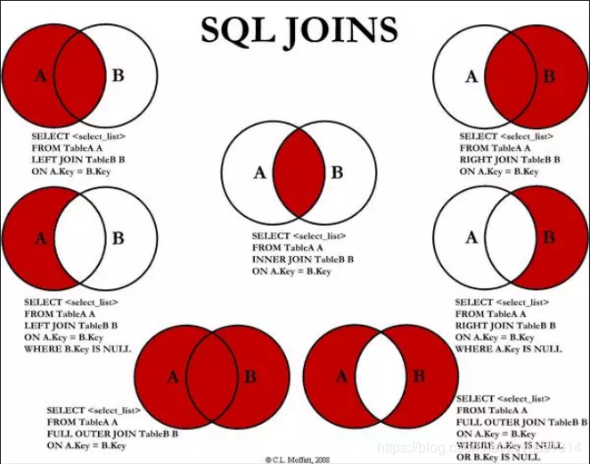


#### INNER JOIN（内连接）


```mysql
SELECT * FORM TABLE_A A INNER JOIN TABLE_B B ON A.KEY = B.KEY
```


#### LEFT JOIN（左连接）

```mysql
SELECT * FORM TABLE_A A LEFT JOIN TABLE_B B ON A.KEY = B.KEY
```


#### RIGHT JOIN（右连接）

```mysql
SELECT * FORM TABLE_A A RIGHT JOIN TABLE_B B ON A.KEY = B.KEY
```


#### OUTER JOIN（外连接）

```mysql
SELECT * FORM TABLE_A A OUTER JOIN TABLE_B B ON A.KEY = B.KEY

--  MySQL不支持OUTER JOIN
SELECT * FORM TABLE_A A LEFT JOIN TABLE_B B ON A.KEY = B.KEY
UNION
SELECT * FORM TABLE_A A RIGHT JOIN TABLE_B B ON A.KEY = B.KEY
```


#### LEFT JOIN EXCLUDING INNER JOIN (左连接 - 内连接)

```mysql
SELECT * FROM TABLE_A A LEFT JOIN TABLE_B ON A.KEY = B.KEY WHERE B.KEY IS NULL
```


#### RIGHT JOIN EXCLUDING INNER JOIN (右连接 - 内连接)

```mysql
SELECT * FROM TABLE_A A RIGHT JOIN TABLE_B B ON A.KEY = B.KEY WHERE A.KEY IS NULL
```


#### OUTER JOIN EXCLUDING INNER JOIN (外连接 - 内连接)

```mysql
SELECT * FROM TABLE_A FULL OUTER JOIN TABLE_B B ON A.KEY = B.KEY WHERE A.KEY IS NULL OR B.KEY IS NULL
--  MySQL不支持FULL OUTER JOIN
SELECT * FROM TABLE_A A LEFT JOIN TABLE_B ON A.KEY = B.KEY WHERE B.KEY IS NULL
UNION
SELECT * FROM TABLE_A A RIGHT JOIN TABLE_B B ON A.KEY = B.KEY WHERE A.KEY IS NULL
```


## explain

select 语句的执行计划。表的读取顺序、哪些索引可以使用、哪些索引时机使用，表之间的引用、每张表有多少行被优化器查询。

#### 1、id

按照select出现的顺序。简单子查询、派生表（from语句中的子查询）、union查询

#### 2、select_type 

1. simple：简单查询
2. primary：子查询中最外层的select
3. subquery：select中的子查询（不在from子句中）
4. deriverd：from子句中的子查询，存放在临时表
5. union：union中第二个或后面的select语句
6.  dependent  union：union中的第二个或后面的SELECT语句，取决于外面的查询
7. union  result：union的结果，union语句中第二个select开始后面所有select

#### 3、table

访问哪张表。from子查询时，<derivenN>，表示当前查询依赖id = N的查询，先执行id = N的查询；有union时，union result的table值位<union1, 2>，1和2 表示参与union的select行id

#### 4、type

NULL>system > const > eq_ref > ref > fulltext > ref_or_null > index_merge > unique_subquery > index_subquery > **range** > index > ALL，一般来说，至少达到range级别，最好ref。

1. system、const：常量，primary key 或 union key 与常量比较，返回最多一条
2. eq_ref：primary key 和 union key 连接使用，返回最多一条
3. ref：不使用唯一索引，而是使用普通索引或者唯一性索引的部分前缀
4. ref_or_null ：可以搜索值为null
5. index_merge：索引合并， 例如：id是主键，tenant_id是普通索引。or 的时候没有用 primary key，而是使用了 primary key(id) 和 tenant_id 索引
6. **range**：in(), between ,> ,<, >= 等操作中，使用一个索引来检索给定范围的行
7. index：扫描索引树
8. ALL：全表扫描

#### 5、possible_keys

查询时**可能**使用的索引。出现 `possible_keys` 有列，而`key` 显示NULL，因为表中数据不多，mysql认为索引对此查询帮助不大，选择全表查询；当该列是NULL，建议选择适当的索引。

#### 6、key

查询时**实际**使用的索引。

####  7、key_len

索引使用的字节数

#### 8、ref

在 `key` 列索引中使用的列或常量。见的有：const（常量），func，NULL，字段名

#### 9、rows

查询时读取的行数，不是结果集的行数。

#### 10、Extra

1. distinct：一旦找到与行相匹配的行，不找搜索
2. Using index：对
3. Using where：先读取整行数据，在按照where条件筛选
4. Using temporary：创建临时表，常见于排序和分组（group  by，order  by）一般需要优化
5. Using filesort：文件排序，order  by，一般需要优化

## 事务特性


###  隔离性 - isolation

#### 隔离性级别

##### 1、read uncommitted 读未提交

```
- 事务A和事务B，事务A未提交的数据，事务B可以读取到
- 这里读取到的数据叫做“脏数据”
- 这种隔离级别最低，这种级别一般是在理论上存在，数据库隔离级别一般都高于该级别
```

##### 2、read committed 读已提交

```
- 事务A和事务B，事务A提交的数据，事务B才能读取到
- 这种隔离级别高于读未提交
- 换句话说，对方事务提交之后的数据，我当前事务才能读取到
- 这种级别可以避免“脏数据”
- 这种隔离级别会导致“不可重复读取”
- Oracle默认隔离级别
```


##### 3、repeatable read 可重复读

```
- 事务A和事务B，事务A提交之后的数据，事务B读取不到
- 事务B是可重复读取数据
- 这种隔离级别高于读已提交
- 换句话说，对方提交之后的数据，我还是读取不到
- 这种隔离级别可以避免“不可重复读取”，达到可重复读取
- 比如1点和2点读到数据是同一个
- MySQL默认级别
- 虽然可以达到可重复读取，但是会导致“幻像读”
```

##### 4、serializable 串行化 

```
- 事务A和事务B，事务A在操作数据库时，事务B只能排队等待
- 这种隔离级别很少使用，吞吐量太低，用户体验差
- 这种级别可以避免“幻像读”，每一次读取的都是数据库中真实存在数据，事务A与事务B串行，而不并发
```

#### 设置隔离级别

##### 1、配置文件my.ini

```
– READ-UNCOMMITTED
– READ-COMMITTED
– REPEATABLE-READ
– SERIALIZABLE

[mysqld]
transaction-isolation = READ-COMMITTED
```


##### 2、动态设置

```
•   事务隔离级别的作用范围分为两种： 
–   全局级：对所有的会话有效 
–   会话级：只对当前的会话有效 
•   例如，设置会话级隔离级别为READ COMMITTED ：
mysql> SET TRANSACTION ISOLATION LEVEL READ COMMITTED；
或：
mysql> SET SESSION TRANSACTION ISOLATION LEVEL READ COMMITTED；
•   设置全局级隔离级别为READ COMMITTED ： 
mysql> SET GLOBAL TRANSACTION ISOLATION LEVEL READ COMMITTED；
```

