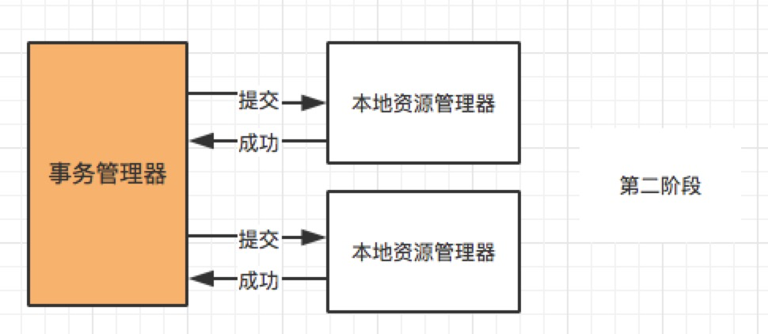

# 分布式事务

## 概念

### 本地事务


#### 四大特性：

**A**：Atomic 原子性 一个事务中所有操作，要不全部完成，要不全部不完成，事务在执行过程中发生错误，会被回滚到事务开始前的状态，就像这个事务没有被执行过一样。

**C**：Consistency 一致性 在一个事务执行之前和执行之后数据库都必须处于一致性状态，如果事务成功完成，那么系统中所有变化将正确应用。系统处于有效状态。如果在事务中出现错误，系统中所有变化都自动回滚，系统将返回到原始状态。

**I**：Isolation 隔离性 指的是在并发环境中，当不同的事务同时操纵相同的数据时，每个事务都有各自的完整数据空间。由并发事务所做的修改必须与任何其他并发事务所做的修改隔离。事务查看数据更新时，数据所处的状态要么是另一事务修改它之前的状态，要么是另一事务修改它之后的状态，事务不会查看到中间状态的数据。（打个比方，你买东西，是不会影响到其他人的。）

**D**：Durability 持久性 指的是只要事务成功结束，它对数据库所作的更新就必须永久保存下来。即使系统发生崩溃，重新启动数据库系统后，数据库还能恢复到事务成功结束时的状态


#### 事务的实现原理：

数据库不同的存储引擎可能会有一些区别。InnerDB存储引擎：

1、原子性实现原理：

通过数据库**Undo Log**实现的。事务中在操作任何数据之前，首先将原始数据备份到Undo Log然后进行数据的修改。如果事务中有任意操作发生异常或用户执行了 rollback 语句，那么数据库就会使用Undo Log中的备份将数据恢复到事务开始之前的状态。 

2、一致性实现原理：

与原子性实现原理一样也是利用**Undo Log**

3、持久性实现原理：

通过数据库**Redo Log**实现的，Redo Log与Undo Log 相反，Redo Log 记录的是新数据的备份，事务提交之前，会把数据备份到Redo Log中并持久化。当系统崩溃时，虽然数据没有持久化到数据库中，但是 Redo Log 已经持久化。系统可以根据 Redo Log 的内容，将所有数据恢复到最新的

4、隔离性实现原理：

隔离性的实现原理比较特殊，是通过**数据库锁**的机制实现的。

隔离性分四个级别：**读未提交**（Read uncommitted）、**读已提交**（Read committed）、**可重复读**（Repeatable reads）、**可序列化**(Serializable)

MySQL的默认隔离级别就是**`REPEATABLE_READ`** ，Oracle默认Read committed

4.1、读未提交：一个事务可以读到另外一个事务未提交的数据。

原理：事务在读数据的时候并未对数据进行加锁。

4.2、读已提交：一个事务可以读到另外一个事务提交的数据。

原理：使用排他锁（Exclusive Lock）和共享锁(Share lock) 。这里暂时称为R锁和S锁。R锁和W锁不能同时存在、当读操作时会加上R锁


#### 事务控制语法

```shell
BEGIN 或 START TRANSACTION     显式地开启一个事务；
COMMIT / COMMIT WORK    二者是等价的。提交事务，并使已对数据库进行的所有修改成为永久性的；
ROLLBACK / ROLLBACK WORK。    回滚会结束用户的事务，并撤销正在进行的所有未提交的修改；
SAVEPOINT identifier     在事务中创建一个保存点，一个事务中可以有多个 SAVEPOINT；
RELEASE SAVEPOINT identifier   删除一个事务的保存点；
ROLLBACK TO identifier    把事务回滚到标记点；
SET TRANSACTION    用来设置事务的隔离级别。
```


#### 什么是脏读、不可重复读、幻读

+ **脏读**

  在事务A修改数据之后提交数据之前，这时另一个事务B来读取数据，如果不加控制，事务B读取到A修改过数据，之后A又对数据做了修改再提交，则B读到的数据是脏数据，此过程称为脏读Dirty Read。

  

  

+ **不可重复读**

  一个事务内在读取某些数据后的某个时间，再次读取以前读过的数据，却发现其读出的数据已经发生了变更、或者某些记录已经被删除了。


+ **幻读**

  事务A在按查询条件读取某个范围的记录时，事务B又在该范围内插入了新的满足条件的记录，当事务A再次按条件查询记录时，会产生新的满足条件的记录（幻行 Phantom Row）


不可重复读和幻读区别？

+ 不可重复读：体现在**修改**；同一事务中，同样的条件，第一次读和第二次读的[数据]()不一样（其他事务提交了修改）

+ 幻读：体现在**新增和删除**。同一事务中，同样的条件，第一次读和第二次读的**记录数**不一样（其他事务提交了插入/删除）

注：https://mp.weixin.qq.com/s?__biz=Mzg2OTA0Njk0OA==&mid=2247485085&idx=1&sn=01e5c29c49f32886bc897af7632b34ba&chksm=cea24956f9d5c040a07e4d335219f11f888a2d32444c16cade3f69c294ae0a1e416bcd221fb6&token=1613452699&lang=zh_CN&scene=21#wechat_redirect


### 分布式事务

分布式事务指事务的参与者、支持事务的服务器、资源服务器以及事务管理器分别位于不同的分布式系统的不同节点之上。简单来说就是一个大的操作由两个或者更多的小的操作共同完成。而这些小的操作又分布在不同的网络主机上。这些操作，要么全部成功执行，要么全部不执行。所以本质来说，分布式事务就是为了保证不同数据库的数据一致性。

#### 产生场景

1. 微服务通过远程调用完成事务操作（跨JVM进程）

2. 单体系统访问多个数据库实例（跨数据库实例）

3. 多服务访问同一个数据库实例（跨JVM进程）

   

### 强一致性、弱一致性、最终一致性

#### 强一致性

任何一次读都能读到某个数据的最近一次写的数据。系统中的所有进程，看到的操作顺序，都和全局时钟下的顺序一致。简言之，在任意时刻，所有节点中的数据是一样的。


#### 弱一致性

数据更新后，如果能容忍后续的访问只能访问到部分或者全部访问不到，则是弱一致性。


#### 最终一致性

不保证在任意时刻任意节点上的同一份数据都是相同的，但是随着时间的迁移，不同节点上的同一份数据总是在向趋同的方向变化。简单说，就是在一段时间后，节点间的数据会最终达到一致状态。


## 基础理论

### CAP理论

**C** (Consistency一致性)：对某个指定的客户端来说，**写操作后的读操作能读取到最新的数据状态**。对于数据分布在不同节点上的数据来说，如果在某个节点更新了数据，那么在其他节点如果都能读取到这个的数据，那么就称为**强一致**，如果有某个节点没有读取到，那就是分布式不一致。

一、特性：

写入主数据库成功，则向从数据库查询更新数据也成功；

写入主数据库失败，则向从数据库查询更新数据也失败。

二、如何实现：

1、写入主数据库后要将数据更新同步到从数据库；

2、写入主数据库后，在向从数据库同步期间将从数据库锁定，待同步完成之后在释放锁，以免在新数据写入成功后，向从数据库查询到旧数据。

三、特点

1、存在数据同步过程，写操作的响应会有一定的延迟；

2、为保证数据一致性会对资源暂时锁定，待同步完成之后在释放锁定资源。

3、如果请求到数据同步失败的节点，则会返回错误信息，而不会返回旧数据。


**A** (Availability可用性)：非故障的节点在合理的时间内返回合理的响应(**不是错误和超时的响应**)。任何事务操作都可以得到响应结果，不会出现响应超时和响应错误。可用性的两个关键一个是合理的时间，一个是合理的响应。

​	合理的时间指的是请求不能被阻塞，应该在合理的时间给出返回；

​	合理的响应指的是系统应该明确返回结果并且结果是正确的，这里的正确指的是比如应该返回 50，而不是返回 40。

一、特性：

从数据库接收到查询请求，立即响应查询结果；

从数据库不允许出现响应超时和响应错误。

二、如何实现：

1、写入主数据库后要将数据更新同步到从数据库；

2、保证从数据库的可用性，不可将数据库锁定；

3、从数据库要返回查询的结果，即使不是最新的数据，如果旧数据也没有，就返回默认的信息，但不能返回错误和响应超时。

三、特点：

所有请求都有结果，不会出现错误和响应超时；


**P** (Partition tolerance分区容错性)：当出现网络分区后，系统能够继续工作。打个比方，这里集群有多台机器，有台机器网络出现了问题，但是这个集群仍然可以正常工作。

一、特性

主数据库向从数据库同步数据失败，在这种情况下不影响数据库的读写操作；

某一节点挂点不影响其它节点提供服务。

二、如何实现：

1、尽量使用异步操作数据库的数据同步；

2、添加从数据库的节点，其中一个节点挂掉，其它节点提供服务。

三、特点：

最基本的功能；


#### 组合方式：

CP、AP，一般分布式系统选择AP，其中银行的跨行转账、zk则是选用的CP，要求强一致性。


### BASE理论

BA（Basically Available）指分布式系统出现故障的时候允许损失一部分的可用性，保证核心功能可用。支持分区失败；

S（Soft state）表示柔性状态，指允许系统存在中间状态，这个中间状态不会影响系统整体的可用性，比如数据库读写分离的主从同步延迟等，也就是允许短时间内不同步；

E（Eventually consistent）表示最终一致性，数据最终是一致的，但是实时是不一致的。原子性和持久性必须从根本上保障，为了可用性、性能和服务降级的需要，只有降低一致性和隔离性的要求。

> 满足BASE理论的事务，称为“柔性事务”
>


#### 柔性事务

柔性事务中的服务模式：

1. 可查询操作：服务操作具有全局唯一的标识，操作唯一的确定的时间。
2. 幂等操作：重复调用多次产生的业务结果与调用一次产生的结果相同。一是通过业务操作实现幂等性，二是系统缓存所有请求与处理的结果，最后是检测到重复请求之后，自动返回之前的处理结果。
3. TCC操作：Try阶段，尝试执行业务，完成所有业务的检查，实现一致性；预留必须的业务资源，实现准隔离性。Confirm阶段：真正的去执行业务，不做任何检查，仅适用Try阶段预留的业务资源，Confirm操作还要满足幂等性。Cancel阶段：取消执行业务，释放Try阶段预留的业务资源，Cancel操作要满足幂等性。TCC与2PC(两阶段提交)协议的区别：TCC位于业务服务层而不是资源层，TCC没有单独准备阶段，Try操作兼备资源操作与准备的能力，TCC中Try操作可以灵活的选择业务资源，锁定粒度。TCC的开发成本比2PC高。实际上TCC也属于两阶段操作，但是TCC不等同于2PC操作。
4. 可补偿操作：Do阶段：真正的执行业务处理，业务处理结果外部可见。Compensate阶段：抵消或者部分撤销正向业务操作的业务结果，补偿操作满足幂等性。约束：补偿操作在业务上可行，由于业务执行结果未隔离或者补偿不完整带来的风险与成本可控。实际上，TCC的Confirm和Cancel操作可以看做是补偿操作。


## 分布式事务解决方案

### 2PC

两阶段提交协议，准备阶段（Prepare）和提交阶段（Commit）

角色：事务管理器和事务参与者，事务管理者负责决策整个分布式事务的提交和回滚，事务参与者负责自己本地事务的提交和回滚。

#### 方案

##### XA

基于数据库的XA协议实现2PC

- TX协议：应用或者应用服务器与事务管理器的接口。

- XA协议：全局事务管理器与资源管理器的接口。XA是由X/Open组织提出的分布式事务规范。该规范主要定义了全局事务管理器和局部资源管理器之间的接口。主流的数据库产品都实现了XA接口。XA接口是一个双向的系统接口，在事务管理器以及多个资源管理器之间作为通信桥梁。之所以需要XA是因为在分布式系统中从理论上讲两台机器是无法达到一致性状态的，因此引入一个单点进行协调。由全局事务管理器管理和协调的事务可以跨越多个资源和进程。全局事务管理器一般使用XA二阶段协议与数据库进行交互。

- AP：Application Program应用程序，可以理解为使用DTP（Data Tools Platform）的程序。

- RM：Resource Manager资源管理器，这里可以是一个DBMS或者消息服务器管理系统，应用程序通过资源管理器对资源进行控制，资源必须实现XA定义的接口。资源管理器负责控制和管理实际的资源。

- TM：Transaction Manager事务管理器，负责协调和管理事务，提供给AP编程接口以及管理资源管理器。事务管理器控制着全局事务，管理事务的生命周期，并且协调资源

  |                                                        |
| :----------------------------------------------------: |
  |  |
  |  |
  
  大致流程：
  
  第一阶段（prepare）：事务管理器TM向所有本地资源管理器RM发起请求，询问是否yes状态，所有参与者都将本地事务能否成功的消息反馈给协调者；
  
  第二阶段（commit/rollback）：事务管理器TM根据所有本地资源管理器RM的反馈，通知所有本地资源管理器RM，步调一致的在所有分支上提交或回滚。
  
  TM向AP提供应用程序编程接口，AP通过T提交、回滚事务；需要本地数据库支持XA协议，资源锁需要等待两个阶段结束才释放。
  
  存在的问题：
  
  1. 同步阻塞：当参与事务者存在占用公共资源的情况，其中一个占用了资源，其他事务参与者就只能阻塞等待资源释放，处于阻塞状态。
  2. 单点故障：一旦事务管理器出现故障，整个系统不可用
  3. 数据不一致：在阶段二，如果事务管理器只发送了部分 commit 消息，此时网络发生异常，那么只有部分参与者接收到 commit 消息，也就是说只有部分参与者提交了事务，使得系统数据不一致
  4. 不确定性：当协事务管理器发送 commit 之后，并且此时只有一个参与者收到了 commit，那么当该参与者与事务管理器同时宕机之后，重新选举的事务管理器无法确定该条消息是否提交成功。


##### Seata


### TCC

`Try-Confirm-Cancel`

Try阶段：尝试执行业务，完成所有业务的检查，实现一致性；预留必须的业务资源，实现准隔离性。

Confirm阶段：真正的去执行业务，不做任何检查，仅适用Try阶段预留的业务资源，Confirm操作还要满足幂等性。

Cancel阶段：取消执行业务，释放Try阶段预留的业务资源，Cancel操作要满足幂等性。

1. 解决了协调者单点，由主业务方发起并完成这个业务活动。业务活动管理器也变成多点，引入集群。
2. 同步阻塞：引入超时，超时后进行补偿，并且不会锁定整个资源，将资源转换为业务逻辑形式，粒度变小。
3. 数据一致性，有了补偿机制之后，由业务活动管理器控制一致性


TCC与2PC(两阶段提交)协议的区别：TCC位于业务服务层而不是资源层，TCC没有单独准备阶段，Try操作兼备资源操作与准备的能力，TCC中Try操作可以灵活的选择业务资源，锁定粒度。TCC的开发成本比2PC高。实际上TCC也属于两阶段操作，但是TCC不等同于2PC操作。


### 本地消息表

1. 当系统 A 被其他系统调用发生数据库表更操作，首先会更新数据库的业务表，其次会往相同数据库的消息表中插入一条数据，两个操作发生在同一个事务中
2. 系统 A 的脚本定期轮询本地消息往 mq 中写入一条消息，如果消息发送失败会进行重试
3. 系统 B 消费 mq 中的消息，并处理业务逻辑。如果本地事务处理失败，会在继续消费 mq 中的消息进行重试，如果业务上的失败，可以通知系统 A 进行回滚操作

|                                                             |
| :---------------------------------------------------------: |
|  |

实现的条件：

1. 消费者和生产者的接口幂等
2. 生产者需要创建额外的消息表
3. 需要提供补偿逻辑，如果消费者失败，需要生产者支持回滚操作

容错机制：

1. 1失败时，事务直接回滚
2. 2、3写MQ与消费MQ失败会进行重试
3. 业务失败系统B向系统A发起事务回滚操作


### 可靠消息最终一致性

当**事务发起方**执行完成本地事务后发送一条事务消息，**事务参与方**（消息消费者）一定能够接收消息并处理事务成功，达到最终事务一致性。

|                                                              |
| :----------------------------------------------------------: |
|  |

1. A 系统先向 MQ发送一条 prepare 消息，如果 prepare 消息发送失败，则直接取消操作
2. 如果消息发送成功，则执行本地事务
3. 如果本地事务执行成功，则向 MQ 发送一条 confirm 消息，如果发送失败，则发送回滚消息
4. B 系统定期消费 MQ中的 confirm 消息，执行本地事务，并发送 ack 消息。如果B系统中的本地事务失败，会一直不断重试，如果是业务失败，会向A系统发起回滚请求
5. MQ 会定期轮询所有 prepared 消息调用系统A提供的接口查询消息的处理情况，如果该 prepare 消息本地事务处理成功，则重新发送 confirm 消息，否则直接回滚该消息

#### 本地事务与消息发送的原子性问题

本地数据库操作失败与发送MQ失败两者之间的矛盾。

#### 事务参与方接收消息的可靠性

事务参与方如果接收消息失败，可以重复接受消息。

#### 消息重复消费问题

实现事务参与方方法幂等性。事务发起方可以回滚事务，而事务参与方无法回滚事务。

> 基于消息的最终一致性方案必须保证消费端在**业务上的操作没障碍**，它只允许系统异常的失败，不允许业务上的失败，比如在你业务上抛出个NPE之类的问题，导致你消费端执行事务失败，那就很难做到一致了。

https://www.jianshu.com/p/eb571e4065ec

### 最大努力通知

特点：业务活动的主动方在完成业务处理之后，向业务活动的被动方发送通知消息。主动方可以设置时间阶梯通知规则，在通知失败后按规则重复通知，直到通知N次后不再通知。同时主动方提供校对查询接口给被动方按需校对查询，用户恢复丢失的业务消息。

1. 系统 A 本地事务执行完之后，发送个消息到 MQ；
2. 这里会有个专门消费 MQ 的服务，这个服务会消费 MQ 并调用系统 B 的接口；
3. 要是系统 B 执行成功就 ok 了；要是系统 B 执行失败了，那么最大努力通知服务就定时尝试重新调用系统 B, 反复 N 次，最后还是不行就放弃。