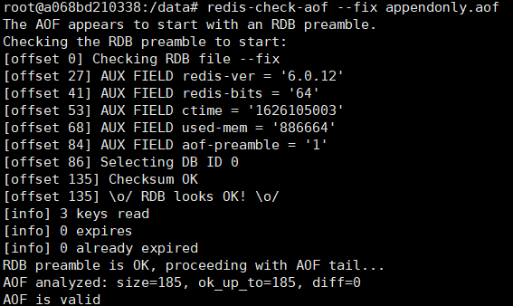
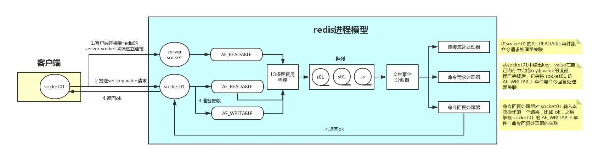
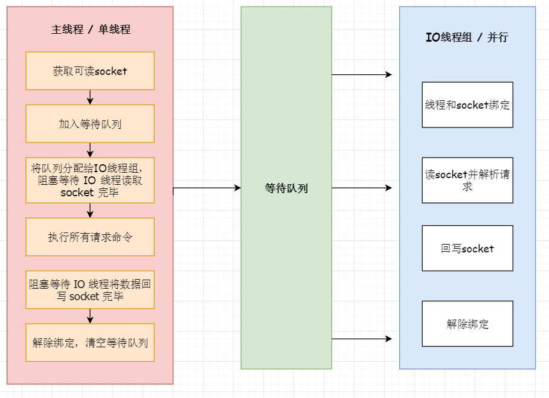

# Redis

## 数据类型

- **字符串（String）**：最大不能超过512MB

  i. int 长整型
  ii. embstr 短字符(<=39字节)
  iii. raw 长字符(>39)

- **列表（List）**

  压缩表（ZipList）：当列表的元素个数小于list-max-ziplist-entries配置（默认512个），同时列表中每个元素的值都小于list-max-ziplist-value配置时（默认64字节），Redis会选用ziplist来作为列表的内部实现来减少内存的使用。

  双向链表（LinkedList）：当列表类型无法满足ziplist的条件时，Redis会使用LinkedList作为列表的内部实现。

- **哈希（Hash）**

  压缩表：当field个数不超过hash-max-ziplist-entries（默认为512个）时，并且没有大value（64个字节以上算大）

  哈希表：ziplist的两个条件只要有一个不符合就会转换为hashtable

- **集合（Set）**

  整型集合：当集合中的元素都是整数且元素个数小于set-max-intset-entries配置（默认512个）时，Redis会选用intset来作为集合的内部实现，从而减少内存的使用。

  哈希表：当集合类型无法满足intset的条件时，Redis会使用hashtable作为集合的内部实现。

  i. 给用户添加标签（共同好友，共同兴趣）

  ii.抽奖：生成随机数,集合不能存放相同的元素,因此随机pop出一个元素,可以作为中奖的号码
  
- **有序集合（Sorted Set）**

  压缩表：当有序集合的元素个数小于zset-max-ziplist-entries配置（默认128个），同时每个元素的值都小于zset-max-ziplist-value配置（默认64字节）时，Redis会用ziplist来作为有序集合的内部实现，ziplist可以有效减少内存的使用。

  跳跃表：当ziplist条件不满足时，有序集合会使用skiplist作为内部实现，因为此时ziplist的读写效率会下降。

  i. 用户点赞数排行
  ii. 排行榜
  iii. 展示用户信息及用户分数

- **Bitmaps **：位图

  > 位存储

  统计用户信息，活跃数，打卡，只要2个状态的都可以使用Bitmaps.

  - SETBIT key offset value：指定偏移量原来储存的位
  - GETBIT key offset ：字符串值指定偏移量上的位(bit)
  - BITCOUNT  key [start] [end]：被设置为 `1` 的位的数量
  - BITPOS  key bit [start] [end]：整数回复
  - BITOP operation destkey key [key …]：保存到 `destkey` 的字符串的长度，和输入 `key` 中最长的字符串长度相等。
  - BITFIELD

- **HyperLogLog**：基数统计

  > 基数：不重复的元素

  存在一定范围内的误差

  - PFADD  key  element  [element ...\]：添加指定元素到 HyperLogLog 中。

  - PFCOUNT  key  [key ...\]：返回给定 HyperLogLog 的基数估算值。

  - PFMERGE destkey  sourcekey  [sourcekey ...\]：将多个 HyperLogLog 合并为一个 HyperLogLog

- **Streams**

- **Geo经纬度**

  推理地理位置、两地之间的距离，底层使用的**Zset**

  - GEOADD：添加地理位置的坐标。
  - GEOPOS：获取地理位置的坐标。
  - GEODIST：计算两个位置之间的距离。
  - GEORADIUS：根据用户给定的经纬度坐标来获取指定范围内的地理位置集合。
  - GEORADIUSBYMEMBER：根据储存在位置集合里面的某个地点获取指定范围内的地理位置集合，中心点是由给定的位置元素决定的， 而不是使用经度和纬度来决定中心点。
  - GEOHASH：返回一个或多个位置对象的 geohash 值。

  i. （我附近的人）


## 持久化配置

快照（RDB快照）和追加式文件（AOF文件），可以同时开启两种持久化方式，在这种情况下, 当redis重启的时候会优先载入AOF文件来恢复原始的数据，因为在通常情况下AOF文件保存的数据集要比RDB文件保存的数据集要完整。[RDB file]  [AOF tail]


### AOF（Append-Only File）

|                                                             |
| :---------------------------------------------------------: |
|  |
|   |

​		以日志的形式记录每个对服务器写操作，只许追加文件不可修改文件，当服务器重启的时候会重新执行这些命令来恢复原始的数据，AOF命令以redis协议追加保存每次写的操作到文件末尾，Redis还能对AOF文件进行后台重写，使得AOF文件的体积不至于过大。**appendonly.aof**文本文件

> appendonly       yes      # 默认不开启

执行流程：

1）所有的写入命令会追加到aof_buf中。

2）AOF缓冲区根据对应的策略向硬盘做同步操作。

3）随着AOF文件越来越大，需要定期对AOF文件进行重写，达到压缩的目的。

4）当Redis服务器重启时，可以加载AOF文件进行数据恢复。

**设置Redis调用fsync的频率**
推荐使用每秒fsync一次的方式（默认的方式），因为它速度快，安全性也不错。相关同步策略配置如下：

```shell
appendfsync   always       # 每次有数据修改时都会写入AOF文件
appendfsync   everysec     # 每秒同步一次，默认策略
appendfsync   no           # 从不同步，高效但不会持久化
```

其它配置项：

```shell
# 指定更新日志文件名，默认为appendonly.aof
appendfilename  appendonly.aof
# 设置为yes表示rewrite期间对新写操作不fsync，暂时存在内存中，等rewrite完成后再写入。Linux默认fsync策略是30秒。可能丢失30秒数据
no-appendfsync-on-rewrite yes
# 增长到一定大小的时候Redis能够调用bgrewriteaof对日志文件进行重写。当前AOF文件大小是上次日志重写得到AOF文件大小的二倍（设置为100）时，自动启动新的日志重写过程
auto-aof-rewrite-percentage  100
# 设置允许重写的最小aof文件大小，避免了达到约定百分比但尺寸仍然很小的情况还要重写
auto-aof-rewrite-min-size  64mb
```

> 缺点：数据量很大的时候，比RDB的启动效率低。

如果**appendonly.aof**出现损坏，`redis-check-aof --fix appendonly.aof`



### RDB文件（Redis  DataBase）

|                                                           |
| :-------------------------------------------------------: |
|                           |
|  |


```shell
save 900 1			# 900秒（15分钟）内有1个更改
save 300 10			# 300秒（5分钟）内有10个更改
save 60 10000		# 60秒内有10000个更改

stop-writes-on-bgsave-error yes

# 快照，可以设置是否进行压缩存储，LZF算法进行压缩
rdbcompression yes

# 数据校验
rdbchecksum yes

# 快照的文件名
dbfilename dump.rdb

rdb-del-sync-files no

# 快照文件的存放路径
dir ./
```

> 同步数据，在指定的时间间隔对数据进行快照存储。非常适用于数据的备份、灾难恢复。

**dump.rdb**二进制文件

执行流程：

1）执行bgsave命令，Redis父进程判断当前是否存在正在执行的子进程，如RDB/AOF子进程，如果存在bgsave命令直接返回。

2）父进程执行fork操作创建子进程，fork操作过程中父进程会阻塞，通过info stats命令查看latest_fork_usec选项，可以获取最近一个fork操作的耗时，单位为微秒。

3）父进程fork完成后，bgsave命令返回“Background saving started”信息并不再阻塞父进程，可以继续响应其他命令。

4）子进程创建RDB文件，根据父进程内存生成临时快照文件，完成后对原有文件进行原子替换。执行lastsave命令可以获取最后一次生成RDB的时间，对应info统计的rdb_last_save_time选项。

5）进程发送信号给父进程表示完成，父进程更新统计信息。

​		RDB在保存RDB文件时主进程唯一需要做的就是单独**fork出一个子进程**，接下来的写操作全部由子进程来做进行持久化，会先将数据写入到一个临时文件中，待持久化过程都结束了，在用这个临时文件替换上次的持久化好的文件。主进程不需要再做其它IO操作，所以RDB持久化方式可以最大化redis的性能。

缺点：不能实时保存数据，最后一次持久化的数据可能会在宕机的时候出现丢失

​		

> 恢复rdb文件？将rdb文件放在redis启动目录即可，会自动检查dump.rdb恢复其中的数据

1. RDB过程中Redis会停止对外服务吗？

2. 如果不会停止服务，如何处理新的请求？

   
   
   启动时会先检查AOF文件是否存在，如果不存在就尝试加载RDB。
   
   那么为什么会优先加载AOF呢？因为AOF保存的数据更完整。
   
   

### 混合持久化（4.x）

​		AOF重写时子进程将当前时间点的数据快照保存为RDB文件格式，而后将父进程积累命令保存为AOF格式。**[RDB file] [AOF tail]**

> aof-use-rdb-preamble   yes

加载Redis时，可以识别AOF文件是否以“redis”字符串开头，是，加载带前缀的RDB文件，之后继续加载AOF尾巴。


- 在RDB持久化模式中：可以使用*save*和*bgsave*命令进行数据持久化操作
- 在AOF持久化模式中：使用*rewriteaof*和*bgrewriteaof*命令进行持久化操作


原因：

内存存储，没有磁盘IO开销

单线程处理请求，避免线程切换和锁资源开销

非阻塞IO，多路复用IO

好的数据结构


1. 用来做缓存的Redis实例尽量不要开启持久化功能
2. 建议关闭RDB持久化功能，使用AOF持久化
3. 利用脚本定期在slave节点做RDB，实现数据备份
4. 实则合理的rewrite阀组，避免频繁的bgrewrite
5. 配置 `no-appendfsync-on-rewrite=yes`，禁止在rewrite期间做aof，避免因AOF引起的阻塞


## 过期删除策略

> 返回键的剩余生存时间：TTL <key> ：以秒的单位返回键 key 的剩余生存时间；PTTL <key> ：以毫秒的单位返回键 key 的剩余生存时间。

过期时间的判断：键 + 过期时间 -->  **过期字典**

- **惰性删除**（被动删除）

  放任过期键不管，在客户端访问这个key的时候，对key的过期时间进行检查，如果过期了就立即删除，不会给你返回任何东西。这样会导致很多过期key到了时间并没有被删除掉，除非你的系统去查一下那个 key，才会被Redis给删除掉

- **定期删除**（主动删除）

  Redis 会将每个设置了过期时间的 key 放入到一个独立的字典中，以后会定期遍历这个字典来删除到期的 key。

  Redis默认是每隔 100ms（**设置hz 10**）就**随机抽取**一些设置了过期时间的key，检查其是否过期，如果过期就删除。为什么要随机？假如 redis 存了几十万个 key ，每隔100ms就遍历所有的设置过期时间的 key 的话，就会给 CPU 带来很大的负载。而是采用了一种简单的贪心策略。

  ```
  # Not all tasks are performed with the same frequency, but Redis checks for
  # tasks to perform according to the specified "hz" value.
  #
  # By default "hz" is set to 10. Raising the value will use more CPU when
  # Redis is idle, but at the same time will make Redis more responsive when
  # there are many keys expiring at the same time, and timeouts may be
  # handled with more precision.
  #
  # The range is between 1 and 500, however a value over 100 is usually not
  # a good idea. Most users should use the default of 10 and raise this up to
  # 100 only in environments where very low latency is required.
  # 定期删除函数的运行频率
  hz 10
  
  # 设置最大内存，通常会设定其为物理内存的四分之三
  # maxmemory <bytes>
  ```

  

> 总结：定期删除是集中处理，惰性删除是零散处理。Redis采用惰性删除和定期删除这两种方式组合进行的


非字符串的bigKey，不要使用del删除，删除的时候建议采用渐进式的方式来完成：hscan、ltrim、sscan、zscan。

> 如果你使用Redis 4.0+，一条异步删除unlink就解决
>


不管是定期采样删除还是惰性删除都不是一种完全精准的删除，就还是会存在key没有被删除掉的场景，所以就需要内存淘汰策略进行补充。


## 内存淘汰策略

当超过能够使用的最大内存（大于**maxmemory**）时，便会触发主动淘汰内存方式，设置**maxmemory-policy**（最大内存淘汰策略），保证机器有20% -  30%的闲置内存

LRU（Least Recently Used）：最少最近使用，用当前时间减去最后一次访问时间，值越大则淘汰优先级越高。其核心思想是“**如果数据最近被访问过，那么将来被访问的几率也更高**”。

LFU（Least Frequently Used）：最少频率使用，统计每个key的访问频率，值越小淘汰优先级越高。其核心思想是“**如果数据过去被访问多次，那么将来被访问的频率也更高**”。

策略种类：

- **noeviction**：不淘汰任何数据，当内存不足时，拒绝所有写入操作，Redis 默认内存淘汰策略；

- **allkeys-lru**：淘汰整个键值中最久未使用的键值；

- **allkeys-random**：随机淘汰任意键值;

- **allkeys-lfu**：淘汰整个键值中最少使用使用频率最低的的键值。（4.0之后）

- **volatile-lru**：淘汰所有设置了过期时间的键值中最久未使用的键值；（默认）

- **volatile-random**：随机淘汰设置了过期时间的任意键值；

- **volatile-ttl**：从已设置过期时间的数据集中挑选将要过期的数据淘汰

- **volatile-lfu**：淘汰所有设置了过期时间的键值中，使用频率最低的键值；（4.0之后）


> 其中 allkeys-xxx 表示从所有的键值中淘汰数据，而 volatile-xxx 表示从设置了过期键的键值中淘汰数据。
> 过期键值：贪心策略

建议：内存淘汰策略设置为***volatile-lru***

```
############################## MEMORY MANAGEMENT ################################

# maxmemory <bytes>

# MAXMEMORY POLICY: how Redis will select what to remove when maxmemory
# is reached. You can select one from the following behaviors:
#
# volatile-lru -> Evict using approximated LRU, only keys with an expire set.
# allkeys-lru -> Evict any key using approximated LRU.
# volatile-lfu -> Evict using approximated LFU, only keys with an expire set.
# allkeys-lfu -> Evict any key using approximated LFU.
# volatile-random -> Remove a random key having an expire set.
# allkeys-random -> Remove a random key, any key.
# volatile-ttl -> Remove the key with the nearest expire time (minor TTL)
# noeviction -> Don't evict anything, just return an error on write operations.
#
# LRU means Least Recently Used
# LFU means Least Frequently Used
# Both LRU, LFU and volatile-ttl are implemented using approximated randomized algorithms.
#
# Note: with any of the above policies, Redis will return an error on write
#       operations, when there are no suitable keys for eviction.
#
#       At the date of writing these commands are: set setnx setex append
#       incr decr rpush lpush rpushx lpushx linsert lset rpoplpush sadd
#       sinter sinterstore sunion sunionstore sdiff sdiffstore zadd zincrby
#       zunionstore zinterstore hset hsetnx hmset hincrby incrby decrby
#       getset mset msetnx exec sort
# Redis默认内存淘汰策略
# maxmemory-policy noeviction

# LRU, LFU and minimal TTL algorithms are not precise algorithms but approximated
# algorithms (in order to save memory), so you can tune it for speed or
# accuracy. For default Redis will check five keys and pick the one that was
# used less recently, you can change the sample size using the following
# configuration directive.
#
# The default of 5 produces good enough results. 10 Approximates very closely
# true LRU but costs more CPU. 3 is faster but not very accurate.
# 随机挑选样例的数据
# maxmemory-samples 5

# Starting from Redis 5, by default a replica will ignore its maxmemory setting
# (unless it is promoted to master after a failover or manually). It means
# that the eviction of keys will be just handled by the master, sending the
# DEL commands to the replica as keys evict in the master side.
#
# This behavior ensures that masters and replicas stay consistent, and is usually
# what you want, however if your replica is writable, or you want the replica
# to have a different memory setting, and you are sure all the writes performed
# to the replica are idempotent, then you may change this default (but be sure
# to understand what you are doing).
#
# Note that since the replica by default does not evict, it may end using more
# memory than the one set via maxmemory (there are certain buffers that may
# be larger on the replica, or data structures may sometimes take more memory
# and so forth). So make sure you monitor your replicas and make sure they
# have enough memory to never hit a real out-of-memory condition before the
# master hits the configured maxmemory setting.
#
# replica-ignore-maxmemory yes

# Redis reclaims expired keys in two ways: upon access when those keys are
# found to be expired, and also in background, in what is called the
# "active expire key". The key space is slowly and interactively scanned
# looking for expired keys to reclaim, so that it is possible to free memory
# of keys that are expired and will never be accessed again in a short time.
#
# The default effort of the expire cycle will try to avoid having more than
# ten percent of expired keys still in memory, and will try to avoid consuming
# more than 25% of total memory and to add latency to the system. However
# it is possible to increase the expire "effort" that is normally set to
# "1", to a greater value, up to the value "10". At its maximum value the
# system will use more CPU, longer cycles (and technically may introduce
# more latency), and will tollerate less already expired keys still present
# in the system. It's a tradeoff betweeen memory, CPU and latecy.
#
# active-expire-effort 1
```


## 事务

事务实现基于COMMANDS队列，不支持rollback。只保证一致性和隔离性，不满足原子性和持久性。

watch机制（乐观锁）监控key发生变化

- MULTI：标记事务的开始；
- EXEC：执行事务的commands队列；
- DISCARD：结束事务，并清除commands队列；

## 配置文件

- INCLUDES

```
################################## INCLUDES ###################################
#
# include /path/to/local.conf
# include /path/to/other.conf
```

如果将此配置写在redis.conf 文件的开头，那么后面的配置会覆盖引入文件的配置，如果想以引入文件的配置为主，那么需要将 include 配置写在 redis.conf 文件的末尾

- MODULES

```
################################## MODULES #####################################

# Load modules at startup. If the server is not able to load modules
# it will abort. It is possible to use multiple loadmodule directives.
#
# loadmodule /path/to/my_module.so
# loadmodule /path/to/other_module.so
```

redis3.0的爆炸功能是新增了集群，而redis4.0就是在3.0的基础上新增了许多功能，其中这里的自定义模块配置就是其中之一 。loadmodule 配置将引入自定义模块来新增一些功能

-  NETWORK

```
################################## NETWORK #####################################

# By default, if no "bind" configuration directive is specified, Redis listens
# for connections from all the network interfaces available on the server.
# It is possible to listen to just one or multiple selected interfaces using
# the "bind" configuration directive, followed by one or more IP addresses.
#
# Examples:
#
# bind 192.168.1.100 10.0.0.1
# bind 127.0.0.1 ::1

# ~~~~~~~~~~~~~~~~~~~~~~~~~~~~~~~~~~~~~~~~~~~~~~~~~~~~~~~~~~~~~~~~~~~~~~~~
bind 127.0.0.1
port 6379
timeout 0
tcp-keepalive 300
```

①、bind：绑定redis服务器网卡IP，默认为127.0.0.1，即本地回环地址。这样的话，访问redis服务只能通过本机的客户端连接，而无法通过远程连接。如果bind选项为空的话，那会接受所有来自于可用网络接口的连接。

②、port：指定redis运行的端口，默认是6379。由于Redis是单线程模型，因此单机开多个Redis进程的时候会修改端口。

③、timeout：设置客户端连接时的超时时间，单位为秒。当客户端在这段时间内没有发出任何指令，那么关闭该连接。默认值为0，表示不关闭。

④、tcp-keepalive ：单位是秒，表示将周期性的使用SO_KEEPALIVE检测客户端是否还处于健康状态，避免服务器一直阻塞，官方给出的建议值是300s，如果设置为0，则不会周期性的检测。

-  GENERAL

```
################################# GENERAL #####################################

# By default Redis does not run as a daemon. Use 'yes' if you need it.
# Note that Redis will write a pid file in /var/run/redis.pid when daemonized.
daemonize no

# If you run Redis from upstart or systemd, Redis can interact with your
# supervision tree. Options:
#   supervised no      - no supervision interaction
#   supervised upstart - signal upstart by putting Redis into SIGSTOP mode
#   supervised systemd - signal systemd by writing READY=1 to $NOTIFY_SOCKET
#   supervised auto    - detect upstart or systemd method based on
#                        UPSTART_JOB or NOTIFY_SOCKET environment variables
# Note: these supervision methods only signal "process is ready."
#       They do not enable continuous liveness pings back to your supervisor.
supervised no

pidfile /var/run/redis_6379.pid

# Specify the server verbosity level.
# This can be one of:
# debug (a lot of information, useful for development/testing)
# verbose (many rarely useful info, but not a mess like the debug level)
# notice (moderately verbose, what you want in production probably)
# warning (only very important / critical messages are logged)
loglevel notice

# output for logging but daemonize, logs will be sent to /dev/null
logfile ""

# To enable logging to the system logger, just set 'syslog-enabled' to yes,
# and optionally update the other syslog parameters to suit your needs.
# syslog-enabled no

# Specify the syslog identity.
# syslog-ident redis

# Specify the syslog facility. Must be USER or between LOCAL0-LOCAL7.
# syslog-facility local0

# 设置数据库的数目
databases 16

always-show-logo yes
```

通用配置

①、daemonize：设置为yes表示指定Redis以守护进程的方式启动（后台启动）。默认值为 no

②、pidfile：配置PID文件路径，当redis作为守护进程运行的时候，它会把 pid 默认写到 /var/redis/run/redis_6379.pid 文件里面

③、loglevel ：定义日志级别。默认值为notice，有如下4种取值：

　　debug（记录大量日志信息，适用于开发、测试阶段）

　　verbose（较多日志信息）

　　notice（适量日志信息，使用于生产环境）

　　warning（仅有部分重要、关键信息才会被记录）

④、logfile ：配置log文件地址,默认打印在命令行终端的窗口上

⑤、databases：设置数据库的数目。默认的数据库是DB 0 ，可以在每个连接上使用select <dbid> 命令选择一个不同的数据库，dbid是一个介于0到databases - 1 之间的数值。默认值是 16，也就是说默认Redis有16个数据库。

- SNAPSHOTTING

```
################################ SNAPSHOTTING  ################################
#
#   save <seconds> <changes>
#   In the example below the behaviour will be to save:
#   after 900 sec (15 min) if at least 1 key changed
#   after 300 sec (5 min) if at least 10 keys changed
#   after 60 sec if at least 10000 keys changed

save 900 1
save 300 10
save 60 10000

stop-writes-on-bgsave-error yes

# 快照，可以设置是否进行压缩存储，LZF算法进行压缩。
rdbcompression yes

# Since version 5 of RDB a CRC64 checksum is placed at the end of the file.
# This makes the format more resistant to corruption but there is a performance
# hit to pay (around 10%) when saving and loading RDB files, so you can disable it
# for maximum performances.
#
# RDB files created with checksum disabled have a checksum of zero that will
# tell the loading code to skip the check.
# 数据校验
rdbchecksum yes

# 快照的文件名
dbfilename dump.rdb

# Remove RDB files used by replication in instances without persistence
# enabled. By default this option is disabled, however there are environments
# where for regulations or other security concerns, RDB files persisted on
# disk by masters in order to feed replicas, or stored on disk by replicas
# in order to load them for the initial synchronization, should be deleted
# ASAP. Note that this option ONLY WORKS in instances that have both AOF
# and RDB persistence disabled, otherwise is completely ignored.
#
# An alternative (and sometimes better) way to obtain the same effect is
# to use diskless replication on both master and replicas instances. However
# in the case of replicas, diskless is not always an option.
rdb-del-sync-files no

# The working directory.
# Note that you must specify a directory here, not a file name.
# 快照文件的存放路径
dir ./
```

快照，持久化配置

①、save：这里是用来配置触发 Redis的持久化条件，也就是什么时候将内存中的数据保存到硬盘

②、stop-writes-on-bgsave-error ：默认值为yes。当启用了RDB且最后一次后台保存数据失败，Redis是否停止接收数据。这会让用户意识到数据没有正确持久化到磁盘上，否则没有人会注意到灾难（disaster）发生了。如果Redis重启了，那么又可以重新开始接收数据了

③、rdbcompression ；默认值是yes。对于存储到磁盘中的快照，可以设置是否进行压缩存储。如果是的话，redis会采用LZF算法进行压缩。如果你不想消耗CPU来进行压缩的话，可以设置为关闭此功能，但是存储在磁盘上的快照会比较大。

④、rdbchecksum ：默认值是yes。在存储快照后，我们还可以让redis使用CRC64算法来进行数据校验，但是这样做会增加大约10%的性能消耗，如果希望获取到最大的性能提升，可以关闭此功能。

⑤、dbfilename ：设置快照的文件名，默认是 dump.rdb

⑥、dir：设置快照文件的存放路径，这个配置项一定是个目录，而不能是文件名。使用上面的 dbfilename 作为保存的文件名。

- REPLICATION

```
################################# REPLICATION #################################

# Master-Replica replication. Use replicaof to make a Redis instance a copy of
# another Redis server. A few things to understand ASAP about Redis replication.
#
#   +------------------+      +---------------+
#   |      Master      | ---> |    Replica    |
#   | (receive writes) |      |  (exact copy) |
#   +------------------+      +---------------+
#
# 1) Redis replication is asynchronous, but you can configure a master to
#    stop accepting writes if it appears to be not connected with at least
#    a given number of replicas.
# 2) Redis replicas are able to perform a partial resynchronization with the
#    master if the replication link is lost for a relatively small amount of
#    time. You may want to configure the replication backlog size (see the next
#    sections of this file) with a sensible value depending on your needs.
# 3) Replication is automatic and does not need user intervention. After a
#    network partition replicas automatically try to reconnect to masters
#    and resynchronize with them.
#
# replicaof <masterip> <masterport>

# If the master is password protected (using the "requirepass" configuration
# directive below) it is possible to tell the replica to authenticate before
# starting the replication synchronization process, otherwise the master will
# refuse the replica request.
#
# masterauth <master-password>
#
# However this is not enough if you are using Redis ACLs (for Redis version
# 6 or greater), and the default user is not capable of running the PSYNC
# command and/or other commands needed for replication. In this case it's
# better to configure a special user to use with replication, and specify the
# masteruser configuration as such:
#
# masteruser <username>
#
# When masteruser is specified, the replica will authenticate against its
# master using the new AUTH form: AUTH <username> <password>.

# When a replica loses its connection with the master, or when the replication
# is still in progress, the replica can act in two different ways:
#
# 1) if replica-serve-stale-data is set to 'yes' (the default) the replica will
#    still reply to client requests, possibly with out of date data, or the
#    data set may just be empty if this is the first synchronization.
#
# 2) if replica-serve-stale-data is set to 'no' the replica will reply with
#    an error "SYNC with master in progress" to all the kind of commands
#    but to INFO, replicaOF, AUTH, PING, SHUTDOWN, REPLCONF, ROLE, CONFIG,
#    SUBSCRIBE, UNSUBSCRIBE, PSUBSCRIBE, PUNSUBSCRIBE, PUBLISH, PUBSUB,
#    COMMAND, POST, HOST: and LATENCY.
#
replica-serve-stale-data yes

# You can configure a replica instance to accept writes or not. Writing against
# a replica instance may be useful to store some ephemeral data (because data
# written on a replica will be easily deleted after resync with the master) but
# may also cause problems if clients are writing to it because of a
# misconfiguration.
#
# Since Redis 2.6 by default replicas are read-only.
#
# Note: read only replicas are not designed to be exposed to untrusted clients
# on the internet. It's just a protection layer against misuse of the instance.
# Still a read only replica exports by default all the administrative commands
# such as CONFIG, DEBUG, and so forth. To a limited extent you can improve
# security of read only replicas using 'rename-command' to shadow all the
# administrative / dangerous commands.
replica-read-only yes

# Replication SYNC strategy: disk or socket.
#
# New replicas and reconnecting replicas that are not able to continue the
# replication process just receiving differences, need to do what is called a
# "full synchronization". An RDB file is transmitted from the master to the
# replicas.
#
# The transmission can happen in two different ways:
#
# 1) Disk-backed: The Redis master creates a new process that writes the RDB
#                 file on disk. Later the file is transferred by the parent
#                 process to the replicas incrementally.
# 2) Diskless: The Redis master creates a new process that directly writes the
#              RDB file to replica sockets, without touching the disk at all.
#
# With disk-backed replication, while the RDB file is generated, more replicas
# can be queued and served with the RDB file as soon as the current child
# producing the RDB file finishes its work. With diskless replication instead
# once the transfer starts, new replicas arriving will be queued and a new
# transfer will start when the current one terminates.
#
# When diskless replication is used, the master waits a configurable amount of
# time (in seconds) before starting the transfer in the hope that multiple
# replicas will arrive and the transfer can be parallelized.
#
# With slow disks and fast (large bandwidth) networks, diskless replication
# works better.
repl-diskless-sync no

# When diskless replication is enabled, it is possible to configure the delay
# the server waits in order to spawn the child that transfers the RDB via socket
# to the replicas.
#
# This is important since once the transfer starts, it is not possible to serve
# new replicas arriving, that will be queued for the next RDB transfer, so the
# server waits a delay in order to let more replicas arrive.
#
# The delay is specified in seconds, and by default is 5 seconds. To disable
# it entirely just set it to 0 seconds and the transfer will start ASAP.
repl-diskless-sync-delay 5

# -----------------------------------------------------------------------------
# WARNING: RDB diskless load is experimental. Since in this setup the replica
# does not immediately store an RDB on disk, it may cause data loss during
# failovers. RDB diskless load + Redis modules not handling I/O reads may also
# cause Redis to abort in case of I/O errors during the initial synchronization
# stage with the master. Use only if your do what you are doing.
# -----------------------------------------------------------------------------
#
# Replica can load the RDB it reads from the replication link directly from the
# socket, or store the RDB to a file and read that file after it was completely
# recived from the master.
#
# In many cases the disk is slower than the network, and storing and loading
# the RDB file may increase replication time (and even increase the master's
# Copy on Write memory and salve buffers).
# However, parsing the RDB file directly from the socket may mean that we have
# to flush the contents of the current database before the full rdb was
# received. For this reason we have the following options:
#
# "disabled"    - Don't use diskless load (store the rdb file to the disk first)
# "on-empty-db" - Use diskless load only when it is completely safe.
# "swapdb"      - Keep a copy of the current db contents in RAM while parsing
#                 the data directly from the socket. note that this requires
#                 sufficient memory, if you don't have it, you risk an OOM kill.
repl-diskless-load disabled

# Replicas send PINGs to server in a predefined interval. It's possible to
# change this interval with the repl_ping_replica_period option. The default
# value is 10 seconds.
#
# repl-ping-replica-period 10

# The following option sets the replication timeout for:
#
# 1) Bulk transfer I/O during SYNC, from the point of view of replica.
# 2) Master timeout from the point of view of replicas (data, pings).
# 3) Replica timeout from the point of view of masters (REPLCONF ACK pings).
#
# It is important to make sure that this value is greater than the value
# specified for repl-ping-replica-period otherwise a timeout will be detected
# every time there is low traffic between the master and the replica.
#
# repl-timeout 60

# Disable TCP_NODELAY on the replica socket after SYNC?
#
# If you select "yes" Redis will use a smaller number of TCP packets and
# less bandwidth to send data to replicas. But this can add a delay for
# the data to appear on the replica side, up to 40 milliseconds with
# Linux kernels using a default configuration.
#
# If you select "no" the delay for data to appear on the replica side will
# be reduced but more bandwidth will be used for replication.
#
# By default we optimize for low latency, but in very high traffic conditions
# or when the master and replicas are many hops away, turning this to "yes" may
# be a good idea.
repl-disable-tcp-nodelay no

# Set the replication backlog size. The backlog is a buffer that accumulates
# replica data when replicas are disconnected for some time, so that when a
# replica wants to reconnect again, often a full resync is not needed, but a
# partial resync is enough, just passing the portion of data the replica
# missed while disconnected.
#
# The bigger the replication backlog, the longer the time the replica can be
# disconnected and later be able to perform a partial resynchronization.
#
# The backlog is only allocated once there is at least a replica connected.
#
# repl-backlog-size 1mb

# After a master has no longer connected replicas for some time, the backlog
# will be freed. The following option configures the amount of seconds that
# need to elapse, starting from the time the last replica disconnected, for
# the backlog buffer to be freed.
#
# Note that replicas never free the backlog for timeout, since they may be
# promoted to masters later, and should be able to correctly "partially
# resynchronize" with the replicas: hence they should always accumulate backlog.
#
# A value of 0 means to never release the backlog.
#
# repl-backlog-ttl 3600

# The replica priority is an integer number published by Redis in the INFO
# output. It is used by Redis Sentinel in order to select a replica to promote
# into a master if the master is no longer working correctly.
#
# A replica with a low priority number is considered better for promotion, so
# for instance if there are three replicas with priority 10, 100, 25 Sentinel
# will pick the one with priority 10, that is the lowest.
#
# However a special priority of 0 marks the replica as not able to perform the
# role of master, so a replica with priority of 0 will never be selected by
# Redis Sentinel for promotion.
#
# By default the priority is 100.
replica-priority 100

# It is possible for a master to stop accepting writes if there are less than
# N replicas connected, having a lag less or equal than M seconds.
#
# The N replicas need to be in "online" state.
#
# The lag in seconds, that must be <= the specified value, is calculated from
# the last ping received from the replica, that is usually sent every second.
#
# This option does not GUARANTEE that N replicas will accept the write, but
# will limit the window of exposure for lost writes in case not enough replicas
# are available, to the specified number of seconds.
#
# For example to require at least 3 replicas with a lag <= 10 seconds use:
#
# min-replicas-to-write 3
# min-replicas-max-lag 10
#
# Setting one or the other to 0 disables the feature.
#
# By default min-replicas-to-write is set to 0 (feature disabled) and
# min-replicas-max-lag is set to 10.

# A Redis master is able to list the address and port of the attached
# replicas in different ways. For example the "INFO replication" section
# offers this information, which is used, among other tools, by
# Redis Sentinel in order to discover replica instances.
# Another place where this info is available is in the output of the
# "ROLE" command of a master.
#
# The listed IP and address normally reported by a replica is obtained
# in the following way:
#
#   IP: The address is auto detected by checking the peer address
#   of the socket used by the replica to connect with the master.
#
#   Port: The port is communicated by the replica during the replication
#   handshake, and is normally the port that the replica is using to
#   listen for connections.
#
# However when port forwarding or Network Address Translation (NAT) is
# used, the replica may be actually reachable via different IP and port
# pairs. The following two options can be used by a replica in order to
# report to its master a specific set of IP and port, so that both INFO
# and ROLE will report those values.
#
# There is no need to use both the options if you need to override just
# the port or the IP address.
#
# replica-announce-ip 5.5.5.5
# replica-announce-port 1234
```


①、slave-serve-stale-data：默认值为yes。当一个 slave 与 master 失去联系，或者复制正在进行的时候，slave 可能会有两种表现：

 　　1) 如果为 yes ，slave 仍然会应答客户端请求，但返回的数据可能是过时，或者数据可能是空的在第一次同步的时候 

 　　2) 如果为 no ，在你执行除了 info he salveof 之外的其他命令时，slave 都将返回一个 "SYNC with master in progress" 的错误

②、slave-read-only：配置Redis的Slave实例是否接受写操作，即Slave是否为只读Redis。默认值为yes。

③、repl-diskless-sync：主从数据复制是否使用无硬盘复制功能。默认值为no。

④、repl-diskless-sync-delay：当启用无硬盘备份，服务器等待一段时间后才会通过套接字向从站传送RDB文件，这个等待时间是可配置的。 这一点很重要，因为一旦传送开始，就不可能再为一个新到达的从站服务。从站则要排队等待下一次RDB传送。因此服务器等待一段 时间以期更多的从站到达。延迟时间以秒为单位，默认为5秒。要关掉这一功能，只需将它设置为0秒，传送会立即启动。默认值为5。

⑤、repl-disable-tcp-nodelay：同步之后是否禁用从站上的TCP_NODELAY 如果你选择yes，redis会使用较少量的TCP包和带宽向从站发送数据。但这会导致在从站增加一点数据的延时。 Linux内核默认配置情况下最多40毫秒的延时。如果选择no，从站的数据延时不会那么多，但备份需要的带宽相对较多。默认情况下我们将潜在因素优化，但在高负载情况下或者在主从站都跳的情况下，把它切换为yes是个好主意。默认值为no。

- SECURITY

```
################################## SECURITY ###################################

# Warning: since Redis is pretty fast an outside user can try up to
# 1 million passwords per second against a modern box. This means that you
# should use very strong passwords, otherwise they will be very easy to break.
# Note that because the password is really a shared secret between the client
# and the server, and should not be memorized by any human, the password
# can be easily a long string from /dev/urandom or whatever, so by using a
# long and unguessable password no brute force attack will be possible.

# Redis ACL users are defined in the following format:
#
#   user <username> ... acl rules ...
#
# For example:
#
#   user worker +@list +@connection ~jobs:* on >ffa9203c493aa99
#
# The special username "default" is used for new connections. If this user
# has the "nopass" rule, then new connections will be immediately authenticated
# as the "default" user without the need of any password provided via the
# AUTH command. Otherwise if the "default" user is not flagged with "nopass"
# the connections will start in not authenticated state, and will require
# AUTH (or the HELLO command AUTH option) in order to be authenticated and
# start to work.
#
# The ACL rules that describe what an user can do are the following:
#
#  on           Enable the user: it is possible to authenticate as this user.
#  off          Disable the user: it's no longer possible to authenticate
#               with this user, however the already authenticated connections
#               will still work.
#  +<command>   Allow the execution of that command
#  -<command>   Disallow the execution of that command
#  +@<category> Allow the execution of all the commands in such category
#               with valid categories are like @admin, @set, @sortedset, ...
#               and so forth, see the full list in the server.c file where
#               the Redis command table is described and defined.
#               The special category @all means all the commands, but currently
#               present in the server, and that will be loaded in the future
#               via modules.
#  +<command>|subcommand    Allow a specific subcommand of an otherwise
#                           disabled command. Note that this form is not
#                           allowed as negative like -DEBUG|SEGFAULT, but
#                           only additive starting with "+".
#  allcommands  Alias for +@all. Note that it implies the ability to execute
#               all the future commands loaded via the modules system.
#  nocommands   Alias for -@all.
#  ~<pattern>   Add a pattern of keys that can be mentioned as part of
#               commands. For instance ~* allows all the keys. The pattern
#               is a glob-style pattern like the one of KEYS.
#               It is possible to specify multiple patterns.
#  allkeys      Alias for ~*
#  resetkeys    Flush the list of allowed keys patterns.
#  ><password>  Add this passowrd to the list of valid password for the user.
#               For example >mypass will add "mypass" to the list.
#               This directive clears the "nopass" flag (see later).
#  <<password>  Remove this password from the list of valid passwords.
#  nopass       All the set passwords of the user are removed, and the user
#               is flagged as requiring no password: it means that every
#               password will work against this user. If this directive is
#               used for the default user, every new connection will be
#               immediately authenticated with the default user without
#               any explicit AUTH command required. Note that the "resetpass"
#               directive will clear this condition.
#  resetpass    Flush the list of allowed passwords. Moreover removes the
#               "nopass" status. After "resetpass" the user has no associated
#               passwords and there is no way to authenticate without adding
#               some password (or setting it as "nopass" later).
#  reset        Performs the following actions: resetpass, resetkeys, off,
#               -@all. The user returns to the same state it has immediately
#               after its creation.
#
# ACL rules can be specified in any order: for instance you can start with
# passwords, then flags, or key patterns. However note that the additive
# and subtractive rules will CHANGE MEANING depending on the ordering.
# For instance see the following example:
#
#   user alice on +@all -DEBUG ~* >somepassword
#
# This will allow "alice" to use all the commands with the exception of the
# DEBUG command, since +@all added all the commands to the set of the commands
# alice can use, and later DEBUG was removed. However if we invert the order
# of two ACL rules the result will be different:
#
#   user alice on -DEBUG +@all ~* >somepassword
#
# Now DEBUG was removed when alice had yet no commands in the set of allowed
# commands, later all the commands are added, so the user will be able to
# execute everything.
#
# Basically ACL rules are processed left-to-right.
#
# For more information about ACL configuration please refer to
# the Redis web site at https://redis.io/topics/acl

# ACL LOG
#
# The ACL Log tracks failed commands and authentication events associated
# with ACLs. The ACL Log is useful to troubleshoot failed commands blocked 
# by ACLs. The ACL Log is stored in memory. You can reclaim memory with 
# ACL LOG RESET. Define the maximum entry length of the ACL Log below.
acllog-max-len 128

# Using an external ACL file
#
# Instead of configuring users here in this file, it is possible to use
# a stand-alone file just listing users. The two methods cannot be mixed:
# if you configure users here and at the same time you activate the exteranl
# ACL file, the server will refuse to start.
#
# The format of the external ACL user file is exactly the same as the
# format that is used inside redis.conf to describe users.
#
# aclfile /etc/redis/users.acl

# requirepass foobared

# rename-command CONFIG b840fc02d524045429941cc15f59e41cb7be6c52
#
# It is also possible to completely kill a command by renaming it into
# an empty string:
#
# rename-command CONFIG ""
```

①、rename-command：命令重命名，对于一些危险命令例如：

　　flushdb（清空数据库）、flushall（清空所有记录）、config（客户端连接后可配置服务器）、keys

　　作为服务端redis-server，常常需要禁用以上命令来使得服务器更加安全，禁用的具体做法是是：

- rename-command FLUSHALL ""

也可以保留命令但是不能轻易使用，重命名这个命令即可：

- rename-command FLUSHALL abcdefg

　　这样，重启服务器后则需要使用新命令来执行操作，否则服务器会报错unknown command。

②、requirepass:设置redis连接密码

　　比如: requirepass 123 表示redis的连接密码为123.

- CLIENTS

```
################################### CLIENTS ####################################
#
# maxclients 10000
```

①、maxclients ：设置客户端最大并发连接数，默认无限制，Redis可以同时打开的客户端连接数为Redis进程可以打开的最大文件。 描述符数-32（redis server自身会使用一些），如果设置 maxclients为0 。表示不作限制。当客户端连接数到达限制时，Redis会关闭新的连接并向客户端返回max number of clients reached错误信息

- APPEND ONLY MODE

```
############################## APPEND ONLY MODE ###############################

appendonly no

# The name of the append only file (default: "appendonly.aof")

appendfilename "appendonly.aof"

# The fsync() call tells the Operating System to actually write data on disk
# instead of waiting for more data in the output buffer. Some OS will really flush
# data on disk, some other OS will just try to do it ASAP.
#
# Redis supports three different modes:
#
# no: don't fsync, just let the OS flush the data when it wants. Faster.
# always: fsync after every write to the append only log. Slow, Safest.
# everysec: fsync only one time every second. Compromise.

# appendfsync always
appendfsync everysec
# appendfsync no

no-appendfsync-on-rewrite no


auto-aof-rewrite-percentage 100
auto-aof-rewrite-min-size 64mb


aof-load-truncated yes

# When rewriting the AOF file, Redis is able to use an RDB preamble in the
# AOF file for faster rewrites and recoveries. When this option is turned
# on the rewritten AOF file is composed of two different stanzas:
#
#   [RDB file][AOF tail]

aof-use-rdb-preamble yes
```

①、appendonly：默认redis使用的是rdb方式持久化，这种方式在许多应用中已经足够用了。但是redis如果中途宕机，会导致可能有几分钟的数据丢失，根据save来策略进行持久化，Append Only File是另一种持久化方式， 可以提供更好的持久化特性。Redis会把每次写入的数据在接收后都写入appendonly.aof文件，每次启动时Redis都会先把这个文件的数据读入内存里，先忽略RDB文件。默认值为no。

②、appendfilename ：aof文件名，默认是"appendonly.aof"

③、appendfsync：aof持久化策略的配置；no表示不执行fsync，由操作系统保证数据同步到磁盘，速度最快；always表示每次写入都执行fsync，以保证数据同步到磁盘；everysec表示每秒执行一次fsync，可能会导致丢失这1s数据

④、no-appendfsync-on-rewrite：在aof重写或者写入rdb文件的时候，会执行大量IO，此时对于everysec和always的aof模式来说，执行fsync会造成阻塞过长时间，no-appendfsync-on-rewrite字段设置为默认设置为no。如果对延迟要求很高的应用，这个字段可以设置为yes，否则还是设置为no，这样对持久化特性来说这是更安全的选择。  设置为yes表示rewrite期间对新写操作不fsync，暂时存在内存中,等rewrite完成后再写入，默认为no，建议yes。Linux的默认fsync策略是30秒。可能丢失30秒数据。默认值为no。

⑤、auto-aof-rewrite-percentage：默认值为100。aof自动重写配置，当目前aof文件大小超过上一次重写的aof文件大小的百分之多少进行重写，即当aof文件增长到一定大小的时候，Redis能够调用bgrewriteaof对日志文件进行重写。当前AOF文件大小是上次日志重写得到AOF文件大小的二倍（设置为100）时，自动启动新的日志重写过程。

⑥、auto-aof-rewrite-min-size：64mb。设置允许重写的最小aof文件大小，避免了达到约定百分比但尺寸仍然很小的情况还要重写。

⑦、aof-load-truncated：aof文件可能在尾部是不完整的，当redis启动的时候，aof文件的数据被载入内存。重启可能发生在redis所在的主机操作系统宕机后，尤其在ext4文件系统没有加上data=ordered选项，出现这种现象 redis宕机或者异常终止不会造成尾部不完整现象，可以选择让redis退出，或者导入尽可能多的数据。如果选择的是yes，当截断的aof文件被导入的时候，会自动发布一个log给客户端然后load。如果是no，用户必须手动redis-check-aof修复AOF文件才可以。默认值为 yes。

## 删除BigKey

避免BigKey，string类型控制在10kb以内，hash、list、set、zset元素个数不要超过5000个

big key搜索工具

热点key寻找，内部实现使用monitor，可以使用`redis-faina`

`slowlog-max-len`：128，慢查询列表

### 4.0+版本

```
一条异步删除unlink
```

非字符串的bigkey，不要使用del删除，使用hscan、sscan、zscan方式渐进式删除

### 编程式

#### list

```java
public void delKeyList(String key) {
    Long len = jedis.llen(key);
    int counter = 0;
    int left = 100;
    while (counter < len) {
        // 左侧截取left个 就是说，让列表只保留指定区间内的元素，不在指定区间之内的元素都将被删除。
        jedis.ltrim(key, left, len);
        counter += left;
    }
    //最终删除key
    jedis.del(key);
}
```


#### set

```java
public void delKeySet(String key) {
    String cursor = START_CURSOR;
    do {
        ScanResult<String> scanResult = jedis.sscan(key, cursor, new ScanParams().count(100));
        // 获取扫描结果
        List<String> result = scanResult.getResult();
        if (result != null && !result.isEmpty()) {
            // set remove 移除集合中一个或多个成员
            jedis.srem(key, result.toArray(new String[result.size()]));
        }
        // 获取游标
        cursor = scanResult.getCursor();
    } while (!START_CURSOR.equals(cursor));

    //最终删除key
    jedis.del(key);
}
```


#### zset

```java
public void delKeyZSet(String key) {
    String cursor = START_CURSOR;
    ScanParams scanParams = new ScanParams().count(100);
    do {
        ScanResult<Tuple> scanResult = jedis.zscan(key, cursor, scanParams);
        // 获取扫描结果
        List<Tuple> result = scanResult.getResult();
        if (result != null && !result.isEmpty()) {
            // zst remove 移除集合中一个或多个成员
            jedis.zrem(key, result.stream().map(Tuple::getElement).toArray(String[]::new));
        }
        // 获取游标
        cursor = scanResult.getCursor();
    } while (!START_CURSOR.equals(cursor));
    jedis.del(key);
}
```


#### hash

```java
public void delKeyHash(String key) {
    String cursor = START_CURSOR;
    ScanParams scanParams = new ScanParams().count(100);
    do {
        ScanResult<Map.Entry<String, String>> scanResult = jedis.hscan(key, cursor, scanParams);
        List<Map.Entry<String, String>> result = scanResult.getResult();
        if (result != null && !result.isEmpty()) {
            jedis.hdel(key, result.stream().map(Map.Entry::getKey).toArray(String[]::new));
        }
        cursor = scanResult.getCursor();
    } while (!START_CURSOR.equals(cursor));
    jedis.del(key);
}
```


## Pipeline（管道）

​		一次请求/响应服务器能实现处理新的请求即使旧的请求还未被响应。这样就可以将多个命令发送到服务器，而不用等待回复，最后在一个步骤中读取该答复。

​		大量 pipeline 应用场景可通过 Redis [脚本]（Redis 版本 >= 2.6）得到更高效的处理，后者在服务器端执行大量工作。脚本的一大优势是可通过最小的延迟读写数据，让读、计算、写等操作变得非常快（pipeline 在这种情况下不能使用，因为客户端在写命令前需要读命令返回的结果）。

应用程序有时可能在 pipeline 中发送 [EVAL] 或 [EVALSHA] 命令。

​		**重要说明**: 使用管道发送命令时，服务器将被迫回复一个队列答复，占用很多内存。所以，如果你需要发送大量的命令，最好是把他们按照合理数量分批次的处理，例如10K的命令，读回复，然后再发送另一个10k的命令，等等。这样速度几乎是相同的，但是在回复这10k命令队列需要非常大量的内存用来组织返回数据内容。


### 使用Pipeline或者Lua脚本减少请求次数

(1) 批量操作的命令，如mget，mset等

(2) pipeline方式 

(3) Lua脚本

> redis确实不是单线程的,更确切地说法是redis的核心业务线程只有一个,但是可以配置多个I/O线程，除此之外还有执行RDB序列化操作的时候也会开启线程


原生和Pipeline


Pipeline 多个命令一起执行，无法保证原子性

multi 事务执行

参考文章：https://mp.weixin.qq.com/s?spm=a2c4e.10696291.0.0.54b019a4fgyMeh&__biz=Mzg2NTEyNzE0OA==&mid=2247483677&idx=1&sn=5c320b46f0e06ce9369a29909d62b401&chksm=ce5f9e9ef928178834021b6f9b939550ac400abae5c31e1933bafca2f16b23d028cc51813aec&scene=21#wechat_redirect

https://yq.aliyun.com/articles/531067

关于Redis单线程问题：Redis在处理客户端的请求时，包括获取 (socket 读)、解析、执行、内容返回 (socket 写) 等都由一个顺序串行的主线程处理，这就是所谓的“单线程”。但如果严格来讲从Redis4.0之后并不是单线程，除了主线程外，它也有后台线程在处理一些较为缓慢的操作，例如清理脏数据、无用连接的释放、大key的删除等等。


### 集群下的批处理

- 串行命令：for循环遍历

- 串行slot：计算每个key的slot，将slot一致的分为一组，每组利用Pipeline**串行**执行

- 并行slot：计算每个key的slot，将slot一致的分为一组，每组利用Pipeline**并行**执行，推荐

- hash_tag：将所有key设置相同的hash_tag，则key的slot一定相同，容易出现数据倾斜

## 线程模型

1. Redis 基于 Reactor 模式开发了网络事件处理器： 这个处理器被称为文件事件处理器（file event handler）
2. 文件事件处理器使用 I/O 多路复用（multiplexing）程序来同时监听多个套接字， 并根据套接字目前执行的任务来为套接字关联不同的事件处理器。
3. 当被监听的套接字准备好执行连接应答（accept）、读取（read）、写入（write）、关闭（close）等操作时， 与操作相对应的文件事件就会产生， 这时文件事件处理器就会调用套接字之前关联好的事件处理器来处理这些事件。
4. 文件事件处理器以单线程方式运行， 但通过使用 I/O 多路复用程序来监听多个套接字， 文件事件处理器既实现了高性能的网络通信模型， 又可以很好地与 redis 服务器中其他同样以单线程方式运行的模块进行对接， 这保持了 Redis 内部单线程设计的简单性。

|                                                              |
| :----------------------------------------------------------: |
|  |


## Redis5.x

​		**单线程Worker实现**

​		Redis基于Reactor设计模式开发了网络事件处理器，这个处理器被称为**文件事件处理器**。它的组成结构为4部分：多个套接字、IO多路复用程序、文件事件分派器、事件处理器。因为**文件事件分派器队列的消费是单线程的，所以Redis才叫单线程模型**。

|                                                              |
| ------------------------------------------------------------ |
|  |


## Redis6.x

默认没有开启多线程，在conf文件进行配置

```
io-threads-do-reads  yes
io-threads   4
```

> 官方建议：4 核的机器建议设置为 2 或 3 个线程，8 核的建议设置为 6 个线程，线程数一定要小于机器核数，尽量不超过8个。

多线程实现机制：

|                                                          |
| :------------------------------------------------------: |
|  |

主要流程：

- 主线程负责接收建立连接请求，获取 Socket 放入全局等待读处理队列。
- 主线程处理完读事件之后，通过 RR（Round Robin）将这些连接分配给这些 IO 线程。
- 主线程阻塞等待 IO 线程读取 Socket 完毕。
- 主线程通过单线程的方式执行请求命令，请求数据读取并解析完成，但并不执行。
- 主线程阻塞等待 IO 线程将数据回写 Socket 完毕。
- 解除绑定，清空等待队列。


> 开启多线程后，是否会存在线程并发安全问题？
>
> 不会，Redis 的多线程部分只是用来处理网络数据的读写和协议解析，执行命令仍然是单线程顺序执行。


- IO 线程要么同时在读 Socket，要么同时在写，不会同时读或写。
- IO 线程只负责读写 Socket 解析命令，不负责命令处理。


## 应用场景

活跃用户、用户统计

秒杀、抢购、排行榜、评论列表

推荐系统、抽奖、商品详情


排序实现：

跳表

## 缓存问题隐患

### 多线程

- 线程模型：

Reactor模式，非阻塞IO多路复用机制


### 缓存穿透

​		正常情况下，查询的数据都存在，如果请求一个不存在的数据，也就是缓存和数据库都查不到这个数据，每次都会去数据库查询，这种**查询不存在数据的现象**我们称为缓存穿透（透心凉）

​		**缓存中无，DB中也无**

解决办法：

- 接口层增加校验：比如鉴权、参数校验，不合法的直接return
- 缓存空值，但过期时间TTL很短
- BloomFilter布隆过滤器


### 缓存击穿

​		在高并发的情况下，大量的请求同时查询同一个key时，此时这个key正好失效了，就会导致同一时间，这些请求都会去查询数据库，这样的现象我们称为缓存击穿

​		**缓存中无，但是DB中有**

​		会造成某一时刻数据库请求量过大

解决办法：

- 热点数据永不过期
- 互斥锁，在第一个查询数据的请求上使用一个锁，其它的线程走到这一步拿不到锁就等着，等第一个线程查询到了数据，然后做缓存。后面的线程进来发现已经有缓存了，就直接走缓存。
- 逻辑过期


### 缓存雪崩

​		当某一时刻发生大规模的缓存失效的情况，比如缓存服务宕机了，会有大量的请求进来直接打到DB上面，导致DB挂了

解决方案：

- 搭建异地多活、集群
- 缓存时间设置业务过期时间 + 随机值
- 缓存数据预热（提前将可能大量访问的数据加载到缓存中，可以手动触发加载）
- 互斥锁
- ehcache本地缓存 + 限流&降级组件
- 多级缓存


### 热点数据集中失效

对于一些热点的数据来说，当缓存失效以后会存在大量的请求过来，然后打到数据库去，从而可能导致数据库崩溃的情况。

设置不同的失效时间（在一个基础的时间上加上或者减去一个范围内的随机值）

互斥锁


### 大key

value比较大，string类型控制在10kb以内，集合元素个数不要超过N。

一直往value塞数据，没有删除或过期机制；数据没有合理做分片，将大key变成一个个小key。

导致客户端超时阻塞、内存空间不均匀、网络阻塞。

#### 如何检测？

scan

`memory usage keyname`

**redis-rdb-tools**，解析快照文件，执行bgsave时对dump出来的rdb文件进行分析。

#### 如何删除？

主动删除

分批渐进式删除

unlink + bigKey 异步非阻塞删除

被动删除，配置`lazy free`

#### 如何优化？

1. 只存储有用字段
2. 对value进行压缩
3. 可以使用不同关联的key进行存储
4. 大key 分拆成几个 key-value
5. 集群扩容
6. 集合数据类型，hash类型，拆分新的newHashKey，设置一个桶值bucket，filed值对bucket取余

```
newHashKey = hashKey + (filed) % bucket
hmset(newHashKey)
hmget(newHashKey)
```


### 热点key

极短时间内访问频次非常高的key

#### 产生原因

- 比如秒杀活动、热点微博、热评，某件商品被数万次点击浏览或购买时，就会造成热点问题

- 被大量发布、浏览的热点新闻、热点评论等读多写少场景也会产生热点问题


#### 产生危害

1. 占用大量CPU，性能变差，影响其它请求，请求过多，服务器被打垮
2. 分片集中，引起节点数据倾斜
3. 超出服务承受能力造成缓存击穿，造成DB宕机

#### 如何发现

- 热key检测系统
- proxy代理层上报数据
- 4.0+版本hotkeys，`redis-cli --hotkeys`
- redis节点抓包解析上报数据

#### 如何解决

1. 使用本地缓存
2. 冗余备份key，拆key，将key拆分成N份，分散在不同的节点上
3. 限流熔断（保护系统）**nginx限流**、应用网关限流、**微服务限流**

京东开源的hotkey

### Redis分布式锁

#### 可重入

#### 可重试

#### 超时释放

#### 主从一致性

联锁，多个独立锁，`RLock getMultiLock(RLock... locks)`


### 缓存数据库双写不一致

- 延迟双删

- 内存队列
- 读写锁（分布式）


### 慢查询

#### 客户端

1. 连接池过小引起的阻塞

   如果连接池配置了较小连接数，不能满足业务高QPS的需求的话，可能导致经常无法获取到空闲连接，此时如果blockWhenExhausted=true的话，就会在获取连接时阻塞等待，表现在业务接口中，就是接口耗时增加。也可能会无法获取到连接，在客户端抛出无法获取连接的异常。

2. 连接池伸缩引起的性能损耗

   创建连接是个较耗时的操作，如果连接池配置maxTotal > maxIdle，可能会在请求量大时经常创建新的连接。频繁的创建、销毁连接，会带来性能损耗。

#### 服务端

1. 慢查询

   在慢查询日志中，可以查看到处理时间超过`slowlog-log-slower-than`（可配置）微秒的命令

2. 大量的key同时过期引起的阻塞

   打散过期时间

3. AOF rewrite引起的阻塞

   AOF重写需要fork子进程

### 内存不足

- 数据内存：存储键值信息，主要是BigKey问题、内存碎片

- 进程内存：

- 缓冲区内存：客户端缓冲区（）输入和输出缓冲区、AOF缓冲区（AOF刷盘之前的缓存区域，执行rewrite的缓冲区）、复制缓冲区（主从复制的repl_backlog_buf）。

#### 查看内存分配情况

- `info memory`
- `memory xxxx`

### 连接池设置建议

| 参数名                        | 资源池中最大连接数                                           | 默认值           | 使用建议                                                     |
| ----------------------------- | ------------------------------------------------------------ | ---------------- | ------------------------------------------------------------ |
| maxTotal(maxActive）          | 资源池中最大连接数                                           | 8                | 建议根据需要设置( qps/主节点数/ (1000/每条命令的预计耗时ms)*(3/2))与maxIdle、minIdle相同，且不超过业务线程数量 |
| maxIdle                       | 资源池允许最大空闲的连接数                                   | 8                | 同上                                                         |
| minIdle                       | 资源池允许最小空闲的连接数                                   | 8                | 同上                                                         |
| blockWhenExhausted            | 资源池资源耗尽时，是否等待                                   | true             |                                                              |
| maxWaitMillis(maxWait)        | 当资源池连接用尽后，调用者的最大等待时间(单位为毫秒)         | -1：表示永不超时 | 根据需要确认最大等待时间                                     |
| jmxEnable                     | 是否开启JMX                                                  | true             | true                                                         |
| testOnBorrow                  | 向资源池借用连接时是否做连接有效性检测(ping)，无效连接会被移除 | false            | false                                                        |
| testOnReturn                  | 向资源池归还连接时是否做连接有效性检测(ping)，无效连接会被移除 | false            | false                                                        |
| testWhileIdle                 | 是否开启空闲资源监测                                         | false            | true                                                         |
| timeBetweenEvictionRunsMillis | 空闲资源的检测周期(单位为毫秒)                               | -1:不检测        | 建议设置，可以使用JedisPoolConfig中的配置                    |
| minEvictableIdleTimeMillis    | 资源池中资源最小空闲时间(单位为毫秒)，达到此值后空闲资源将被移除 | 30分钟           | 大部分情况下默认值即可，也可以参考JedisPoolConfig的配置      |
| numTestsPerEvictionRun        | 做空闲资源检测时，每次的采样数                               | 3                | 可根据自身应用连接数进行微调,如果设置为-1，就是对所有连接做空闲监测 |

1. 缩短键值对的存储长度；**序列化我们可以使用 protostuff 或 kryo，压缩我们可以使用 snappy。**

2. 使用 lazy free（延迟删除）特性；

   4.0版本

   ```
   lazyfree-lazy-eviction no     # 超过最大内存惰性删除
   lazyfree-lazy-expire no       # 过期惰性删除
   lazyfree-lazy-server-del no   # 服务端被动惰性删除
   slave-lazy-flush no           # slave接收完RDB文件后清空数据选项
   ```

3. 设置键值的过期时间；

4. 禁用长耗时的查询命令；

5. 使用 **slowlog** 优化耗时命令；

   ```
   slowlog-log-slower-than:1000， 用于设置慢查询的评定时间，也就是说超过此配置项的命令，将会被当成慢操作记录在慢查询日志中，它执行单位是微秒 (1 秒等于 1000000 微秒)；
   slowlog-max-len:128， 用来配置慢查询日志的最大记录数。
   ```

6. 使用 Pipeline 批量操作数据；

7. 避免大量数据同时失效；**过期时间的基础上添加一个指定范围的随机数**

8. 客户端使用优化；**Pipeline和连接池**

9. 限制 Redis 内存大小；

10. 使用物理机而非虚拟机安装 Redis 服务；

11. 检查数据持久化策略；
    - RDB 快照         内存快照
    - AOF 文件追加  文件形式
    - 混合 在写入的时候，先把当前的数据以 RDB 的形式写入文件的开头，再将后续的操作命令以 AOF 的格式存入文件，这样既能保证 Redis 重启时的速度，又能减低数据丢失的风险。

```
aof-use-rdb-preamble  4.0版本提供
```

12. 禁用 THP 特性；

13. 使用分布式架构来增加读写速度。