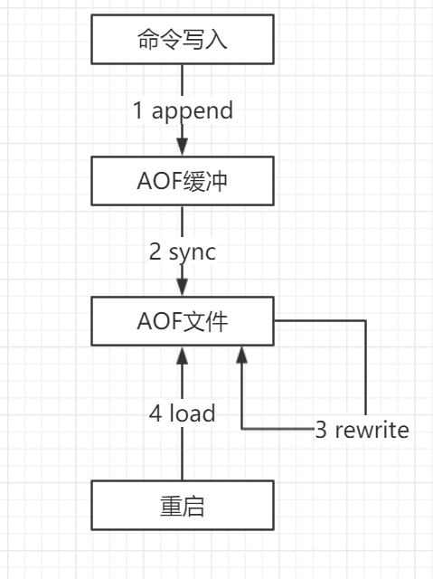
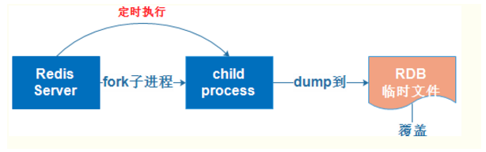
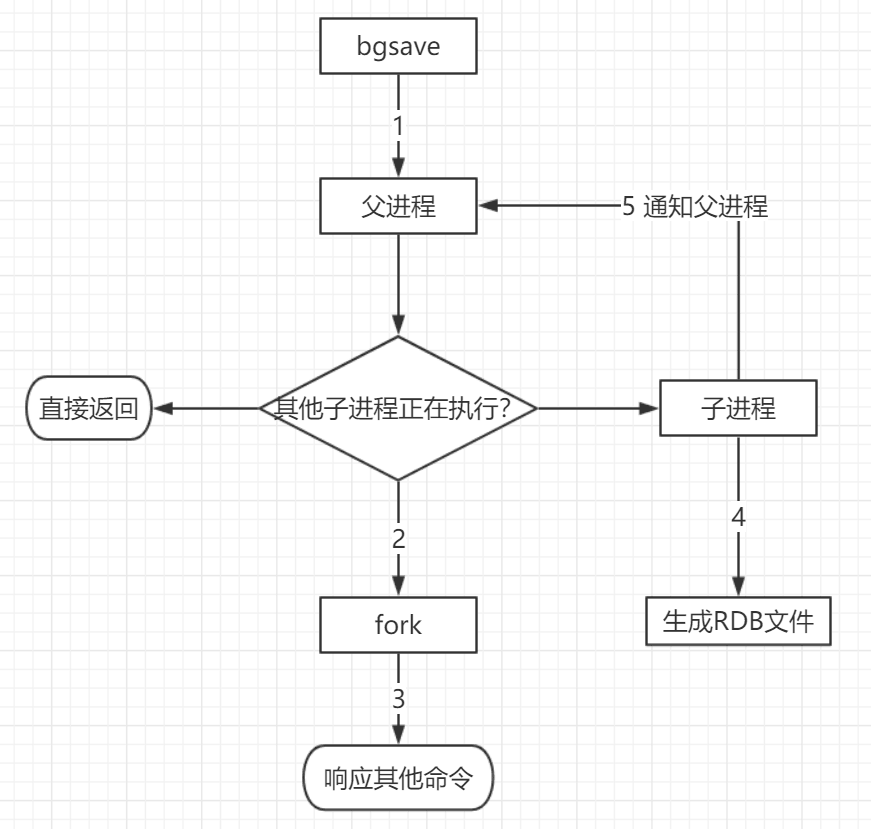

# Redis持久化

[Redis进阶 - 持久化：RDB和AOF机制详解 | Java 全栈知识体系 (pdai.tech)](https://pdai.tech/md/db/nosql-redis/db-redis-x-rdb-aof.html)

## 持久化配置

快照（RDB快照）和追加式文件（AOF文件），可以同时开启两种持久化方式，在这种情况下, 当redis重启的时候会优先载入AOF文件来恢复原始的数据，因为在通常情况下AOF文件保存的数据集要比RDB文件保存的数据集要完整。[RDB file]  [AOF tail]

### AOF（Append-Only File）

AOF日志记录Redis的每个写命令，步骤分为：命令追加（append）、文件写入（write）和文件同步（sync）。

|                                                             |
| :---------------------------------------------------------: |
|  |
|   |

​		以日志的形式记录每个对服务器写操作，**只许追加文件不可修改文件**，当服务器重启的时候会重新执行这些命令来恢复原始的数据，AOF命令以redis协议追加保存每次写的操作到文件末尾，Redis还能对AOF文件进行后台重写，使得AOF文件的体积不至于过大。**appendonly.aof**文本文件

> appendonly   yes      # 默认不开启

执行流程：

1）服务器在执行完一个写命令之后，会以协议格式将被执行的写命令追加到服务器的aof_buf缓冲区中。

2）AOF缓冲区根据对应的策略向硬盘做同步操作。

3）随着AOF文件越来越大，需要定期对AOF文件进行重写，达到压缩的目的。

4）当Redis服务器重启时，可以加载AOF文件进行数据恢复。

#### **设置Redis调用fsync的频率**

推荐使用每秒fsync一次的方式（默认的方式），因为它速度快，安全性也不错。相关同步策略配置如下：

```shell
appendfsync   always       # 每次有数据修改时都会写入AOF文件
appendfsync   everysec     # 每个写命令执行完，只是先把日志写到AOF文件的内存缓冲区，每秒同步一次，默认策略
appendfsync   no           # 从不同步，高效但不会持久化
```

#### 其它配置项

默认没有开启AOF

```shell
# 默认不开启
appendonly   yes
# 指定更新日志文件名，默认为appendonly.aof
appendfilename  appendonly.aof
# AOF文件的保存位置和RDB文件的位置相同，都是通过dir参数设置的
dir ./
# 设置为yes表示rewrite期间对新写操作不fsync，暂时存在内存中，等rewrite完成后再写入。Linux默认fsync策略是30秒。可能丢失30秒数据
no-appendfsync-on-rewrite yes
# 增长到一定大小的时候Redis能够调用bgrewriteaof对日志文件进行重写。当前AOF文件大小是上次日志重写得到AOF文件大小的二倍（设置为100）时，自动启动新的日志重写过程
auto-aof-rewrite-percentage  100
# 设置允许重写的最小aof文件大小，避免了达到约定百分比但尺寸仍然很小的情况还要重写
auto-aof-rewrite-min-size  64mb

# 加载aof出错如何处理
aof-load-truncated yes
# 文件重写策略
aof-rewrite-incremental-fsync yes
```

> 缺点：数据量很大的时候，比RDB的启动效率低。


#### AOF重写

AOF会记录每个写命令到AOF文件，随着时间越来越长，AOF文件会变得越来越大。如果不加以控制，会对Redis服务器，甚至对操作系统造成影响，而且AOF文件越大，数据恢复也越慢。为了解决AOF文件体积膨胀的问题，Redis提供AOF文件重写机制来对AOF文件进行“瘦身”。


- **AOF重写会阻塞吗**？

AOF重写过程是由后台进程**bgrewriteaof**来完成的。主线程fork出后台的**bgrewriteaof子进程**，fork会把主线程的内存拷贝一份给bgrewriteaof子进程，这里面就包含了数据库的最新数据。然后，bgrewriteaof子进程就可以在不影响主线程的情况下，逐一把拷贝的数据写成操作，记入重写日志。

所以aof在重写时，在fork进程时是会阻塞主线程的。

- **AOF何时会重写**

`auto-aof-rewrite-min-size`：表示运行AOF重写时文件的最小大小，默认为64MB。

`auto-aof-rewrite-percentage`：这个值的计算方式是，当前aof文件大小和上一次重写后aof文件大小的差值，再除以上一次重写后aof文件大小。也就是当前aof文件比上一次重写后aof文件的增量大小，和上一次重写后aof文件大小的比值。

- **重写日志时，有新数据写入咋整**？

重写过程总结为：“**一个拷贝，两处日志**”。在fork出子进程时的拷贝，以及在重写时，如果有新数据写入，主线程就会将命令记录到**两个aof日志内存缓冲区**中。如果AOF写回策略配置的是always，则直接将命令写回旧的日志文件，并且保存一份命令至AOF重写缓冲区，这些操作对新的日志文件是不存在影响的。（旧的日志文件：主线程使用的日志文件，新的日志文件：bgrewriteaof进程使用的日志文件）

而在bgrewriteaof子进程完成会日志文件的重写操作后，会提示主线程已经完成重写操作，主线程会将AOF重写缓冲中的命令追加到新的日志文件后面。这时候在高并发的情况下，AOF重写缓冲区积累可能会很大，这样就会造成阻塞，Redis后来通过Linux管道技术让aof重写期间就能同时进行回放，这样aof重写结束后只需回放少量剩余的数据即可。

最后通过修改文件名的方式，保证文件切换的原子性。

在AOF重写日志期间发生宕机的话，因为日志文件还没切换，所以恢复数据时，用的还是旧的日志文件。

**总结操作**：

- 主线程fork出子进程重写AOF日志
- 子进程重写日志完成后，主线程追加AOF日志缓冲
- 替换日志文件


- **主线程fork出子进程的是如何复制内存数据的**？

fork采用操作系统提供的写时复制（copy on write）机制，就是为了避免一次性拷贝大量内存数据给子进程造成阻塞。fork子进程时，子进程时会拷贝父进程的页表，即虚实映射关系（虚拟内存和物理内存的映射索引表），而不会拷贝物理内存。这个拷贝会消耗大量cpu资源，并且拷贝完成前会阻塞主线程，阻塞时间取决于内存中的数据量，数据量越大，则内存页表越大。拷贝完成后，父子进程使用相同的内存地址空间。

但主进程是可以有数据写入的，这时候就会拷贝物理内存中的数据。

- **在重写日志整个过程时，主线程有哪些地方会被阻塞**？

1. fork子进程时，需要拷贝虚拟页表，会对主线程阻塞。
2. 主进程有bigkey写入时，操作系统会创建页面的副本，并拷贝原有的数据，会对主线程阻塞。
3. 子进程重写日志完成后，主进程追加aof重写缓冲区时可能会对主线程阻塞。

- **为什么AOF重写不复用原AOF日志**？

1. 父子进程写同一个文件会产生竞争问题，影响父进程的性能。
2. 如果AOF重写过程中失败了，相当于污染了原本的AOF文件，无法做恢复数据使用


如果**appendonly.aof**出现损坏，`redis-check-aof --fix appendonly.aof`


### RDB文件（Redis  DataBase）

**dump.rdb**二进制文件

> 触发RDB持久化有2种方式：手动触发和字段触发

#### 手动触发

> save和bgsave命令

**save命令**：阻塞当前Redis服务器，直到RDB过程完成为止，对于内存 比较大的实例会造成长时间**阻塞**，线上环境不建议使用。

**bgsave命令**：Redis进程执行fork操作创建子进程，**RDB持久化过程由子进程负责**，完成后自动结束。阻塞只发生在fork阶段，一般时间很短。


|                                                           |
| :-------------------------------------------------------: |
|                           |
|  |

具体流程如下：

- redis客户端执行bgsave命令或者自动触发bgsave命令；
- Redis父进程判断当前是否存在正在执行的子进程，如RDB/AOF子进程，如果存在bgsave命令直接返回。
- 如果不存在正在执行的子进程，那么就fork一个新的子进程进行持久化数据，**fork过程是阻塞的**，父进程fork完成后，bgsave命令返回“Background saving started”信息并不再阻塞父进程，可以继续响应其他命令。
- 子进程创建RDB文件，根据父进程内存生成临时快照文件，完成后对原有文件进行原子替换。执行lastsave命令可以获取最后一次生成RDB的时间，对应info统计的rdb_last_save_time选项。
- 同时发送信号给主进程，通知主进程rdb持久化完成，主进程更新相关的统计信息。

RDB在保存RDB文件时主进程唯一需要做的就是单独**fork出一个子进程**，接下来的写操作全部由子进程来做进行持久化，会先将数据写入到一个临时文件中，待持久化过程都结束了，在用这个临时文件替换上次的持久化好的文件。主进程不需要再做其它IO操作，所以RDB持久化方式可以最大化redis的性能。

缺点：不能实时保存数据，最后一次持久化的数据可能会在宕机的时候出现丢失。

#### 自动触发

- redis.conf中配置`save m n`，即在m秒内有n次修改时，自动触发bgsave生成rdb文件；
- 主从复制时，从节点要从主节点进行全量复制时也会触发bgsave操作，生成当时的快照发送到从节点；
- 执行`debug reload`命令重新加载redis时也会触发bgsave操作；
- 默认情况下执行`shutdown`命令时，如果没有开启aof持久化，那么也会触发bgsave操作；

#### 其它配置项

```shell
save 900 1			# 900秒（15分钟）内有1个更改，则进行快照
save 300 10			# 300秒（5分钟）内有10个更改，则进行快照
save 60 10000		# 60秒内有10000个更改，则进行快照

# 如果持久化出错，主进程是否停止写入
stop-writes-on-bgsave-error yes

# 快照，可以设置是否进行压缩存储，LZF算法进行压缩
rdbcompression yes

# 导入时是否检查
rdbchecksum yes

# 快照的文件名
dbfilename dump.rdb

rdb-del-sync-files no

# 快照文件的存放路径
dir ./
```

> 同步数据，在指定的时间间隔对数据进行快照存储。非常适用于数据的备份、灾难恢复。


RDB中的核心思路是**Copy-on-Write**，如果主线程对这些数据也都是读操作（例如图中的键值对 A），那么，主线程和 bgsave 子进程相互不影响。但是，如果主线程要修改一块数据（例如图中的键值对 C），那么，这块数据就会被复制一份，生成该数据的副本。然后，bgsave 子进程会把这个副本数据写入 RDB 文件，而在这个过程中，主线程仍然可以直接修改原来的数据。


- **在进行快照操作的这段时间，如果发生服务崩溃怎么办**？

在没有将数据全部写入到磁盘前，这次快照操作都不算成功。如果出现了服务崩溃的情况，将**以上一次完整的RDB快照文件作为恢复内存数据的参考**。也就是说，在快照操作过程中不能影响上一次的备份数据。Redis服务会在磁盘上创建一个临时文件进行数据操作，待操作成功后才会用这个临时文件替换掉上一次的备份。

- **可以每秒做一次快照吗**？

对于快照来说，所谓“连拍”就是指连续地做快照。这样一来，快照的间隔时间变得很短，即使某一时刻发生宕机了，因为上一时刻快照刚执行，丢失的数据也不会太多。但是，这其中的快照间隔时间就很关键了。

如下图所示，我们先在T0 时刻做了一次快照，然后又在 T0+t 时刻做了一次快照，在这期间，数据块 5 和 9 被修改了。如果在 t 这段时间内，机器宕机了，那么，只能按照 T0 时刻的快照进行恢复。此时，数据块 5 和 9 的修改值因为没有快照记录，就无法恢复了。 


所以，要想尽可能恢复数据，t 值就要尽可能小，t 越小，就越像“连拍”。那么，t 值可以小到什么程度呢，比如说是不是可以每秒做一次快照？毕竟，每次快照都是由 bgsave 子进程在后台执行，也不会阻塞主线程。

这种想法其实是错误的。虽然 bgsave 执行时不阻塞主线程，但是，**如果频繁地执行全量快照，也会带来两方面的开销**：

- 一方面，频繁将全量数据写入磁盘，会给磁盘带来很大压力，多个快照竞争有限的磁盘带宽，前一个快照还没有做完，后一个又开始做了，容易造成恶性循环。

- 另一方面，bgsave 子进程需要通过 fork 操作从主线程创建出来。虽然，子进程在创建后不会再阻塞主线程，但是，fork 这个创建过程本身会阻塞主线程，而且主线程的内存越大，阻塞时间越长。如果频繁 fork 出 bgsave 子进程，这就会频繁**阻塞主线程**了

我们可以做**增量快照**，就是指做了一次全量快照后，后续的快照只对修改的数据进行快照记录，这样可以避免每次全量快照的开销。

但是它需要我们使用额外的元数据信息去记录哪些数据被修改了，这会带来额外的**空间开销问题**。

#### 优缺点

**优点**

- RDB文件是某个时间节点的快照，默认使用LZF算法进行压缩，压缩后的文件体积远远小于内存大小，适用于备份、全量复制等场景；
- Redis加载RDB文件恢复数据要远远快于AOF方式；

**缺点**

- RDB方式实时性不够，无法做到秒级的持久化；
- 每次调用bgsave都需要fork子进程，fork子进程属于重量级操作，频繁执行成本较高；
- RDB文件是二进制的，没有可读性，AOF文件在了解其结构的情况下可以手动修改或者补全；
- 版本兼容RDB文件问题；

​		

> 恢复rdb文件？将rdb文件放在redis启动目录即可，会自动检查dump.rdb恢复其中的数据

1. RDB过程中Redis会停止对外服务吗？

2. 如果不会停止服务，如何处理新的请求？

   
   

启动时会先检查AOF文件是否存在，如果不存在就尝试加载RDB。      

那么为什么会优先加载AOF呢？因为AOF保存的数据更完整。

   

### 混合持久化（4.x）

> Redis 4.0 中提出了一个**混合使用 AOF 日志和内存快照**的方法。简单来说，内存快照以一定的频率执行，在两次快照之间，使用AOF日志记录这期间的所有命令操作。

AOF重写时子进程将当前时间点的数据快照保存为RDB文件格式，而后将父进程积累命令保存为AOF格式。**[RDB file] [AOF tail]**

> aof-use-rdb-preamble   yes

T1 和 T2 时刻的修改，用 AOF 日志记录，等到第二次做全量快照时，就可以清空 AOF 日志，因为此时的修改都已经记录到快照中了，恢复时就不再用日志了


加载Redis时，可以识别AOF文件是否以“redis”字符串开头，是，加载带前缀的RDB文件，之后继续加载AOF尾巴。

#### 从持久化中恢复数据


- redis重启时判断是否开启AOF，如果开启了AOF，那么就优先加载AOF文件；
- 如果AOF存在，那么就去加载AOF文件，加载成功的话redis重启成功，如果AOF文件加载失败，那么会打印日志表示启动失败，此时可以去修复AOF文件后重新启动；
- 若AOF文件不存在，那么redis就会转而去加载rdb文件，如果rdb文件不存在，redis直接启动成功；
- 如果rdb文件存在就会去加载rdb文件恢复数据，如加载失败则打印日志提示启动失败，如加载成功，那么redis重启成功，且使用rdb文件恢复数据；

> 为什么会优先加载AOF呢？因为AOF保存的数据更完整，通过上面的分析我们知道AOF基本上最多损失1s的数据。

- 在RDB持久化模式中：可以使用*save*和*bgsave*命令进行数据持久化操作
- 在AOF持久化模式中：使用*rewriteaof*和*bgrewriteaof*命令进行持久化操作

## 性能

RDB的快照、AOF的重写都需要fork，这是一个重量级操作，会对Redis造成阻塞。因此为了不影响Redis主进程响应，我们需要尽可能降低阻塞。

- 降低fork的频率，比如可以手动来触发RDB生成快照、与AOF重写；
- 控制Redis最大使用内存，防止fork耗时过长；
- 使用更牛逼的硬件；
- 合理配置Linux的内存分配策略，避免因为物理内存不足导致fork失败。

在线上？

- 如果Redis中的数据并不是特别敏感或者可以通过其它方式重写生成数据，可以关闭持久化，如果丢失数据可以通过其它途径补回；
- 自己制定策略定期检查Redis的情况，然后可以手动触发备份、重写数据；
- 单机如果部署多个实例，要防止多个机器同时运行持久化、重写操作，防止出现内存、CPU、IO资源竞争，让持久化变为串行；
- 可以加入主从机器，利用一台从机器进行备份处理，其它机器正常响应客户端的命令；
- RDB持久化与AOF持久化可以同时存在，配合使用。


原因：

内存存储，没有磁盘IO开销

单线程处理请求，避免线程切换和锁资源开销

非阻塞IO，多路复用IO

好的数据结构


1. 用来做缓存的Redis实例尽量不要开启持久化功能
2. 建议关闭RDB持久化功能，使用AOF持久化
3. 利用脚本定期在slave节点做RDB，实现数据备份
4. 实则合理的rewrite阀组，避免频繁的bgrewrite
5. 配置 `no-appendfsync-on-rewrite=yes`，禁止在rewrite期间做aof，避免因AOF引起的阻塞


