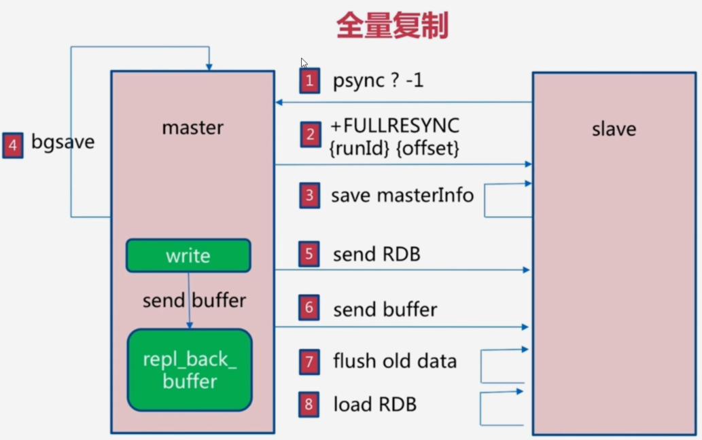
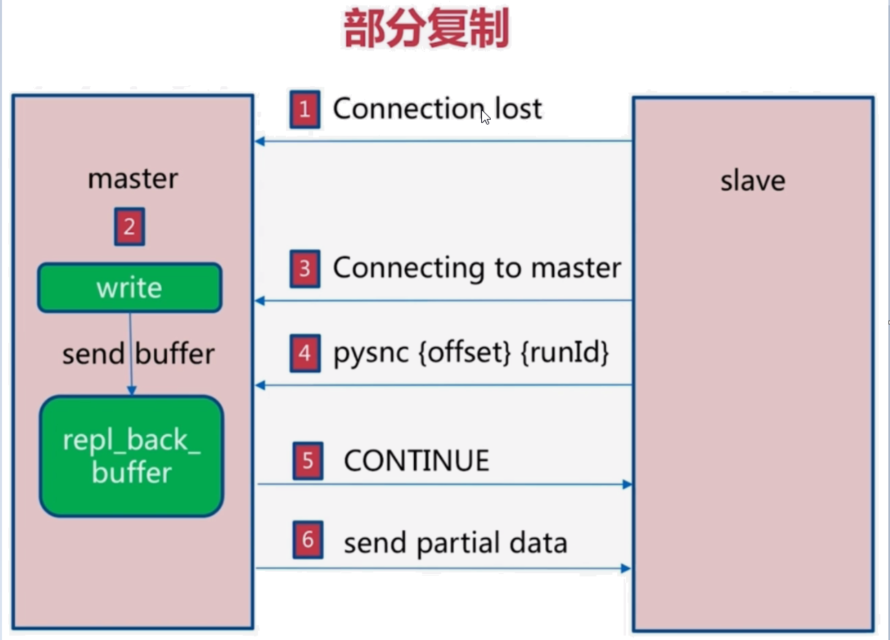
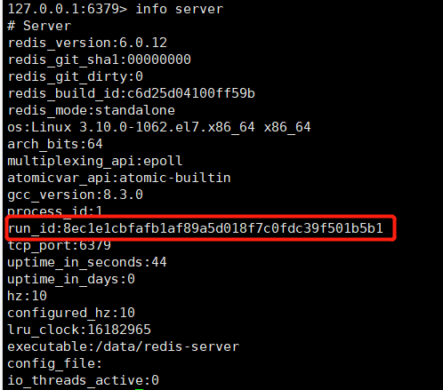

# Redis

## 高可用

### 主从复制原理

```
127.0.0.1:6379> auth root
OK
```

#### 全量同步

将Master上所有的数据都复制一份，执行步骤：

|                          全量同步                           |
| :---------------------------------------------------------: |
|  |

1. 从服务器连接主服务器，不管它是第一次连接还是再次连接都没有关系，从服务器发送SYNC命令，刚开始是 Psync 命令，Psync ? -1表示要求 master 主机同步数据
2. 主机会向从机发送 run_id （`redis-cli info server`）和 offset，因为slave并没有对应的offset，所以是全量复制
3. 从服务器slave会保存主机master的基本信息 save masterInfo
4. 主服务器接收到命令，开启一个后台进程执行BGSAVE命令（异步执行）生成RDB文件，并使用缓冲区记录此后的所有写命令
5. BGSAVE执行完成后，向所有的从服务器发送快照文件，并在发送期间继续记录所有的写命令
6. 从服务器接收到快照文件后丢弃原有的旧数据，载入新快照
7. 主服务器发送完成之后开始向从服务器发送缓冲区内的写命令
8. 从服务器完成快照载入之后，开始接收新的命令请求，并执行来自主服务器缓冲区的写命令

完成上面几个步骤后就完成了从服务器数据初始化的所有操作，从服务器此时可以接收来自用户的读请求。

#### 增量同步

|                          增量同步                           |
| :---------------------------------------------------------: |
|  |

Slave初始化后开始正常工作时主服务器发生的写操作同步到从服务器的过程。 

增量复制的过程主要是主服务器每执行一个写命令就会向从服务器发送相同的写命令，从服务器接收并执行收到的写命令。

  1. 如果网络抖动（连接断开 connection lost）
  2. 主机master 还是会写 repl_back_buffer（复制缓冲区）
  3. 从机slave 会继续尝试连接主机
  4. 从机slave 会把自己当前 runid 和偏移量传输给主机 master，并且执行 pysnc 命令同步
  5. 如果 master 发现你的偏移量是在缓冲区的范围内，就会返回 continue 命令
 6. 同步了offset 的部分数据，所以部分复制的基础就是偏移量**offset**

#### 服务器运行ID（run_id）

每个Redis节点（无论主从），在启动时都会自动生成一个随机ID（每次启动都不一样），由40个随机的十六进制字符串组成，run_id用来唯一识别一个Redis节点。通过`info server`命令，可以查看节点的run_id



​		主从节点首次复制时，主节点将自己的`run_id`发送给从节点，从节点将这个`run_id`保存起来，当断线重连时，从节点会将这个`run_id`发送给主节点，主节点根据`run_id`判断能否进行部分复制；

​		如果从节点保存的`run_id`与主节点的`run_id`相同，说明主从节点之前同步过，主节点会继续尝试使用**部分复制**（到底能不能部分复制还要看offset和复制积压缓冲区的情况）

> 如果从节点保存的`run_id`与主节点的`run_id`不同，说明从节点在断线前同步的Redis节点并不是当前的主节点，只能进行**全量复制**。
>

#### 复制偏移量

参与复制的主从节点都会维护自身复制**偏移量**。主节点（master）在处理完写入命令后，会把命令的字节长度做累加记录，统计信息会在`info replication`中的`master_repl_offset`指标中

从节点（slave）每秒钟上报自身的复制偏移量给主节点，因为主节点也会保存从节点的复制偏移量，统计指标如下：


从节点在接收到主节点发送的命令后，也会累加记录自身的偏移量。统计信息在`info replication`中的`slave_repl_offset`

#### 主从同步策略

master-slave刚连接的时候，进行全量同步；全量同步结束之后，进行增量同步。

Redis策略：首先先尝试进行增量同步，如不成功，则要求从服务器进行全量同步

从节点将offset发送给主节点后，主节点根据offset和缓冲区大小决定能否执行增量同步

> 如果offset偏移量之后的数据，仍然都在复制积压缓冲区里，则执行增量同步；
>
> 如果offset偏移量之后的数据已不在复制积压缓冲区中（数据已被挤压），则执行全量增量同步

Redis主从复制不阻塞主服务器端，采用异步复制。也就是说当若干个从服务器在进行初始同步时，主服务器仍然可以处理请求。

#### 心跳机制

> 主节点在建立成功后会维护这长连接彼此发送心跳检测

- 主从节点彼此都有心跳检测机制，各自模拟成对方的客户端进行通信，通过`client list`命令查看复制相关客户端信息，主节点的连接状态为`flags=M`，从节点连接状态`flags=S`，`flags=N`表示No
- 主节点默认**每隔10秒对从节点发送ping命令**，判断从节点的存活性和连接状态。可通过参数`repl-ping-slave-period`控制发送频率。
- 从节点在主线程中每隔1秒发送`repl conf ack {offset} `命令，给主节点上报自身当前的复制偏移量。
  

1. 什么时候会发生全量同步？

1) Redis Slave首启动或者重启后，连接到master时;

2) Redis Slave进程没重启，但是掉线了，重连后不满足增量同步条件


2. 什么时候会发生增量同步？

1) redis版本>=2.8

2) Redis Slave进程没有重启，但是掉线了，重连了master(因为slave进程重启的话，run id就没有了)

3) Redis Slave保存的run id与master当前run id一致 (注：run id并不是pid，slave把它保存在内存中，重启就消失)

d) Redis Slave掉线期间，master保存在内存的offset可用，也就是master变化不大，被更改的指令都保存在内存


3. 进程重启后会发生全量同步还是增量同步？

1) master重启时，run_id会发生变化

2) slave重启时，run_id会丢失

很显然，会发生全量同步，因为增量同步的条件之一run id已经不能满足


master节点宕机怎么办？
