# Bean生命周期

|                                         |
| :-------------------------------------: |
| 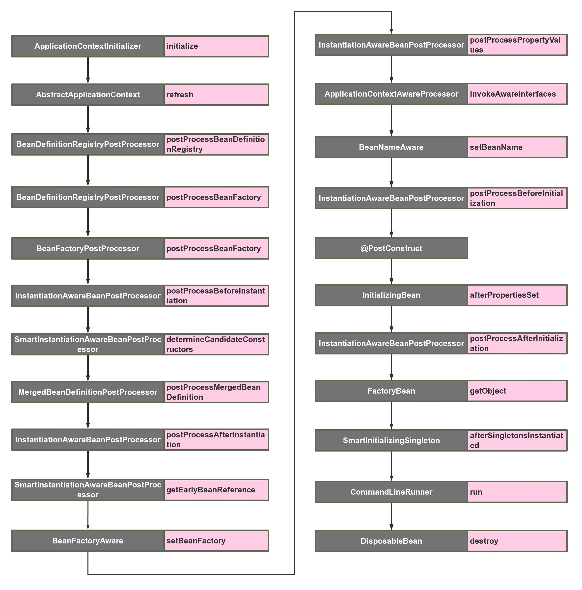 |

## ApplicationContextInitializer

> org.springframework.context.ApplicationContextInitializer

Spring容器刷新refresh()之前初始化`ConfigurableApplicationContext`的回调接口，容器刷新之前调用此类的`initialize`()方法。

可以在整个spring容器还没被初始化之前做一些事情。在最开始激活一些配置，或者利用这时候class还没被类加载器加载的时机，进行动态字节码注入等操作

源码：

|                                                              |
| ------------------------------------------------------------ |
| 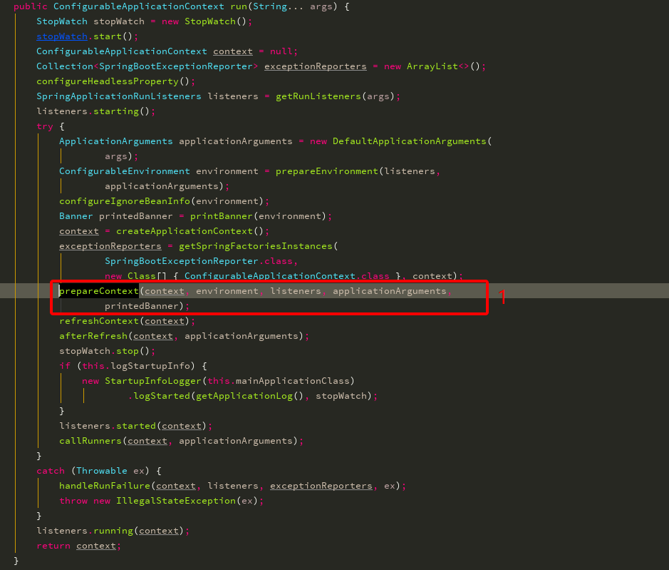 |
| 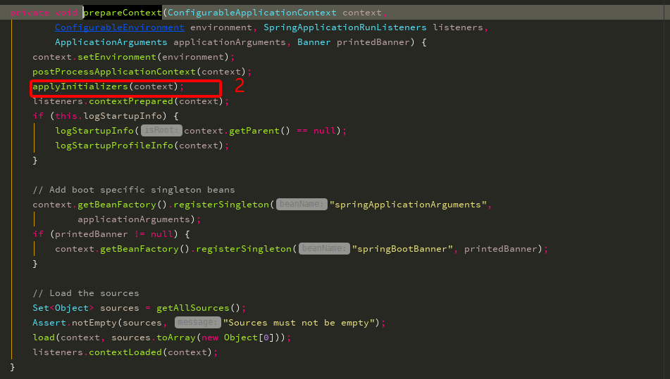 |
| 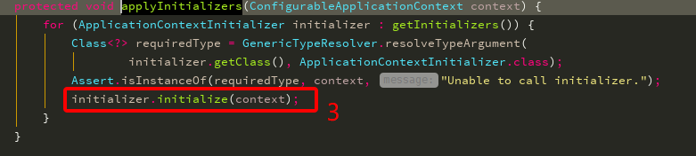 |

扩展的生效，有以下三种方式：

- 在启动类中用`springApplication.addInitializers(new XxxApplicationContextInitializer())`语句加入
- 配置文件配置`context.initializer.classes=com.example.demo.XxxApplicationContextInitializer`
- Spring SPI扩展，在spring.factories中加入`org.springframework.context.ApplicationContextInitializer=com.example.demo.XxxApplicationContextInitializer`


## BeanDefinitionRegistryPostProcessor

> org.springframework.beans.factory.support.BeanDefinitionRegistryPostProcessor

在读取项目中的`beanDefinition`之后执行，提供一个补充的扩展点

使用场景：你可以在这里动态注册自己的`beanDefinition`，可以加载classpath之外的bean


## **BeanFactoryPostProcessor**

> org.springframework.beans.factory.config.BeanFactoryPostProcessor

beanFactory的扩展接口，Spring在读取beanDefinition信息之后，实例化bean之前，可以用在修改已经注册的beanDefinition的元信息

源码：org.springframework.beans.factory.support.AbstractAutowireCapableBeanFactory

|                                                  |
| :----------------------------------------------: |
|           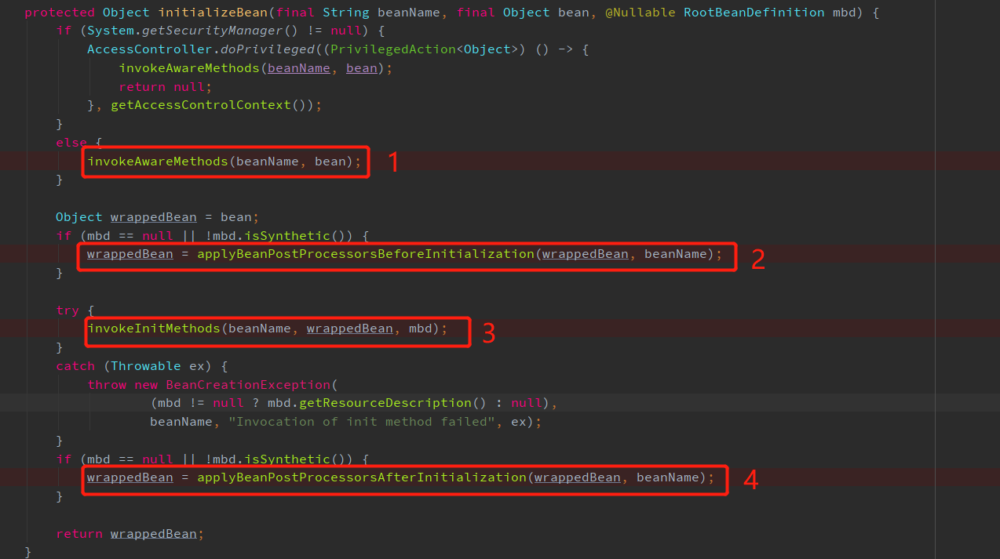            |
| 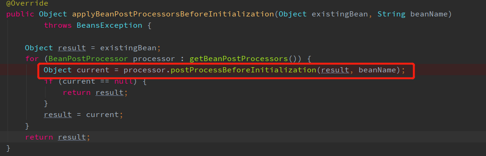 |
|        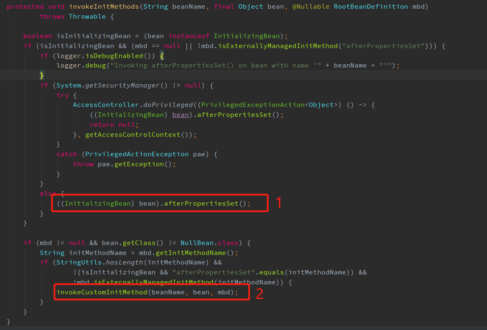        |
| 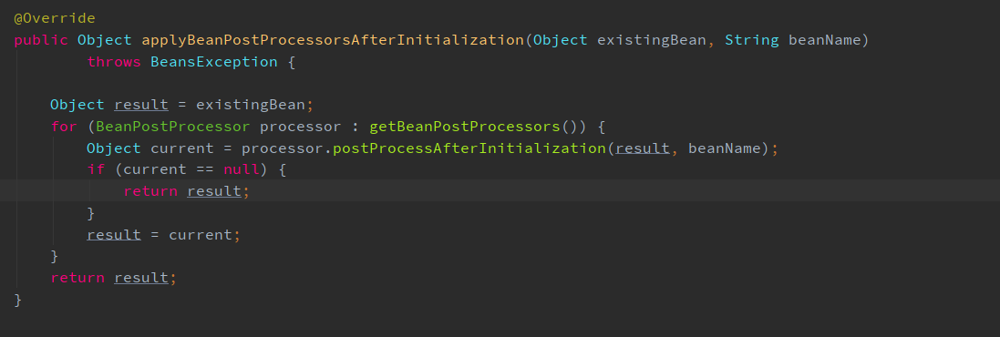  |

1. 调用BeanNameAware、BeanClassLoaderAware、BeanFactoryAware的set方法

2. 执行BeanPostProcessor#postProcessBeforeInitialization()方法

3. 执行初始化方法，先InitializingBean#afterPropertiesSet，后自定义初始化方法

4. 执行BeanPostProcessor#postProcessAfterInitialization()方法

   

## BeanNameAware

> org.springframework.beans.factory.BeanNameAware

bean初始化之前


## BeanFactoryAware

> org.springframework.beans.factory.BeanFactoryAware

发生在bean的实例化之后，注入属性之前。

源码：org.springframework.beans.factory.support.AbstractAutowireCapableBeanFactory

|                          |
| :----------------------: |
| 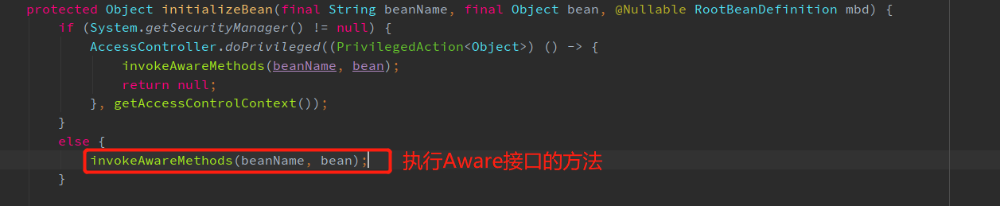 |
| 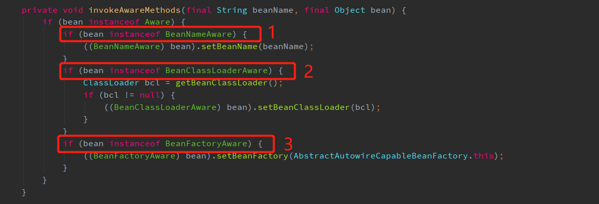 |
|                          |

先执行BeanNameAware，后执行BeanFactoryAware

## ApplicationContextAware

> org.springframework.context.ApplicationContextAware

源码：org.springframework.context.support.ApplicationContextAwareProcessor

|                                                     |
| :-------------------------------------------------: |
| 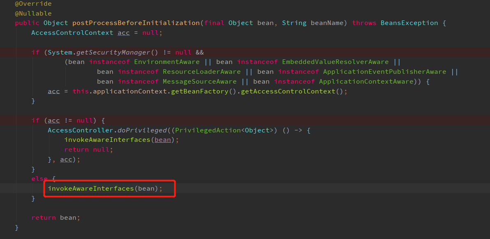 |
| 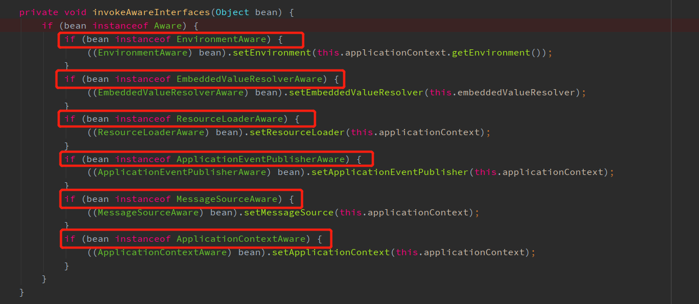 |
|                                                     |


## ApplicationContextAwareProcessor

> org.springframework.context.support.ApplicationContextAwareProcessor

BeanPostProcessor的实现类，bean实例化之后，初始化之前

|                                                     |
| :-------------------------------------------------: |
|  |

- `EnvironmentAware`：用于获取`EnviromentAware`的一个扩展类，这个变量非常有用， 可以获得系统内的所有参数。当然个人认为这个Aware没必要去扩展，因为spring内部都可以通过注入的方式来直接获得。
- `EmbeddedValueResolverAware`：用于获取`StringValueResolver`的一个扩展类， `StringValueResolver`用于获取基于`String`类型的properties的变量，一般我们都用`@Value`的方式去获取，如果实现了这个Aware接口，把`StringValueResolver`缓存起来，通过这个类去获取`String`类型的变量，效果是一样的。
- `ResourceLoaderAware`：用于获取`ResourceLoader`的一个扩展类，`ResourceLoader`可以用于获取classpath内所有的资源对象，可以扩展此类来拿到`ResourceLoader`对象。
- `ApplicationEventPublisherAware`：用于获取`ApplicationEventPublisher`的一个扩展类，`ApplicationEventPublisher`可以用来发布事件，结合`ApplicationListener`来共同使用，下文在介绍`ApplicationListener`时会详细提到。这个对象也可以通过spring注入的方式来获得。
- `MessageSourceAware`：用于获取`MessageSource`的一个扩展类，`MessageSource`主要用来做国际化。
- `ApplicationContextAware`：用来获取`ApplicationContext`的一个扩展类，`ApplicationContext`应该是很多人非常熟悉的一个类了，就是spring上下文管理器，可以手动的获取任何在spring上下文注册的bean，我们经常扩展这个接口来缓存spring上下文，包装成静态方法。同时`ApplicationContext`也实现了`BeanFactory`，`MessageSource`，`ApplicationEventPublisher`等接口，也可以用来做相关接口的事情。


## BeanPostProcessor

bean已经实例化完成，`BeanPostProcess`接口只在bean的初始化阶段进行扩展（注入Spring上下文前后）

- postProcessBeforeInitialzation( Object bean, String beanName ) 
  当前正在初始化的bean对象会被传递进来，我们就可以对这个bean作任何处理。 先于InitialzationBean执行，因此称为前置处理。 所有Aware接口的注入就是在这一步完成的。
- postProcessAfterInitialzation( Object bean, String beanName ) 
  当前正在初始化的bean对象会被传递进来，我们就可以对这个bean作任何处理。 在InitialzationBean完成后执行，因此称为后置处理。


## InstantiationAwareBeanPostProcessor

> org.springframework.beans.factory.config.InstantiationAwareBeanPostProcessor

代表了Spring的另外一段生命周期。继承BeanPostProcessor，BeanPostProcessor的子接口，**把可扩展的范围增加了实例化阶段和属性注入阶段。**其调用顺序：

- `postProcessBeforeInstantiation`：实例化bean之前，相当于new这个bean之前
- `postProcessAfterInstantiation`：实例化bean之后，相当于new这个bean之后
- `postProcessPropertyValues`：bean已经实例化完成，在属性注入阶段触发，`@Autowired`,`@Resource`等注解原理基于此方法实现
- `postProcessBeforeInitialization`：初始化bean之前，相当于把bean注入spring上下文之前
- `postProcessAfterInitialization`：初始化bean之后，相当于把bean注入spring上下文之后

使用场景：对实现了某一类接口的Bean在各生命周期收集，或对某个类型的bean进行统一设值

| 方法                            | 描述                                                         |
| ------------------------------- | ------------------------------------------------------------ |
| postProcessBeforeInstantiation  | 最先执行的方法，它在目标对象实例化之前调用，该方法的返回值类型是Object，我们可以返回任何类型的值。由于这个时候目标对象还未实例化，所以这个返回值可以用来代替原本该生成的目标对象的实例(比如代理对象)。如果该方法的返回值代替原本该生成的目标对象，后续只有postProcessAfterInitialization方法会调用，其它方法不再调用；否则按照正常的流程走 |
| postProcessAfterInstantiation   | 在目标对象实例化之后调用，这个时候对象已经被实例化，但是该实例的属性还未被设置，都是null。因为它的返回值是决定要不要调用postProcessPropertyValues方法的其中一个因素（因为还有一个因素是mbd.getDependencyCheck）；如果该方法返回false，并且不需要check，那么postProcessPropertyValues就会被忽略不执行；如果返回true，postProcessPropertyValues就会被执行 |
| postProcessPropertyValues       | 对属性值进行修改，如果postProcessAfterInstantiation方法返回false，该方法可能不会被调用。可以在该方法内对属性值进行修改 |
| postProcessBeforeInitialization | BeanPostProcessor接口中的方法，在Bean的自定义初始化方法之前执行 |
| postProcessAfterInitialization  | BeanPostProcessor接口中的方法，在Bean的自定义初始化方法执行完成之后执行 |

> Instantiation  表示实例化，对象还未生成；Initialization  表示初始化，对象已经生成


## SmartInstantiationAwareBeanPostProcessor

> org.springframework.beans.factory.config.SmartInstantiationAwareBeanPostProcessor

继承`InstantiationAwareBeanPostProcessor`

- `predictBeanType`：该触发点发生在`postProcessBeforeInstantiation`之前，这个方法用于预测Bean的类型，返回第一个预测成功的Class类型，如果不能预测返回null；当你调用`BeanFactory.getType(name)`时当通过bean的名字无法得到bean类型信息时就调用该回调方法来决定类型信息。
- `determineCandidateConstructors`：该触发点发生在`postProcessBeforeInstantiation`之后，用于确定该bean的构造函数之用，返回的是该bean的所有构造函数列表。用户可以扩展这个点，来自定义选择相应的构造器来实例化这个bean。
- `getEarlyBeanReference`：该触发点发生在`postProcessAfterInstantiation`之后，当有循环依赖的场景，当bean实例化好之后，为了防止有循环依赖，会提前暴露回调方法，用于bean实例化的后置处理。这个方法就是在提前暴露的回调方法中触发。

| 方法                           | 描述                                                         |
| ------------------------------ | ------------------------------------------------------------ |
| predictBeanType                | 预测Bean的类型，返回第一个预测成功的Class类型，如果不能预测返回null；发生在`postProcessBeforeInstantiation`之前 |
| determineCandidateConstructors | 选择合适的构造器，比如目标对象有多个构造器，在这里可以进行一些定制化，选择合适的构造器；发生在`postProcessBeforeInstantiation`之后 |
| getEarlyBeanReference          | 获得提前暴露的bean引用。主要用于解决循环引用的问题；发生在`postProcessAfterInstantiation`之后 |

Spring提供了2个默认实现类：

1. AbstractAutoProxyCreator：AOP
2. InstantiationAwareBeanPostProcessorAdapte


## @PostConstruct

bean初始化阶段，如果一个方法有此注解，会先调用这个方法。发生在`BeanPostProcessor.postProcessBeforeInitialization`之后，`InitializingBean.afterPropertiesSet`之前。


## InitializingBean

> org.springframework.beans.factory.InitializingBean

初始化bean，`BeanPostProcessor.postProcessBeforeInitialzation`的前置处理完成后，发生在`BeanPostProcessor.postProcessAfterInitialization`之前，可以在系统启动的时候一些业务指标的初始化工作。

- afterPropertiesSet()

这一阶段也可以在bean正式构造完成前增加我们自定义的逻辑，但它与前置处理不同，由于该函数并不会把当前bean对象传进来，因此在这一步没办法处理对象本身，只能增加一些额外的逻辑。 
若要使用它，我们需要让bean实现该接口，并把要增加的逻辑写在该函数中。然后Spring会在前置处理完成后检测当前bean是否实现了该接口，并执行afterPropertiesSet()。


## FactoryBean

> org.springframework.beans.factory.FactoryBean

工厂类接口，用户可以扩展这个类，来为要实例化的bean作一个代理，比如为该对象的所有的方法作一个拦截


## SmartInitializingSingleton

> org.springframework.beans.factory.SmartInitializingSingleton

在Spring容器管理的所有单例Bean（非懒加载对象）初始化完成之后调用的回调接口。其触发时机为``BeanPostProcessor.postProcessAfterInitialization`之后。


## DisposableBean

> org.springframework.beans.factory.DisposableBean

销毁对象


## ApplicationListener

> org.springframework.context.ApplicationListener

可以监听某个事件的`event`，触发时机可以穿插在业务方法执行过程中，用户可以自定义某个业务事件。Spring内部也有一些内置事件，这种事件，可以穿插在启动调用中。我们也可以利用这个特性，来自己做一些内置事件的监听器来达到和前面一些触发点大致相同的事情。

## PropertySourcesPlaceholderConfigurer

BeanFactoryPostProcessor的子类实现

属性配置文件，解析${...}

```
<property name="url" value="jdbc:${dbname:defaultdb}"/>
```

## CommandLineRunner

> org.springframework.boot.CommandLineRunner


# Bean初始化

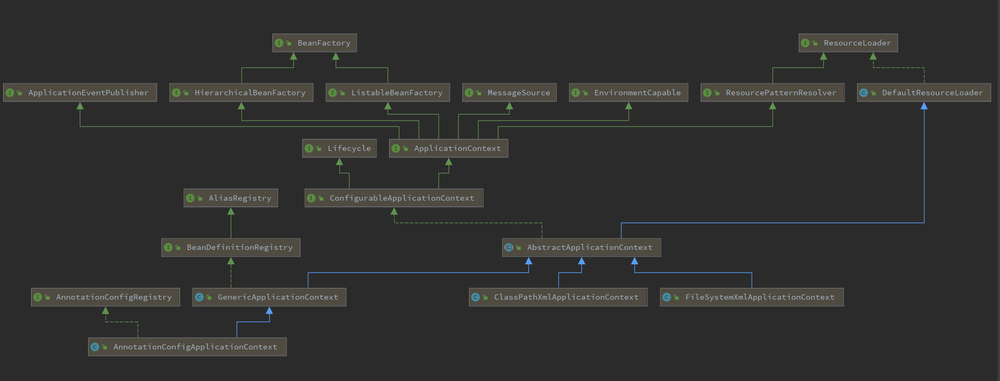


> org.springframework.context.support.AbstractApplicationContext#refresh

```java
public void refresh() throws BeansException, IllegalStateException {
   synchronized (this.startupShutdownMonitor) {
      // 准备工作，记录下容器的启动时间、标记“已启动”状态、处理配置文件中的占位符
      prepareRefresh();

      // 这步比较关键，这步完成后，配置文件就会解析成一个个 Bean 定义，注册到 BeanFactory 中，
      // 当然，这里说的 Bean 还没有初始化，只是配置信息都提取出来了，
      // 注册也只是将这些信息都保存到了注册中心(说到底核心是一个 beanName-> beanDefinition 的 map)
      ConfigurableListableBeanFactory beanFactory = obtainFreshBeanFactory();

      // 设置 BeanFactory 的类加载器，添加几个 BeanPostProcessor，手动注册几个特殊的 bean
      prepareBeanFactory(beanFactory);

      try {
          // 【这里需要知道 BeanFactoryPostProcessor 这个知识点，Bean 如果实现了此接口，
         // 那么在容器初始化以后，Spring 会负责调用里面的 postProcessBeanFactory 方法。】
 
         // 这里是提供给子类的扩展点，到这里的时候，所有的 Bean 都加载、注册完成了，但是都还没有初始化
         // 具体的子类可以在这步的时候添加一些特殊的 BeanFactoryPostProcessor 的实现类或做点什么事
         postProcessBeanFactory(beanFactory);

         // 调用 BeanFactoryPostProcessor 各个实现类的 postProcessBeanFactory(factory) 方法
         invokeBeanFactoryPostProcessors(beanFactory);

         // 注册 BeanPostProcessor 的实现类，注意看和 BeanFactoryPostProcessor 的区别
         // 此接口两个方法: postProcessBeforeInitialization 和 postProcessAfterInitialization
         // 两个方法分别在 Bean 初始化之前和初始化之后得到执行。注意，到这里 Bean 还没初始化
         registerBeanPostProcessors(beanFactory);

         // 初始化当前 ApplicationContext 的 MessageSource，国际化
         initMessageSource();

         // 初始化当前 ApplicationContext 的事件广播器
         initApplicationEventMulticaster();

         // 从方法名就可以知道，典型的模板方法(钩子方法)，
         // 具体的子类可以在这里初始化一些特殊的 Bean（在初始化 singleton beans 之前）
         onRefresh();

         // 注册事件监听器，监听器需要实现 ApplicationListener 接口
         registerListeners();

         // 重点，重点，重点
         // 初始化所有的 singleton beans
         //（lazy-init 的除外）
         finishBeanFactoryInitialization(beanFactory);

         // 最后，广播事件，ApplicationContext 初始化完成
         finishRefresh();
      }

      catch (BeansException ex) {
         if (logger.isWarnEnabled()) {
            logger.warn("Exception encountered during context initialization - " +
                  "cancelling refresh attempt: " + ex);
         }

         // 销毁已经初始化的 singleton 的 Beans，以免有些 bean 会一直占用资源
         destroyBeans();

         // Reset 'active' flag.
         cancelRefresh(ex);

         // Propagate exception to caller.
         throw ex;
      }

      finally {
         // Reset common introspection caches in Spring's core, since we
         // might not ever need metadata for singleton beans anymore...
         resetCommonCaches();
      }
   }
}
```

## 创建Bean容器，加载并注册Bean


## Bean容器实例化完成后


## 准备 Bean 容器: prepareBeanFactory


## 初始化所有的 singleton beans

### 实例化

> org.springframework.beans.factory.support.AbstractAutowireCapableBeanFactory#createBean

实则也是InstantiationAwareBeanPostProcessor.postProcessBeforeInstantiation调用时机

```java
@Override
protected Object createBean(String beanName, RootBeanDefinition mbd, @Nullable Object[] args)
      throws BeanCreationException {
   try {
      // Give BeanPostProcessors a chance to return a proxy instead of the target bean instance.
      Object bean = resolveBeforeInstantiation(beanName, mbdToUse);
      if (bean != null) {
         return bean;
      }
   }
   ...
   try {
      // 真正执行创建Bean
      Object beanInstance = doCreateBean(beanName, mbdToUse, args);
      return beanInstance;
	}
}


protected Object resolveBeforeInstantiation(String beanName, RootBeanDefinition mbd) {
    Object bean = null;
    // 如果beforeInstantiationResolved还没有设置或者是false（说明还没有需要在实例化前执行的操作）
    if (!Boolean.FALSE.equals(mbd.beforeInstantiationResolved)) {
        // Make sure bean class is actually resolved at this point.
        // 判断是否有注册过InstantiationAwareBeanPostProcessor类型的bean
        if (!mbd.isSynthetic() && hasInstantiationAwareBeanPostProcessors()) {
            Class<?> targetType = determineTargetType(beanName, mbd);
            if (targetType != null) {
                bean = applyBeanPostProcessorsBeforeInstantiation(targetType, beanName);
                if (bean != null) {
                    // 初始化之后的方法，也就是通过这个方法实例化了之后，直接执行初始化之后的方法;中间的实例化之后和初始化之前都不执行
                    bean = applyBeanPostProcessorsAfterInitialization(bean, beanName);
                }
            }
        }
        mbd.beforeInstantiationResolved = (bean != null);
    }
    return bean;
}

protected Object applyBeanPostProcessorsBeforeInstantiation(Class<?> beanClass, String beanName) {
    for (BeanPostProcessor bp : getBeanPostProcessors()) {
        if (bp instanceof InstantiationAwareBeanPostProcessor) {
            InstantiationAwareBeanPostProcessor ibp = (InstantiationAwareBeanPostProcessor) bp;
            // 只要有一个result不为null；后面的所有后置处理器的方法就不执行了，直接返回(所以执行顺序很重要)
            Object result = ibp.postProcessBeforeInstantiation(beanClass, beanName);
            if (result != null) {
                return result;
            }
        }
    }
    return null;
}

// 初始化之后的方法
public Object applyBeanPostProcessorsAfterInitialization(Object existingBean, String beanName)
    throws BeansException {

    Object result = existingBean;
    for (BeanPostProcessor processor : getBeanPostProcessors()) {
        Object current = processor.postProcessAfterInitialization(result, beanName);
        // 如果返回null；后面的所有后置处理器的方法就不执行，直接返回(所以执行顺序很重要)
        if (current == null) {
            return result;
        }
        result = current;
    }
    return result;
}
```

总结：

1. 如果postProcessBeforeInstantiation方法返回了Object是nul，那么就直接返回，调用doCreateBean方法()
2. 如果postProcessBeforeInstantiation返回不为null；说明修改了bean对象，然后这个时候就立马执行postProcessAfterInitialization方法（注意这个是初始化之后的方法，也就是通过这个方法实例化了之后，直接执行初始化之后的方法，中间的实例化之后和初始化之前都不执行）;
3. 在调用postProcessAfterInitialization方法时候如果返回null，那么就直接返回，调用doCreateBean方法，（初始化之后的方法返回了null，那就需要调用doCreateBean生成对象了）
4. 在调用postProcessAfterInitialization时返回不为null，那这个Bean就直接返回给容器。 初始化之后的操作是这里面最后一个方法
5. 通过上面的描述，我们其实可以在这里生成一个代理类；
   

| org.springframework.beans.factory.support.AbstractAutowireCapableBeanFactory#doCreateBean |
| ------------------------------------------------------------ |
| 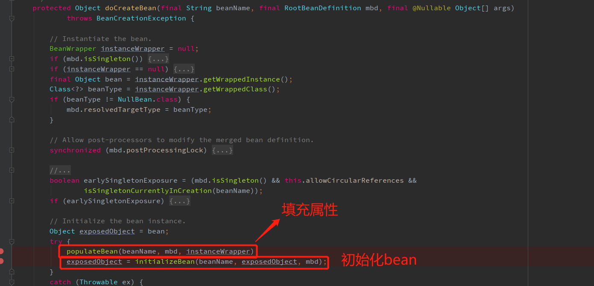                                |


### 填充属性

循环依赖在此发生

```java
protected void populateBean(String beanName, RootBeanDefinition mbd, @Nullable BeanWrapper bw) {
	if (bw == null) {
		if (mbd.hasPropertyValues()) {
			throw new BeanCreationException(
					mbd.getResourceDescription(), beanName, "Cannot apply property values to null instance");
		}
		else {
			// Skip property population phase for null instance.
			return;
		}
	}

    // 判断是否有InstantiationAwareBeanPostProcessor，提前生成代理对象
	if (!mbd.isSynthetic() && hasInstantiationAwareBeanPostProcessors()) {
        // 遍历BeanPostProcessor
		for (BeanPostProcessor bp : getBeanPostProcessors()) {
            // 如果有InstantiationAwareBeanPostProcessor，提前生成代理对象
			if (bp instanceof InstantiationAwareBeanPostProcessor) {
				InstantiationAwareBeanPostProcessor ibp = (InstantiationAwareBeanPostProcessor) bp;
                // 执行InstantiationAwareBeanPostProcessor.postProcessAfterInstantiation方法
                // 如果返回false，代表不需要进行后续的属性设值，也不需要再经过其他的 BeanPostProcessor 的处理
				if (!ibp.postProcessAfterInstantiation(bw.getWrappedInstance(), beanName)) {
                    // 返回false,并且不需要check，那么postProcessPropertyValues就会被忽略不执行；如果返回true，postProcessPropertyValues就会被执行
					return;
				}
			}
		}
	}

	PropertyValues pvs = (mbd.hasPropertyValues() ? mbd.getPropertyValues() : null);

	if (mbd.getResolvedAutowireMode() == AUTOWIRE_BY_NAME || mbd.getResolvedAutowireMode() == AUTOWIRE_BY_TYPE) {
		MutablePropertyValues newPvs = new MutablePropertyValues(pvs);
		// Add property values based on autowire by name if applicable.
        // 通过名字找到所有属性值，如果是 bean 依赖，先初始化依赖的 bean。记录依赖关系
		if (mbd.getResolvedAutowireMode() == AUTOWIRE_BY_NAME) {
			autowireByName(beanName, mbd, bw, newPvs);
		}
		// Add property values based on autowire by type if applicable.
        // 通过类型装配
		if (mbd.getResolvedAutowireMode() == AUTOWIRE_BY_TYPE) {
			autowireByType(beanName, mbd, bw, newPvs);
		}
		pvs = newPvs;
	}

    // 判断是否有InstantiationAwareBeanPostProcessor，提前生成代理对象
	boolean hasInstAwareBpps = hasInstantiationAwareBeanPostProcessors();
	boolean needsDepCheck = (mbd.getDependencyCheck() != AbstractBeanDefinition.DEPENDENCY_CHECK_NONE);

	if (hasInstAwareBpps || needsDepCheck) {
		if (pvs == null) {
			pvs = mbd.getPropertyValues();
		}
		PropertyDescriptor[] filteredPds = filterPropertyDescriptorsForDependencyCheck(bw, mbd.allowCaching);
		if (hasInstAwareBpps) {
			for (BeanPostProcessor bp : getBeanPostProcessors()) {
                // 
				if (bp instanceof InstantiationAwareBeanPostProcessor) {
					InstantiationAwareBeanPostProcessor ibp = (InstantiationAwareBeanPostProcessor) bp;
                    // 执行InstantiationAwareBeanPostProcessor.postProcessPropertyValues方法
                    // 执行@Resource、@Autowired
                    // BeanPostProcessor: CommonAnnotationBeanPostProcessor和AutowiredAnnotationBeanPostProcessor
                    // 对采用 @Autowired、@Value 注解的依赖进行设值
					pvs = ibp.postProcessPropertyValues(pvs, filteredPds, bw.getWrappedInstance(), beanName);
					if (pvs == null) {
						return;
					}
				}
			}
		}
		if (needsDepCheck) {
			checkDependencies(beanName, mbd, filteredPds, pvs);
		}
	}

	if (pvs != null) {
        // 设置bean实例的属性值
		applyPropertyValues(beanName, mbd, bw, pvs);
	}
}
```

总结：

1. 如果实现InstantiationAwareBeanPostProcessor，执行postProcessAfterInstantiation()
2. 进行自动装配
3. 如果实现InstantiationAwareBeanPostProcessor，执行postProcessPropertyValues()，@Resource、@Autowired发生在此
4. 设置bean实例的属性值


### 初始化Bean

```java
protected Object initializeBean(final String beanName, final Object bean, @Nullable RootBeanDefinition mbd) {
    // 1. 如果bean实现了 BeanNameAware、BeanClassLoaderAware 或 BeanFactoryAware 接口，回调
	if (System.getSecurityManager() != null) {
		AccessController.doPrivileged((PrivilegedAction<Object>) () -> {
			invokeAwareMethods(beanName, bean);
			return null;
		}, getAccessControlContext());
	}
	else {
		invokeAwareMethods(beanName, bean);
	}

	Object wrappedBean = bean;
    // 2. 执行BeanPostProcessor 的 postProcessBeforeInitialization 回调
	if (mbd == null || !mbd.isSynthetic()) {
		wrappedBean = applyBeanPostProcessorsBeforeInitialization(wrappedBean, beanName);
	}

    // 3. 处理InitializingBean的afterPropertiesSet()、自定义初始化方法init-method
	try {
		invokeInitMethods(beanName, wrappedBean, mbd);
	}
	catch (Throwable ex) {
		throw new BeanCreationException(
				(mbd != null ? mbd.getResourceDescription() : null),
				beanName, "Invocation of init method failed", ex);
	}
    
    // 4. 执行BeanPostProcessor 的 postProcessAfterInitialization 回调
	if (mbd == null || !mbd.isSynthetic()) {
		wrappedBean = applyBeanPostProcessorsAfterInitialization(wrappedBean, beanName);
	}

	return wrappedBean;
}

// 1. 如果bean实现了 BeanNameAware、BeanClassLoaderAware 或 BeanFactoryAware 接口，回调
private void invokeAwareMethods(final String beanName, final Object bean) {
	if (bean instanceof Aware) {
		if (bean instanceof BeanNameAware) {
			((BeanNameAware) bean).setBeanName(beanName);
		}
		if (bean instanceof BeanClassLoaderAware) {
			ClassLoader bcl = getBeanClassLoader();
			if (bcl != null) {
				((BeanClassLoaderAware) bean).setBeanClassLoader(bcl);
			}
		}
		if (bean instanceof BeanFactoryAware) {
			((BeanFactoryAware) bean).setBeanFactory(AbstractAutowireCapableBeanFactory.this);
		}
	}
}

// 2. 执行BeanPostProcessor 的 postProcessBeforeInitialization 回调
public Object applyBeanPostProcessorsBeforeInitialization(Object existingBean, String beanName)
		throws BeansException {

	Object result = existingBean;
	for (BeanPostProcessor processor : getBeanPostProcessors()) {
        // 执行postProcessBeforeInitialization()
		Object current = processor.postProcessBeforeInitialization(result, beanName);
		if (current == null) {
			return result;
		}
		result = current;
	}
	return result;
}

// 3. 处理初始化方法
protected void invokeInitMethods(String beanName, final Object bean, @Nullable RootBeanDefinition mbd)
		throws Throwable {

    // 1. 处理InitializingBean的afterPropertiesSet()
	boolean isInitializingBean = (bean instanceof InitializingBean);
	if (isInitializingBean && (mbd == null || !mbd.isExternallyManagedInitMethod("afterPropertiesSet"))) {
		if (System.getSecurityManager() != null) {
			try {
				AccessController.doPrivileged((PrivilegedExceptionAction<Object>) () -> {
					((InitializingBean) bean).afterPropertiesSet();
					return null;
				}, getAccessControlContext());
			}
			catch (PrivilegedActionException pae) {
				throw pae.getException();
			}
		}
		else {
			((InitializingBean) bean).afterPropertiesSet();
		}
	}

    // 2. 处理自定义初始化方法init-method
	if (mbd != null && bean.getClass() != NullBean.class) {
		String initMethodName = mbd.getInitMethodName();
		if (StringUtils.hasLength(initMethodName) &&
				!(isInitializingBean && "afterPropertiesSet".equals(initMethodName)) &&
				!mbd.isExternallyManagedInitMethod(initMethodName)) {
			invokeCustomInitMethod(beanName, bean, mbd);
		}
	}
}

// 4. 执行BeanPostProcessor 的 postProcessAfterInitialization 回调
public Object applyBeanPostProcessorsAfterInitialization(Object existingBean, String beanName)
		throws BeansException {

	Object result = existingBean;
	for (BeanPostProcessor processor : getBeanPostProcessors()) {
        // postProcessAfterInitialization()
		Object current = processor.postProcessAfterInitialization(result, beanName);
		if (current == null) {
			return result;
		}
		result = current;
	}
	return result;
}
```

总结：初始化方法

1. 如果 bean 实现了 BeanNameAware、BeanClassLoaderAware 或 BeanFactoryAware 接口，回调
2. 执行BeanPostProcessor 的 postProcessBeforeInitialization 回调
3. 处理InitializingBean的afterPropertiesSet()、自定义初始化方法init-method
4. 执行BeanPostProcessor 的 postProcessAfterInitialization 回调