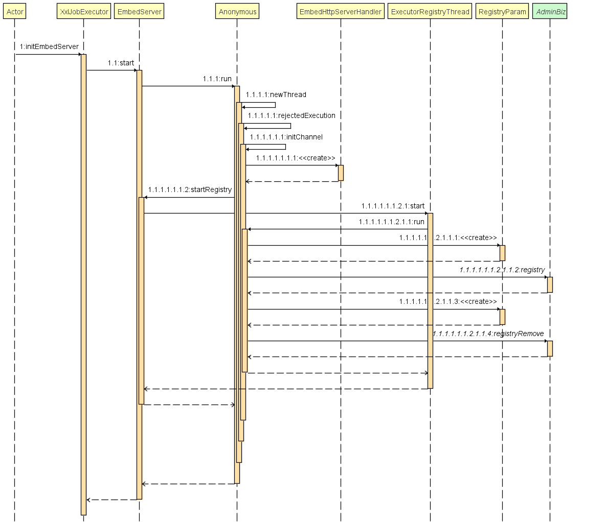
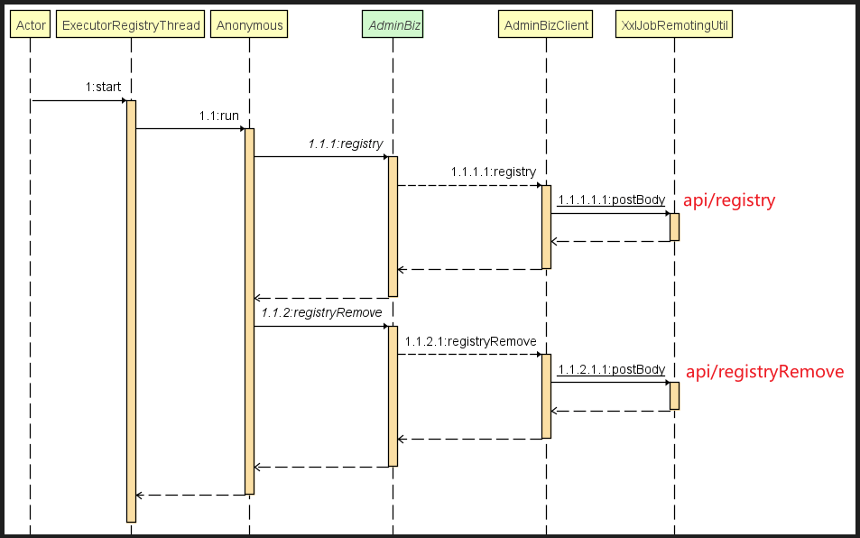

# xxl-job

## 设计理念

将调度行为抽象成“**调度中心**”平台，平台本身不承担业务逻辑，负责发起调度请求

将任务抽象成分散的**JobHandler**，交于“**执行器**”统一管理，“**执行器**”负责接收调度请求并执行对应的**JobHandler**中业务逻辑

“调度”和“任务"相互解耦。

## 分布式定时任务比较

| 功能       | quartz                                             | elastic-job                                                  | xxl-job                                                      | Spring Task                          |
| ---------- | -------------------------------------------------- | ------------------------------------------------------------ | ------------------------------------------------------------ | ------------------------------------ |
| HA(高可用) | 多节点部署，通过数据库锁来保证只有一个节点执行任务 | 通过zookeeper的注册和发现，可以动态添加服务器，支持水平扩容  | 集群部署                                                     | 不支持                               |
| 任务分片   | 不支持                                             | 支持                                                         | 支持                                                         | 不支持                               |
| 管理界面   | 没有                                               | 有                                                           | 有                                                           | 没有                                 |
| 难易程度   | 简单                                               | 较复杂                                                       | 简单                                                         | 简单                                 |
| 缺点       | 没有管理界面不支持任务分片，不适用于分布式场景     | 需要引入zookeeper，增加系统复杂度，比较复杂，任务量巨大时可以考虑使用 | 通过获取数据库锁的方式，保证集群中执行任务的唯一性，性能不好 | 不支持分布式，功能单一，重试机制不好 |

## 架构

| xxl-job架构图v2.1.0                                     |
| ------------------------------------------------------- |
|  |

- 数据库表

```
- xxl_job_lock：任务调度锁表；
- xxl_job_group：执行器信息表，维护任务执行器信息；
- xxl_job_info：调度扩展信息表： 用于保存XXL-JOB调度任务的扩展信息，如任务分组、任务名、机器地址、执行器、执行入参和报警邮件等等；
- xxl_job_log：调度日志表： 用于保存XXL-JOB任务调度的历史信息，如调度结果、执行结果、调度入参、调度机器和执行器等等；
- xxl_job_log_report：调度日志报表：用户存储XXL-JOB任务调度日志的报表，调度中心报表功能页面会用到；
- xxl_job_logglue：任务GLUE日志：用于保存GLUE更新历史，用于支持GLUE的版本回溯功能；
- xxl_job_registry：执行器注册表，维护在线的执行器和调度中心机器地址信息；
- xxl_job_user：系统用户表；
```


## 执行流程分析

### 执行器启动流程

#### 初始化执行器

```java
@Bean
public XxlJobSpringExecutor xxlJobExecutor() {
    logger.info(">>>>>>>>>>> xxl-job config init.");
    XxlJobSpringExecutor xxlJobSpringExecutor = new XxlJobSpringExecutor();
    xxlJobSpringExecutor.setAdminAddresses(adminAddresses);
    xxlJobSpringExecutor.setAppname(appname);
    xxlJobSpringExecutor.setAddress(address);
    xxlJobSpringExecutor.setIp(ip);
    xxlJobSpringExecutor.setPort(port);
    xxlJobSpringExecutor.setAccessToken(accessToken);
    xxlJobSpringExecutor.setLogPath(logPath);
    xxlJobSpringExecutor.setLogRetentionDays(logRetentionDays);

    return xxlJobSpringExecutor;
}
```


#### XxlJobSpringExecutor

调用父类的start方法（com.xxl.job.core.executor.XxlJobExecutor#start）

```java
    public void start() throws Exception {

        // 初始化日志路径
        XxlJobFileAppender.initLogPath(logPath);

        // 初始化admin的客户端
        initAdminBizList(adminAddresses, accessToken);

        // 初始化日志清理线程
        JobLogFileCleanThread.getInstance().start(logRetentionDays);

        // 初始化回调线程池
        TriggerCallbackThread.getInstance().start();

        // 初始化执行器服务
        initEmbedServer(address, ip, port, appname, accessToken);
    }
```

总结下来，就是：

- 初始化日志路径
- 初始化admin的客户端
- 初始化日志清理线程
- 初始化回调线程池
- 初始化执行器服务


### 三个线程

#### JobLogFileCleanThread

**初始化日志清理线程**，功能：启动一个线程localThread，用来清理过期的日志文件。localThread的run方法一直执行，

1. 首先获取所有的日志文件目录，日志文件形式如logPath/yyyy-MM-dd/9999.log，获取logPath/yyyy-MM-dd/目录下的所有日志文件

2. 判断日志文件是否已经过期，过期时间是配置的，如果当前时间减去日志文件创建时间（yyyy-MM-dd）大于配置的日志清理天数，说明日志文件已经过期，一般配置只保存30天的日志，30天以前的日志都删除掉
3. 执行完成之后，线程localThread会休眠1天

#### TriggerCallbackThread

**初始化回调线程池**，功能：启动了两个线程，一个是**triggerCallbackThread**回调线程，一个是**triggerRetryCallbackThread**重试回调线程。

- triggerCallbackThread回调线程

  将定时任务执行的结果回调给admin保存在数据库中，调用AdminBizClient的callback方法回调写回admin服务的数据库中。

- triggerRetryCallbackThread重试回调线程

  将错误的回调重新进行回调，跟triggerCallbackThread回调线程是一样的，只是triggerRetryCallbackThread只重新回调错误的回调。


定时任务运行完成以后，将运行以后的结果保存在队列中，每次回调都是从队列中获取定时任务的结果写回admin服务，是通过http去写回到admin服务的。

#### ExecutorRegistryThread

初始化执行器服务，功能：启动一个netty服务器，用于执行器接收admin的http请求。

> 主要接收admin发送的空闲检测请求、运行定时任务的请求、停止运行定时任务的请求、获取日志的请求。

admin注册了执行器，注册执行器是调用**AdminBizClient**的registry方法注册的，AdminBizClient的registry方法通过http将注册请求转发给admin服务的**AdminBizImpl**类的registry方法，AdminBizImpl类的registry方法将注册请求保存在数据库中。

| initEmbedServer                                              |
| ------------------------------------------------------------ |
|  |
| startRegistry                                                |
|  |

执行器服务接收admin服务的请求，交给ExecutorBiz接口处理

##### ExecutorBiz

ExecutorBiz接口有五个方法

- beat（心跳检测）
- idleBeat（空闲检测）
- run（运行定时任务）
- kill（停止运行任务）
- log（获取日志）

ExecutorBiz接口有两个实现：**ExecutorBizClient**和**ExecutorBizImpl**

- ExecutorBizClient：执行器客户端

- ExecutorBizImpl：执行器服务端

admin服务通过ExecutorBizClient类的方法通过http将请求转发给执行器服务的ExecutorBizImpl对应的方法。

### 调度中心启动流程

```
com.xxl.job.admin.core.conf.XxlJobAdminConfig
```


```
    public void init() throws Exception {
        // init i18n
        initI18n();

        // admin trigger pool start
        JobTriggerPoolHelper.toStart();

        // admin registry monitor run
        JobRegistryHelper.getInstance().start();

        // admin fail-monitor run
        JobFailMonitorHelper.getInstance().start();

        // admin lose-monitor run ( depend on JobTriggerPoolHelper )
        JobCompleteHelper.getInstance().start();

        // admin log report start
        JobLogReportHelper.getInstance().start();

        // start-schedule  ( depend on JobTriggerPoolHelper )
        JobScheduleHelper.getInstance().start();

        logger.info(">>>>>>>>> init xxl-job admin success.");
    }
```

