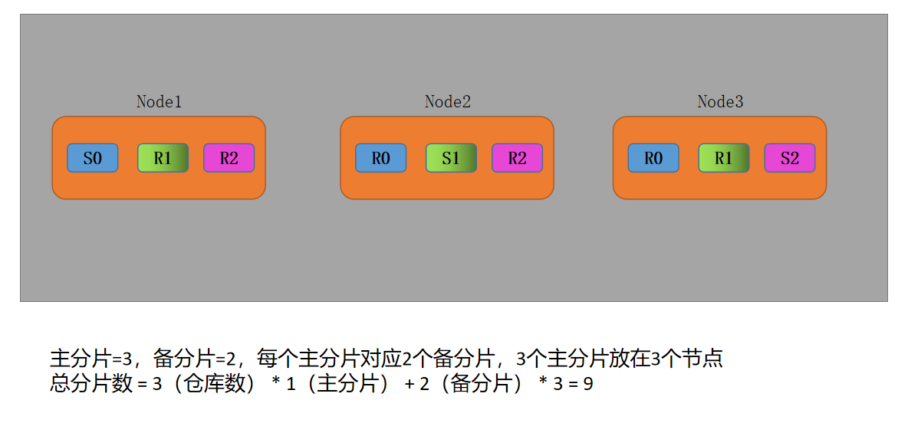
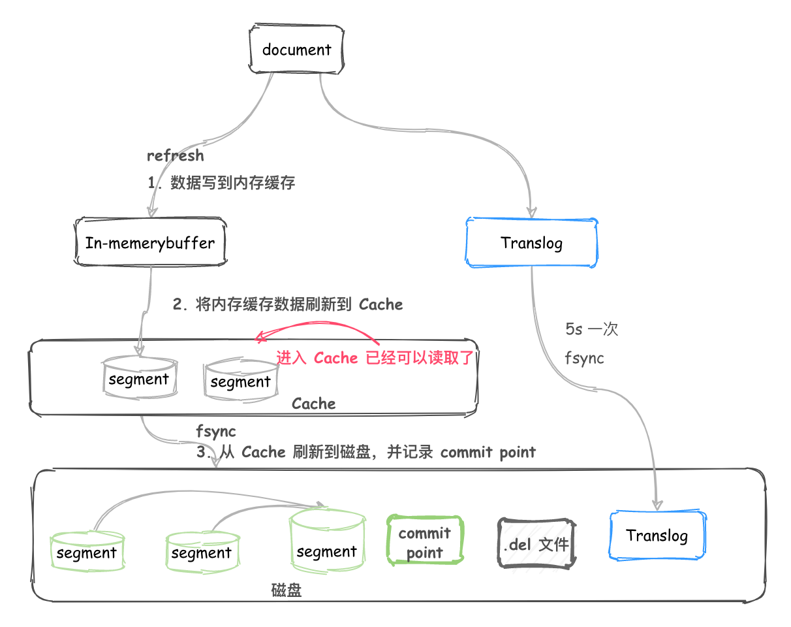

# ElasticSearch集群

cluster集群，每个节点配置相同的 `cluster.name` 即可加入集群

一个服务启动实例就是一个节点Node，节点通过 `node.name` 设置节点名称，会分配一个随机、唯一的标识符作为名称

## 发现机制

内部通过相同的  `cluster.name` 将不同的节点连接到同一个集群。HOW？

### Zen Discovery

内置默认发现模块，发现集群节点和Master选举

提供单播和基于文件的发现，也可扩展。

节点之间通信使用**transport**模块实现

> 单播列表不需要包含集群中的所有节点

```yml
discovery.zen.ping.unicast.hosts: [“192.168.198.241:9301”, “10.150.55.95:9301”,“10.150.30.246:9301”] # 6.x版本
# 在Elasticsearch7.0版本已被移除，配置错误
# 写入候选主节点的设备地址，来开启服务时就可以被选为主节点
# 默认主机列表只有127.0.0.1和IPV6的本机回环地址
# discover意思为发现，zen是判定集群成员的协议，unicast是单播的意思，ES5.0版本之后只支持单播的方式来进行集群间的通信，hosts为主机
# 总结下来就是：使用zen协议通过单播方式去发现集群成员主机，在此建议将所有成员的节点名称都写进来，这样就不用仅靠集群名称cluster.name来判别集群关系了


discovery.seed_hosts: ["192.168.107.110:9301","192.168.107.110:9302","192.168.107.110:9303"] # 7.x版本
```

### 节点角色

每个节点既可以是 **候选主节点**，也可以是**数据节点**

```yml
node.master: true # 候选主节点
node.data: true # 数据节点
```

 **候选主节点**可以被选举为主节点（Master节点），集群中只有**候选主节点**才有选举权和被选举权，其它节点不参与选举。

#### 主节点

master

每个集群都有且只有一个主节点。

负责创建索引、删除索引、跟踪哪些节点是集群的一部分，并决定哪些分片分配给相关的节点、追踪节点的状态。

索引数据和搜索查询等操作会占用大量的cpu，内存，io资源，分离master和数据节点是一个比较好的选择：尽量避免master节点设置`node.data: true`

#### 数据节点

data node

`node.data: true`，数据节点主要存储索引数据，对文档进行增删改查操作、聚合操作

#### 协调节点

coordination

```yml
node.master: fasle # 候选主节点
node.data: false   # 数据节点
```

每一个节点都隐式的是一个协调节点，都设置为false时，该节点只将成为仅协调节点。能处理路由信息

用户的请求可以发往任何一个节点，并由该节点负责分发请求、收集结果等操作，而不需要主节点转发，**协调节点**不需要指定和配置，任何节点都可以充当其角色


## 脑裂现象

由于网络原因或其它原因导致集群中选举多个Master节点，使得数据更新时不一致。出现了多个Master 竞争。

### 原因：

- 网络问题：由于集群之间的网络延迟导致一些节点无法访问到Master，错误的认为Master挂掉了，从而选取新的Master
- 节点负载：主节点角色既是Master也是Data，访问量较大时会造成ES停止响应（假死）造成大面积的延迟，其它节点得不到主节点的响应认为Master挂了，重新选取Master
- 内存回收：主节点角色既是Master也是Data，当Data节点的ES进程占用很大内存的时候，引发JVM内存回收，造成ES进程失去响应

### 如何避免

1. 适当调大响应时间，减少误判。

```yml
discovery.zen.fd.ping_timeout: 120s # 在Elasticsearch7.0版本已被移除，配置无效
# 探测超时时间，默认是3秒，我们这里填120秒是为了防止网络不好的时候ES集群发生脑裂现象
```

2. 选举触发，设置参与候选主节点的节点数。建议：`(master_eligibel_nodes/2)+1`，

```yml
discovery.zen.minimum_master_nodes: 2 # 在Elasticsearch7.0版本已被移除，配置无效
# 为了避免脑裂，集群的最少节点数量为1，集群的总节点数量除以2加1
```


> master_eligibel_nodes：为候选主节点的个数

当小于这个值的时候，无法触发选举行为，集群无法使用，不会造成分片混乱的情况。

3. 角色分离

候选主节点和数据节点进行角色隔离。可以减轻主节点的压力，防止主节点的假死状态。


## 集群状态

- Yellow：预警状态，所有主分片功能正常，但至少有一个副本是不能正常工作的。此时集群是可以正常工作的，但是高可用性在某种程度上会受影响。
- Green：集群健康完好，一切功能齐全正常，所有分片和副本都可以正常工作。
- Red：集群不可正常使用。某个或某些分片及其副本异常不可用，这时集群的查询操作还能执行，但是返回的结果会不准确。对于分配到这个分片的写入请求将会报错，最终会导致数据的丢失。

## 分片和副本

### 分片

**Shards**，通过水平拆分的方式，将一个索引上的数据拆分到不同的数据块，拆分出来的数据块成为一个分片。

```yml
"settings": {
    "index": {
        "number_of_shards": "5",  # 默认5个主分片
    }
}
```

### 副本

**Replicas**，是对分片的拷贝，每个主分片都有一个或多个副本分片。主分片和对于的副本分片不会在同一个节点上的，所以副本分片的最大值=（节点数 - 1）

```yml
"settings": {
    "index": {
        "number_of_replicas": "1"  # 默认每个分片1个副本
    }
}
```

对于文档的新建、索引、删除都是写操作，必须在主分片上完成之后才能被复制到相关的副本分片上。

ES通过乐观锁的方式控制并发写，每个文档都有一个_version，文档修改时 _version 递增。

一旦所有的副本分片写成功才会向协调节点报告成功，协调节点向客户端报告成功。





Master节点会避免将主分片**(Shards)**和副本**(Replicas)**放在同一个节点上

- 将数据分片是为了提高可处理数据的容量和易于进行水平扩展，分片副本是为了提高集群的稳定性和并发性
- 索引的分片和副本不是越多越好

```
shard_num = hash(_routing) % num_primary_shards

shard_num = (hash(_routing) + hash(_id) % routing_partition_size) % num_primary_shards
```


为什么ES索引的主分片数量不能改？

如果num_primary_shards在查询的时候取余发生变化，无法获取到数据


小趣闻

> 目前有如下常用的稳定的主版本：2.x，5.x，6.x，7.x
>
> 你可能会发现没有 3.x 和 4.x，ES从2.4.6直接跳到了5.0.0。其实是为了ELK(ElasticSearch，Logstash，Kibana)技术栈的版本统一，免的给用户带来混乱。
>
> 在Elasticsearch是 2.x (2.x 的最后一版 2.4.6的发布时间是July 25, 2017) 的情况下，Kibana 已经是 4.x(Kibana 4.6.5 的发布时间是 July 25, 2017)。
>
> 那么在 Kibana 的下一主版本肯定是 5.x 了，所以 Elasticsearch 直接将自己的主版本发布为 5.0.0 了。

## 架构原理

### 写入原理

写索引只能写在主分片上，然后同步到副本分片。

```
shard_num = hash(_routing) % num_primary_shards
```

在一个写请求被发送到某个节点后，该节点即为**协调节点**，**协调节点**会根据路由公式计算出哪个分片，在将请求转发到该分片的主分片节点上。

#### 执行流程：

1. shard_num = hash(_routing) % 3 = 1
2. 客户端向Node1节点（协调节点）发送写请求，通过路由公式计算值=0，则将当前数据应写到主分片S1上
3. Node1节点将请求转发到主分片S1所在的节点Node2上，Node2接收请求并写入磁盘
4. 并发将数据复制到副本分片R1上，通过乐观锁控制冲突，一旦所有的副本分片更新成功，则节点Node2将向协调节点Node1报告成功，协调节点向客户端报告成功

#### 存储原理

```yml
path.data: /usr/share/elasticsearch/data1,/usr/share/elasticsearch/data2,/usr/share/elasticsearch/data3
#ES是搜索引擎，会创建文档，建立索引，此路径是索引的存放目录，如果我们的日志数据较为庞大，那么索引所占用的磁盘空间也是不可小觑的
#这个路径建议是专门的存储系统，如果不是存储系统，最好也要有冗余能力的磁盘，此目录还要对elasticsearch的运行用户有写入权限
#path可以指定多个存储位置，分散存储，有助于性能提升，以至于怎么分散存储请看详解https://www.dockerc.com/elk-theory-elasticsearch/

path.logs: /usr/share/elasticsearch/logs
#elasticsearch专门的日志存储位置，生产环境中建议elasticsearch配置文件与elasticsearch日志分开存储
```

##### 分段存储

索引文件以**segment**的形式存储在磁盘上。

索引文件被拆分为多个子文件，每个子文件叫做segment，每一个segment都是一个倒排索引，并且具有不变性，一旦索引的数据被写入磁盘，就不再修改。

segment被写入磁盘后会生成一个**提交点Commit point**，**提交点Commit point**用来记录所有提交后segment信息的文件

> 一个segment一旦拥有了提交点Commit point，只有读权限，失去了写权限；相反，当segmeng在内存中时，就只有写权限，没有读权限

新增、更新、删除如何处理？

- **新增**：只需要对当前文档新增一个segmeng即可
- **删除**：不会把文档从旧的segment中移除，而是新增一个.del文件，文件中列出被删除文档的segment信息（逻辑删除）。被标记删除的文件仍然可以被查询匹配到，但最终会在结果集中移除
- **更新**：不能修改旧的segment，会将旧的文档在.del文件中标记删除，同时会写入一个新的文件，被索引到新的segment中，被删除的那个旧版本文档在结果集返回前就会被移除，此时查询会查询到两个版本的数据，但在返回前会被移除掉一个。

##### 延迟写策略

近实时全文索引引擎

1. 有新增的数据时，先将其写入内存，在内存和磁盘之间是**文件系统缓存**

2. 当达到默认的时间（1s）或者内存的数据达到一定量时，会触发一次刷新（**refresh**），将内存中的数据生成到新的**段segment**上并缓存到**文件缓存系统**上并清空内存，稍后在被刷新到磁盘中并生成提交点Commit point，此时可以提供文档的检索功能且不能修改
3. 内存使用的是JVM内存，文件缓存系统使用的是操作系统的内存

新的数据被写入内存，但内存中的数据并不是以**段segment**的形式存储，因此不提供检索功能；内存刷新到文件缓存系统时会生成新的段，并将段打开供搜索使用。

##### 事务日志

**事务日志translog**记录了所有的还没有持久化到磁盘的数据

|                                                              |
| :----------------------------------------------------------: |
|  |


1. 一个新文档被索引之后，先被写入JVM内存中，同时会追加一份数据到事务日志translog中，此时的数据还不能被检索和查询
2. 随着新文档索引不断写入，当日志大小超过512M或者时间超过30min时，会触发一次flush，内存中的数据被写入新段segment同时被写入文件缓存系统，文件系统缓存中数据通过Fsync刷新到磁盘中，生成Commit point，日志文件被删除，创建一个空的新日志。

> ES根据提交点Commit point去加载已经持久化过的段segment，还需要根据translog里的记录，把未持久化的数据重新持久化到磁盘上，避免了数据丢失的可能

手动执行flush：

```
POST /my-index/_flush
```


##### 段合并

每一个segment会消耗文件句柄、内存和CPU。

后台定期进行**segment合并**，小的segment被合并到大的segment，大的segment再被合并到更大的segment上。

|                                                          |
| :------------------------------------------------------: |
|  |

**segment合并**在进行索引和搜索时会自动进行，合并结束后，老的segment会被删除，新的segment被flush到磁盘。

### 读取原理

搜索类型为**QUERY_THEN_FETCH**、**QUERY_AND_FETCH**、**DFS_QUERY_THEN_FETCH**和**DFS_QUERY_AND_FETCH**

主要query then fetch两个阶段

```
shard_num = hash(_routing) % num_primary_shards
```

#### query and fetch

向索引的所有分片（shards）都发出查询请求，各分片返回的时候把元素文档（document）和计算后的排名信息一起返回。

这种搜索方式是最快的，只需要去shards查询一次。但是各个shards返回的结果的数量之和可能是用户要求的size的n倍。

#### query then fetch

默认的搜索方式，这种方式返回的document与用户要求的size是相等的。

1. 先向所有的shards发出请求，各分片只返回排序和排名相关的信息（注意，不包括文档document)，然后按照各分片返回的分数进行重新排序和排名，取前size个文档。

2. 路由节点再去相关的shards取document，返回给客户端

#### DFS query and fetch

比第一种方式多了一个初始化散发(initial scatter)步骤，有这一步，据说可以更精确控制搜索打分和排名

#### **DFS** query then fetch

比第2种方式多了一个初始化散发(initial scatter)步骤。

### 优化

#### 调整配置参数

- 给每个文档指定有序的具有压缩良好的序列模式 ID，避免随机的 UUID-4 这样的 ID，这样的 ID 压缩比很低，会明显拖慢 Lucene。
- 对于那些不需要聚合和排序的索引字段禁用 Doc values。Doc Values 是有序的基于 document=>field value 的映射列表。
- 不需要做模糊检索的字段使用 Keyword 类型代替 Text 类型，这样可以避免在建立索引前对这些文本进行分词。
- 如果搜索结果不需要近实时的准确度，考虑把每个索引的 index.refresh_interval 改到 30s 。
- 如果在做大批量导入，导入期间可以通过设置这个值为 -1 关掉刷新，还可以通过设置 index.number_of_replicas: 0 关闭副本。别忘记在完工的时候重新开启它。
- 避免深度分页查询建议使用 Scroll 进行分页查询。普通分页查询时，会创建一个 from+size 的空优先队列，每个分片会返回 from+size 条数据，默认只包含文档 ID 和得分 Score 给协调节点。
- 如果有 N 个分片，则协调节点再对(from+size)×n 条数据进行二次排序，然后选择需要被取回的文档。当 from 很大时，排序过程会变得很沉重，占用 CPU 资源严重。
- 减少映射字段，只提供需要检索，聚合或排序的字段。其他字段可存在其他存储设备上，例如 Hbase，在 ES 中得到结果后再去 Hbase 查询这些字段。
- 创建索引和查询时指定路由 Routing 值，这样可以精确到具体的分片查询，提升查询效率。路由的选择需要注意数据的分布均衡。

#### JVM调优

- 确保堆内存最小值( Xms )与最大值( Xmx )的大小是相同的，防止程序在运行时改变堆内存大小。
- 默认安装后设置的堆内存是 1GB，可通过 ../config/jvm.option 文件进行配置，但是最好不要超过物理内存的50%和超过 32GB。
- 使用 G1 收集器


> https://blog.csdn.net/chuixue24/article/details/104022065
>
> https://www.cnblogs.com/ningskyer/articles/5984346.html
>
> https://blog.csdn.net/qq_35688140/article/details/85411049?utm_medium=distribute.pc_relevant.none-task-blog-baidujs-1
>
> https://juejin.cn/post/6866294863106441224