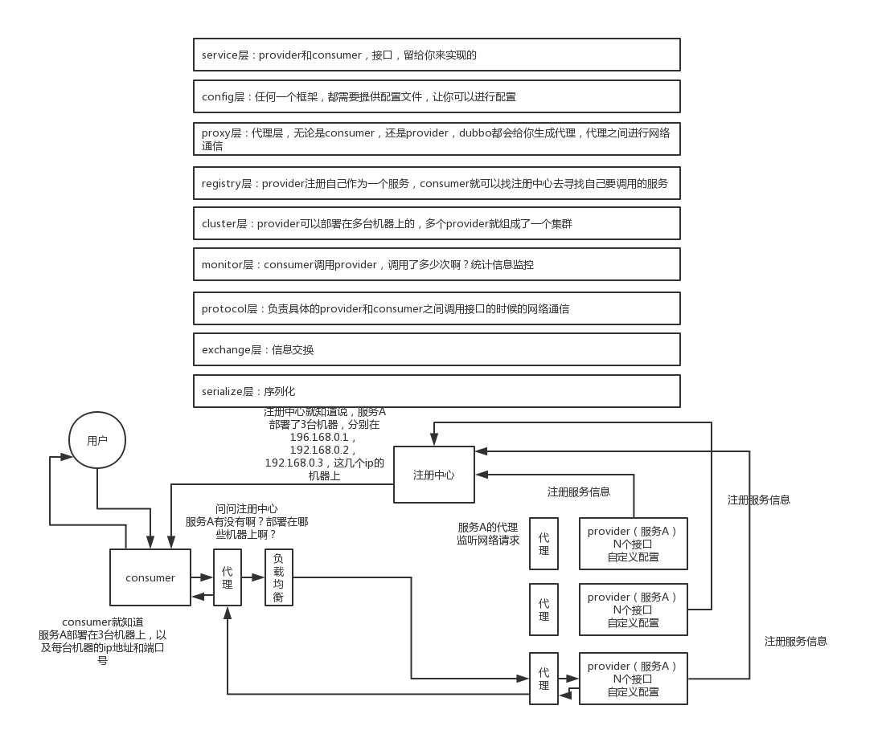
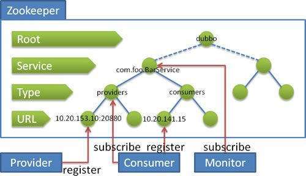

# Dubbo

## 工作原理

### 架构


### 工作原理



- 第一层：service层，接口层，给服务提供者和消费者来实现的
- 第二层：config层，配置层，主要是对dubbo进行各种配置的
- 第三层：proxy层，服务代理层，透明生成客户端的stub和服务单的skeleton
- 第四层：registry层，服务注册层，负责服务的注册与发现
- 第五层：cluster层，集群层，封装多个服务提供者的路由以及负载均衡，将多个实例组合成一个服务
- 第六层：monitor层，监控层，对rpc接口的调用次数和调用时间进行监控
- 第七层：protocol层，远程调用层，封装rpc调用
- 第八层：exchange层，信息交换层，封装请求响应模式，同步转异步
- 第九层：transport层，网络传输层，抽象mina和netty为统一接口
- 第十层：serialize层，数据序列化层

### 工作流程

- 服务容器负责启动，加载，运行服务提供者。

- 服务提供者在启动时，向注册中心注册自己提供的服务。

- 服务消费者在启动时，向注册中心订阅自己所需的服务。

- 注册中心返回服务提供者地址列表给消费者，如果有变更，注册中心将基于**长连接**推送变更数据给消费者。

- 服务消费者，从提供者地址列表中，基于软负载均衡算法，选一台提供者进行调用，如果调用失败，再选另一台调用。

- 服务消费者和提供者，在内存中累计调用次数和调用时间，定时每分钟发送一次统计数据到监控中心。

  
  
  |                             |
  | :-------------------------: |
  |  |
  
  

## 启动流程

org.apache.dubbo.container.Main（com.alibaba.dubbo.container.Main）

提供的启动脚本：META-INF/assembly/bin/start.sh

> 制作自定义的标签：
> 1. spring.handlers     
> 2. NamespaceHandlerSupport


```java
public class DubboNamespaceHandler extends NamespaceHandlerSupport implements ConfigurableSourceBeanMetadataElement {

    static {
        Version.checkDuplicate(DubboNamespaceHandler.class);
    }

    @Override
    public void init() {
        registerBeanDefinitionParser("application", new DubboBeanDefinitionParser(ApplicationConfig.class, true));
        registerBeanDefinitionParser("module", new DubboBeanDefinitionParser(ModuleConfig.class, true));
        registerBeanDefinitionParser("registry", new DubboBeanDefinitionParser(RegistryConfig.class, true));
        registerBeanDefinitionParser("config-center", new DubboBeanDefinitionParser(ConfigCenterBean.class, true));
        registerBeanDefinitionParser("metadata-report", new DubboBeanDefinitionParser(MetadataReportConfig.class, true));
        registerBeanDefinitionParser("monitor", new DubboBeanDefinitionParser(MonitorConfig.class, true));
        registerBeanDefinitionParser("metrics", new DubboBeanDefinitionParser(MetricsConfig.class, true));
        registerBeanDefinitionParser("ssl", new DubboBeanDefinitionParser(SslConfig.class, true));
        registerBeanDefinitionParser("provider", new DubboBeanDefinitionParser(ProviderConfig.class, true));
        registerBeanDefinitionParser("consumer", new DubboBeanDefinitionParser(ConsumerConfig.class, true));
        registerBeanDefinitionParser("protocol", new DubboBeanDefinitionParser(ProtocolConfig.class, true));
        // 服务发布
        registerBeanDefinitionParser("service", new DubboBeanDefinitionParser(ServiceBean.class, true));
        registerBeanDefinitionParser("reference", new DubboBeanDefinitionParser(ReferenceBean.class, false));
        registerBeanDefinitionParser("annotation", new AnnotationBeanDefinitionParser());
    }
}
```

会在Spring容器中生成一个**`ServiceBean`** ，服务的发布也会在`ServiceBean`中完成。

```
public class ServiceBean<T> extends ServiceConfig<T> implements InitializingBean, DisposableBean,
        ApplicationContextAware, BeanNameAware, ApplicationEventPublisherAware {
}
```

初始化之后，调用**`InitializingBean`**的`afterPropertiesSet`方法，Spring容器加载完成，接收事件**`ContextRefreshedEvent`**，调用**`ApplicationListener`**的`onApplicationEvent`方法。

在`afterPropertiesSet`中，和`onApplicationEvent`中，会调用`export()`，在`export()`中，会暴露dubbo服务，具体区别在于是否配置了`delay`属性，是否延迟暴露，如果`delay`不为`null`，或者不为`-1`时，会在`afterPropertiesSet`中调用`export()`暴露dubbo服务，如果为`null`，或者为`-1`时，会在Spring容器初始化完成，接收到**`ContextRefreshedEvent`**事件，调用`onApplicationEvent`，暴露dubbo服务。


## 服务调用底层原理

> org.apache.dubbo.rpc.proxy.InvokerInvocationHandler

```java
public class InvokerInvocationHandler implements InvocationHandler {
    private static final Logger logger = LoggerFactory.getLogger(InvokerInvocationHandler.class);
    private final Invoker<?> invoker;
    private ConsumerModel consumerModel;

    public InvokerInvocationHandler(Invoker<?> handler) {
        this.invoker = handler;
        String serviceKey = invoker.getUrl().getServiceKey();
        if (serviceKey != null) {
            this.consumerModel = ApplicationModel.getConsumerModel(serviceKey);
        }
    }

    @Override
    public Object invoke(Object proxy, Method method, Object[] args) throws Throwable {
        if (method.getDeclaringClass() == Object.class) {
            return method.invoke(invoker, args);
        }
        String methodName = method.getName();
        Class<?>[] parameterTypes = method.getParameterTypes();
        if (parameterTypes.length == 0) {
            if ("toString".equals(methodName)) {
                return invoker.toString();
            } else if ("$destroy".equals(methodName)) {
                invoker.destroy();
                return null;
            } else if ("hashCode".equals(methodName)) {
                return invoker.hashCode();
            }
        } else if (parameterTypes.length == 1 && "equals".equals(methodName)) {
            return invoker.equals(args[0]);
        }
        RpcInvocation rpcInvocation = new RpcInvocation(method, invoker.getInterface().getName(), args);
        String serviceKey = invoker.getUrl().getServiceKey();
        rpcInvocation.setTargetServiceUniqueName(serviceKey);
      
        if (consumerModel != null) {
            rpcInvocation.put(Constants.CONSUMER_MODEL, consumerModel);
            rpcInvocation.put(Constants.METHOD_MODEL, consumerModel.getMethodModel(method));
        }
		// 封装成一个RPC执行的远程调用的对象；
        return invoker.invoke(rpcInvocation).recreate();
    }
}
```

invoker.invoke是如何实现？

> org.apache.dubbo.rpc.cluster.support.wrapper.MockClusterInvoker

```java
public class MockClusterInvoker<T> implements Invoker<T> {

    private final Directory<T> directory;
    private final Invoker<T> invoker;

    public MockClusterInvoker(Directory<T> directory, Invoker<T> invoker) {
        this.directory = directory;
        this.invoker = invoker;
    }


    @Override
    public Result invoke(Invocation invocation) throws RpcException {
        Result result = null;

        String value = getUrl().getMethodParameter(invocation.getMethodName(), MOCK_KEY, Boolean.FALSE.toString()).trim();
        if (value.length() == 0 || "false".equalsIgnoreCase(value)) {
            //no mock
            result = this.invoker.invoke(invocation);
        } else if (value.startsWith("force")) {
            if (logger.isWarnEnabled()) {
                logger.warn("force-mock: " + invocation.getMethodName() + " force-mock enabled , url : " + getUrl());
            }
            //force:direct mock
            result = doMockInvoke(invocation, null);
        } else {
            //fail-mock
            try {
                result = this.invoker.invoke(invocation);

                //fix:#4585
                if(result.getException() != null && result.getException() instanceof RpcException){
                    RpcException rpcException= (RpcException)result.getException();
                    if(rpcException.isBiz()){
                        throw  rpcException;
                    }else {
                        result = doMockInvoke(invocation, rpcException);
                    }
                }

            } catch (RpcException e) {
                if (e.isBiz()) {
                    throw e;
                }

                if (logger.isWarnEnabled()) {
                    logger.warn("fail-mock: " + invocation.getMethodName() + " fail-mock enabled , url : " + getUrl(), e);
                }
                result = doMockInvoke(invocation, e);
            }
        }
        return result;
    }

    @SuppressWarnings({"unchecked", "rawtypes"})
    private Result doMockInvoke(Invocation invocation, RpcException e) {
        Result result = null;
        Invoker<T> minvoker;

        List<Invoker<T>> mockInvokers = selectMockInvoker(invocation);
        if (CollectionUtils.isEmpty(mockInvokers)) {
            minvoker = (Invoker<T>) new MockInvoker(getUrl(), directory.getInterface());
        } else {
            minvoker = mockInvokers.get(0);
        }
        try {
            result = minvoker.invoke(invocation);
        } catch (RpcException me) {
            if (me.isBiz()) {
                result = AsyncRpcResult.newDefaultAsyncResult(me.getCause(), invocation);
            } else {
                throw new RpcException(me.getCode(), getMockExceptionMessage(e, me), me.getCause());
            }
        } catch (Throwable me) {
            throw new RpcException(getMockExceptionMessage(e, me), me.getCause());
        }
        return result;
    }

    private String getMockExceptionMessage(Throwable t, Throwable mt) {
        ...
    }

    /**
     * Return MockInvoker
     * Contract：
     * directory.list() will return a list of normal invokers if Constants.INVOCATION_NEED_MOCK is present in invocation, otherwise, a list of mock invokers will return.
     * if directory.list() returns more than one mock invoker, only one of them will be used.
     *
     * @param invocation
     * @return
     */
    private List<Invoker<T>> selectMockInvoker(Invocation invocation) {
        List<Invoker<T>> invokers = null;
        //TODO generic invoker？
        if (invocation instanceof RpcInvocation) {
            //Note the implicit contract (although the description is added to the interface declaration, but extensibility is a problem. The practice placed in the attachment needs to be improved)
            ((RpcInvocation) invocation).setAttachment(INVOCATION_NEED_MOCK, Boolean.TRUE.toString());
            //directory will return a list of normal invokers if Constants.INVOCATION_NEED_MOCK is present in invocation, otherwise, a list of mock invokers will return.
            try {
                invokers = directory.list(invocation);
            } catch (RpcException e) {
				...
            }
        }
        return invokers;
    }

}
```


> org.apache.dubbo.rpc.cluster.support.AbstractClusterInvoker

```java
public abstract class AbstractClusterInvoker<T> implements Invoker<T> {
    @Override
    public Result invoke(final Invocation invocation) throws RpcException {
        checkWhetherDestroyed();

        // binding attachments into invocation.
        Map<String, Object> contextAttachments = RpcContext.getContext().getObjectAttachments();
        if (contextAttachments != null && contextAttachments.size() != 0) {
            ((RpcInvocation) invocation).addObjectAttachments(contextAttachments);
        }

        List<Invoker<T>> invokers = list(invocation);
        LoadBalance loadbalance = initLoadBalance(invokers, invocation);
        RpcUtils.attachInvocationIdIfAsync(getUrl(), invocation);
        return doInvoke(invocation, invokers, loadbalance);
    }
    
    // 
    protected abstract Result doInvoke(Invocation invocation, List<Invoker<T>> invokers,
                                       LoadBalance loadbalance) throws RpcException;
}
```

## 服务注册底层原理


## 服务引入底层原理

- 服务上线

consumer本身在zk节点下的注册；创建监听器来感知zk节点的变化。provider上下线时会引起对应zk节点的变化，监听器感知到节点变化后，会调用NotifyListener的notify方法，更新内存中的provider列表；与此同时，consumer还会将最新的provider列表写入`~/.dubbo`目录下的文件中，这样做可以保证在zk挂掉的情况下，consumer依然能通过本地的缓存文件找到provider的地址。拿到provider列表后，接下来consumer就可以根据约定好的协议进行远程调用了，当然在这一步还可以做负载均衡。

- 服务下线

服务下线过程中，dubbo有两处代码来处理dubbo的下线。一处是ServiceBean中的detroy()方法，由Spring在销毁bean的时候调用；另一处是DubboShutdownHook，是JVM退出时的钩子线程，会在JVM退出之前执行。

> org.apache.dubbo.config.DubboShutdownHook

```java
public static void destroyAll() {
    if (destroyed.compareAndSet(false, true)) {
        AbstractRegistryFactory.destroyAll();
        destroyProtocols();
    }
}

public static void destroyProtocols() {
    ExtensionLoader<Protocol> loader = ExtensionLoader.getExtensionLoader(Protocol.class);
    for (String protocolName : loader.getLoadedExtensions()) {
        try {
            Protocol protocol = loader.getLoadedExtension(protocolName);
            if (protocol != null) {
                // 对应协议销毁
                protocol.destroy();
            }
        } catch (Throwable t) {
            logger.warn(t.getMessage(), t);
        }
    }
}
	// org.apache.dubbo.registry.support.AbstractRegistryFactory#destroyAll
    public static void destroyAll() {
        if (!destroyed.compareAndSet(false, true)) {
            return;
        }
        // Lock up the registry shutdown process
        LOCK.lock();
        try {
            // 遍历所有的注册信息，销毁
            for (Registry registry : getRegistries()) {
                try {
                    registry.destroy();
                } catch (Throwable e) {
                    LOGGER.error(e.getMessage(), e);
                }
            }
            // 清空注册信息
            REGISTRIES.clear();
        } finally {
            // Release the lock
            LOCK.unlock();
        }
    }
```

对于dubbo协议

> org.apache.dubbo.rpc.protocol.dubbo.DubboProtocol#destroy

```java
@Override
public void destroy() {
	// 1. 关闭provier
    for (String key : new ArrayList<>(serverMap.keySet())) {
        ProtocolServer protocolServer = serverMap.remove(key);

        if (protocolServer == null) {
            continue;
        }

        RemotingServer server = protocolServer.getRemotingServer();

        try {
            server.close(ConfigurationUtils.getServerShutdownTimeout());
        } catch (Throwable t) {
            logger.warn(t.getMessage(), t);
        }
    }
	// 2. 关闭consuer
    for (String key : new ArrayList<>(referenceClientMap.keySet())) {
        List<ReferenceCountExchangeClient> clients = referenceClientMap.remove(key);

        if (CollectionUtils.isEmpty(clients)) {
            continue;
        }

        for (ReferenceCountExchangeClient client : clients) {
            closeReferenceCountExchangeClient(client);
        }
    }

    super.destroy();
}
```

对于server.close：org.apache.dubbo.remoting.exchange.support.header.HeaderExchangeServer#close(int)

```java
public void close(final int timeout) {
	// 
    startClose();
    if (timeout > 0) {
        final long max = (long) timeout;
        final long start = System.currentTimeMillis();
        if (getUrl().getParameter(Constants.CHANNEL_SEND_READONLYEVENT_KEY, true)) {
            sendChannelReadOnlyEvent();
        }
        while (HeaderExchangeServer.this.isRunning() && System.currentTimeMillis() - start < max) {
            try {
                Thread.sleep(10);
            } catch (InterruptedException e) {
                logger.warn(e.getMessage(), e);
            }
        }
    }
    doClose();
    server.close(timeout);
}
```

对于客户端关闭，实际调用`HeaderExchangeClient.close()`方法。停止与provider的心跳、重连，然后关闭NettyClient。


## 服务负载均衡底层原理


- #### Random LoadBalance

  **随机**，按权重设置随机概率

  

- #### RoundRobin LoadBalance

  **轮询**，按公约后的权重设置轮询比率。

  

- #### LeastActive LoadBalance

  **最少活跃调用数**，相同活跃数的随机，活跃数指调用前后计数差。

  

- #### ConsistentHash LoadBalance

  **一致性 Hash**，相同参数的请求总是发到同一提供者

  

## 服务集群容错底层原理

|                                  |
| :------------------------------: |
|  |


- ### Failover Cluster

失败自动切换，当出现失败，重试其它服务器。通常用于读操作，但重试会带来更长延迟。可通过 `retries="2"` 来设置重试次数(不含第一次)

- ### Failfast Cluster

快速失败，只发起一次调用，失败立即报错。通常用于非幂等性的写操作，比如新增记录。

- ### Failsafe Cluster

失败安全，出现异常时，直接忽略。通常用于写入审计日志等操作。

- ### Failback Cluster

失败自动恢复，后台记录失败请求，定时重发。通常用于消息通知操作。

- ### Forking Cluster

并行调用多个服务器，只要一个成功即返回。通常用于实时性要求较高的读操作，但需要浪费更多服务资源。可通过 `forks="2"` 来设置最大并行数。

- ### Broadcast Cluster

广播调用所有提供者，逐个调用，任意一台报错则报错。通常用于通知所有提供者更新缓存或日志等本地资源信息。


## 服务扩展SPI底层原理

SPI，ServiceProvider Interface

扩展机制：

> org.apache.dubbo.common.extension.ExtensionLoader  扩展点加载器

```java
// 根据名称去获取扩展点
public T getExtension(String name) {
    if (StringUtils.isEmpty(name)) {
        throw new IllegalArgumentException("Extension name == null");
    }
    if ("true".equals(name)) {
        return getDefaultExtension();
    }
    final Holder<Object> holder = getOrCreateHolder(name);
    Object instance = holder.get();
    if (instance == null) {
        synchronized (holder) {
            instance = holder.get();
            if (instance == null) {
                instance = createExtension(name);
                holder.set(instance);
            }
        }
    }
    return (T) instance;
}

public T getAdaptiveExtension() {
    Object instance = cachedAdaptiveInstance.get();
    if (instance == null) {
        if (createAdaptiveInstanceError != null) {
            throw new IllegalStateException("Failed to create adaptive instance: " +
                    createAdaptiveInstanceError.toString(),
                    createAdaptiveInstanceError);
        }

        synchronized (cachedAdaptiveInstance) {
            instance = cachedAdaptiveInstance.get();
            if (instance == null) {
                try {
                    instance = createAdaptiveExtension();
                    cachedAdaptiveInstance.set(instance);
                } catch (Throwable t) {
                    createAdaptiveInstanceError = t;
                    throw new IllegalStateException("Failed to create adaptive instance: " + t.toString(), t);
                }
            }
        }
    }

    return (T) instance;
}

// 
getActivateExtension(URL url, String key) 
```

- ExtensionFactory

  实现类：

- AdaptiveExtensionFactory       **@Adaptive**

- SpiExtensionFactory                  **@SPI**

- SpringExtensionFactory


> org.apache.dubbo.config.spring.extension.SpringExtensionFactory

```java
public <T> T getExtension(Class<T> type, String name) {

    //SPI should be get from SpiExtensionFactory
    // 如果接口上存在@SPI注解，就不从Spring获取对象实例了
    if (type.isInterface() && type.isAnnotationPresent(SPI.class)) {
        return null;
    }
	// 从Spring中获取bean，byName
    for (ApplicationContext context : CONTEXTS) {
        T bean = BeanFactoryUtils.getOptionalBean(context, name, type);
        if (bean != null) {
            return bean;
        }
    }
    return null;
}
```


> org.apache.dubbo.common.extension.factory.SpiExtensionFactory

```java
public <T> T getExtension(Class<T> type, String name) {
    // SPI注解
    if (type.isInterface() && type.isAnnotationPresent(SPI.class)) {
        ExtensionLoader<T> loader = ExtensionLoader.getExtensionLoader(type);
        if (!loader.getSupportedExtensions().isEmpty()) {
            return loader.getAdaptiveExtension();
        }
    }
    return null;
}
```


## 服务调用方式

### 异步调用

基于 Netty 的 NIO 异步通讯机制，客户端不需要启动多线程即可完成并行调用多个远程服务，相对多线程开销较小。

|                                   |
| --------------------------------- |
|  |
|                                   |

- Consumer 配置

```xml
<dubbo:reference id="asyncService" interface="com.alibaba.dubbo.samples.async.api.AsyncService">
    <dubbo:method name="goodbye" async="true"/>
</dubbo:reference>
```

- Consumer发起调用：

```java

AsyncService service = ...;
String result = service.goodbye("samples");// 这里的返回值为空，请不要使用
Future<String> future = RpcContext.getContext().getFuture();
... // 业务线程可以开始做其他事情
result = future.get(); // 阻塞需要获取异步结果时，也可以使用 get(timeout, unit) 设置超时时间
```


- sent="true"` 等待消息发出，消息发送失败将抛出异常；
- `sent="false"` 不等待消息发出，将消息放入 IO 队列，即刻返回。

如果你只是想异步，完全忽略返回值，可以配置 `return="false"`，以减少 Future 对象的创建和管理成本

```xml
<dubbo:method name="goodbye" async="true" return="false"/>
```

此时，`RpcContext.getContext().getFuture()`将返回`null`。

### 参数回调

### 事件通知

事件通知允许 Consumer 端在调用之前、调用之后或出现异常时，触发 `oninvoke`、`onreturn`、`onthrow` 三个事件。

- Consumer端，指定事件需要通知的方法

```xml
<bean id="demoCallback" class="com.alibaba.dubbo.samples.notify.impl.NotifyImpl" />

<dubbo:reference id="demoService" check="false" interface="com.alibaba.dubbo.samples.notify.api.DemoService" version="1.0.0" group="cn">
    <dubbo:method name="sayHello" onreturn="demoCallback.onreturn" onthrow="demoCallback.onthrow"/>
</dubbo:reference>
```

- NotifyImpl

```java
public class NotifyImpl implements Notify{

    public Map<Integer, String> ret = new HashMap<Integer, String>();
    
    public void onreturn(String name, int id) {
        ret.put(id, name);
        System.out.println("onreturn: " + name);
    }

    public void onthrow(Throwable ex, String name, int id) {
        System.out.println("onthrow: " + name);
    }
}
```

这里要强调一点，自定义 Notify 接口中的三个方法的参数规则如下：

- `oninvoke` 方法参数与调用方法的参数相同；
- `onreturn`方法第一个参数为调用方法的返回值，其余为调用方法的参数；
- `onthrow`方法第一个参数为调用异常，其余为调用方法的参数。

上述配置中，`sayHello`方法为同步调用，因此事件通知方法的执行也是同步执行。可以配置 `async=true`让方法调用为异步，这时事件通知的方法也是异步执行的。特别强调一下，`oninvoke`方法不管是否异步调用，都是同步执行的。


## 服务提供方停机过程？

1. 从注册中心剔除自己，从而确保消费者不要在拉取它
2. sleep一段时间，等到服务消费，接收到服务中心通知该服务提供者下线，加大在不重试情况下的优雅停机成功率
3. 广播readonly事件给所有的consumer本服务下线
4. sleep 10 ms，保证consumer收到消息
5. 先标记为不接收新请求，当新请求过来时直接报错，让客户端重试其它机器
6. 关闭心跳线程
7. 检测线程池中的线程是否有正在运行，如果有，等待所有线程执行完毕，除非超时，则强制关闭。


- 注册中心宕机，服务间是否可以继续通信？

可以通信，启动dubbo时，消费者会从zk拉取注册的生产者的地址接口等数据，缓存在本地。每次调用时，按照本地存储的地址进行调用；（但前提是你没有增加新的服务，如果你要调用新的服务，则是不能办到的）
另外如果服务的提供者全部宕机，服务消费者会无法使用，并无限次重连等待服务者恢复；


## 注册信息

- 持久节点

- 临时节点




1. 羊群效应
2. 长连接
3. 注册中心本地缓存，消费者如何感知生产者下线
4. 