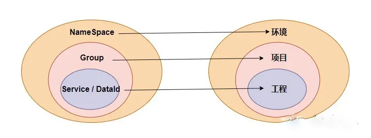
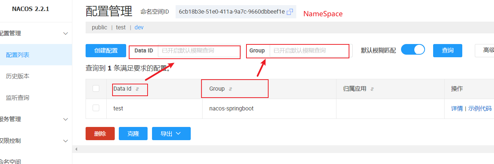
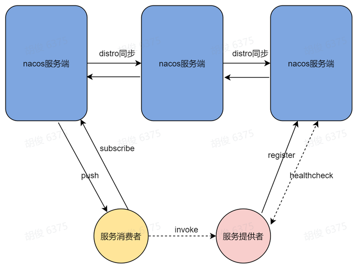

# Nacos

**Dynamic Naming and Configuration Service**，Nacos 提供了一组简单易用的特性集，实现**动态服务发现**、**动态DNS服务**、服务配置管理、服务及流量管理

- **命名空间（NameSpace）**：用于不同环境（开发环境、测试环境、预发布环境和生产环境）的配置隔离。不同的命名空间下，可以存在相同名称的配置分组（Group）或配置集。
- **配置分组（Group）**：对配置集进行分组，不同的配置分组下可以有相同的配置集（DateId）。默认的配置分组名称为 **DEFAULT_GROUP**。用于区分不同的项目或应用。
- **配置集（DataId）**：个配置文件通常就是一个**配置集**，一个配置集可以包含了系统的各种配置信息，例如一个配置集可能包含了数据源、线程池、日志级别等配置项。每个配置集都可以定义一个有意义的名称。

数据结构类型`Map<namespaceId, Map<group@@serviceName, Service>>`，最外层的key是namespaceId，值是map，内部map大的key是group拼接serviceName（group@@serviceName），值是service对象；service对象内部又是一个map，key是集群名称，值是Cluster对象，Cluster对象内部维护了实例对象集合

|                                                  |
| ------------------------------------------------ |
|  |
|               |

Nacos1.x：心跳多，无效查询多，心跳续约感知变化慢，连接消耗大，资源空耗严重。

Nacos2.x：客户端不再需要定时发送实例心跳，长连接的流式推送

## 动态服务发现

|                                                              |
| ------------------------------------------------------------ |
|  |

### 通讯协议

1.x版本：**http协议**

2.x版本：**grpc长连接协议**

## Nacos中的CAP

作为配置中心时，所有的配置信息都是同一份，一般存在MySQL中；作为注册中心时，

推荐AP，保证高可用。

> Nacos中**服务注册中心**默认是**AP**模式，如果设置为CP模式`
> `那么客户端设置 `spring.cloud.nacos.discovery.ephemeral=false` （默认为true） false - 持久化实例，使用 CP架构；true - 临时实例，使用AP架构

### Raft协议

**强一致性**共识算法，**CP模式**，类似Zookeeper，`raft`通过**心跳机制**来维持`Leader`以及`Follower`的关系。

客户端在注册服务信息的同时，对于每个服务会启动一个心跳服务，**默认每隔5S时间会发送服务实例的心跳信息**。

**配置管理**

保存节点之间的选举和数据同步，数据持久化到本地。

### Distro协议

**最终一致性**协议，**AP模式**，类似Eureka，权威Server的概念，每个节点负责⼀部分数据以及将自己的数据同步给其他节点，有效的降低了消息冗余的问题。

**服务注册**

数据不会持久化到本地，只会存在内存中。

> 两种一致性策略共存

其负载均衡通过**ribbon**实现的。

Nacos配置中心宕机，还是可以读取到配置，因为客户端读取到配置信息以后会缓存在本地内存，可以在内存中拿到数据。

为了保证业务方服务的新增机器和机器下线等信息及时同步给消费者，提供者需定期向Nacos服务器上报心跳包（**默认5秒发送一次**），告诉服务器自己还活着，如果Nacos服务器**15秒没有收到心跳包**，就会把这个提供者标示为**不健康**，并通报给Nacos客户端，如果服务器**30秒没有收到心跳包**，就会在Nacos服务器上**删除这个提供者**，并把最新的提供者列表通过**upd协议**发送给Nacos客户端。

`ephemeral`属性：

- 临时实例：true，服务实例仅会注册在Nacos内存，不会持久化到Nacos磁盘，其**健康检测机制为Client模式**，即Client主动向Server上报其健康状态（类似于推模式）。是在应用程序启动时注册到Nacos中的，当该实例关闭时，Nacos将自动注销该实例。临时实例通常用于临时的服务实例。

  默认心跳间隔为5秒，在15秒内Server未收到Client心跳，则会将其标记为”不健康“状态；在30秒内若收到了Client心跳，则重新恢复“健康”状态，否则该实例将从Server端内存清除。即对于不健康的实例，Server会自动清除；

- 永久实例：false，服务实例不仅会注册到Nacos内存，同时也会被持久化到Nacos磁盘，它们会一直存在，除非手动从Nacos中注销。其**健康检测机制为Server模式**，即Server会主动去检测Client的健康状态（类似于拉模式），永久实例通常用于具有长期生命周期的服务，例如基于物理服务器的服务。

  默认每20秒检测一次，健康检测失败后服务实例会被标记为“不健康”状态，但不会被清除，因为其是持久化在磁盘的，其对不健康持久实例的清除，需要专门进行；

