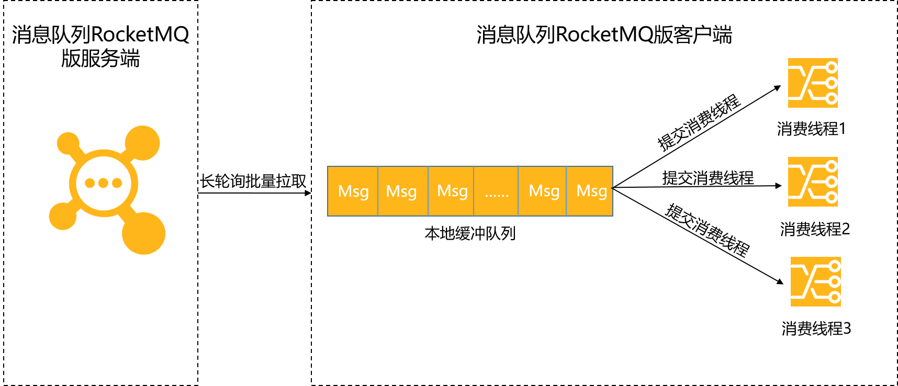

# 消息堆积和延迟问题

客户端消费者的消费速度跟不上服务端的发送速度，出现未处理的消息越来越多，这部分消息被称为**堆积消息**。消息堆积进而造成消息**消费延迟**。

## 客户端消费原理

| RocketMQ消费流程                              |
| --------------------------------------------- |
|  |

- **获取消息**：客户端通过长轮询批量拉取的方式从服务端获取消息，将拉取到的消息缓存到**本地缓冲队列**中。

- **提交消费线程**：客户端将**本地缓冲队列**中的消息提交到**消费线程**中，使用业务消费逻辑进行处理。

  此时客户端的消费能力就完全依赖于业务逻辑的复杂度（消费耗时）和消费逻辑并发度。如果业务处理逻辑复杂，处理单条消息耗时都较长，则整体的消息吞吐量肯定不会高，此时就会导致客户端**本地缓冲队列**达到上限，停止从服务端拉取消息。

消息堆积的瓶颈在于客户端的消费能力，即**消费耗时**和**消费并发度**。必须合理的控制消费耗时和消息并发度，其中消费耗时的优先级高于消费并发度，必须先保证消费耗时的合理性，再考虑消费并发度问题。

## 如何避免

- 梳理消息的消费耗时

  通过压测获取消息的消费耗时，并对耗时较高的操作的代码逻辑进行分析。查询消费耗时，请参见[获取消息消费耗时](https://help.aliyun.com/document_detail/193952.htm#step-zbp-czw-m7t)。

- 设置消息的消费并发度

  

## 如何解决

通过**监控报警**功能，设置告警规则**提前预警**消息堆积问题，或通过**业务埋点**，触发报警事件，及时监控消息堆积问题并进行处理。