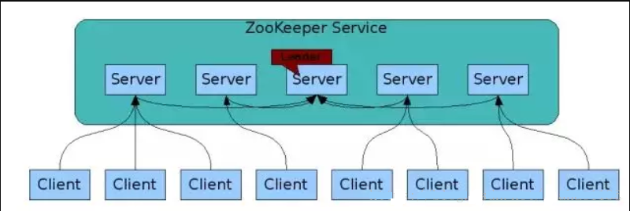

# Zookeeper

> ZooKeeper: A Distributed Coordination Service for Distributed Applications  分布式协调

|                                                            |
| :--------------------------------------------------------: |
|  |
|  |

- Leader： ZooKeeper集群工作的核心事务请求（写操作）的唯一调度和处理者，保证集群事务处理的顺序性；集群内部各个服务的调度者。 对于create，setData，delete等有写操作的请求，则需要统一转发给leader处理，leader需要决定编号、执行操作，这个过程称为一个事务。
- Follower： 处理客户端（读操作）请求，转发（写操作）请求给Leader ，参与集群 leader 选举投票2n-1台可以做集群投票，此外，针对访问量比较大的zookeeper集群，还可以新增观察者角色
- Observer： 观察者角色，观察ZooKeeper集群的最新状态变化并将这些状态同步过来，其对于非事务请求（读操作）可以进行独立处理，对于事务请求（写操作），则会转发给Leader服务器处理， 不会参与任何形式的投票只提供服务，通常用于在不影响集群事务处理能力的前提下提升集群的非事务处理能力

## 特性

1. zookeeper：一个leader，多个follower组成的集群

2. 全局数据一致：每个server保存一份相同的数据副本，client无论连接到呢个server，数据都是一致的

3. 分布式读写，更新请求转发，由leader实施

4. 更新请求顺序进行，来自同一个client的更新请求按其发送顺序依次执行

5. 数据更新原子性，一次数据更新要么成功，要么失败

6. 实时性，在一定时间范围内，client能读到最新数据

> **保证：CP（强一致性）**

## 数据结构

Znode兼具文件和目录两种特点。既像文件一样维护着数据长度、元信息、ACL、时间戳等数据结构，又像目录一样可以作为路径标识的一部分。每个Znode由三个部分组成：

- stat            状态信息，描述该Znode版本、权限等信息。

- data           与该Znode关联的数据

- children    该Znode下的节点

  

### Znode类型

- 持久节点（`persistent node`）节点会被持久
- 临时节点（`ephemeral node`），客户端断开连接后，ZooKeeper会自动删除临时节点
- 顺序节点（`sequential node`），每次创建顺序节点时，ZooKeeper都会在路径后面自动添加上10位的数字，从1开始，最大是2147483647 （2^32-1） **每个顺序节点都有一个单独的计数器，并且单调递增的，由Zookeeper的**`**leader**`**实例维护。**

### Znode结构

| znode 状态信息 | 解释                                                         |
| -------------- | ------------------------------------------------------------ |
| cZxid          | create ZXID，即该数据节点被创建时的事务 id                   |
| ctime          | create time，即该节点的创建时间                              |
| mZxid          | modified ZXID，即该节点最终一次更新时的事务 id               |
| mtime          | modified time，即该节点最后一次的更新时间                    |
| pZxid          | 该节点的子节点列表最后一次修改时的事务 id，只有子节点列表变更才会更新 pZxid，子节点内容变更不会更新 |
| cversion       | children version，子节点版本号，当前节点的子节点每次变化时值增加 1 |
| dataVersion    | 数据节点内容版本号，节点创建时为 0，每更新一次节点内容(不管内容有无变化)该版本号的值增加 1 |
| aclVersion     | 节点的 ACL 版本号，表示该节点 ACL 信息变更次数               |
| ephemeralOwner | 创建该临时节点的会话的 sessionId；如果当前节点为持久节点，则 ephemeralOwner=0 |
| dataLength     | 数据节点内容长度                                             |
| numChildren    | 当前节点的子节点个数                                         |

### Znode属性

### Zxid

事务id，64位的数字，高32位表示epoch用来标识leader关系是否改变，每次一个leader被选出来，它都会有一个新的epoch；低32位递增计数，保证事务的顺序一致性

1. **cZxid**
   Create，节点创建的事务标识
2. **mZxid**
   Modify，节点更新的zxid。对znode的修改都会更新mZxid
3. **pZxid**
   该节点的子节点（或该节点）的最近一次创建/删除，与孙子节点无关，znode最后更新的子节点zxid。

### version

​		版本号，每当客户端检索数据时，它将同时检索数据的版本号。并且如果一个客户端执行了某个节点的更新或删除操作，它也必须提供要被操作的数据的版本号。如果所提供的数据版本号与实际的不匹配，那么这个操作将会失败。

- dataVersion         (当前 ZNode 的版本）

- cversion             （当前 ZNode 子节点的版本）

- aclVersion          （当前 ZNode 的 ACL 版本）

### Watcher

（事件监听器），是 ZooKeeper 中的一个很重要的特性。

ZooKeeper 允许用户在指定节点上注册一些 Watcher，并且在一些特定事件触发的时候，ZooKeeper 服务端会将事件通知到感兴趣的客户端，该机制是 ZooKeeper 实现分布式协调服务的重要特性。

- 一种是DataWatches，基于znode节点的数据变更从而触发 watch 事件，触发条件getData()、exists()、setData()、 create()。
- 一种是Child Watches，基于znode的子节点发生变更触发的watch事件，触发条件 getChildren()、 create()。

> 调用 delete() 方法删除znode时，则会同时触发Data Watches和Child Watches，如果被删除的节点还有父节点，则父节点会触发一个Child Watches。

1. Watch是一次性的，每次都需要重新注册，并且客户端在会话异常结束时不会收到任何通知，而快速重连接时仍不影响接收通知。
2. Watch的回调执行都是顺序执行的，并且客户端在没有收到关注数据的变化事件通知之前是不会看到最新的数据
3. Watch是轻量级的，WatchEvent是最小的通信单元，结构上只包含通知状态、事件类型和节点路径。ZooKeeper服务端只会通知客户端发生了什么，并不会告诉具体内容。

### ACL

ZooKeeper 采用 ACL（Access Control List）策略来进行权限控制，类似于  UNIX 文件系统的权限控制。

- CREATE           创建子节点的权限
- READ               获取节点数据和子节点列表的权限
- WRITE             更新节点数据的权限
- DELETE           删除子节点的权限
- ADMIN            设置节点ACL的权限

## Leader Election

集群初始化启动时就会进行选举，运行期间也会进行选举

### ZAB 协议

ZAB 核心思想是当多数 Server 写成功，则任务数据写成功.

ZAB（ZooKeeper Atomic Broadcast 原子广播）协议是为分布式协调服务 ZooKeeper 专门设计的一种支持崩溃恢复的原子广播协议。

在 ZooKeeper 中，主要依赖 ZAB 协议来实现分布式数据一致性，基于该协议，ZooKeeper 实现了一种主备模式的系统架构来保持集群中各个副本之间的数据一致性。

包含两个阶段：leader election阶段和Atomic Broadcast阶段

- a) 集群中将选举出一个leader，其他的机器则称为follower，所有的写操作都被传送给leader，并通过broadcast将所有的更新告诉follower。
- b) 当leader崩溃或者leader失去大多数的follower时，需要重新选举出一个新的leader，让所有的服务器都恢复到一个正确的状态。
- c) 当leader被选举出来，且大多数服务器完成了和leader的状态同步后，leader election 的过程就结束了，就将会进入到Atomic broadcast的过程。
- d) Atomic Broadcast同步leader和follower之间的信息，保证leader和follower具有形同的系统状态。

### Paxos 算法

### 选举机制中概念

#### serverId（服务器ID 既 myid）

- 比如有三台服务器，编号分别是1,2,3。
- 编号越大在选择算法中的权重越大。

#### zxid（最新的事务D 既 LastLoggedZxid）

- 服务器中存放的最大数据ID。
- ID值越大说明数据越新，在选举算法中数据越新权重越大。

#### epoch （逻辑时钟 既 PeerEpoch）

- 每个服务器都会给自己投票，或者叫投票次数，同一轮投票过程中的逻辑时钟值是相同的。
- 每投完一次票这个数据就会增加，然后与接收到的其它服务器返回的投票信息中的数值相比。
- 如果收到低于当前轮次的投票结果，该投票无效，需更新到当前轮次和当前的投票结果。

### 选举状态

- LOOKING，竞选状态。
- FOLLOWING，随从状态，同步leader状态，参与投票。
- OBSERVING，观察状态，同步leader状态，不参与投票。
- LEADING，领导者状态。

### 选举算法

通过 zoo.cfg 配置文件中的 electionAlg 属性指定 （1-3），要理解paxos算法的理论基础。

- 1 对应：LeaderElection 算法。
- 2 对应：AuthFastLeaderElection 算法。
- 3 对应：FastLeaderElection **默认的算法**。

### 投票内容

- 选举人ID
- 选举人数据ID
- 选举人选举轮数
- 选举人选举状态
- 推举人ID
- 推举人选举轮数

### 选举过程

**Leader选举有如下两种**

- 第一种：**服务器初始化启动的Leader选举**。
- 第二种：**服务器运行时期的Leader选举**（服务器运行期间无法和Leader保持连接）。

**Leader选举的前提条件**

- 只有服务器状态在LOOKING（竞选状态）状态才会去执行选举算法。
- Zookeeper 的集群规模至少是2台机器，才可以选举Leader，这里以3台机器集群为例。
- 当一台服务器启动是不能选举的，等第二台服务器启动后，两台机器之间可以互相通信，才可以进行Leader选举
- 服务器运行期间无法和Leader保持连接的时候。
- 

#### 服务器启动时期的 Leader 选举

在集群初始化阶段，当有一台服务器Server1启动时，其单独无法进行和完成Leader选举，当第二台服务器Server2启动后，此时两台机器可以相互通信，每台机器都试图找到Leader，于是进入Leader选举过程。选举过程如下：

**(1) 每个Server发出一个投票投给自己**。由于是初始情况，Server1和Server2都会将自己作为Leader服务器来进行投票，**每次投票会包含所推举的服务器的myid和ZXID**，使用(myid, ZXID)来表示，此时Server1的投票为(1, 0)，Server2的投票为(2, 0)，然后各自将这个投票发给集群中其他机器。

**(2) 接受来自各个服务器的投票**。集群的每个服务器收到投票后，**首先判断该投票的有效性，如检查是否是本轮投票、是否来自LOOKING状态的服务器**。

**(3) 处理投票**。针对每一个投票，服务器都需要将别人的投票和自己的投票进行PK，PK规则如下

**1、优先检查ZXID。ZXID比较大的服务器优先作为Leader**。

**2、如果ZXID相同，那么就比较myid。myid较大的服务器作为Leader服务器**。

对于Server1而言，它的投票是(1, 0)，接收Server2的投票为(2, 0)，首先会比较两者的ZXID，均为0，再比较myid，此时Server2的myid最大，于是更新自己的投票为(2, 0)，然后重新投票，对于Server2而言，其无须更新自己的投票，只是再次向集群中所有机器发出上一次投票信息即可。

**(4) 统计投票**。每次投票后，服务器都会统计投票信息，判断是否已经有过半机器接受到相同的投票信息，对于Server1、Server2而言，都统计出集群中已经有两台机器接受了(2, 0)的投票信息，此时便认为已经选出了Leader。

**(5) 改变服务器状态**。一旦确定了Leader，每个服务器就会更新自己的状态，如果是Follower，那么就变更为FOLLOWING，如果是Leader，就变更为LEADING。

#### 服务器运行时期的 Leader 选举

在Zookeeper运行期间，即便当有非Leader服务器宕机或新加入，此时也不会影响Leader，但是**一旦Leader服务器挂了，那么整个集群将暂停对外服务，进入新一轮Leader选举**，其过程和启动时期的Leader选举过程基本一致。假设正在运行的有Server1、Server2、Server3三台服务器，当前Leader是Server2，若某一时刻Leader挂了，此时便开始Leader选举。选举过程如下：

**(1)变更状态**。Leader挂后，余下的非Observer服务器都会将自己的服务器状态变更为LOOKING，然后开始进入Leader选举流程。

**(2)每个Server会发出一个投票**。在这个过程中，需要生成投票信息(myid,ZXID)每个服务器上的ZXID可能不同，我们假定Server1的ZXID为123，而Server3的ZXID为122；在第一轮投票中，Server1和Server3都会投自己，产生投票(1, 123)，(3, 122)，然后各自将投票发送给集群中所有机器。

**(3)接收来自各个服务器的投票**。与启动时过程相同。

**(4)处理投票**。与启动时过程相同，此时，Server1将会成为Leader。

**(5)统计投票**。与启动时过程相同。

**(6)改变服务器的状态**。与启动时过程相同。

### Leader选举算法分析

在3.4.0后的Zookeeper的版本只保留了TCP版本的FastLeaderElection选举算法。当一台机器进入Leader选举时，当前集群可能会处于以下两种状态

当ZooKeeper集群中的一台服务器出现以下两种情况之一时，就会开始进入Leader选举。

- 服务器初始化启动。
- 服务器运行期间无法和Leader保持连接。

而当一台机器进入Leader选举流程时，当前集群也可能会处于以下两种状态。

- 集群中本来就巳经存在一个Leader。
- 集群中确实不存在Leader。

我们先来看第一种巳经存在Leader的情况。此种情况一般都是某台机器启动得较晚，在其启动之前，集群已经在正常工作，对这种情况，该机器试图去选举Leader时，会被告知当前服务器的Leader信息，对于该机器而言，仅仅需要和Leader机器建立起连接，并进行状态同步即可。

**下面我们重点来看在集群中Leader不存在的情况下，如何进行Leader选举**。

#### 开始第一次投票

通常有两种情况会导致集群中不存在Leader

- 一种情况是在整个服务器刚刚初始化启动时，此时尚未产生一台Leader服务器。
- 另一种情况就是在运行期间当前Leader所在的服务器挂了。

无论是哪种情况，此时集群中的所有机器都处于一种试图选举出一个Leader的状态，我们把这种状态称为“LOOKING”，意思是说正在寻找Leader。当一台服务器处于LOOKING状态的时候，那么它就会向集群中所有其他机器发送消息，我们称这个消息为“投票”。

**在这个投票消息中包含两个最基本的信息**：

**所推举的服务器的SID和ZXID**,**分别表示了被推举服务器的唯一标识和事务ID**。

下文中我们将以“（SID, ZXID)”这样的形式 来标识一次投票信息。举例来说，如果当前服务器要推举SID为1、ZXID为8的服务器成为Leader,那么它的这次投票信息可以表示为（1，8）。

我们假设ZooKeeper由5台机器组成，SID分別为1、2、3、4和5, ZXID分别为9、9、9、8和8,并且此时SID为2的机器是Leader服务器。某一时刻，1和2所在的机器出现故障，因此集群开始进行Leader选举。

**在第一次投票的时候，由于还无法检测到集群中其他机器的状态信息，因此每台机器都是将自己作为被推举的对象来进行投票**，于是SID为3、4和5的机器，投票情况分别为：（3, 9）、（4, 8）和（5, 8）。

#### 变更投票

集群中的每台机器发出自己的投票后，也会接收到来自集群中其他机器的投票。每台机器都会根据一定的规则，来处理收到的其他机器的投票，并以此来决定是否需要变更自己的投票。这个规则也成为了整个Leader选举算法的核心所在。为了便于描述，我们首先定义一些术语。

- vote_sid：接收到的投票中所推举Leader服务器的SID。
- vote_zxid：接收到的投票中所推举Leader服务器的ZXID，既事物ID。
- self_sid:：当前服务器自己的SID。
- self_zxid：当前服务器自己的ZXID。

每次对于收到的投票的处理，都是一个对（votesid，votezxid)和（selfsid，selfzxid) 对比的过程，假设Epoch相同的情况下。

规则如下：

**1、**如果votezxid大于自己的selfzxid，就认可当前收到的投票，并再次将该投票发送出去。

**2、**如果votezxid小于自己的selfzxid,那么就坚持自己的投票，不做任何变更。

**3、**如果votezxid等于自己的selfzxid,那么就对比两者的SID。如果votesid大于selfsid，那么就认可当前接收到的投票，并再次将该投票发送出去。

**4、**如果votezxid等于自己的selfzxid，并且votesid小于selfsid，那么同样坚持自己的投票，不做变更。

根据上面这个规则，我们结合图来分折上面提到的5台机器组成的ZooKeeper集群的投票变更过程。

 

每台机器都把投票发出后，同时也会接收到来自另外两台机器的投票。

对干Server3来说，它接收到了（4, 8）和（5, 8）两个投票，对比后，由子自己的ZXID要大于接收到的两个投票，因此不需要做任何变更。

对于Server4来说，它接收到了（3, 9）和（5, 8）两个投票，对比后，由于（3, 9）这个投票的ZXID大于自己，因此需要变更投票为（3, 9）,然后继续将这个投票发送给另外两台机器。

同样，对TServer5来说，它接收到了（3, 9）和（4, 8）两个投票，对比后，由于（3, 9）这个投票的ZXID大于自己，因此需要变更投票为（3, 9），然后继续将这个投票发送给另外两台机器。

#### 确定Leader

经过这第二次投票后，集群中的每台机器都会再次收到其他机器的投票，然后开始统计投票。如果一台机器收到了超过半数的相同的投票，那么这个投票对应的SID机器即为 Leader。

如上图所示的Leader选举例子中，因为ZooKeeper集群的总机器数为5台，那么 quorum = ( 5/2 + 1 ) = 3

也就是说，只要收到3个或3个以上（含当前服务器自身在内）一致的投票即可。在这里，Server3、Server4 和Server5 都投票（3, 9），因此确定了 Server3为 Leader。

**小结**

简单地说，通常哪台服务器上的数据越新（ZXID会越大），那么越有可能成为Leader,原因很简单，数据越新，那么它的ZXID也就越大，也就越能够保证数据的恢复。当然，如果集群中有几个服务器有相同的ZXID，那么SID较大的那台服务器成为Leader。

### Leader选举实现细节

**1、服务器状态**

服务器具有四种状态，分别是LOOKING、FOLLOWING、LEADING、OBSERVING。

- **LOOKING**：寻找Leader状态。当服务器处于该状态时，它会认为当前集群中没有Leader，因此需要进入Leader选举状态。
- **FOLLOWING**：跟随者状态。表明当前服务器角色是Follower。
- **LEADING**：领导者状态。表明当前服务器角色是Leader。
- **OBSERVING**：观察者状态。表明当前服务器角色是Observer。

**2、投票数据结构**

每个投票中包含了两个最基本的信息，所推举服务器的SID和ZXID，投票（Vote）在Zookeeper中包含字段如下。

- **id**：被推举的Leader的SID。
- **zxid**：被推举的Leader事务ID。
- **electionEpoch**：逻辑时钟，用来判断多个投票是否在同一轮选举周期中，该值在服务端是一个自增序列，每次进入新一轮的投票后，都会对该值进行加1操作。
- **peerEpoch**：被推举的Leader的epoch。
- **state**：当前服务器的状态。

**3、QuorumCnxManager：网络I/O**

每台服务器在启动的过程中，会启动一个QuorumPeerManager，负责各台服务器之间的底层Leader选举过程中的网络通信。

**(1)消息队列**。QuorumCnxManager内部维护了一系列的队列，用来保存接收到的、待发送的消息以及消息的发送器，除接收队列以外，其他队列都按照SID分组形成队列集合，如一个集群中除了自身还有3台机器，那么就会为这3台机器分别创建一个发送队列，互不干扰。

- **recvQueue**：消息接收队列，用于存放那些从其他服务器接收到的消息。
- **queueSendMap**：消息发送队列，用于保存那些待发送的消息，按照SID进行分组。
- **·senderWorkerMap**：发送器集合，每个SenderWorker消息发送器，都对应一台远程Zookeeper服务器，负责消息的发送，也按照SID进行分组。
- **lastMessageSent**：最近发送过的消息，为每个SID保留最近发送过的一个消息。

**(2)建立连接**。为了能够相互投票，Zookeeper集群中的所有机器都需要两两建立起网络连接。QuorumCnxManager在启动时会创建一个ServerSocket来监听Leader选举的通信端口(默认为3888)。开启监听后，Zookeeper能够不断地接收到来自其他服务器的创建连接请求，在接收到其他服务器的TCP连接请求时，会进行处理。**为了避免两台机器之间重复地创建TCP连接，Zookeeper只允许SID大的服务器主动和其他机器建立连接，否则断开连接。在接收到创建连接请求后，服务器通过对比自己和远程服务器的SID值来判断是否接收连接请求，如果当前服务器发现自己的SID更大，那么会断开当前连接，然后自己主动和远程服务器建立连接。一旦连接建立，就会根据远程服务器的SID来创建相应的消息发送器SendWorker和消息接收器RecvWorker，并启动**。

**(3)消息接收与消息发送**。

**消息接收**：由消息接收器RecvWorker负责，**由于Zookeeper为每个远程服务器都分配一个单独的RecvWorker**，因此，每个RecvWorker只需要不断地从这个TCP连接中读取消息，并将其保存到recvQueue队列中。

**消息发送**：由于Zookeeper为每个远程服务器都分配一个单独的SendWorker，因此，每个SendWorker只需要不断地从对应的消息发送队列中获取出一个消息发送即可，同时将这个消息放入lastMessageSent中。**在SendWorker中，一旦Zookeeper发现针对当前服务器的消息发送队列为空，那么此时需要从lastMessageSent中取出一个最近发送过的消息来进行再次发送，这是为了解决接收方在消息接收前或者接收到消息后服务器挂了，导致消息尚未被正确处理。同时，Zookeeper能够保证接收方在处理消息时，会对重复消息进行正确的处理**。

**4、FastLeaderElection：选举算法核心**

- **外部投票**：特指其他服务器发来的投票。
- **内部投票**：服务器自身当前的投票。
- **选举轮次**：Zookeeper服务器Leader选举的轮次，即logicalclock。
- **PK**：对内部投票和外部投票进行对比来确定是否需要变更内部投票。

**(1) 选票管理**

- **sendqueue**：选票发送队列，用于保存待发送的选票。
- **recvqueue**：选票接收队列，用于保存接收到的外部投票。
- **WorkerReceiver**：选票接收器。其会不断地从QuorumCnxManager中获取其他服务器发来的选举消息，并将其转换成一个选票，然后保存到recvqueue中，在选票接收过程中，如果发现该外部选票的选举轮次小于当前服务器的，那么忽略该外部投票，同时立即发送自己的内部投票。
- **WorkerSender**：选票发送器，不断地从sendqueue中获取待发送的选票，并将其传递到底层QuorumCnxManager中。

**(2) 算法核心**

 

上图展示了FastLeaderElection模块是如何与底层网络I/O进行交互的。Leader选举的基本流程如下

**1、自增选举轮次**。Zookeeper规定所有有效的投票都必须在同一轮次中，在开始新一轮投票时，会首先对logicalclock进行自增操作。

**2、初始化选票**。在开始进行新一轮投票之前，每个服务器都会初始化自身的选票，并且在初始化阶段，每台服务器都会将自己推举为Leader。

**3、发送初始化选票**。完成选票的初始化后，服务器就会发起第一次投票。Zookeeper会将刚刚初始化好的选票放入sendqueue中，由发送器WorkerSender负责发送出去。

**4、接收外部投票**。每台服务器会不断地从recvqueue队列中获取外部选票。如果服务器发现无法获取到任何外部投票，那么就会立即确认自己是否和集群中其他服务器保持着有效的连接，如果没有连接，则马上建立连接，如果已经建立了连接，则再次发送自己当前的内部投票。

**5、判断选举轮次**。在发送完初始化选票之后，接着开始处理外部投票。在处理外部投票时，会根据选举轮次来进行不同的处理。

- **外部投票的选举轮次大于内部投票**。若服务器自身的选举轮次落后于该外部投票对应服务器的选举轮次，那么就会立即更新自己的选举轮次(logicalclock)，并且清空所有已经收到的投票，然后使用初始化的投票来进行PK以确定是否变更内部投票。最终再将内部投票发送出去。
- **外部投票的选举轮次小于内部投票**。若服务器接收的外选票的选举轮次落后于自身的选举轮次，那么Zookeeper就会直接忽略该外部投票，不做任何处理，并返回步骤4。
- **外部投票的选举轮次等于内部投票**。此时可以开始进行选票PK。

**6、选票PK**。在进行选票PK时，符合任意一个条件就需要变更投票。

- 若外部投票中推举的Leader服务器的选举轮次大于内部投票，那么需要变更投票。
- 若选举轮次一致，那么就对比两者的ZXID，若外部投票的ZXID大，那么需要变更投票。
- 若两者的ZXID一致，那么就对比两者的SID，若外部投票的SID大，那么就需要变更投票。

**7、变更投票**。经过PK后，若确定了外部投票优于内部投票，那么就变更投票，即使用外部投票的选票信息来覆盖内部投票，变更完成后，再次将这个变更后的内部投票发送出去。

**8、选票归档**。无论是否变更了投票，都会将刚刚收到的那份外部投票放入选票集合recvset中进行归档。recvset用于记录当前服务器在本轮次的Leader选举中收到的所有外部投票（按照服务队的SID区别，如{(1, vote1), (2, vote2)...}）。

**9、统计投票**。完成选票归档后，就可以开始统计投票，统计投票是为了统计集群中是否已经有过半的服务器认可了当前的内部投票，如果确定已经有过半服务器认可了该投票，则终止投票。否则返回步骤4。

**10、更新服务器状态**。若已经确定可以终止投票，那么就开始更新服务器状态，服务器首选判断当前被过半服务器认可的投票所对应的Leader服务器是否是自己，若是自己，则将自己的服务器状态更新为LEADING，若不是，则根据具体情况来确定自己是FOLLOWING或是OBSERVING。

**以上10个步骤就是FastLeaderElection的核心，其中步骤4-9会经过几轮循环，直到有Leader选举产生**。