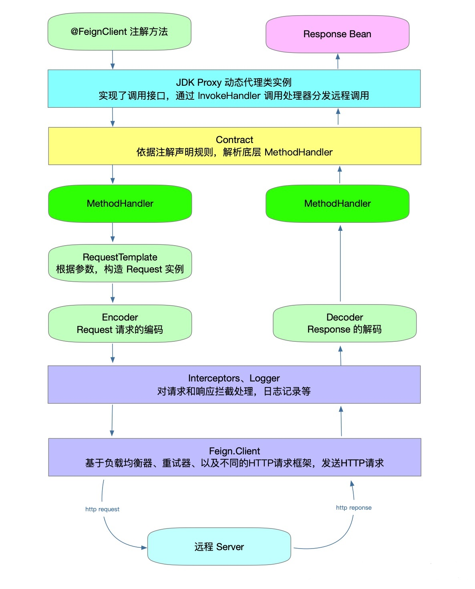

# Feign

## 原理

|                                                            |
| :--------------------------------------------------------: |
|  |

- 启动时，程序会进行包扫描，扫描所有包下所有@FeignClient注解的类，并将这些类注入到Spring容器中。当定义的Feign中的接口被调用时，通过JDK的动态代理来生成RequestTemplate。

- RequestTemplate中包含请求的所有信息，如请求参数，请求URL等。

- RequestTemplate生产Request，然后将Request交给feign.Client处理，这个feign.Client默认是JDK的HTTPUrlConnection，也可以是OKhttp、Apache的HTTPClient等。

- 最后feign.Client封装成LoadBaLanceClient，结合ribbon负载均衡地发起调用。


## @EnableFeignClients 注解声明客户端接口

```java
@Retention(RetentionPolicy.RUNTIME)
@Target(ElementType.TYPE)
@Documented
@Import(FeignClientsRegistrar.class)
public @interface EnableFeignClients {
	//basePackages的别名
	String[] value() default {};
	//声明基础包，spring boot启动后，会扫描该包下被@FeignClient注解的接口
	String[] basePackages() default {};
	//声明基础包的类，通过该类声明基础包
	Class<?>[] basePackageClasses() default {};
	//默认配置类
	Class<?>[] defaultConfiguration() default {};
	//直接声明的客户端接口类
	Class<?>[] clients() default {};
}
```

## @FeignClient注解，将接口声明为Feign客户端
```java
@Target(ElementType.TYPE)
@Retention(RetentionPolicy.RUNTIME)
@Documented
public @interface FeignClient {

	@AliasFor("name")
	String value() default "";
	// 名称，对应与eureka上注册的应用名
	@AliasFor("value")
	String name() default "";
	//生成spring bean的qualifier
	String qualifier() default "";
	// http服务的url，全路径地址或hostname，http或https可选
	String url() default "";
	// 配置响应状态码为404时是否应该抛出FeignExceptions
	boolean decode404() default false;
	// 配置类，这里设置的配置类是Spring Configuration，将会在FeignContext中创建内部声明的Bean，用于不同的客户端进行隔离,参考FeignClientsConfiguration
	Class<?>[] configuration() default {};
	// 声明hystrix调用失败后的方法，底层依赖hystrix，启动类要加上@EnableHystrix
	Class<?> fallback() default void.class;
	Class<?> fallbackFactory() default void.class;
    // 自动给所有方法的requestMapping前加上前缀，类似与controller类上的requestMapping
	String path() default "";
}
```

## FeignClientsRegistrar 注册客户端
```java
class FeignClientsRegistrar implements ImportBeanDefinitionRegistrar,
		ResourceLoaderAware, BeanClassLoaderAware {
。。。

	@Override
	public void registerBeanDefinitions(AnnotationMetadata metadata,
			BeanDefinitionRegistry registry) {
		// 注册默认配置
		registerDefaultConfiguration(metadata, registry);
		// 注册feign客户端
		registerFeignClients(metadata, registry);
	}
。。。
}
```

+ 接口ResourceLoaderAware用于注入ResourceLoader
+ 接口BeanClassLoaderAware用于注入ClassLoader
+ 接口ImportBeanDefinitionRegistrar用于动态向Spring Context中注册bean

### 注册默认配置
```java
private void registerDefaultConfiguration(AnnotationMetadata metadata, BeanDefinitionRegistry registry) {
	//获取@EnableFeignClients注解参数
	Map<String, Object> defaultAttrs = metadata
			.getAnnotationAttributes(EnableFeignClients.class.getName(), true);
	//如果参数中包含defaultConfiguration
	if (defaultAttrs != null && defaultAttrs.containsKey("defaultConfiguration")) {
		String name;
		if (metadata.hasEnclosingClass()) {
			name = "default." + metadata.getEnclosingClassName();
		}
		else {
			name = "default." + metadata.getClassName();
		}
		// 注册客户端的配置Bean
		registerClientConfiguration(registry, name,
				defaultAttrs.get("defaultConfiguration"));
	}
}
```

### 注册客户端的配置Bean
```java
private void registerClientConfiguration(BeanDefinitionRegistry registry, Object name, Object configuration) {
	// 创建一个BeanDefinitionBuilder，注册bean的类为FeignClientSpecification
	BeanDefinitionBuilder builder = BeanDefinitionBuilder
			.genericBeanDefinition(FeignClientSpecification.class);
	//增加构造函数参数
	builder.addConstructorArgValue(name);
	builder.addConstructorArgValue(configuration);
	//调用BeanDefinitionRegistry.registerBeanDefinition方法动态注册Bean
	registry.registerBeanDefinition(
			name + "." + FeignClientSpecification.class.getSimpleName(),
			builder.getBeanDefinition());
}
```

### registerFeignClients方法，注册feign客户端

```java
public void registerFeignClients(AnnotationMetadata metadata, BeanDefinitionRegistry registry) {
	//生成一个scanner，扫描注定包下的类
	ClassPathScanningCandidateComponentProvider scanner = getScanner();
	scanner.setResourceLoader(this.resourceLoader);

	Set<String> basePackages;

	Map<String, Object> attrs = metadata
			.getAnnotationAttributes(EnableFeignClients.class.getName());
	//包含@FeignClient注解的过滤器
	AnnotationTypeFilter annotationTypeFilter = new AnnotationTypeFilter(
			FeignClient.class);
	final Class<?>[] clients = attrs == null ? null
			: (Class<?>[]) attrs.get("clients");
	if (clients == null || clients.length == 0) {
	//@EnableFeignClients没有声明clients，获取basePackages，设置过滤器
		scanner.addIncludeFilter(annotationTypeFilter);
		basePackages = getBasePackages(metadata);
	}
	else {
		//@EnableFeignClients声明了clients
		final Set<String> clientClasses = new HashSet<>();
		basePackages = new HashSet<>();
		//basePackages为声明的clients所在的包
		for (Class<?> clazz : clients) {
			basePackages.add(ClassUtils.getPackageName(clazz));
			clientClasses.add(clazz.getCanonicalName());
		}
		//增加过滤器，只包含声明的clients
		AbstractClassTestingTypeFilter filter = new AbstractClassTestingTypeFilter() {
			@Override
			protected boolean match(ClassMetadata metadata) {
				String cleaned = metadata.getClassName().replaceAll("\\$", ".");
				return clientClasses.contains(cleaned);
			}
		};
		scanner.addIncludeFilter(
				new AllTypeFilter(Arrays.asList(filter, annotationTypeFilter)));
	}
	//遍历basePackages
	for (String basePackage : basePackages) {
		//扫描包，根据过滤器找到候选的Bean
		Set<BeanDefinition> candidateComponents = scanner
				.findCandidateComponents(basePackage);
		// 遍历候选的bean
		for (BeanDefinition candidateComponent : candidateComponents) {
			if (candidateComponent instanceof AnnotatedBeanDefinition) {
				// 校验注解是否是注解在接口上
				AnnotatedBeanDefinition beanDefinition = (AnnotatedBeanDefinition) candidateComponent;
				AnnotationMetadata annotationMetadata = beanDefinition.getMetadata();
				Assert.isTrue(annotationMetadata.isInterface(),
						"@FeignClient can only be specified on an interface");
				// 获取注解属性
				Map<String, Object> attributes = annotationMetadata
						.getAnnotationAttributes(
								FeignClient.class.getCanonicalName());

				String name = getClientName(attributes);
				//注册客户端配置
				registerClientConfiguration(registry, name,
						attributes.get("configuration"));
				//注册客户端
				registerFeignClient(registry, annotationMetadata, attributes);
			}
		}
	}
}
```

如果在@FeignClient注解中设置了url参数，就不走Ribbon，直接url调用，否则通过Ribbon调用，实现客户端负载均衡。生成Feign客户端所需要的各种配置对象，都是通过FeignContex中获取的。
```java
@Override
public Object getObject() throws Exception {
	// FeignContext在FeignAutoConfiguration中自动注册，FeignContext用于客户端配置类独立注册，后面具体分析
	FeignContext context = applicationContext.getBean(FeignContext.class);
	// 创建Feign.Builder
	Feign.Builder builder = feign(context);
	// 如果@FeignClient注解没有设置url参数
	if (!StringUtils.hasText(this.url)) {
		String url;
		//url为@FeignClient注解的name参数
		if (!this.name.startsWith("http")) {
			url = "http://" + this.name;
		}
		else {
			url = this.name;
		}
		// 加上path
		url += cleanPath();
		// 返回loadBlance客户端，也就是ribbon+eureka的客户端
		return loadBalance(builder, context, new HardCodedTarget<>(this.type,
				this.name, url));
	}
	// @FeignClient设置了url参数，不做负载均衡
	if (StringUtils.hasText(this.url) && !this.url.startsWith("http")) {
		this.url = "http://" + this.url;
	}
	//加上path
	String url = this.url + cleanPath();
	// 从FeignContext中获取client
	Client client = getOptional(context, Client.class);
	if (client != null) {
		if (client instanceof LoadBalancerFeignClient) {
			// 有url参数，不做负载均衡，但是客户端是ribbon，或者实际的客户端
			client = ((LoadBalancerFeignClient)client).getDelegate();
		}
		builder.client(client);
	}
	// 从FeignContext中获取Targeter
	Targeter targeter = get(context, Targeter.class);
	// 生成客户端代理
	return targeter.target(this, builder, context, new HardCodedTarget<>(
			this.type, this.name, url));
}
```

## FeignContext 隔离配置

### Feign构建类创建过程
```java
protected Feign.Builder feign(FeignContext context) {
	。。。
	// 从FeignContext中获取注册的Feign.Builder bean，设置Encoder/Decoder/Contract
	Feign.Builder builder = get(context, Feign.Builder.class)
			.logger(logger)
			.encoder(get(context, Encoder.class))
			.decoder(get(context, Decoder.class))
			.contract(get(context, Contract.class));
	。。。
	//设置feign其他参数，都从FeignContext中获取
	Retryer retryer = getOptional(context, Retryer.class);
	if (retryer != null) {
		builder.retryer(retryer);
	}
	ErrorDecoder errorDecoder = getOptional(context, ErrorDecoder.class);
	if (errorDecoder != null) {
		builder.errorDecoder(errorDecoder);
	}
	Request.Options options = getOptional(context, Request.Options.class);
	if (options != null) {
		builder.options(options);
	}
	Map<String, RequestInterceptor> requestInterceptors = context.getInstances(
			this.name, RequestInterceptor.class);
	if (requestInterceptors != null) {
		builder.requestInterceptors(requestInterceptors.values());
	}

	if (decode404) {
		builder.decode404();
	}

	return builder;
}
```

## FeignClientsConfiguration 客户端默认配置

```java
@Configuration
public class FeignClientsConfiguration {
	// 注入springMVC的HttpMessageConverters
	@Autowired
	private ObjectFactory<HttpMessageConverters> messageConverters;

	// 注解参数处理器，处理SpringMVC注解，生成http元数据
	@Autowired(required = false)
	private List<AnnotatedParameterProcessor> parameterProcessors = new ArrayList<>();
。。。
	//Decoder bean，默认通过HttpMessageConverters进行处理
	@Bean
	@ConditionalOnMissingBean
	public Decoder feignDecoder() {
		return new ResponseEntityDecoder(new SpringDecoder(this.messageConverters));
	}
	//Encoder bean，默认通过HttpMessageConverters进行处理
	@Bean
	@ConditionalOnMissingBean
	public Encoder feignEncoder() {
		return new SpringEncoder(this.messageConverters);
	}
	//Contract bean，通过SpringMvcContract进行处理接口
	@Bean
	@ConditionalOnMissingBean
	public Contract feignContract(ConversionService feignConversionService) {
		return new SpringMvcContract(this.parameterProcessors, feignConversionService);
	}
	// hystrix自动注入
	@Configuration
	@ConditionalOnClass({ HystrixCommand.class, HystrixFeign.class })
	protected static class HystrixFeignConfiguration {
		//HystrixFeign的builder，全局关掉Hystrix配置feign.hystrix.enabled=false
		@Bean
		@Scope("prototype")
		@ConditionalOnMissingBean
		@ConditionalOnProperty(name = "feign.hystrix.enabled", matchIfMissing = true)
		public Feign.Builder feignHystrixBuilder() {
			return HystrixFeign.builder();
		}
	}
	// 默认不重试
	@Bean
	@ConditionalOnMissingBean
	public Retryer feignRetryer() {
		return Retryer.NEVER_RETRY;
	}
	// 默认的builder
	@Bean
	@Scope("prototype")
	@ConditionalOnMissingBean
	public Feign.Builder feignBuilder(Retryer retryer) {
		return Feign.builder().retryer(retryer);
	}
。。。
}
```

## Targeter 生成接口动态代理

### HystrixTargeter

```java
class HystrixTargeter implements Targeter {

	@Override
	public <T> T target(FeignClientFactoryBean factory, Feign.Builder feign, FeignContext context,
						Target.HardCodedTarget<T> target) {
		// 如果不是HystrixFeign.Builder，直接调用target生成代理
		if (!(feign instanceof feign.hystrix.HystrixFeign.Builder)) {
			return feign.target(target);
		}
		// 找到fallback或者fallbackFactory，设置到hystrix中
		feign.hystrix.HystrixFeign.Builder builder = (feign.hystrix.HystrixFeign.Builder) feign;
		Class<?> fallback = factory.getFallback();
		if (fallback != void.class) {
			return targetWithFallback(factory.getName(), context, target, builder, fallback);
		}
		Class<?> fallbackFactory = factory.getFallbackFactory();
		if (fallbackFactory != void.class) {
			return targetWithFallbackFactory(factory.getName(), context, target, builder, fallbackFactory);
		}

		return feign.target(target);
	}
  ...
}
```


## 调用处理器

### 默认调用处理器FeignInvocationHandler

```java
package feign;
//...省略import

public class ReflectiveFeign extends Feign {

  //...

  // 内部类：默认的Feign调用处理器 FeignInvocationHandler
  static class FeignInvocationHandler implements InvocationHandler {

    private final Target target;
    // 方法实例对象和方法处理器的映射
    private final Map<Method, MethodHandler> dispatch;

    //构造函数    
    FeignInvocationHandler(Target target, Map<Method, MethodHandler> dispatch) {
      this.target = checkNotNull(target, "target");
      this.dispatch = checkNotNull(dispatch, "dispatch for %s", target);
    }

    //默认Feign调用的处理
    @Override
    public Object invoke(Object proxy, Method method, Object[] args) throws Throwable {
      //...
	  // 首先，根据方法实例，从方法实例对象和方法处理器的映射中，
	  // 取得 方法处理器，然后，调用 方法处理器 的 invoke(...) 方法
         return dispatch.get(method).invoke(args);
    }
    //...
  }
```

1. 根据Java反射的方法实例，在dispatch 映射对象中，找到对应的MethodHandler 方法处理器；
2. 调用MethodHandler方法处理器的 invoke(...) 方法，完成实际的HTTP请求和结果的处理。

```java
public interface InvocationHandlerFactory {
  //…

  // 方法处理器接口，仅仅拥有一个invoke(…)方法
  interface MethodHandler {
    // 完成远程URL请求
    Object invoke(Object[] argv) throws Throwable;
  }
//...
}
```

主要职责是完成实际远程URL请求，然后返回解码后的远程URL的响应结果。Feign提供了默认的 SynchronousMethodHandler 实现类

#### 方法处理器SynchronousMethodHandler

```java
final class SynchronousMethodHandler implements MethodHandler {
    
	@Override
    public Object invoke(Object[] argv) throws Throwable {
        RequestTemplate template = buildTemplateFromArgs.create(argv);
        Options options = findOptions(argv);
        Retryer retryer = this.retryer.clone();
        while (true) {
            try {
                return executeAndDecode(template, options);
            } catch (RetryableException e) {
                try {
                    retryer.continueOrPropagate(e);
                } catch (RetryableException th) {
                    Throwable cause = th.getCause();
                    if (propagationPolicy == UNWRAP && cause != null) {
                        throw cause;
                    } else {
                        throw th;
                    }
                }
                if (logLevel != Logger.Level.NONE) {
                    logger.logRetry(metadata.configKey(), logLevel);
                }
                continue;
            }
        }
    }
    
    // 执行请求，解码结果
    Object executeAndDecode(RequestTemplate template, Options options) throws Throwable {
        Request request = targetRequest(template);

        if (logLevel != Logger.Level.NONE) {
            logger.logRequest(metadata.configKey(), logLevel, request);
        }

        Response response;
        long start = System.nanoTime();
        try {
            response = client.execute(request, options);
            // ensure the request is set. TODO: remove in Feign 12
            response = response.toBuilder()
                    .request(request)
                    .requestTemplate(template)
                    .build();
        } catch (IOException e) {
           
        }
        long elapsedTime = TimeUnit.NANOSECONDS.toMillis(System.nanoTime() - start);

        boolean shouldClose = true;
        try {
            if (logLevel != Logger.Level.NONE) {
                response =
                        logger.logAndRebufferResponse(metadata.configKey(), logLevel, response, elapsedTime);
            }
            if (Response.class == metadata.returnType()) {
                if (response.body() == null) {
                    return response;
                }
                if (response.body().length() == null ||
                        response.body().length() > MAX_RESPONSE_BUFFER_SIZE) {
                    shouldClose = false;
                    return response;
                }
                // Ensure the response body is disconnected
                byte[] bodyData = Util.toByteArray(response.body().asInputStream());
                return response.toBuilder().body(bodyData).build();
            }
            if (response.status() >= 200 && response.status() < 300) {
                if (void.class == metadata.returnType()) {
                    return null;
                } else {
                    Object result = decode(response);
                    shouldClose = closeAfterDecode;
                    return result;
                }
            } else if (decode404 && response.status() == 404 && void.class != metadata.returnType()) {
                Object result = decode(response);
                shouldClose = closeAfterDecode;
                return result;
            } else {
                throw errorDecoder.decode(metadata.configKey(), response);
            }
        } catch (IOException e) {
            if (logLevel != Logger.Level.NONE) {
                
            }
            throw errorReading(request, response, e);
        } finally {
            if (shouldClose) {
                ensureClosed(response.body());
            }
        }
    }
}
```


### Hystrix调用处理器 HystrixInvocationHandler


## 客户端组件feign.Client

负责端到端的执行URL请求。发送request请求到服务器，并接收response响应后进行解码。

```java
public interface Client {
    Response execute(Request request, Options options) throws IOException;
}
```

1. Client.Default类：默认的feign.Client 客户端实现类，内部使用HttpURLConnnection 完成URL请求处理；

2. ApacheHttpClient 类：内部使用 Apache httpclient 开源组件完成URL请求处理的feign.Client 客户端实现类；

3. OkHttpClient类：内部使用 OkHttp3 开源组件完成URL请求处理的feign.Client 客户端实现类。

4. LoadBalancerFeignClient 类：内部使用 Ribben 负载均衡技术完成URL请求处理的feign.Client 客户端实现类。