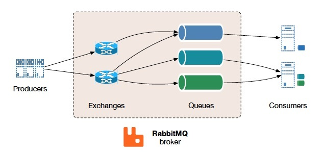
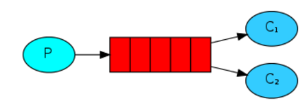
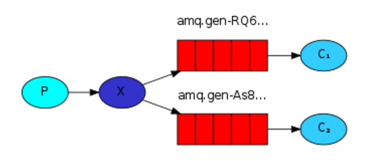
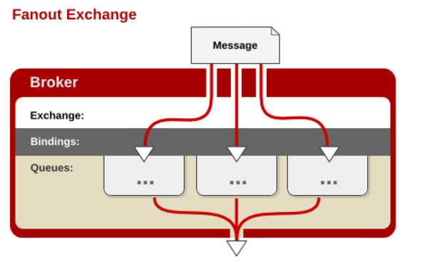
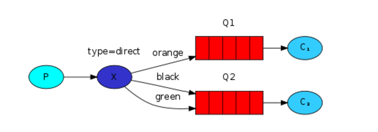
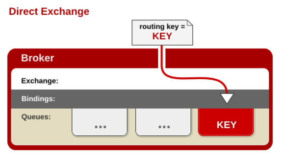
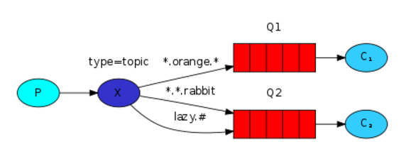
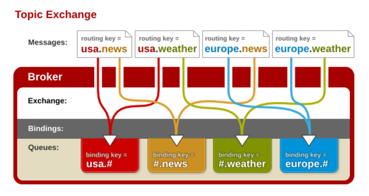

# RabbitMQ

​		erlang语言开发，基于`AMQP`协议，核心思想是解耦生产者和消费者，生产者将消息发送到一个交换机，不直接发送到队列中。先由Exchange接收，在按照特定的策略转发到Queue。



## 基本概念

1. Message
   消息，消息是不具名的，它由消息头和消息体组成。消息体是不透明的，而消息头则由一系列的可选属性组成，这些属性包括routing-key（路由键）、priority（相对于其他消息的优先权）、delivery-mode（指出该消息可能需要持久性存储）等。

2. Publisher
   消息的生产者，也是一个向交换器发布消息的客户端应用程序。

3. Exchange
   交换器，用来接收生产者发送的消息并将这些消息路由给服务器中的队列。

4. Binding
   绑定，用于消息队列和交换器之间的关联。一个绑定就是基于路由键将交换器和消息队列连接起来的路由规则，所以可以将交换器理解成一个由绑定构成的路由表。

5. RoutingKey

   路由键，生产者将消息发送给交换器的时候，会发送一个RoutingKey，用来指定路由规则，这样交换器就知道把消息发送到哪个队列。路由键通常为一个“.”分割的字符串，例如“com.rabbitmq”。

6. Queue
   消息队列，用来保存消息直到发送给消费者。它是消息的容器，也是消息的终点。一个消息可投入一个或多个队列。消息一直在队列里面，等待消费者连接到这个队列将其取走。

7. Connection
   网络连接，比如一个TCP连接。

8. Channel
   信道，多路复用连接中的一条独立的双向数据流通道。信道是建立在真实的TCP连接内地虚拟连接，AMQP 命令都是通过信道发出去的，不管是发布消息、订阅队列还是接收消息，这些动作都是通过信道完成。因为对于操作系统来说建立和销毁 TCP 都是非常昂贵的开销，所以引入了信道的概念，以复用一条 TCP 连接。

9. Consumer
   消息的消费者，表示一个从消息队列中取得消息的客户端应用程序。

10. Virtual Host
    虚拟主机，表示一批交换器、消息队列和相关对象。虚拟主机是共享相同的身份认证和加密环境的独立服务器域。每个 vhost 本质上就是一个 mini 版的 RabbitMQ 服务器，拥有自己的队列、交换器、绑定和权限机制。vhost 是 AMQP 概念的基础，必须在连接时指定，RabbitMQ 默认的 vhost 是 / 。

11. Broker
    表示消息队列服务器实体。

## 工作模式

### 队列

work消息模型、**Publish/Subscribe**（交换机类型：Fanout，也称为广播 **）**、**Routing 路由模型**（交换机类型：direct）、**Topics 通配符模式**（交换机类型：topics）

生产者-消费者模型。直接绑定队列，虽然不用创建交换机，但会使用默认的交换机，并用默认的直连（`default-direct`）策略连接队列

|        queue         |
| :------------------: |
|  |


### Exchange类型

四种类型：`direct`、`fanout`、`topic`、`headers `

#### Fanout Exchange

​		每个发到 fanout 类型交换器的消息都会分到所有绑定的队列上去。fanout 交换器忽略 RoutingKey 路由键，只是简单的将队列绑定到交换器上，每个发送到交换器的消息都会被转发到与该交换器绑定的所有队列上。优点是转发消息最快，性能最好。

|         fanout         |
| :--------------------: |
|   |
|  |

#### Direct Exchange（直连交换机）

​		默认的Exchange，消息中的路由键（routing key）如果和 Binding 中的 binding key 一致， 交换器就将消息发到对应的队列中。
|         routingkey         |
| :------------------------: |
|   |
|  |


#### Topic Exchange（主题交换机）

​		Topic Exchange和Direct Exchange 类似，通过模式匹配分配消息的路由键属性，将路由键和某个模式进行匹配，此时队列需要绑定到一个模式上。它将路由键和绑定键的字符串切分成单词，这些单词之间用点隔开。`#`匹配0个或多个单词，`*`匹配不多不少一个单词。

- `*` 可以通配1个单词
- `#` 可以通配零个或多个单词

|         topic         |
| :-------------------: |
|   |
|  |


​		Default Exchange是一种特殊的 Direct Exchange。当手动创建一个队列时，后台会自动将这个队列绑定到一个名称为空的`Direct Exchange`上，绑定`RoutingKey`与队列名称相同。有了这个默认的交换机和绑定，使我们只关心队列这一层即可，这个比较适合做一些简单的应用。


### 消息确认

- 发送方确认机制：

  ```
  开启confirm模式
  确认模式是异步的
  ConfirmCallback：确认消息到达exchange，不保证消息可以路由到正确的queue,如果exchange错误，就会触发confirm机制
  ReturnCallback：消息失败
  ```

- 接收方确认机制

**autoAck=false**

```java
// 表示成功确认，使用此回执方法后，消息会被rabbitmq broker 删除
channel.basicAck(message.getMessageProperties().getDeliveryTag(), false);


// 拒绝消息，与basicNack区别在于不能进行批量操作，其他用法很相似。
// deliveryTag：表示消息投递序号
// requeue：值为 true 消息将重新入队列
channel.basicReject(message.getMessageProperties().getDeliveryTag(), false);


// 表示失败确认，一般在消费消息业务异常时用到此方法，可以将消息重新投递入队列。
// deliveryTag：表示消息投递序号。
// multiple：是否批量确认。
// requeue：值为 true 消息将重新入队列。
channel.basicNack(message.getMessageProperties().getDeliveryTag(), false, true);
```

### 消息持久化

​		要求rabbitmq不丢失数据要做如下两点: 把队列和消息都设置为可持久化(durable)

- exchange要持久化
- queue要持久化
- message要持久化

## 消息发送

### 消息丢失

#### 生产者 -> Server

1. 生产者confirm模式投递消息，Server接收消息失败发送nack，生产者监听消息失败
2. 生产者发送消息到Exchange后，路由和queue没有绑定

#### Server中存储的消息丢失或可靠性不足

1. 消息未完全持久化，机器重启后，消息丢失
2. 单节点模式问题
3. 普通集群模式：队列的内容仅仅存在某一个节点上面，不会存在所有节点上面，所有节点仅仅存放消息结构和元数据
4. 镜像模式

#### Server -> 消费者


### 避免消息丢失

#### 生产者 -> Server

1. 事务机制

   在生产者发送消息之前，通过channel.txSelect开启一个事务，接着发送消息， 如果消息投递server失败，进行事务回滚channel.txRollback，然后重新发送， 如果server收到消息，就提交事务channel.txCommit

2. 确认机制

   首先生产者通过调用channel.confirmSelect方法将信道设置为confirm模式，一旦信道进入confirm模式，所有在该信道上面发布的消息都会被指派一个唯一的ID（从1开始），一旦消息被投递到所有匹配的队列之后，RabbitMQ就会发送一个确认（Basic.Ack）给生产者（包含消息的唯一deliveryTag和multiple参数），这就使得生产者知晓消息已经正确到达了目的地了。

   1) `mandatory` 设置 true，使用mandatory 设置true的时候有个关键点要调整，生产者如何获取到没有被正确路由到合适队列的消息呢？通过调用channel.addReturnListener来添加ReturnListener监听器实现，只要发送的消息，没有路由到具体的队列，ReturnListener就会收到监听消息。

   2) 使用备份交换机(alternate-exchange)，实现没有路由到队列的消息


#### Server -> 消费者

​		消费者手动ack机制


## RabbitMQ集群

### 副本集群

​		主备模式，Matser节点提供读写，Slave节点不提供读写。如果主节点挂了，就切换到备用节点，原来的备用节点升级为主节点提供读写服务，当原来的主节点恢复运行后，原来的主节点就变成备用节点。


内建集群，这个功能设计的目的是允许消费者和生产者在节点崩溃的情况下继续运行，以及通过添加更多的节点来线性扩展消息通信吞吐量。RabbitMQ 内部利用 Erlang 提供的分布式通信框架 OTP 来满足上述需求，使客户端在失去一个 RabbitMQ 节点连接的情况下，还是能够重新连接到集群中的任何其他节点继续生产、消费消息。

RabbitMQ 会始终记录以下四种类型的内部元数据：

1. 队列元数据
   包括队列名称和它们的属性，比如是否可持久化，是否自动删除

2. 交换器元数据
   交换器名称、类型、属性

3. 绑定元数据
   内部是一张表格记录如何将消息路由到队列

4. vhost 元数据
   为 vhost 内部的队列、交换器、绑定提供命名空间和安全属性

   因此，当用户访问其中任何一个RabbitMQ节点时，通过rabbitmqctl查询到的queue／user／exchange/vhost等信息都是相同的。 


​		普通集群模式，并不保证队列的高可用性。尽管交换机、绑定这些可以复制到集群里的任何一个节点，但是队列内容不会复制。虽然该模式解决一项目组节点压力，但队列节点宕机直接导致该队列无法应用，只能等待重启。所以要想在队列节点宕机或故障也能正常应用，就要复制队列内容到集群里的每个节点，必须要创建镜像队列。

### 镜像集群

​		保证100% 数据不丢失。将队列在节点之间设置主从关系，消息会在节点之间进行自动同步。


​		用KeepAlived做了HA-Proxy的高可用，然后有3个节点的 MQ 服务，消息发送到主节点上，主节点通过mirror队列把数据同步到其它的MQ节点，这样来实现其高可靠。

镜像队列是在普通集群搭建后，通过设置同步策略来实现的

```
rabbitmqctl set_policy [-p Vhost] Name Pattern Definition [Priority]

-p Vhost： 可选参数，针对指定vhost下的queue进行设置
Name: policy的名称
Pattern: queue的匹配模式(正则表达式)
Definition：镜像定义，包括三个部分ha-mode, ha-params, ha-sync-mode
        ha-mode:指明镜像队列的模式，有效值为 all/exactly/nodes
            all：表示在集群中所有的节点上进行镜像
            exactly：表示在指定个数的节点上进行镜像，节点的个数由ha-params指定
            nodes：表示在指定的节点上进行镜像，节点名称通过ha-params指定
        ha-params：作为参数，为ha-mode的补充
        ha-sync-mode：进行队列中消息的同步方式，有效值为 automatic 和 manual
priority：可选参数，policy的优先级


rabbitmqctl set_policy ha-all "^" '{"ha-mode":"all","ha-sync-mode":"automatic"}' --apply-to all
```


## SpringBoot整合


依赖：

```xml
<dependency>
    <groupId>org.springframework.boot</groupId>
    <artifactId>spring-boot-starter-amqp</artifactId>
</dependency>
```


配置文件：

```yaml
spring:
  # rabbit配置，produce端
  rabbitmq:
    host: 192.168.107.100
    username: maoyz
    password: 123456
    port: 5672
    virtual-host: /
    #  消息发送到交换机确认机制,是否确认回调 异步
    publisher-confirm-type: correlated
    #  消息发送到交换机确认机制,是否返回回馈
    publisher-returns: true
    template:
      retry:
        enabled: true   # 开启失败重试
        max-interval: 20000ms        # 最长重试间隔，超过这个间隔将不再重试
        initial-interval: 30000ms    # 第一次重试的间隔时长
        multiplier: 2                # 下次重试间隔的倍数，此处是2即下次重试间隔是上次的2倍
      exchange: topic.exchange       # 缺省的交换机名称，此处配置后，发送消息如果不指定交换机就会使用这个
    connection-timeout: 15000
    listener:
      simple:
        acknowledge-mode: manual  # 手动
        concurrency: 10
        max-concurrency: 20
        retry:
          max-attempts: 3
        prefetch: 3
      direct:
        acknowledge-mode: manual
```


消息监听：

```java
@RabbitListener(bindings = {@QueueBinding(
        value = @Queue(value = "queue_name", autoDelete = "false", durable = "true"),
        exchange = @Exchange(name = "exchange_name", durable = "true", type = ExchangeTypes.FANOUT, ignoreDeclarationExceptions = "true"),
        key = {"routing_key"})
})
@Component
public class OrderMessageListener {
@RabbitHandler
    public void handleMessage(@Payload Object msg, @Headers Map<String, Object> headers, Message message, Channel channel) throws IOException {
        ...
    }
}
```


消息积压？

重复消费？

死信队列？

DLQ（Dead Letter Queue）死信队列配置一个死信交换机，同一个项目的死信交换机可以公用一个，队列分配单独的路由key.

1. 消息被否定确认，使用 `channel.basicNack` 或 `channel.basicReject` ，并且此时`requeue` 属性被设置为`false`。

2. 消息在队列的存活时间超过设置的TTL时间。

3. 消息队列的消息数量已经超过最大队列长度。

   如果队列配置了参数 `x-dead-letter-routing-key` 的话，“死信”的路由key将会被替换成该参数对应的值。如果没有设置，则保留该消息原有的路由key

延时队列？

TTL（Time To Live）

事务消息？