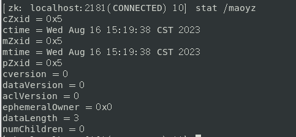
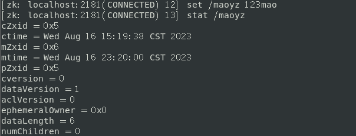
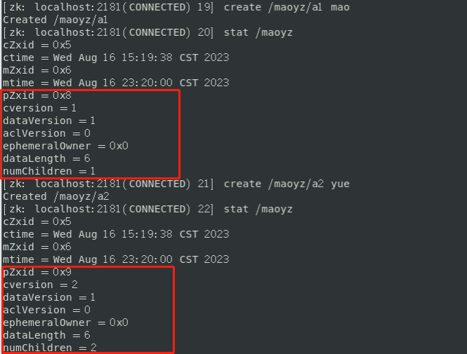

# Zookeeper

提供了**文件系统**和**通知机制**

> ZooKeeper: A Distributed Coordination Service for Distributed Applications  分布式协调服务框架

## 数据模型

文件系统，树形结构，

Znode兼具文件和目录两种特点。既像文件一样维护着数据长度、元信息、ACL、时间戳等数据结构，又像目录一样可以作为路径标识的一部分。每个Znode由三个部分组成：

- stat            状态信息，描述该Znode版本、权限等信息。

- data           节点存放的数据具体内容

- children    该Znode下的节点

  

### Znode类型

Zookeeper中数据的最小单元，每个znode都有一个唯一的路径标识。**每个节点的数据大小上限是1M**。

- 持久节点（`persistent node`），节点会被持久
- 临时节点（`ephemeral node`），客户端断开连接后，ZooKeeper会自动删除临时节点
- 持久顺序节点（`persistent sequential node`），每次创建顺序节点时，ZooKeeper都会在路径后面自动添加上10位的数字，从1开始，最大是2147483647 （2^32-1） 每个顺序节点都有一个单独的计数器，并且单调递增的，由Zookeeper的Leader实例维护。
- 临时顺序节点（`ephemeral sequential node`）

> 分布式锁：**临时顺序节点**，如果自己不是第一个节点，对自己上一个节点添加监听器

### Znode状态结构

| stat + 节点路径查看状态信息                                  |
| ------------------------------------------------------------ |
|           |
| 修改节点 |
| 新增子节点 |

| znode 状态信息 | 解释                                                         |
| -------------- | ------------------------------------------------------------ |
| cZxid          | create ZXID，即该数据节点被创建时的事务 id                   |
| ctime          | create time，即该节点的创建时间                              |
| mZxid          | modified ZXID，即该节点最终一次更新时的事务 id               |
| mtime          | modified time，即该节点最后一次的更新时间                    |
| pZxid          | 子节点列表最后一次修改时的事务 id，只有子节点列表变更才会更新 pZxid，子节点内容变更不会更新 |
| cversion       | children version，子节点版本号，当前节点的子节点每次变化时值增加 1 |
| dataVersion    | 数据节点内容版本号，节点创建时为 0，每更新一次节点内容（不管内容有无变化）该版本号的值增加 1 |
| aclVersion     | 节点的 ACL 版本号，表示该节点 ACL 信息变更次数               |
| ephemeralOwner | 创建该临时节点的会话的 sessionId；如果当前节点为持久节点，则 ephemeralOwner=0 |
| dataLength     | 数据节点内容长度                                             |
| numChildren    | 当前节点的子节点个数                                         |

### Znode属性

#### zxid

事务id，64位的数字，高32位表示epoch用来标识leader关系是否改变，每次一个leader被选出来，它都会有一个新的epoch；低32位递增计数，保证事务的顺序一致性

1. **cZxid**
   create，节点创建的事务标识
2. **mZxid**
   modify，节点更新的zxid。对znode的修改都会更新mZxid
3. **pZxid**
   该节点的子节点（或该节点）的最近一次创建/删除，与孙子节点无关，znode最后更新的子节点zxid。

#### version

​		每个数据节点有3种类型的版本信息，数据节点的任何更新变更都会修改版本号，每当客户端检索数据时，它将同时检索数据的版本号。并且如果一个客户端执行了某个节点的更新或删除操作，它也必须提供要被操作的数据的版本号。如果所提供的数据版本号与实际的不匹配，那么这个操作将会失败。

- dataVersion         (当前 znode 的版本）

- cversion             （当前 znode 子节点的版本）

- aclVersion          （当前 znode 的 ACL 版本）

#### **悲观锁**和**乐观锁**

## Watch机制

发布订阅（事件监听器），是 ZooKeeper 中的一个很重要的特性。

ZooKeeper 允许用户在指定节点上注册一些 Watcher，并且在一些特定事件触发的时候，ZooKeeper 服务端会将事件通知到感兴趣的客户端，该机制是 ZooKeeper 实现分布式协调服务的重要特性。

- 一种是**Data Watches**，基于znode节点的数据变更从而触发 watch 事件，触发条件 getData()、exists()、setData()、 create()。
- 一种是**Child Watches**，基于znode的子节点发生变更触发的watch事件，触发条件 getChildren()、create()。

> 调用 delete() 方法删除znode时，则会同时触发Data Watches和Child Watches，如果被删除的节点还有父节点，则父节点会触发一个Child Watches。

1. Watch是**一次性**的，每次都需要重新注册，并且客户端在会话异常结束时不会收到任何通知，而快速重连接时仍不影响接收通知。
2. Watch的回调执行都是顺序执行的，并且客户端在没有收到关注数据的变化事件通知之前是不会看到最新的数据
3. Watch是轻量级的，WatchedEvent是最小的通信单元，结构上只包含通知状态、事件类型和节点路径。ZooKeeper服务端只会通知客户端发生了什么，并不会告诉具体内容。
4. 串行同步的。

### 客户端实现过程

标记会话带有Watch事件请求，同时保存和节点的对应关系，添加到outgoingQueue队列中。

### 服务端实现过程

解析是否带有Watch事件，如果为true，存储到WatchManager。

### 服务端触发过程

触发数据变更事件，封装WatchedEvent，调用process()方法向客户端发送通知。

### 客户端回调过程

SendThread.readResponse()方法统一处理服务器响应。交给EventThread线程处理

## ACL权限控制

ZooKeeper 采用 ACL（Access Control List）策略来进行权限控制，类似于  UNIX 文件系统的权限控制。

- CREATE           创建**子节点**的权限
- READ               获取节点数据和子节点列表的权限
- WRITE             更新节点数据的权限
- DELETE           删除**子节点**的权限
- ADMIN           设置节点ACL的权限

**CREATE**和**DELETE**这两种权限都是只对**子节点**的权限控制。

> 为什么 ZooKeeper 不能采用相对路径查找节点呢？
>
> 这是因为 ZooKeeper 大多是应用场景是定位数据模型上的节点，并在相关节点上进行操作。像这种查找与给定值相等的记录问题最适合用散列来解决。因此 ZooKeeper 在底层实现的时候，使用了一个 hashtable，即 hashtableConcurrentHashMap<String, DataNode> nodes ，用节点的**完整路径**来作为 key 存储节点数据。这样就大大提高了 ZooKeeper 的性能。

### 序列化

将对象编译成字节码的形式存储在本地或进行网络传输，Jute 的序列解决方案，实现 Record 接口的 serilize 和 deserialize 方法，这两个方法分别是序列化和反序列化方法。

## 应用场景

- 命名服务：zk的顺序节点生成全局唯一ID
- 发布/订阅：通过**Watcher**机制，监听节点
- 分布式锁：使用**临时顺序节点**和**Watcher**机制实现的，在前一个节点比如`/locks/lock0`上注册事件监听器
- Master选举