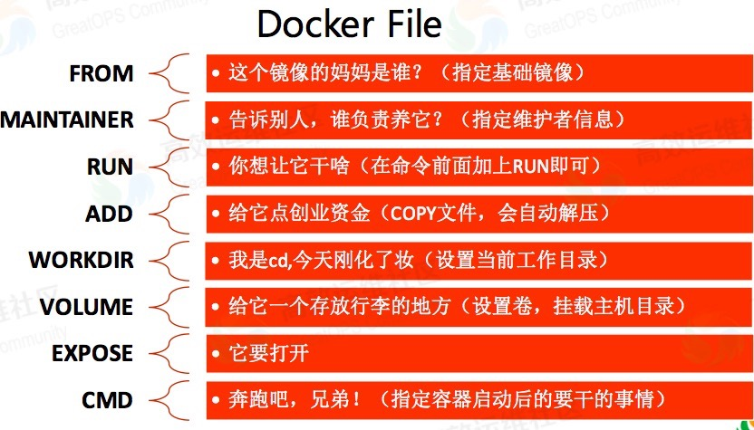
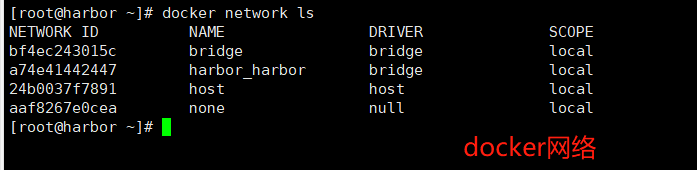

# 1 开始

## 1.1 概念

`image`(镜像)  
`container`(容器)  
`registry`(仓库)  

+ 添加国内淘宝镜像源

daemon.json添加阿里源,登录url:https://cr.console.aliyun.com/cn-beijing/instances/mirrors?accounttraceid=4e34a8a5-2ed6-4856-815a-051d44f17c2e  

```
    sudo mkdir -p /etc/docker
    sudo tee /etc/docker/daemon.json <<-'EOF'
    {
        "registry-mirrors": ["https://knx1let0.mirror.aliyuncs.com"]
    }
    EOF
    sudo systemctl daemon-reload
    sudo systemctl restart docker
```

    aaa

+ 常用命令


```shell
docker images                        查看镜像  
docker search mysql                  搜索镜像  
docker pull mysql:5.7                安装镜像(指定版本号)  
docker rmi -f IMAGE_ID               删除镜像
docker run -d -p 80:80 --name=mynginx nginx     容器运行   -d(指定容器运行于前台还是后台，默认为false);  -p (端口映射);  80:80 (: 之前是宿主机端口，之后是容器需暴露的端口);   --name=mynginx(为容器指定一个名字)  
docker run --name myz-mysql -v /data/docker-mysql/data:/var/lib/mysq -e MYSQL_USER="maoyz" l -e MYSQL_PASSWORD="123456" -e MYSQL_ROOT_PASSWORD=root -p 3306:3306 -d mysql:8.0 --character-set-server=UTF8MB4 --collation-server=utf8mb4_unicode_ci   -v(挂载,本地/data/docker-mysql/data充当)  -e(配置信息，此处配置mysql的root用户的登陆密码)  
docker stop nginx                    停止镜像  
docker container exec -it zookeeper bash       进入容器  
docker container exec -it myz-mysql /usr/bin/bash  
docker container ps                            查看运行容器  
docker container ps -a                         查看所有容器  
docker logs -f zookeeper(id/别名)     查看日志  
docker rm zookeeper(id/别名)          删除容器  
docker logs container-name  查看日志
```


docker inspect 容器名称 | grep Address 

更新容器  

```shell
docker build -t name:v1.0.0 -f /home/maoyz/Dockerfile                 镜像构建(指定目录)  
docker build -t name:v1.0.0 .                                         镜像构建(当前目录)  
docker tag image_name:${version} my_registry/image_name:${version}    镜像tag  
docker push my_registry/image_name:${version}                         镜像推送  

docker pull registry                                 创建本地仓库  
docker run -d -p 5000:5000 -v /data/docker registry  运行容器,挂在本地/data/docker目录  
http://127.0.0.01:5000/v2/_catalog                   查看仓库信息  


docker exec -it 9df70f9a0714 /bin/bash		进入终端
docker exec -it 9df70f9a0714 bash		进入终端 
```


出现docker push denied: requested access to the resource is denied
    https://www.jianshu.com/p/08fe56abb6f3

帮助文档:https://blog.csdn.net/qq_42114918/article/details/81609465

docker执行build:  org.apache.http.impl.execchain.RetryExec execute 信息: Retrying request to {}->unix://localhost:80
解决办法:chmod 777 /var/run/docker.sock

```
    <!--docker镜像build插件-->
    <plugin>
        <groupId>com.spotify</groupId>
        <artifactId>docker-maven-plugin</artifactId>
        <version>1.0.0</version>
        <configuration>
            <imageName>maoyz/${project.artifactId}:${project.version}</imageName>
            <dockerDirectory>${project.basedir}/src/main/docker</dockerDirectory>
            <skipDockerBuild>false</skipDockerBuild>
            <resources>
                <resource>
                    <targetPath>/</targetPath>
                    <directory>${project.build.directory}</directory>
                    <include>${project.build.finalName}.jar</include>
                </resource>
            </resources>
            <!-- 以下两行是为了docker push到DockerHub使用的 -->
            <!--<serverId>docker-hub</serverId>-->
            <!--<registryUrl>https://index.docker.io/v1/</registryUrl>-->
            <serverId>docker-registry</serverId>
        </configuration>
    </plugin>

```


/etc/default/docker

mvn clean package -Dmaven.test.skip=true dockerfile:build

+ maven插件

```xml
    <build>
        <plugins>
            <plugin>
                <groupId>org.springframework.boot</groupId>
                <artifactId>spring-boot-maven-plugin</artifactId>
            </plugin>
            <plugin>
                <groupId>com.spotify</groupId>
                <artifactId>dockerfile-maven-plugin</artifactId>
                <version>${dockerfile-maven-version}</version>
                <executions>
                    <execution>
                        <id>default</id>
                        <goals>
                            <goal>build</goal>
                            <goal>push</goal>
                        </goals>
                    </execution>
                </executions>
                <configuration>
                    <dockerInfoDirectory>src/main/docker</dockerInfoDirectory>
                    <dockerConfigFile>src/main/docker</dockerConfigFile>
                    <repository>${docker.image}/${project.artifactId}</repository>
                    <tag>${project.version}</tag>
                    <buildArgs>
                        <JAR_FILE>target/${project.build.finalName}.jar</JAR_FILE>
                    </buildArgs>
                </configuration>
            </plugin>
        </plugins>
    </build>
```

### Dockerfile指令




- FROM    指定基础镜像,是必备的指令，并且必须是第一条指令  
- ENV  
- RUN     执行命令行命令  
- ADD     更高级的复制文件, 可解压文件  
- VOLUME  指定挂载点  
- WORKDIR 指定工作目录  
- EXPOSE  暴露端口  
- CMD []    容器启动命令, 可被覆盖
- ENTRYPOINT ["/usr/bin/java", "-jar", "/app.jar"]

```
FROM java:8

VOLUME /tmp

# Add Maven dependencies (not shaded into the artifact; Docker-cached)
#ADD target/lib  /usr/share/maoyz/lib

# Add the service itself
ARG JAR_FILE
ADD ${JAR_FILE} app.jar

RUN bash -c 'touch /app.jar'

EXPOSE 8701

ENTRYPOINT ["/usr/bin/java", "-jar", "/app.jar"]
```

开启远程访问


出现问题:  

+ 1. `Got permission denied while trying to connect to the Docker daemon socket at unix:///var/run/docker.sock: Get http://%2Fvar%2Frun%2Fdocker.sock/v1.39/containers/json: dial unix /var/run/docker.sock: connect: permission denied`

```
    1. sudo ls -l /var/run/docker.sock      # 这个文件的所有者和所属组是什么
    输出结果: srw-rw---- 1 root docker 0 Jul 12 22:41 /var/run/docker.sock   表示属于root用户和docker组的
    
    2. sudo gpasswd -a ${USER} docker   # 加入到了用户组


ENTRYPOINT ["/usr/bin/java", "-jar", "/app.jar"]


mvn clean package


mvn clean package dockerfile:build -Dmaven.test.skip=true

    3. newgrp - docker
```

+ 2. linux修改docker.service之后重新启动docker出错: `Job for docker.service failed because the control process exited with error code. See "systemctl status docker.service" and "journalctl -xe" for details`

```
cd /etc/docker/

mv daemon.json daemon.conf
```

docker-compose

```sh
sudo curl -L "https://github.com/docker/compose/releases/download/1.25.4/docker-compose-$(uname -s)-$(uname -m)" -o /usr/local/bin/docker-compose
```

出现：curl: (56) OpenSSL SSL_read: SSL_ERROR_SYSCALL, errno 104

使用　1.23.1　版本

```sh
sudo chmod +x /usr/local/bin/docker-compose

sudo ln -s /usr/local/bin/docker-compose /usr/bin/docker-compose

```

/sys/fs/cgroup/cpu

cpu.cfs_period_us

cpu.cfs_quota_us

```

```


### 联合文件系统


bootfs（boot file system）

rootfs（root file system）

### 分层的镜像

## 容器数据券

所有的docker容器内的卷，没有指定目录的时候，默认/var/lib/docker/volumes/xxx__data

### Docker网络


## Docker Compose

### 安装步骤

1. 离线安装包： **docker-compose-Linux-x86_64**
2. `sudo mv docker-compose-Linux-x86_64 /usr/local/bin/docker-compose`
3. 添加可执行权限：`sudo chmod +x /usr/local/bin/docker-compose`
4. 查看：`docker-compose -v`

### 文档说明

> 官方文档  https://docs.docker.com/compose/compose-file

Compose is a tool for defining and running multi-container Docker applications. With Compose, you use a YAML file to configure your application’s services. Then, with a single command, you create and start all the services from your configuration. To learn more about all the features of Compose, see [the list of features](https://docs.docker.com/compose/#features).

Compose works in all environments: production, staging, development, testing, as well as CI workflows. You can learn more about each case in [Common Use Cases](https://docs.docker.com/compose/#common-use-cases).

Using Compose is basically a three-step process:（三步走）

1. Define your app’s environment with a `Dockerfile` so it can be reproduced anywhere.
2. Define the services that make up your app in `docker-compose.yml` so they can be run together in an isolated environment.
3. Run `docker-compose up` and Compose starts and runs your entire app.

### 配置文件

YAML配置文件示例：docker-compose.yml

```yaml
version: "3.8"
services:
  web:
    build: .
    ports:
      - "5000:5000"
    volumes:
      - .:/code
      - logvolume01:/var/log
    links:
      - redis
  redis:
    image: redis
    deploy:
      replicas: 6
      placement:
        max_replicas_per_node: 1
      update_config:
        parallelism: 2
        delay: 10s
      restart_policy:
        condition: on-failure
volumes:
  logvolume01: {}
  
  
---
version: ""  # 版本号
services:  # 服务
  服务1:
    # 服务配置
    build:
    image:
    ports:
    network:
    depends_on:  # 依赖哪些服务
      - 服务2
    ...
  服务2:
    # 服务配置
    image:
    deploy:  # 部署
    ...
# 其他配置
volumes:
network:
configs:
```

+ 服务services：
+ 项目progect：一组关联的容器

网络规则：



