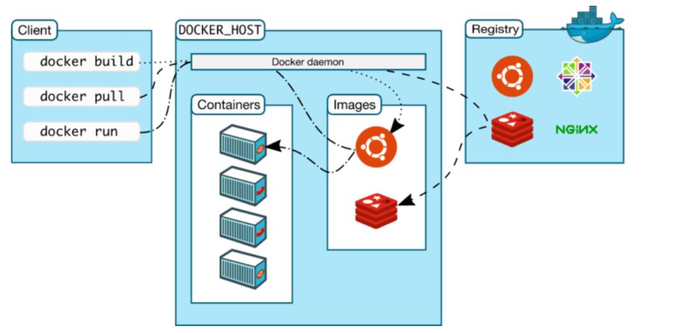

# 1 Docker

Docker和虚拟机的比较


## Docker的基本组成



## 基本概念

`image`(镜像)
`container`(容器)：镜像运行的实例
`registry`(仓库) ：存放镜像的地方

+ 添加国内淘宝镜像源

daemon.json添加阿里源,登录url:https://cr.console.aliyun.com/cn-beijing/instances/mirrors?accounttraceid=4e34a8a5-2ed6-4856-815a-051d44f17c2e  

```shell
sudo mkdir -p /etc/docker

# 修改daemon配置文件/etc/docker/daemon.json来使用加速器：
sudo tee /etc/docker/daemon.json <<-'EOF'
{
	"registry-mirrors": ["https://knx1let0.mirror.aliyuncs.com"]
}
EOF

sudo systemctl daemon-reload
sudo systemctl restart docker
```

### 常用命令


```shell
docker images                        查看镜像  
docker search mysql                  搜索镜像  
docker pull mysql:5.7                安装镜像(指定版本号)  
docker rmi -f IMAGE_ID,IMAGE_ID1     删除指定镜像
docker rmi -f $(docker images -aq)   删除全部镜像
docker run -d -p 80:80 --name=mynginx nginx     容器运行   -d(指定容器运行于前台还是后台，默认为false);  -p (端口映射);  80:80 (: 之前是宿主机端口，之后是容器需暴露的端口);   --name=mynginx(为容器指定一个名字)  
docker run --name myz-mysql -v /data/docker-mysql/data:/var/lib/mysq -e MYSQL_USER="maoyz" l -e MYSQL_PASSWORD="123456" -e MYSQL_ROOT_PASSWORD=root -p 3306:3306 -d mysql:8.0 --character-set-server=UTF8MB4 --collation-server=utf8mb4_unicode_ci   
# -v(挂载,本地/data/docker-mysql/data充当)  -e(配置信息，此处配置mysql的root用户的登陆密码)
docker run -it imageID /bin/bash       镜像产生一个容器，并且和cmd程序做交互
# -i表示交互式的，表示[cmd]是一个有用户输入的程序，比如/bin/bash 和python 等等；  -t 产生一个终端。
docker exec -it imageID /bin/bash      在正在运行容器中运行cmd程序

docker ps [-a]            查看容器
docker start nginx        运行容器
docker restart nginx      重启容器
docker stop nginx         停止容器
docker kill nginx         杀死容器
docker rm -f zookeeper(id/别名)       删除容器

docker exec -it zookeeper bash       进入容器后，开启新的终端
docker exec -it myz-mysql /usr/bin/bash
docker attach containerID            进入正在运行的容器终端，不会开启新的终端

docker logs -tf --tail number zookeeper(id/别名)     查看日志
# -t 时间戳，   --tail number  显示日志条数
docker logs container-name           查看日志
docker top container-name
docker history image_id         查看镜像历史
```


```shell
Management Commands:
  builder     Manage builds
  config      Manage Docker configs
  container   Manage containers
  context     Manage contexts
  engine      Manage the docker engine
  image       Manage images
  network     Manage networks
  node        Manage Swarm nodes
  plugin      Manage plugins
  secret      Manage Docker secrets
  service     Manage services
  stack       Manage Docker stacks
  swarm       Manage Swarm
  system      Manage Docker
  trust       Manage trust on Docker images
  volume      Manage volumes

Commands:
  attach      Attach local standard input, output, and error streams to a running container
  build       Build an image from a Dockerfile
  commit      Create a new image from a container's changes
  cp          Copy files/folders between a container and the local filesystem
  create      Create a new container
  diff        Inspect changes to files or directories on a container's filesystem
  events      Get real time events from the server
  exec        Run a command in a running container
  export      Export a container's filesystem as a tar archive
  history     Show the history of an image
  images      List images
  import      Import the contents from a tarball to create a filesystem image
  info        Display system-wide information
  inspect     Return low-level information on Docker objects
  kill        Kill one or more running containers
  load        Load an image from a tar archive or STDIN
  login       Log in to a Docker registry
  logout      Log out from a Docker registry
  logs        Fetch the logs of a container
  pause       Pause all processes within one or more containers
  port        List port mappings or a specific mapping for the container
  ps          List containers
  pull        Pull an image or a repository from a registry
  push        Push an image or a repository to a registry
  rename      Rename a container
  restart     Restart one or more containers
  rm          Remove one or more containers
  rmi         Remove one or more images
  run         Run a command in a new container
  save        Save one or more images to a tar archive (streamed to STDOUT by default)
  search      Search the Docker Hub for images
  start       Start one or more stopped containers
  stats       Display a live stream of container(s) resource usage statistics
  stop        Stop one or more running containers
  tag         Create a tag TARGET_IMAGE that refers to SOURCE_IMAGE
  top         Display the running processes of a container
  unpause     Unpause all processes within one or more containers
  update      Update configuration of one or more containers
  version     Show the Docker version information
  wait        Block until one or more containers stop, then print their exit codes
```


### Docker工作原理

1. Docker Client执行`docker run`命令
2. Docker daemon发现本地没有httpd镜像
3. daemon从`registry`下载镜像
4. 下载完成，镜像httpd被保存在本地
5. Docker daemon启动容器


- 查看容器元数据：`docker inspect containerID | grep Address `


#### commit镜像

```
docker commit -a="author" -m="msg" CONTAINER [REPOSITORY[:TAG]]
```

#### 镜像构建

```shell
docker build -t name:v1.0.0 -f /home/maoyz/Dockerfile                 镜像构建(指定目录)  
docker build -t name:v1.0.0 .                                         镜像构建(当前目录)  
docker tag image_name:${version} my_registry/image_name:${version}    镜像tag  
docker push my_registry/image_name:${version}                         镜像推送  
docker pull registry                                                  创建本地仓库  
docker run -d -p 5000:5000 -v /data/docker registry                   运行容器,挂在本地/data/docker目录  
http://127.0.0.01:5000/v2/_catalog                                    查看仓库信息  


docker exec -it 9df70f9a0714 /bin/bash		进入终端
docker exec -it 9df70f9a0714 bash		    进入终端 
```


出现docker push denied: requested access to the resource is denied
    https://www.jianshu.com/p/08fe56abb6f3

帮助文档:https://blog.csdn.net/qq_42114918/article/details/81609465

docker执行build:  org.apache.http.impl.execchain.RetryExec execute 信息: Retrying request to {}->unix://localhost:80
解决办法:chmod 777 /var/run/docker.sock

```xml
    <!--docker镜像build插件-->
    <plugin>
        <groupId>com.spotify</groupId>
        <artifactId>docker-maven-plugin</artifactId>
        <version>1.0.0</version>
        <configuration>
            <imageName>maoyz/${project.artifactId}:${project.version}</imageName>
            <dockerDirectory>${project.basedir}/src/main/docker</dockerDirectory>
            <skipDockerBuild>false</skipDockerBuild>
            <resources>
                <resource>
                    <targetPath>/</targetPath>
                    <directory>${project.build.directory}</directory>
                    <include>${project.build.finalName}.jar</include>
                </resource>
            </resources>
            <!-- 以下两行是为了docker push到DockerHub使用的 -->
            <!--<serverId>docker-hub</serverId>-->
            <!--<registryUrl>https://index.docker.io/v1/</registryUrl>-->
            <serverId>docker-registry</serverId>
        </configuration>
    </plugin>
```


/etc/default/docker

mvn clean package -Dmaven.test.skip=true dockerfile:build

+ maven插件

```xml
    <build>
        <plugins>
            <plugin>
                <groupId>org.springframework.boot</groupId>
                <artifactId>spring-boot-maven-plugin</artifactId>
            </plugin>
            <plugin>
                <groupId>com.spotify</groupId>
                <artifactId>dockerfile-maven-plugin</artifactId>
                <version>${dockerfile-maven-version}</version>
                <executions>
                    <execution>
                        <id>default</id>
                        <goals>
                            <goal>build</goal>
                            <goal>push</goal>
                        </goals>
                    </execution>
                </executions>
                <configuration>
                    <dockerInfoDirectory>src/main/docker</dockerInfoDirectory>
                    <dockerConfigFile>src/main/docker</dockerConfigFile>
                    <repository>${docker.image}/${project.artifactId}</repository>
                    <tag>${project.version}</tag>
                    <buildArgs>
                        <JAR_FILE>target/${project.build.finalName}.jar</JAR_FILE>
                    </buildArgs>
                </configuration>
            </plugin>
        </plugins>
    </build>
```

### Dockerfile指令


- FROM    指定基础镜像，是必备的指令，并且必须是第一条指令  
- ENV    设置环境变量，存在于`docker run`命令执行期间。默认值写在 Dockerfile 里。如果要修改，可以通过 `docker run`命令的 --env 参数来指定。
- ARG    存在于`docker build`命令执行期间。默认值写在 Dockerfile 里。如果需要修改，可以通过`docker build`命令里的 --build-arg 参数来指定。如果要把 ARG 的值保存到 container 运行起来之后仍然可以可用，则需要在 ARG 之后写一个 ENV。
- RUN     执行命令行命令
- COPY   将文件从build context复制到镜像，支持两种形式，COPY src dest或COPY["src",  "dest"]
- ADD     更高级的复制文件, 可解压文件  
- VOLUME    指定挂载点  
- WORKDIR    指定工作目录  
- EXPOSE    暴露端口  
- CMD    容器启动时运行的命令，可以有多个CMD指令，可被覆盖，最后一个生效
- ENTRYPOINT   容器启动时运行的命令，可以有多个ENTRYPOINT指令，["/usr/bin/java", "-jar", "/app.jar"]，CMD或docker run之后的参数会被当作参数传递给ENTRYPOINT

```dockerfile
FROM java:8

VOLUME /tmp

ENV MYPATH /usr/local
WORKDIR  $MYPATH

# Add Maven dependencies (not shaded into the artifact; Docker-cached)
#ADD target/lib  /usr/share/maoyz/lib

# Add the service itself
ARG JAR_FILE
ADD ${JAR_FILE} app.jar

RUN bash -c 'touch /app.jar'

EXPOSE 8701

ENTRYPOINT ["/usr/bin/java", "-jar", "/app.jar"]

CMD echo "---------end----------"
```

#### RUN、CMD、ENTRYPOINT

- RUN：执行命令并创建新的镜像层，经常用于安装软件包
- CMD：设置容器启动后默认执行的命令和参数，能够被docker run的命令行参数替换
- ENTRYPOINT：配置容器启动时运行的命令

#### Shell 和 Exec 格式

- Shell格式

  底层调用`/bin/sh  -c  [command]`

- Exec格式

  直接调用`[command]`，不会被shell解析

> CMD、ENTRYPOINT推荐使用`Exec`格式，RUN两种皆可。


开启远程访问


出现问题:  

+ 1. `Got permission denied while trying to connect to the Docker daemon socket at unix:///var/run/docker.sock: Get http://%2Fvar%2Frun%2Fdocker.sock/v1.39/containers/json: dial unix /var/run/docker.sock: connect: permission denied`

```
1. sudo ls -l /var/run/docker.sock      # 这个文件的所有者和所属组是什么
输出结果: srw-rw---- 1 root docker 0 Jul 12 22:41 /var/run/docker.sock   表示属于root用户和docker组的

2. sudo gpasswd -a ${USER} docker   # 加入到了用户组


ENTRYPOINT ["/usr/bin/java", "-jar", "/app.jar"]


mvn clean package


mvn clean package dockerfile:build -Dmaven.test.skip=true

3. newgrp - docker
```

+ 2. linux修改docker.service之后重新启动docker出错: `Job for docker.service failed because the control process exited with error code. See "systemctl status docker.service" and "journalctl -xe" for details`

```
cd /etc/docker/

mv daemon.json daemon.conf
```

docker-compose

```sh
sudo curl -L "https://github.com/docker/compose/releases/download/1.25.4/docker-compose-$(uname -s)-$(uname -m)" -o /usr/local/bin/docker-compose
```

出现：curl: (56) OpenSSL SSL_read: SSL_ERROR_SYSCALL, errno 104

使用　1.23.1　版本

```sh
sudo chmod +x /usr/local/bin/docker-compose

sudo ln -s /usr/local/bin/docker-compose /usr/bin/docker-compose

```

/sys/fs/cgroup/cpu

cpu.cfs_period_us

cpu.cfs_quota_us


### 分层的镜像


docker镜像都是只读的，当容器启动run时，一个新的可写镜像加载到镜像的顶层。


### 联合文件系统

联合文件系统（UnionFS），把各层文件系统叠加起来，是Docker镜像的基础


- bootfs（boot file system）

  bootloader和kernel，bootloader主要引导加载kernel，Docker最底层是bootfs。

- rootfs（root file system）

  在bootfs之上，包含的是linux系统中标准目录和文件，是不同的操作系统发行版。


### 容器数据卷

**Data Volumes**，所有的docker容器内的卷，没有指定目录的时候，默认`/var/lib/docker/volumes/xxx/_data`

```
-v <host path>:<container path>
```

具名挂载和匿名挂载

```
-v 容器内路径              # 匿名挂载
-v 卷名：容器内路径         # 具名挂载
-v /宿主机路径：容器内路径   # 指定路径挂载
```


#### 数据卷容器

  `--volumes-from  container1 `，以`container1`容器为父容器，完成容器之间数据共享、备份


### Docker网络

- **IP 地址**：公网IP下设置私网IP，公网IP下设置私网IP，三个IP地址段作为私有地址：
  1. 10.0.0.0 - 10.255.255.255           00001010  00000000  00000000  00000000   ~  00001010  11111111  11111111  11111111
  2. 172.16.0.0 - 172.31.255.255       10101100  00010000   00000000  00000000  ~  10101100  00011111   11111111  11111111
  3. 192.168.0.0 - 192.168.255.255   11000000  10101000  00000000  00000000   ~  11000000  10101000   11111111  11111111

- **子网掩码**：255.255.255.0，必须结合IP地址一起使用，常见的掩码为：
  1. 255.0.0.0
  2. 255.255.0.0
  3. 255.255.255.0

- **网关**：一个网络通向其它网络的IP地址
- **DNS**：

ip地址补充知识：192.168.107.100/24

IP地址有两种，IP4和IP6。IP4地址，由4个字节表示，每个字节有8个位，写成形如类似255.255.255.255的样子，其中255是十进制，转成二进制是11111111。
每个IP4地址分为两部分，前一部分是网络ID，后一部分是主机ID。根据网络ID的长短不同，又将IP地址划分成三类：A类地址，B类地址，C类地址，D类地址。

1. A类地址：第一个字节，表示网络号，且约定这个字节的**第一位必须是0**，后面三个字节是主机ID。也就是说，A类地址的网络号一共有01111111个，转成十进制是127个，很少。每个网络号之下，有2^24=16777216台主机。因此，A类地址数量是127*16777216=2130706432个。
2. B类地址：第一个和第二个字节是网络ID，且**最高的两位必须是10**，第三和第四个字节是主机ID。也就是说，B类地址的网络数量是`2^14=16384`，每个网络ID容纳的主机ID数量是2^16=65536个，因此B类地址数量一共是`16384*65536=1073741824`个。
3. C类地址：前三个字节是网络ID，且**最高的三位必须是110**，第四个字节是主机ID。也就是说，C类地址的网络数量是`2^21=2097152`个，每个网络下的主机ID数量是2^8=256个，因此C类地址数量一共是`2097152*256=536870912`个。
4. D类地址。D类地址，有点特殊，不分网络ID和主机ID，前四位必须是1110，其他位任意。因此D类地址数量是`2^28=268435456`个。
   上述4类地址，有一个简单的判断方式，如果把IP地址写成十进制，类似 `255.255.255.255`的形式，如果第一个数字是1～126，是A类地址（127有特殊用途，下文会说到），128～191是B类地址，192～223是C类地址，224～239是D类地址。

A类内网IP地址：10.0.0.0 - 10.255.255.255，默认子网掩码是255.0.0.0（11111111·00000000·00000000·00000000）。这个子网掩码的前8位是1，因此，一个A类内网ip地址带上掩码可以写成形如10.1.0.1/8，这个8，表示4字节的IP地址，前8位表示网络ID。

B类内网IP地址：172.16.0.0 - 172.31.255.255，默认子网掩码是255.255.0.0（11111111·11111111·00000000·00000000）。B类地址带上掩码可以写成172.16.1.1/12。

C类内网IP地址：192.168.0.0 - 192.168.255.255，默认子网掩码是255.255.255.0（11111111·11111111·11111111·00000000）。C类地址带上掩码可以写成192.168.0.1/16。

#### Docker的网络概念(container network model)

- Network：网络，可以理解为一个Driver，是一个第三方网络栈，包含多种网络模式

1. 单主机网络模式（none、host、bridge，joined container）
2. 多主机网络模式（overlay、macvlan、flannel）

- Sandbox：沙盒，它定义了容器内的虚拟网卡、DNS和路由表，是network namespace的一种实现，是容器的内部网络栈

- Endpoint：端点，用于连接Sandbox和Network


#### Docker0


​		

计算机网络

```
1: lo: <LOOPBACK,UP,LOWER_UP> mtu 65536 qdisc noqueue state UNKNOWN group default qlen 1000
    link/loopback 00:00:00:00:00:00 brd 00:00:00:00:00:00
    inet 127.0.0.1/8 scope host lo
       valid_lft forever preferred_lft forever
    inet6 ::1/128 scope host 
       valid_lft forever preferred_lft forever
2: eth0: <BROADCAST,MULTICAST,UP,LOWER_UP> mtu 1500 qdisc pfifo_fast state UP group default qlen 1000
    link/ether 00:50:56:25:08:9e brd ff:ff:ff:ff:ff:ff
    inet 192.168.107.100/24 brd 192.168.107.255 scope global noprefixroute eth0
       valid_lft forever preferred_lft forever
    inet6 fd15:4ba5:5a2b:1008:3813:efc0:8363:8d4d/64 scope global noprefixroute dynamic 
       valid_lft 86373sec preferred_lft 14373sec
    inet6 fe80::6f9e:4719:58c0:1c21/64 scope link noprefixroute 
       valid_lft forever preferred_lft forever
3: virbr0: <NO-CARRIER,BROADCAST,MULTICAST,UP> mtu 1500 qdisc noqueue state DOWN group default qlen 1000
    link/ether 52:54:00:66:b2:49 brd ff:ff:ff:ff:ff:ff
    inet 192.168.122.1/24 brd 192.168.122.255 scope global virbr0
       valid_lft forever preferred_lft forever
4: virbr0-nic: <BROADCAST,MULTICAST> mtu 1500 qdisc pfifo_fast master virbr0 state DOWN group default qlen 1000
    link/ether 52:54:00:66:b2:49 brd ff:ff:ff:ff:ff:ff
5: docker0: <BROADCAST,MULTICAST,UP,LOWER_UP> mtu 1500 qdisc noqueue state UP group default 
    link/ether 02:42:67:fd:4b:19 brd ff:ff:ff:ff:ff:ff
    inet 172.17.0.1/16 brd 172.17.255.255 scope global docker0
       valid_lft forever preferred_lft forever
    inet6 fe80::42:67ff:fefd:4b19/64 scope link 
       valid_lft forever preferred_lft forever
7: vetha64ab28@if6: <BROADCAST,MULTICAST,UP,LOWER_UP> mtu 1500 qdisc noqueue master docker0 state UP group default 
    link/ether 42:37:e7:98:30:d0 brd ff:ff:ff:ff:ff:ff link-netnsid 0
    inet6 fe80::4037:e7ff:fe98:30d0/64 scope link 
       valid_lft forever preferred_lft forever
9: vethd342a47@if8: <BROADCAST,MULTICAST,UP,LOWER_UP> mtu 1500 qdisc noqueue master docker0 state UP group default 
    link/ether ba:92:b2:e2:c7:9d brd ff:ff:ff:ff:ff:ff link-netnsid 0
    inet6 fe80::b892:b2ff:fee2:c79d/64 scope link 
       valid_lft forever preferred_lft forever
11: veth47e6f94@if10: <BROADCAST,MULTICAST,UP,LOWER_UP> mtu 1500 qdisc noqueue master docker0 state UP group default 
    link/ether 66:ab:79:62:e7:e9 brd ff:ff:ff:ff:ff:ff link-netnsid 1
    inet6 fe80::64ab:79ff:fe62:e7e9/64 scope link 
       valid_lft forever preferred_lft forever
```

- `lo`

  `127.0.0.1/8`:本机回环地址

- `eth0`

  `192.168.107.100/24`:本机内网地址

  `192.168.107.255`:

- `docker0`

  `172.17.0.1/16`:docker0地址

  `172.17.255.255`:

- `7: vetha64ab28@if6`

  

docker处理网络访问？

桥接模式，**evth-pair**技术，一对虚拟设备接口，成对出现，一段连着协议，一段彼此相连


#### Docker单主机四种网络模式：

```shell
[root@node0 ~]# docker network ls
NETWORK ID          NAME                DRIVER              SCOPE
17f151e2a5fe        bridge              bridge              local
24b0037f7891        host                host                local
aaf8267e0cea        none                null                local
```


- host：和宿主机共享网络
- bridge：桥接式网络模式，默认设置
- none：不配置网络
- joined-container：联合挂载式网络模式，是host网络模式的延伸，k8s的pod就是使用的这一模式。

> `docker run --network`命令可以指定使用网络模式

##### Bridge 网络模式


当Docker进程启动时，会**在主机上创建一个名为docker0的虚拟网桥**，此主机上启动的**Docker容器会连接到这个虚拟网桥上，**所以有默认地址172.17.0.1/16的地址。虚拟网桥的工作方式和物理交换机类似，这样主机上的所有容器就通过交换机连在了一个二层网络中。

从**docker0子网中分配一个IP给容器使用**，并设置**docker0的IP地址为容器的默认网关**。在主机上**创建一对虚拟网卡**veth pair设备，Docker将veth pair设备的**一端放在新创建的容器**中，并命名为eth0（容器的网卡），**另一端放在主机中**，以vethxxx这样类似的名字命名，并将这个网络设备加入到docker0网桥中。

可以通过brctl show命令查看

```
[root@node0 ~]# brctl show
bridge name	bridge id		STP enabled	interfaces
docker0		8000.0242af893e83	no		
virbr0		8000.52540066b249	yes		virbr0-nic
```

默认网络模式。`--network bridge`指定网络模式

##### Host 网络模式


如果启动容器的时候使用host模式，那么这个容器将不会获得一个独立的**Network Namespace**，而是**和宿主机共用一个Network Namespace**。容器将不会虚拟出自己的网卡，配置自己的IP等，而是使用宿主机的IP和端口。但是，容器的其他方面，如文件系统、进程列表等还是和宿主机隔离的。

##### Container 网络模式


指定新创建的容器和**已经存在的一个容器**共享一个 **Network Namespace**，而不是和宿主机共享。新创建的容器不会创建自己的网卡，配置自己的 IP，而是和一个指定的容器共享IP、端口范围等。同样，两个容器除了网络方面，其他的如文件系统、进程列表等还是隔离的。两个容器的进程可以通过 lo 网卡设备通信。

##### None 网络模式

Docker容器拥有自己的**Network Namespace**，但是，并不为Docker容器进行任何网络配置。也就是说，这个Docker容器没有网卡、IP、路由等信息，只有lo 网络接口。需要我们自己为Docker容器添加网卡、配置IP等。

不参与网络通信，运行于此类容器中的进程仅能访问本地回环接口；仅适用于进程无须网络通信的场景中，例如：备份、进程诊断及各种离线任务等。


总结：

|                  | Network Namespace | Network stack  |
| ---------------- | ----------------- | -------------- |
| host             | 0%                | 与宿主机共享   |
| bridge           | 100%              | 独有，自动配置 |
| none             | 100%              | 独有，手动配置 |
| joined-container | n%                | 多个容器共享   |

##### 自定义bridge网络

###### 默认网段

```shell
[root@node0 ~]# docker network create -d bridge  my_net
f75c8f267bd6802956d8354437df50dee37f84a15b971a63604104d833ceb211

[root@node0 ~]# docker network ls
NETWORK ID          NAME                DRIVER              SCOPE
17f151e2a5fe        bridge              bridge              local
24b0037f7891        host                host                local
f75c8f267bd6        my_net              bridge              local
aaf8267e0cea        none                null                local
[root@node0 ~]# 
```

创建一个桥接网络，名称为my_net，如果没有指定网段，默认是172.18.0.0/16，按docker0的网段自动递增，查看网络信息：

```shell
[root@node0 ~]# docker inspect my_net
[
    {
        "Name": "my_net",
        "Id": "f75c8f267bd6802956d8354437df50dee37f84a15b971a63604104d833ceb211",
        "Created": "2021-06-29T00:07:47.844239996+08:00",
        "Scope": "local",
        "Driver": "bridge",
        "EnableIPv6": false,
        "IPAM": {
            "Driver": "default",
            "Options": {},
            "Config": [
                {
                    "Subnet": "172.18.0.0/16",
                    "Gateway": "172.18.0.1"
                }
            ]
        },
        "Internal": false,
        "Attachable": false,
        "Ingress": false,
        "ConfigFrom": {
            "Network": ""
        },
        "ConfigOnly": false,
        "Containers": {},
        "Options": {},
        "Labels": {}
    }
]

6: br-f75c8f267bd6: <NO-CARRIER,BROADCAST,MULTICAST,UP> mtu 1500 qdisc noqueue state DOWN group default 
    link/ether 02:42:ab:cb:3a:e6 brd ff:ff:ff:ff:ff:ff
    inet 172.18.0.1/16 brd 172.18.255.255 scope global br-f75c8f267bd6
       valid_lft forever preferred_lft forever
```

###### 自定义网络地址

```shell
[root@node0 ~]# docker network create -d bridge --subnet 172.20.16.0/24 --gateway 172.20.16.1 my_net2
c250dfae4b3d9cdf849a953182fec90815a0245d87304edd5ff37c87e5c32d41

[root@node0 ~]# docker network ls
NETWORK ID          NAME                DRIVER              SCOPE
17f151e2a5fe        bridge              bridge              local
24b0037f7891        host                host                local
f75c8f267bd6        my_net              bridge              local
c250dfae4b3d        my_net2             bridge              local
aaf8267e0cea        none                null                local

```

指定其IP网段`172.20.16.0/24`及网关信息`172.20.16.1`

```shell
[root@node0 ~]# docker inspect my_net2
[
    {
        "Name": "my_net2",
        "Id": "c250dfae4b3d9cdf849a953182fec90815a0245d87304edd5ff37c87e5c32d41",
        "Created": "2021-06-29T00:14:04.915677638+08:00",
        "Scope": "local",
        "Driver": "bridge",
        "EnableIPv6": false,
        "IPAM": {
            "Driver": "default",
            "Options": {},
            "Config": [
                {
                    "Subnet": "172.20.16.0/24",
                    "Gateway": "172.20.16.1"
                }
            ]
        },
        "Internal": false,
        "Attachable": false,
        "Ingress": false,
        "ConfigFrom": {
            "Network": ""
        },
        "ConfigOnly": false,
        "Containers": {},
        "Options": {},
        "Labels": {}
    }
]

7: br-c250dfae4b3d: <NO-CARRIER,BROADCAST,MULTICAST,UP> mtu 1500 qdisc noqueue state DOWN group default 
    link/ether 02:42:06:9b:43:50 brd ff:ff:ff:ff:ff:ff
    inet 172.20.16.1/24 brd 172.20.16.255 scope global br-c250dfae4b3d
       valid_lft forever preferred_lft forever
```

> 容器之间可以通过容器名进行通信，但前提必须是使用自定义网络，比如创建的my_net、my_net2；
>
> 如果在创建自定义网络时，指定了该网络的网段，那么使用此时的容器也可以指定容器的IP地址，若没有指定该网络的网段，则不可指定容器的IP地址

#### 跨主机的Docker网络通信


自定义网络


网络联通

```
for port in $(seq 1 6); \
do \
mkdir -p /mydata/redis/node-${port}/conf
touch /mydata/redis/node-${port}/conf/redis.conf
cat  EOF /mydata/redis/node-${port}/conf/redis.conf
port 6379 
bind 0.0.0.0
cluster-enabled yes 
cluster-config-file nodes.conf
cluster-node-timeout 5000
cluster-announce-ip 172.38.0.1${port}
cluster-announce-port 6379
cluster-announce-bus-port 16379
appendonly yes
EOF
done
```

## Docker Compose

### 安装步骤

1. 离线安装包： **docker-compose-Linux-x86_64**
2. `sudo mv docker-compose-Linux-x86_64 /usr/local/bin/docker-compose`
3. 添加可执行权限：`sudo chmod +x /usr/local/bin/docker-compose`
4. 查看：`docker-compose -v`

### 文档说明

> 官方文档  https://docs.docker.com/compose/compose-file

Compose is a tool for defining and running multi-container Docker applications. With Compose, you use a YAML file to configure your application’s services. Then, with a single command, you create and start all the services from your configuration. To learn more about all the features of Compose, see [the list of features](https://docs.docker.com/compose/#features).

Compose works in all environments: production, staging, development, testing, as well as CI workflows. You can learn more about each case in [Common Use Cases](https://docs.docker.com/compose/#common-use-cases).

Using Compose is basically a three-step process:（三步走）

1. Define your app’s environment with a `Dockerfile` so it can be reproduced anywhere.
2. Define the services that make up your app in `docker-compose.yml` so they can be run together in an isolated environment.
3. Run `docker-compose up` and Compose starts and runs your entire app.

### 配置文件

YAML配置文件示例：docker-compose.yml

```yaml
version: "3.8"
services:
  web:
    build: .
    ports:
      - "5000:5000"
    volumes:
      - .:/code
      - logvolume01:/var/log
    links:
      - redis
  redis:
    image: redis
    deploy:
      replicas: 6
      placement:
        max_replicas_per_node: 1
      update_config:
        parallelism: 2
        delay: 10s
      restart_policy:
        condition: on-failure
volumes:
  logvolume01: {}
  
  
---
version: ""  # 版本号
services:  # 服务
  服务1:
    # 服务配置
    build:
    image:
    ports:
    network:
    depends_on:  # 依赖哪些服务
      - 服务2
    ...
  服务2:
    # 服务配置
    image:
    deploy:  # 部署
    ...
# 其他配置
volumes:
network:
configs:
```

+ 服务services：
+ 项目progect：一组关联的容器

网络规则：


