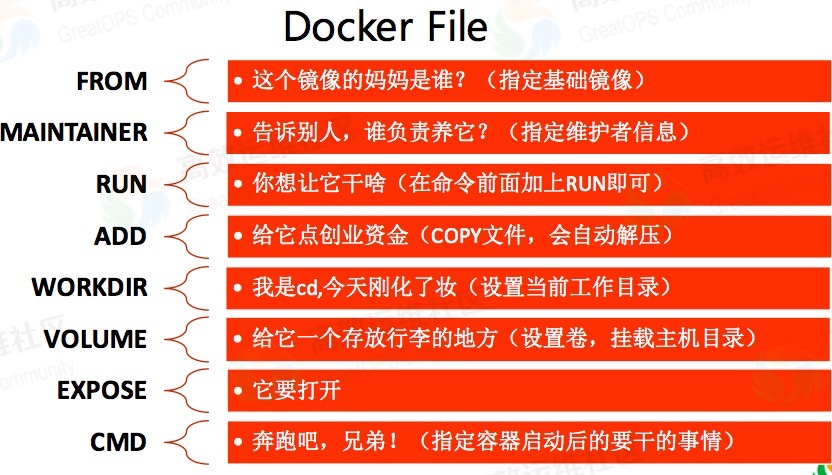

# Dockerfile

用途：用来构建Docker镜像的构建文件，由一系列命令和参数构成的脚本。

编写`Dockerfile`文件 -> `docker build [image]`  ->  `docker run [container]`

> Dockerfile  ->  Docker 镜像  ->  Docker容器

## Dockerfile指令



- FROM    指定基础镜像，是必备的指令，**并且必须是第一条指令**  
- MAINTAINER  作者姓名和邮箱
- RUN     执行命令行命令
- ENV    设置环境变量，存在于`docker run`命令执行期间。默认值写在 Dockerfile 里。如果要修改，可以通过 `docker run`命令的 --env 参数来指定。
- ARG    存在于`docker build`命令执行期间。默认值写在 Dockerfile 里。如果需要修改，可以通过`docker build`命令里的 --build-arg 参数来指定。如果要把 ARG 的值保存到 container 运行起来之后仍然可以可用，则需要在 ARG 之后写一个 ENV。
- COPY   将文件从build context复制到镜像，支持两种形式，COPY src dest或COPY["src",  "dest"]
- ADD  更高级的复制文件, 可解压文件 ，将宿主机目录下的文件拷贝到镜像且`ADD`命令会自动处理`URL`和解压缩包。例如：`run.sh .`
- VOLUME   容器数据卷，用于数据保存和持久化工作
- WORKDIR    指定在创建容器后，终端默认登录后进入的目录
- EXPOSE    暴露端口  
- CMD    容器启动时运行的命令，可以有多个`CMD`指令，**可被覆盖**，只有最后一个生效。`CMD`会被`docker run`之后的参数替换。例如：["./run.sh"]
- ENTRYPOINT   容器启动时运行的命令，可以有多个`ENTRYPOINT`指令，["/usr/bin/java", "-jar", "/app.jar"]，`CMD`或`docker run`之后的参数会被当作参数传递给ENTRYPOINT，**不会覆盖**

```dockerfile
FROM centos
MAINTAINER zzx<zzx@qq.com>

# 把宿主机与当前文件同目录下的host.txt  复制到 容器中的loacl文件下，并改名为continal.txt
COPE host.txt /usr/local/continal.txt
# 复制Tomcat 到容器的local目录并进行解压
ADD apache-tomcat-9.0.8.tar.gz /usr/local/

# 定义容器默认录入
ENV MYPATH /usr/local
WORKDIR $MYPATH
# 安装指定命令
RUN yum -y install vim
RUN yum -y install net-tools

EXPOSE 80
# ENTRYPOINT 与CMD类似，只是它为连接CMD是替换
CMD bin/bash

# ONBUILD 表示别的file 继承此镜像 FROM时会触发
ONBUILD RUN echo "father"

```

构建：`docker build -t`新镜像名:`tag .`

```dockerfile
FROM java:8

VOLUME /tmp

ENV MYPATH /usr/local
WORKDIR  $MYPATH

# Add Maven dependencies (not shaded into the artifact; Docker-cached)
#ADD target/lib  /usr/share/maoyz/lib

# Add the service itself
ARG JAR_FILE
ADD ${JAR_FILE} app.jar

RUN bash -c 'touch /app.jar'

EXPOSE 8701

ENTRYPOINT ["/usr/bin/java", "-jar", "/app.jar"]

CMD echo "---------end----------"
```

### RUN、CMD、ENTRYPOINT

- RUN：用于指定` docker build`过程中要运行的命令，在当前镜像之上执行任何命令，执行命令并创建新的镜像层，经常用于安装软件包，可以有多个RUN指令并依次执行

> RUN <command> (shell模式)，RUN ["executable", "param1", "param2"] (exec 模式)

- CMD：在`docker run`时运行，容器启动时默认执行的命令和参数，只有**最后一个该指令有效**，能够被`docker run`的命令行参数替换。

> CMD ["executable", "param1",  "param2"] (exec 模式, 推荐使用)；CMD ["param1", "param2"] (作为 ENTRYPOINT 指令的参数)

- ENTRYPOINT：在`docker run`时运行，配置容器启动时运行的命令，只有**最后一个该指令有效**, 不会被`docker run`的命令行参数替换。而且这些命令行参数会被当作参数送给`ENTRYPOINT`指令指定的程序；但是, 如果运行`docker run`时使用了`--entrypoint`选项，此选项的参数可当作要运行的程序覆盖 ENTRYPOINT 指令指定的程序；

> ENTRYPOINT["executable", "param1",  "param2"] (exec 模式, 推荐使用)

#### shell 和 exec 格式

- shell格式

  底层调用`/bin/sh  -c  [command]`

- exec格式

  直接调用`[command]`，不会被shell解析

> CMD、ENTRYPOINT推荐使用`Exec`格式，RUN两种皆可。
