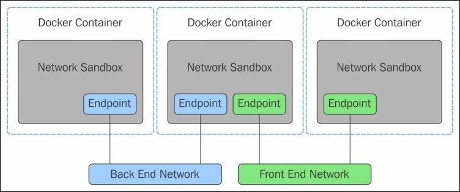
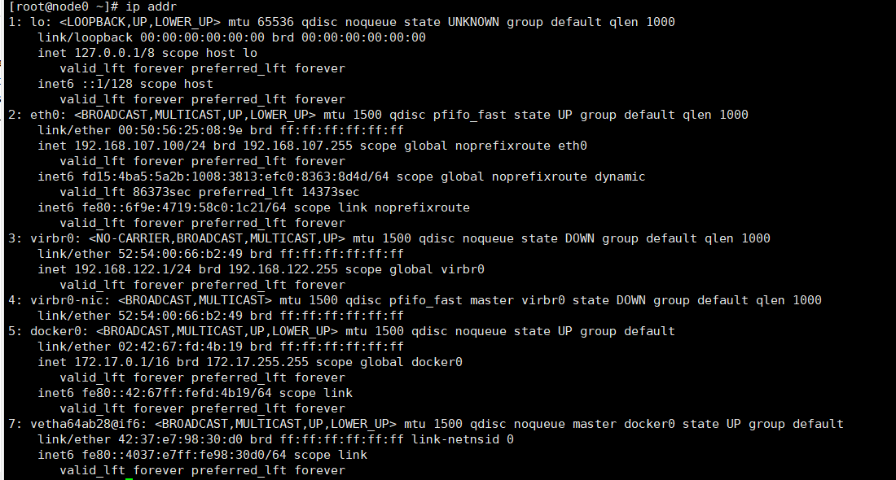
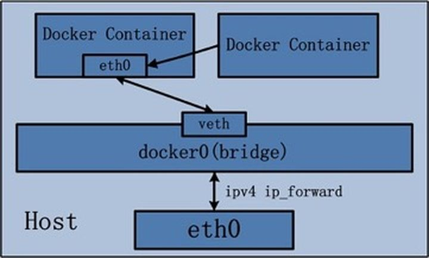

# Docker-网络

> 容器之间如何通信？容器和主机如何通信？

## Docker网络

- **IP 地址**：公网IP下设置私网IP，公网IP下设置私网IP，三个IP地址段作为私有地址：
  1. 10.0.0.0 - 10.255.255.255           00001010  00000000  00000000  00000000   ~  00001010  11111111  11111111  11111111
  2. 172.16.0.0 - 172.31.255.255       10101100  00010000   00000000  00000000  ~  10101100  00011111   11111111  11111111
  3. 192.168.0.0 - 192.168.255.255   11000000  10101000  00000000  00000000   ~  11000000  10101000   11111111  11111111

- **子网掩码**：255.255.255.0，必须结合IP地址一起使用，常见的掩码为：
  1. 255.0.0.0
  2. 255.255.0.0
  3. 255.255.255.0

- **网关**：一个网络通向其它网络的IP地址
- **DNS**：

ip地址补充知识：192.168.107.100/24

IP地址有两种，IP4和IP6。IP4地址，由4个字节表示，每个字节有8个位，写成形如类似255.255.255.255的样子，其中255是十进制，转成二进制是11111111。
每个IP4地址分为两部分，前一部分是网络ID，后一部分是主机ID。根据网络ID的长短不同，又将IP地址划分成三类：A类地址，B类地址，C类地址，D类地址。

1. A类地址：第一个字节，表示网络号，且约定这个字节的**第一位必须是0**，后面三个字节是主机ID。也就是说，A类地址的网络号一共有01111111个，转成十进制是127个，很少。每个网络号之下，有2^24=16777216台主机。因此，A类地址数量是127*16777216=2130706432个。
2. B类地址：第一个和第二个字节是网络ID，且**最高的两位必须是10**，第三和第四个字节是主机ID。也就是说，B类地址的网络数量是`2^14=16384`，每个网络ID容纳的主机ID数量是2^16=65536个，因此B类地址数量一共是`16384*65536=1073741824`个。
3. C类地址：前三个字节是网络ID，且**最高的三位必须是110**，第四个字节是主机ID。也就是说，C类地址的网络数量是`2^21=2097152`个，每个网络下的主机ID数量是2^8=256个，因此C类地址数量一共是`2097152*256=536870912`个。
4. D类地址。D类地址，有点特殊，不分网络ID和主机ID，前四位必须是1110，其他位任意。因此D类地址数量是`2^28=268435456`个。
   上述4类地址，有一个简单的判断方式，如果把IP地址写成十进制，类似 `255.255.255.255`的形式，如果第一个数字是1～126，是A类地址（127有特殊用途，下文会说到），128～191是B类地址，192～223是C类地址，224～239是D类地址。

A类内网IP地址：10.0.0.0 - 10.255.255.255，默认子网掩码是255.0.0.0（11111111·00000000·00000000·00000000）。这个子网掩码的前8位是1，因此，一个A类内网ip地址带上掩码可以写成形如10.1.0.1/8，这个8，表示4字节的IP地址，前8位表示网络ID。

B类内网IP地址：172.16.0.0 - 172.31.255.255，默认子网掩码是255.255.0.0（11111111·11111111·00000000·00000000）。B类地址带上掩码可以写成172.16.1.1/12。

C类内网IP地址：192.168.0.0 - 192.168.255.255，默认子网掩码是255.255.255.0（11111111·11111111·11111111·00000000）。C类地址带上掩码可以写成192.168.0.1/16。

### Docker的网络概念(container network model)

- Network：网络，可以理解为一个Driver，是一个第三方网络栈，包含多种网络模式

1. 单主机网络模式（none、host、bridge，joined container）
2. 多主机网络模式（overlay、macvlan、flannel）

- Sandbox：沙盒，它定义了容器内的虚拟网卡、DNS和路由表，是network namespace的一种实现，是容器的内部网络栈

- Endpoint：端点，用于连接Sandbox和Network



#### Docker0



​		

计算机网络

```
1: lo: <LOOPBACK,UP,LOWER_UP> mtu 65536 qdisc noqueue state UNKNOWN group default qlen 1000
    link/loopback 00:00:00:00:00:00 brd 00:00:00:00:00:00
    inet 127.0.0.1/8 scope host lo
       valid_lft forever preferred_lft forever
    inet6 ::1/128 scope host 
       valid_lft forever preferred_lft forever
2: eth0: <BROADCAST,MULTICAST,UP,LOWER_UP> mtu 1500 qdisc pfifo_fast state UP group default qlen 1000
    link/ether 00:50:56:25:08:9e brd ff:ff:ff:ff:ff:ff
    inet 192.168.107.100/24 brd 192.168.107.255 scope global noprefixroute eth0
       valid_lft forever preferred_lft forever
    inet6 fd15:4ba5:5a2b:1008:3813:efc0:8363:8d4d/64 scope global noprefixroute dynamic 
       valid_lft 86373sec preferred_lft 14373sec
    inet6 fe80::6f9e:4719:58c0:1c21/64 scope link noprefixroute 
       valid_lft forever preferred_lft forever
3: virbr0: <NO-CARRIER,BROADCAST,MULTICAST,UP> mtu 1500 qdisc noqueue state DOWN group default qlen 1000
    link/ether 52:54:00:66:b2:49 brd ff:ff:ff:ff:ff:ff
    inet 192.168.122.1/24 brd 192.168.122.255 scope global virbr0
       valid_lft forever preferred_lft forever
4: virbr0-nic: <BROADCAST,MULTICAST> mtu 1500 qdisc pfifo_fast master virbr0 state DOWN group default qlen 1000
    link/ether 52:54:00:66:b2:49 brd ff:ff:ff:ff:ff:ff
5: docker0: <BROADCAST,MULTICAST,UP,LOWER_UP> mtu 1500 qdisc noqueue state UP group default 
    link/ether 02:42:67:fd:4b:19 brd ff:ff:ff:ff:ff:ff
    inet 172.17.0.1/16 brd 172.17.255.255 scope global docker0
       valid_lft forever preferred_lft forever
    inet6 fe80::42:67ff:fefd:4b19/64 scope link 
       valid_lft forever preferred_lft forever
7: vetha64ab28@if6: <BROADCAST,MULTICAST,UP,LOWER_UP> mtu 1500 qdisc noqueue master docker0 state UP group default 
    link/ether 42:37:e7:98:30:d0 brd ff:ff:ff:ff:ff:ff link-netnsid 0
    inet6 fe80::4037:e7ff:fe98:30d0/64 scope link 
       valid_lft forever preferred_lft forever
9: vethd342a47@if8: <BROADCAST,MULTICAST,UP,LOWER_UP> mtu 1500 qdisc noqueue master docker0 state UP group default 
    link/ether ba:92:b2:e2:c7:9d brd ff:ff:ff:ff:ff:ff link-netnsid 0
    inet6 fe80::b892:b2ff:fee2:c79d/64 scope link 
       valid_lft forever preferred_lft forever
11: veth47e6f94@if10: <BROADCAST,MULTICAST,UP,LOWER_UP> mtu 1500 qdisc noqueue master docker0 state UP group default 
    link/ether 66:ab:79:62:e7:e9 brd ff:ff:ff:ff:ff:ff link-netnsid 1
    inet6 fe80::64ab:79ff:fe62:e7e9/64 scope link 
       valid_lft forever preferred_lft forever
```

- `lo`

  `127.0.0.1/8`:  本机回环地址

- `eth0`

  `192.168.107.100/24`:  本机内网地址

  `192.168.107.255`:

- `docker0`

  `172.17.0.1/16`:  docker0地址

  `172.17.255.255`:

- `7: vetha64ab28@if6`

docker处理网络访问？

桥接模式，**evth-pair**技术，一对虚拟设备接口，成对出现，一段连着协议，一段彼此相连


#### Docker单主机四种网络模式：

```shell
[root@node0 ~]# docker network ls
NETWORK ID          NAME                DRIVER              SCOPE
17f151e2a5fe        bridge              bridge              local
24b0037f7891        host                host                local
aaf8267e0cea        none                null                local
```


- host：和宿主机共享网络
- bridge：桥接式网络模式，默认设置
- none：不配置网络
- joined-container：联合挂载式网络模式，是host网络模式的延伸，k8s的pod就是使用的这一模式。

> `docker run --network`命令可以指定使用网络模式

##### Bridge 网络模式


当Docker进程启动时，会**在主机上创建一个名为docker0的虚拟网桥**，此主机上启动的**Docker容器会连接到这个虚拟网桥上，**所以有默认地址172.17.0.1/16的地址。虚拟网桥的工作方式和物理交换机类似，这样主机上的所有容器就通过交换机连在了一个二层网络中。

从**docker0子网中分配一个IP给容器使用**，并设置**docker0的IP地址为容器的默认网关**。在主机上**创建一对虚拟网卡**veth pair设备，Docker将veth pair设备的**一端放在新创建的容器**中，并命名为eth0（容器的网卡），**另一端放在主机中**，以vethxxx这样类似的名字命名，并将这个网络设备加入到docker0网桥中。

可以通过brctl show命令查看

```
[root@node0 ~]# brctl show
bridge name	bridge id		STP enabled	interfaces
docker0		8000.0242af893e83	no		
virbr0		8000.52540066b249	yes		virbr0-nic
```

默认网络模式。`--network bridge`指定网络模式

##### Host 网络模式


如果启动容器的时候使用host模式，那么这个容器将不会获得一个独立的**Network Namespace**，而是**和宿主机共用一个Network Namespace**。容器将不会虚拟出自己的网卡，配置自己的IP等，而是使用宿主机的IP和端口。但是，容器的其他方面，如文件系统、进程列表等还是和宿主机隔离的。

##### Container 网络模式



指定新创建的容器和**已经存在的一个容器**共享一个 **Network Namespace**，而不是和宿主机共享。新创建的容器不会创建自己的网卡，配置自己的 IP，而是和一个指定的容器共享IP、端口范围等。同样，两个容器除了网络方面，其他的如文件系统、进程列表等还是隔离的。两个容器的进程可以通过 lo 网卡设备通信。

##### None 网络模式

Docker容器拥有自己的**Network Namespace**，但是，并不为Docker容器进行任何网络配置。也就是说，这个Docker容器没有网卡、IP、路由等信息，只有lo 网络接口。需要我们自己为Docker容器添加网卡、配置IP等。

不参与网络通信，运行于此类容器中的进程仅能访问本地回环接口；仅适用于进程无须网络通信的场景中，例如：备份、进程诊断及各种离线任务等。


总结：

|                  | Network Namespace | Network stack  |
| ---------------- | ----------------- | -------------- |
| host             | 0%                | 与宿主机共享   |
| bridge           | 100%              | 独有，自动配置 |
| none             | 100%              | 独有，手动配置 |
| joined-container | n%                | 多个容器共享   |

##### 自定义bridge网络

###### 默认网段

```shell
[root@node0 ~]# docker network create -d bridge  my_net
f75c8f267bd6802956d8354437df50dee37f84a15b971a63604104d833ceb211

[root@node0 ~]# docker network ls
NETWORK ID          NAME                DRIVER              SCOPE
17f151e2a5fe        bridge              bridge              local
24b0037f7891        host                host                local
f75c8f267bd6        my_net              bridge              local
aaf8267e0cea        none                null                local
[root@node0 ~]# 
```

创建一个桥接网络，名称为my_net，如果没有指定网段，默认是172.18.0.0/16，按docker0的网段自动递增，查看网络信息：

```shell
[root@node0 ~]# docker inspect my_net
[
    {
        "Name": "my_net",
        "Id": "f75c8f267bd6802956d8354437df50dee37f84a15b971a63604104d833ceb211",
        "Created": "2021-06-29T00:07:47.844239996+08:00",
        "Scope": "local",
        "Driver": "bridge",
        "EnableIPv6": false,
        "IPAM": {
            "Driver": "default",
            "Options": {},
            "Config": [
                {
                    "Subnet": "172.18.0.0/16",
                    "Gateway": "172.18.0.1"
                }
            ]
        },
        "Internal": false,
        "Attachable": false,
        "Ingress": false,
        "ConfigFrom": {
            "Network": ""
        },
        "ConfigOnly": false,
        "Containers": {},
        "Options": {},
        "Labels": {}
    }
]

6: br-f75c8f267bd6: <NO-CARRIER,BROADCAST,MULTICAST,UP> mtu 1500 qdisc noqueue state DOWN group default 
    link/ether 02:42:ab:cb:3a:e6 brd ff:ff:ff:ff:ff:ff
    inet 172.18.0.1/16 brd 172.18.255.255 scope global br-f75c8f267bd6
       valid_lft forever preferred_lft forever
```

###### 自定义网络地址

```shell
[root@node0 ~]# docker network create -d bridge --subnet 172.20.16.0/24 --gateway 172.20.16.1 my_net2
c250dfae4b3d9cdf849a953182fec90815a0245d87304edd5ff37c87e5c32d41

[root@node0 ~]# docker network ls
NETWORK ID          NAME                DRIVER              SCOPE
17f151e2a5fe        bridge              bridge              local
24b0037f7891        host                host                local
f75c8f267bd6        my_net              bridge              local
c250dfae4b3d        my_net2             bridge              local
aaf8267e0cea        none                null                local

```

指定其IP网段`172.20.16.0/24`及网关信息`172.20.16.1`

```shell
[root@node0 ~]# docker inspect my_net2
[
    {
        "Name": "my_net2",
        "Id": "c250dfae4b3d9cdf849a953182fec90815a0245d87304edd5ff37c87e5c32d41",
        "Created": "2021-06-29T00:14:04.915677638+08:00",
        "Scope": "local",
        "Driver": "bridge",
        "EnableIPv6": false,
        "IPAM": {
            "Driver": "default",
            "Options": {},
            "Config": [
                {
                    "Subnet": "172.20.16.0/24",
                    "Gateway": "172.20.16.1"
                }
            ]
        },
        "Internal": false,
        "Attachable": false,
        "Ingress": false,
        "ConfigFrom": {
            "Network": ""
        },
        "ConfigOnly": false,
        "Containers": {},
        "Options": {},
        "Labels": {}
    }
]

7: br-c250dfae4b3d: <NO-CARRIER,BROADCAST,MULTICAST,UP> mtu 1500 qdisc noqueue state DOWN group default 
    link/ether 02:42:06:9b:43:50 brd ff:ff:ff:ff:ff:ff
    inet 172.20.16.1/24 brd 172.20.16.255 scope global br-c250dfae4b3d
       valid_lft forever preferred_lft forever
```

> 容器之间可以通过容器名进行通信，但前提必须是使用自定义网络，比如创建的my_net、my_net2；
>
> 如果在创建自定义网络时，指定了该网络的网段，那么使用此时的容器也可以指定容器的IP地址，若没有指定该网络的网段，则不可指定容器的IP地址

#### 跨主机的Docker网络通信


自定义网络


网络联通

```
for port in $(seq 1 6); \
do \
mkdir -p /mydata/redis/node-${port}/conf
touch /mydata/redis/node-${port}/conf/redis.conf
cat  EOF /mydata/redis/node-${port}/conf/redis.conf
port 6379 
bind 0.0.0.0
cluster-enabled yes 
cluster-config-file nodes.conf
cluster-node-timeout 5000
cluster-announce-ip 172.38.0.1${port}
cluster-announce-port 6379
cluster-announce-bus-port 16379
appendonly yes
EOF
done
```
