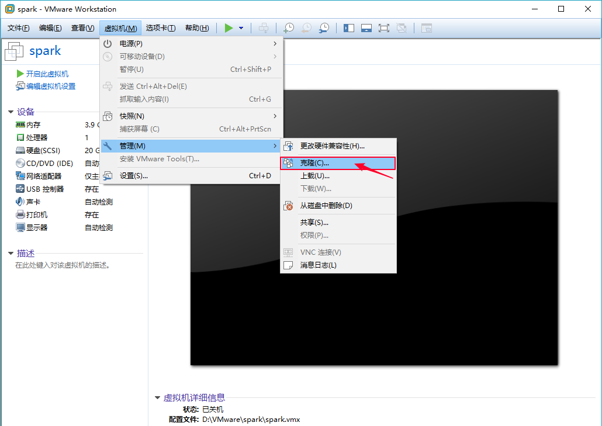
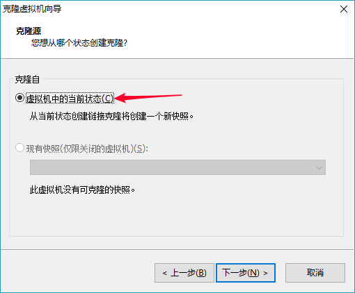
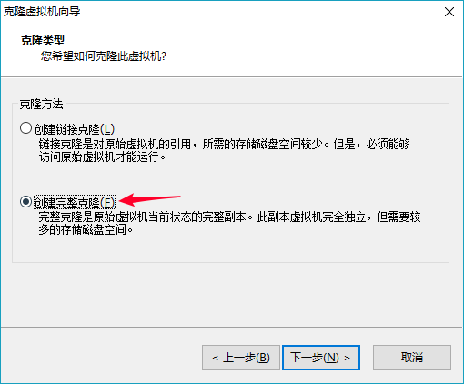
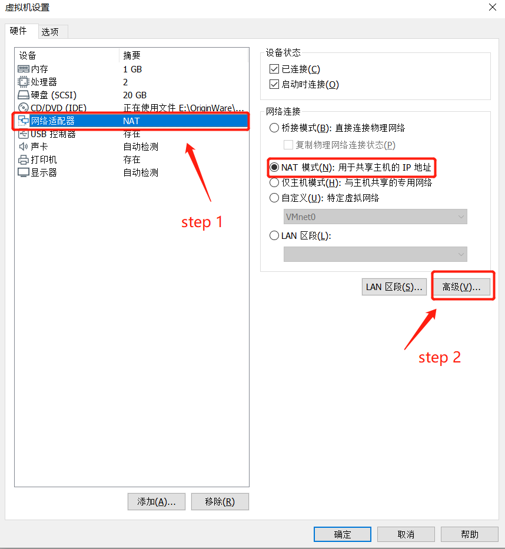
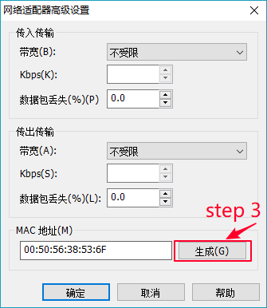

# VMware克隆虚拟机

## 克隆

|  |
| :-----------------------------: |
|  |
|  |


## 修改linux参数

|  |
| :-----------------------------: |
|  |

首先从VMware获取新的mac地址：00:50:56:38:53:6F，也就是step 3的值。

- `vim /etc/udev/rules.d/70-persistent-net.rules`

删除其他的配置信息栏，只留下eth0，并将eth0中ATTR{address}修改为新生成的mac地址，修改成功后保存该文本，如下所示。

```
ACTION=="add", SUBSYSTEM=="net", DRIVERS=="?*", ATTR{type}=="32", ATTR{address}=="00:50:56:38:53:6F", NAME="eth0", KERNEL=="eth*"
```

#### 修改ip地址

- `vim /etc/sysconfig/network-scripts/ifcfg-eth0`

```
TYPE="Ethernet"
PROXY_METHOD="none"
BROWSER_ONLY="no"
BOOTPROTO="static"	# 静态IP
DEFROUTE="yes"
IPV4_FAILURE_FATAL="no"
IPV6INIT="yes"
IPV6_AUTOCONF="yes"
IPV6_DEFROUTE="yes"
IPV6_FAILURE_FATAL="no"
IPV6_ADDR_GEN_MODE="stable-privacy"
NAME="ens33"
UUID="a2607510-740e-49e5-99e4-2aca9d9fd55f"
DEVICE="eth0"	# 此处修改NAME,对应 -ifcfg-eth0
ONBOOT="yes"	# 随系统启动
IPADDR=192.168.107.129	# ip地址，前三位网络固定
NETMASK=255.255.255.0	# 
GATEWAY=192.168.107.2	# 网关地址
DNS1=8.8.8.8	# dns
HWADDR=00:50:56:38:53:6F	# mac地址
```

#### 修改hostname

- `vim /etc/sysconfig/network `

```
NETWORKING=yes
HOSTNAME=node1
```


-   `vim /etc/hosts  `    

```shell
127.0.0.1   localhost localhost.localdomain localhost4 localhost4.localdomain4
::1         localhost localhost.localdomain localhost6 localhost6.localdomain6

192.168.107.128  node1
192.168.107.129  node2
192.168.107.130  node3
```

重启系统`reboot`或重启网络服务`systemctl restart network.service`

